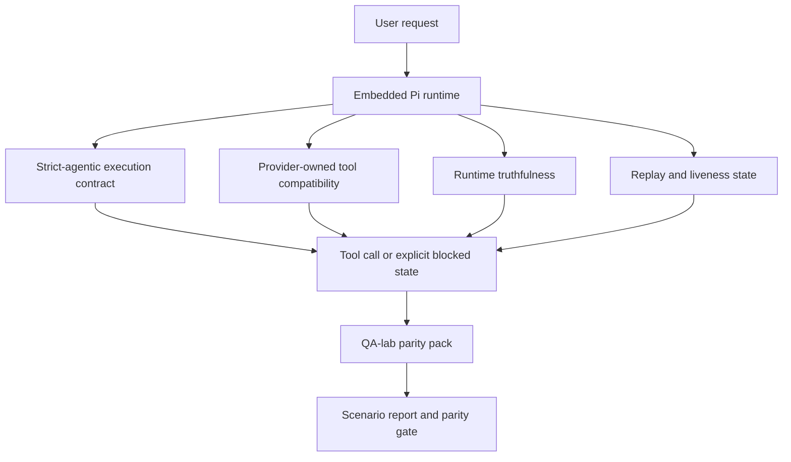
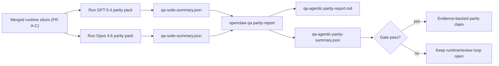

# Parité agentic GPT-5.4 / Codex dans OpenClaw

OpenClaw fonctionnait déjà bien avec les modèles de pointe utilisant des outils, mais GPT-5.4 et les modèles de type Codex présentaient encore des lacunes pratiques :

- ils pouvaient s'arrêter après la planification au lieu d'effectuer le travail
- ils pouvaient utiliser incorrectement les schémas d'outils stricts OpenAI/Codex
- ils pouvaient demander `/elevated full` même lorsque l'accès complet était impossible
- ils pouvaient perdre l'état des tâches de longue durée lors de la relecture ou de la compaction
- les affirmations de parité avec Claude Opus 4.6 reposaient sur des anecdotes plutôt que sur des scénarios reproductibles

Ce programme de parité corrige ces lacunes en quatre tranches révisables.

## Ce qui a changé

### PR A : exécution strict-agentic

Cette tranche ajoute un contrat d'exécution `strict-agentic` opt-in pour les exécutions GPT-5 Pi intégrées.

Lorsqu'il est activé, OpenClaw n'accepte plus les tours de planification seule comme une complétion « suffisamment bonne ». Si le modèle se contente de décrire ce qu'il a l'intention de faire sans utiliser réellement d'outils ni progresser, OpenClaw réessaie avec une consigne d'action immédiate, puis échoue fermement avec un état bloqué explicite au lieu de terminer silencieusement la tâche.

Cela améliore l'expérience GPT-5.4 surtout dans les cas suivants :

- les relances courtes de type « ok, fais-le »
- les tâches de code où la première étape est évidente
- les flux où `update_plan` devrait servir au suivi de progression plutôt qu'au texte de remplissage

### PR B : véracité du runtime

Cette tranche oblige OpenClaw à dire la vérité sur deux points :

- pourquoi l'appel fournisseur/runtime a échoué
- si `/elevated full` est réellement disponible

Cela signifie que GPT-5.4 reçoit de meilleurs signaux d'exécution pour les périmètres manquants, les échecs de rafraîchissement d'authentification, les échecs d'authentification HTML 403, les problèmes de proxy, les échecs DNS ou de délai d'attente, et les modes d'accès complet bloqués. Le modèle est moins susceptible d'halluciner une remédiation incorrecte ou de continuer à demander un mode de permission que le runtime ne peut pas fournir.

### PR C : correction de l'exécution

Cette tranche améliore deux types de correction :

- la compatibilité des schémas d'outils OpenAI/Codex détenus par le fournisseur
- la visibilité de la relecture et de l'état des tâches de longue durée

Le travail de compatibilité des outils réduit la friction de schéma pour l'enregistrement strict des outils OpenAI/Codex, en particulier pour les outils sans paramètres et les attentes strictes de racine objet. Le travail de relecture/vivacité rend les tâches de longue durée plus observables, de sorte que les états en pause, bloqués et abandonnés sont visibles au lieu de disparaître dans un texte d'échec générique.

### PR D : harnais de parité

Cette tranche ajoute le pack de parité de première vague du laboratoire QA afin que GPT-5.4 et Opus 4.6 puissent être exercés à travers les mêmes scénarios et comparés à l'aide de preuves partagées.

Le pack de parité est la couche de preuve. Il ne modifie pas le comportement du runtime par lui-même.

Une fois que vous disposez de deux artefacts `qa-suite-summary.json`, générez la comparaison de porte de publication avec :

```bash
pnpm openclaw qa parity-report \
  --repo-root . \
  --candidate-summary .artifacts/qa-e2e/gpt54/qa-suite-summary.json \
  --baseline-summary .artifacts/qa-e2e/opus46/qa-suite-summary.json \
  --output-dir .artifacts/qa-e2e/parity
```

Cette commande produit :

- un rapport Markdown lisible par l'humain
- un verdict JSON lisible par la machine
- un résultat de porte explicite `pass` / `fail`

## Pourquoi cela améliore GPT-5.4 en pratique

Avant ce travail, GPT-5.4 sur OpenClaw pouvait sembler moins agentic qu'Opus lors de sessions de codage réelles car le runtime tolérait des comportements particulièrement néfastes pour les modèles de style GPT-5 :

- des tours de commentaire uniquement
- de la friction de schéma autour des outils
- des retours vagues sur les permissions
- des ruptures silencieuses de relecture ou de compaction

L'objectif n'est pas de faire en sorte que GPT-5.4 imite Opus. L'objectif est de fournir à GPT-5.4 un contrat d'exécution qui récompense les progrès réels, fournit des sémantiques d'outils et de permissions plus claires, et transforme les modes d'échec en états explicites lisibles par la machine et par l'humain.

Cela fait passer l'expérience utilisateur de :

- « le modèle avait un bon plan mais s'est arrêté »

à :

- « le modèle a soit agi, soit OpenClaw a affiché la raison exacte pour laquelle il n'a pas pu le faire »

## Avant vs après pour les utilisateurs de GPT-5.4

| Avant ce programme                                                                                                    | Après PR A-D                                                                                          |
| --------------------------------------------------------------------------------------------------------------------- | ----------------------------------------------------------------------------------------------------- |
| GPT-5.4 pouvait s'arrêter après un plan raisonnable sans passer à l'étape d'outil suivante                            | PR A transforme « plan uniquement » en « agissez maintenant ou affichez un état bloqué »              |
| Les schémas d'outils stricts pouvaient rejeter les outils sans paramètres ou de forme OpenAI/Codex de manière confuse | PR C rend l'enregistrement et l'appel d'outils détenus par le fournisseur plus prévisibles            |
| Les indications `/elevated full` pouvaient être vagues ou incorrectes dans les runtimes bloqués                       | PR B donne à GPT-5.4 et à l'utilisateur des indices véridiques sur le runtime et les permissions      |
| Les échecs de relecture ou de compaction pouvaient donner l'impression que la tâche a silencieusement disparu         | PR C affiche explicitement les états en pause, bloqués, abandonnés et de relecture invalide           |
| « GPT-5.4 semble moins bon qu'Opus » était principalement anecdotique                                                 | PR D transforme cela en un même pack de scénarios, les mêmes métriques et une porte pass/fail stricte |

## Architecture



## Flux de publication



## Pack de scénarios

Le pack de parité de première vague couvre actuellement cinq scénarios :

### `approval-turn-tool-followthrough`

Vérifie que le modèle ne s'arrête pas à « je vais le faire » après une brève approbation. Il devrait exécuter la première action concrète dans le même tour.

### `model-switch-tool-continuity`

Vérifie que le travail utilisant des outils reste cohérent à travers les limites de changement de modèle/runtime au lieu de se réinitialiser en commentaire ou de perdre le contexte d'exécution.

### `source-docs-discovery-report`

Vérifie que le modèle peut lire les sources et la documentation, synthétiser les résultats et poursuivre la tâche de manière agentic plutôt que de produire un résumé superficiel et de s'arrêter prématurément.

### `image-understanding-attachment`

Vérifie que les tâches en mode mixte impliquant des pièces jointes restent exploitables et ne se réduisent pas à une narration vague.

### `compaction-retry-mutating-tool`

Vérifie qu'une tâche avec une écriture mutante réelle maintient l'insécurité de relecture explicite au lieu de sembler silencieusement sûre pour la relecture si l'exécution se compacte, réessaie ou perd l'état de réponse sous pression.

## Matrice de scénarios

| Scénario                           | Ce qu'il teste                                         | Bon comportement GPT-5.4                                                                            | Signal d'échec                                                                                     |
| ---------------------------------- | ------------------------------------------------------ | --------------------------------------------------------------------------------------------------- | -------------------------------------------------------------------------------------------------- |
| `approval-turn-tool-followthrough` | Tours d'approbation courts après un plan               | Démarre immédiatement la première action d'outil concrète au lieu de reformuler l'intention         | relance de planification seule, aucune activité d'outil, ou tour bloqué sans vrai bloqueur         |
| `model-switch-tool-continuity`     | Changement de runtime/modèle sous utilisation d'outils | Préserve le contexte de tâche et continue à agir de manière cohérente                               | réinitialisation en commentaire, perte du contexte d'outils, ou arrêt après le changement          |
| `source-docs-discovery-report`     | Lecture de sources + synthèse + action                 | Trouve les sources, utilise les outils et produit un rapport utile sans stagner                     | résumé superficiel, travail d'outils manquant, ou arrêt de tour incomplet                          |
| `image-understanding-attachment`   | Travail agentic piloté par pièce jointe                | Interprète la pièce jointe, la connecte aux outils et poursuit la tâche                             | narration vague, pièce jointe ignorée, ou aucune action concrète suivante                          |
| `compaction-retry-mutating-tool`   | Travail mutant sous pression de compaction             | Effectue une écriture réelle et maintient l'insécurité de relecture explicite après l'effet de bord | l'écriture mutante a lieu mais la sécurité de relecture est implicite, manquante ou contradictoire |

## Porte de publication

GPT-5.4 ne peut être considéré à parité ou supérieur que lorsque le runtime fusionné réussit simultanément le pack de parité et les régressions de véracité du runtime.

Résultats requis :

- aucun blocage de planification seule lorsque la prochaine action d'outil est claire
- aucune complétion factice sans exécution réelle
- aucune indication `/elevated full` incorrecte
- aucun abandon silencieux de relecture ou de compaction
- des métriques du pack de parité au moins aussi solides que la ligne de base Opus 4.6 convenue

Pour le harnais de première vague, la porte compare :

- le taux d'achèvement
- le taux d'arrêt non intentionnel
- le taux d'appels d'outils valides
- le nombre de faux succès

Les preuves de parité sont intentionnellement réparties sur deux couches :

- PR D prouve le comportement GPT-5.4 vs Opus 4.6 sur les mêmes scénarios avec le laboratoire QA
- Les suites déterministes de PR B prouvent la véracité de l'authentification, du proxy, du DNS et de `/elevated full` en dehors du harnais

## Matrice objectif-preuve

| Élément de la porte d'achèvement                               | PR propriétaire | Source de preuve                                                        | Signal de réussite                                                                                                             |
| -------------------------------------------------------------- | --------------- | ----------------------------------------------------------------------- | ------------------------------------------------------------------------------------------------------------------------------ |
| GPT-5.4 ne stalle plus après la planification                  | PR A            | `approval-turn-tool-followthrough` et suites runtime PR A               | les tours d'approbation déclenchent un travail réel ou un état bloqué explicite                                                |
| GPT-5.4 ne simule plus de progrès ou de complétion d'outils    | PR A + PR D     | résultats de scénarios du rapport de parité et comptage des faux succès | aucun résultat de passage suspect et aucune complétion par commentaire uniquement                                              |
| GPT-5.4 ne donne plus de guidance `/elevated full` erronée     | PR B            | suites déterministes de véracité du runtime                             | les raisons de blocage et les indications d'accès complet restent fidèles au runtime                                           |
| Les échecs de relecture/vivacité restent explicites            | PR C + PR D     | suites lifecycle/replay PR C et `compaction-retry-mutating-tool`        | le travail mutant maintient l'insécurité de relecture explicite au lieu de disparaître silencieusement                         |
| GPT-5.4 égale ou surpasse Opus 4.6 sur les métriques convenues | PR D            | `qa-agentic-parity-report.md` et `qa-agentic-parity-summary.json`       | même couverture de scénarios et aucune régression sur l'achèvement, le comportement d'arrêt ou l'utilisation valide des outils |

## Comment lire le verdict de parité

Utilisez le verdict dans `qa-agentic-parity-summary.json` comme décision finale lisible par machine pour le pack de parité de première vague.

- `pass` signifie que GPT-5.4 a couvert les mêmes scénarios qu'Opus 4.6 sans régression sur les métriques agrégées convenues.
- `fail` signifie qu'au moins une porte dure a été déclenchée : achèvement plus faible, arrêts non intentionnels plus fréquents, utilisation d'outils valides plus faible, tout cas de faux succès, ou couverture de scénarios incohérente.
- « problème CI partagé/de base » n'est pas en soi un résultat de parité. Si le bruit CI en dehors de PR D bloque une exécution, le verdict doit attendre une exécution propre du runtime fusionné au lieu d'être déduit des journaux de l'ère de la branche.
- La véracité de l'authentification, du proxy, du DNS et de `/elevated full` provient toujours des suites déterministes de PR B, donc la déclaration de publication finale nécessite les deux : un verdict de parité PR D passant et une couverture de véracité PR B verte.

## Qui devrait activer `strict-agentic`

Activez `strict-agentic` lorsque :

- l'agent est censé agir immédiatement lorsqu'une prochaine étape est évidente
- GPT-5.4 ou les modèles de la famille Codex sont le runtime principal
- vous préférez des états bloqués explicites aux réponses de seul récapitulatif « utiles »

Conservez le contrat par défaut lorsque :

- vous souhaitez le comportement existant plus souple
- vous n'utilisez pas les modèles de la famille GPT-5
- vous testez des prompts plutôt que l'application du runtime
