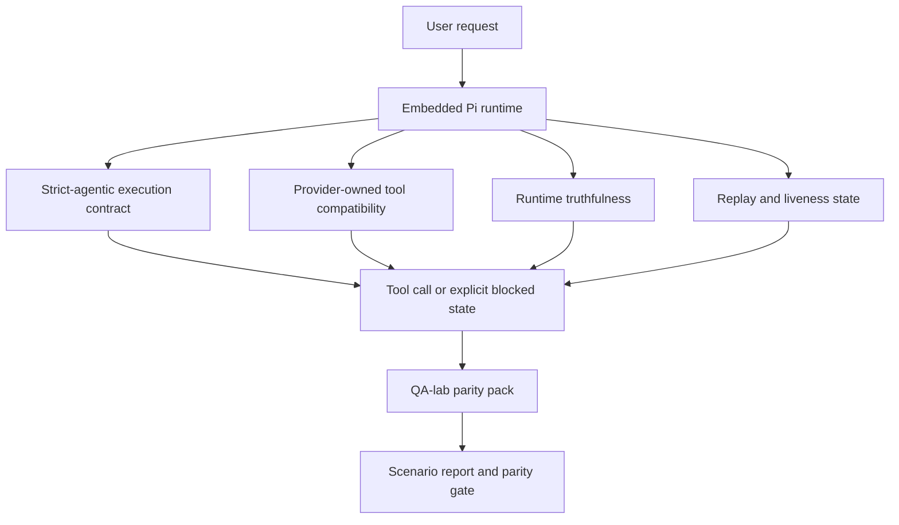
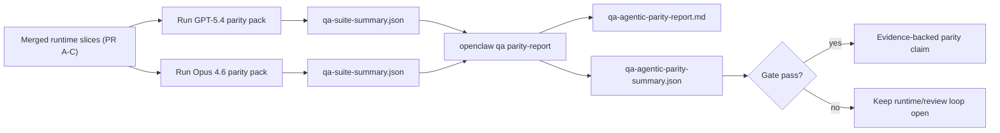

# Parité Agentic GPT-5.4 / Codex dans OpenClaw

OpenClaw fonctionnait déjà bien avec les modèles frontières utilisant des outils, mais GPT-5.4 et les modèles de style Codex étaient encore en dessous de leurs performances de quelques manières pratiques :

- ils pouvaient s'arrêter après la planification au lieu de faire le travail
- ils pouvaient utiliser incorrectement les schémas d'outils stricts OpenAI/Codex
- ils pouvaient demander `/elevated full` même lorsque l'accès complet était impossible
- ils pouvaient perdre l'état des tâches de longue durée lors de la relecture ou de la compactage
- les revendications de parité avec Claude Opus 4.6 étaient basées sur des anecdotes plutôt que sur des scénarios reproductibles

Ce programme de parité corrige ces lacunes en quatre tranches révisables.

## Ce qui a changé

### PR A : exécution strict-agentic

Cette tranche ajoute un contrat d'exécution `strict-agentic` optionnel pour les exécutions GPT-5 Pi intégrées.

Lorsqu'elle est activée, OpenClaw cesse d'accepter les tours de planification pure comme une achèvement « assez bon ». Si le modèle dit seulement ce qu'il a l'intention de faire et n'utilise pas réellement d'outils ou ne progresse pas, OpenClaw réessaie avec une incitation d'action immédiate (act-now steer) puis échoue de manière fermée avec un état bloqué explicite au lieu de terminer silencieusement la tâche.

Cela améliore l'expérience GPT-5.4 le plus sur :

- les courts suivis « ok fais-le »
- les tâches de code où la première étape est évidente
- les flux où `update_plan` devrait être un suivi de progression plutôt que du texte de remplissage

### PR B : véracité à l'exécution (runtime)

Cette tranche fait dire la vérité à OpenClaw sur deux choses :

- pourquoi l'appel fournisseur/runtime a échoué
- si `/elevated full` est réellement disponible

Cela signifie que GPT-5.4 obtient de meilleurs signaux d'exécution pour les étendues manquantes, les échecs d'actualisation de l'authentification, les échecs d'authentification HTML 403, les problèmes de proxy, les échecs DNS ou d'expiration, et les modes d'accès complet bloqués. Le modèle est moins susceptible d'halluciner une mauvaise correction ou de continuer à demander un mode d'autorisation que le runtime ne peut pas fournir.

### PR C : exactitude de l'exécution

Cette tranche améliore deux types d'exactitude :

- compatibilité des schémas d'outils OpenAI/Codex détenus par le fournisseur
- la mise en surface de la vivacité (liveness) de la relecture et des tâches longues

Le travail de compatibilité des outils (tool-compat) réduit la friction des schémas pour l'enregistrement strict des outils OpenAI/Codex, en particulier autour des outils sans paramètres et des attentes strictes de racine d'objet. Le travail de relecture/d'activité rend les tâches de longue durée plus observables, de sorte que les États en pause, bloqués et abandonnés sont visibles au lieu de disparaître dans un texte d'échec générique.

### PR D : harnais de parité

Cette tranche ajoute le premier pack de parité QA-lab afin que GPT-5.4 et Opus 4.6 puissent être testés à travers les mêmes scénarios et comparés en utilisant des preuves partagées.

Le pack de parité est la couche de preuve. Il ne modifie pas le comportement à l'exécution par lui-même.

Une fois que vous avez deux artefacts `qa-suite-summary.json`, générez la comparaison de barrière de version (release-gate) avec :

```bash
pnpm openclaw qa parity-report \
  --repo-root . \
  --candidate-summary .artifacts/qa-e2e/gpt54/qa-suite-summary.json \
  --baseline-summary .artifacts/qa-e2e/opus46/qa-suite-summary.json \
  --output-dir .artifacts/qa-e2e/parity
```

Cette commande écrit :

- un rapport Markdown lisible par l'homme
- un verdict JSON lisible par la machine
- un résultat de barrière (gate) explicite `pass` / `fail`

## Pourquoi cela améliore GPT-5.4 en pratique

Avant ce travail, GPT-5.4 sur OpenClaw pouvait sembler moins agentique qu'Opus dans de vraies sessions de codage car l'exécution tolérait des comportements particulièrement nuisibles pour les modèles de type GPT-5 :

- tours de commentaires uniquement
- friction des schémas autour des outils
- retours d'autorisation vagues
- échec silencieux de la relecture (replay) ou de la compactage

L'objectif n'est pas de faire imiter Opus à GPT-5.4. L'objectif est de donner à GPT-5.4 un contrat d'exécution qui récompense les progrès réels, fournit des sémantiques d'outils et d'autorisations plus propres, et transforme les modes d'échec en états explicites lisibles par la machine et par l'homme.

Cela change l'expérience utilisateur de :

- « le modèle avait un bon plan mais s'est arrêté »

à :

- « le modèle a soit agi, soit OpenClaw a affiché la raison exacte pour laquelle il ne pouvait pas le faire »

## Avant et après pour les utilisateurs de GPT-5.4

| Avant ce programme                                                                                                         | Après les PR A-D                                                                                                           |
| -------------------------------------------------------------------------------------------------------------------------- | -------------------------------------------------------------------------------------------------------------------------- |
| GPT-5.4 pouvait s'arrêter après un plan raisonnable sans effectuer l'étape d'outil suivante                                | La PR A transforme « plan uniquement » en « agir maintenant ou afficher un état bloqué »                                   |
| Les schémas stricts d'outils pouvaient rejeter les outils sans paramètres ou de forme OpenAI/Codex de manière déroutante   | La PR C rend l'enregistrement et l'invocation des outils appartenant au fournisseur plus prévisibles                       |
| Les conseils `/elevated full` pouvaient être vagues ou incorrects dans les exécutions bloquées                             | La PR B fournit à GPT-5.4 et à l'utilisateur des indices d'exécution et d'autorisation véridiques                          |
| Les échecs de relecture (replay) ou de compactage pouvaient donner l'impression que la tâche avait silencieusement disparu | PR C expose explicitement les résultats en pause, bloqués, abandonnés et invalides pour la relecture                       |
| « GPT-5.4 semble moins bon qu'Opus » était surtout anecdotique                                                             | PR D transforme cela en le même pack de scénarios, les mêmes métriques et une porte de validation stricte (réussite/échec) |

## Architecture



## Flux de publication



## Pack de scénarios

Le pack de parité de première vague couvre actuellement cinq scénarios :

### `approval-turn-tool-followthrough`

Vérifie que le modèle ne s'arrête pas à « Je vais faire ça » après une courte approbation. Il doit entreprendre la première action concrète lors du même tour.

### `model-switch-tool-continuity`

Vérifie que le travail utilisant des outils reste cohérent lors des changements de modèle/runtime au lieu de se réinitialiser en commentaire ou de perdre le contexte d'exécution.

### `source-docs-discovery-report`

Vérifie que le modèle peut lire la source et les docs, synthétiser les résultats et continuer la tâche de manière agencée plutôt que de produire un résumé sommaire et de s'arrêter prématurément.

### `image-understanding-attachment`

Vérifie que les tâches en mode mixte impliquant des pièces jointes restent actionnables et ne s'effondrent pas en une narration vague.

### `compaction-retry-mutating-tool`

Vérifie qu'une tâche avec une écriture mutante réelle garde l'insécurité de relecture explicite au lieu de sembler discrètement sûre pour la relecture si l'exécution compresse, réessaie ou perd l'état de réponse sous pression.

## Matrice de scénarios

| Scénario                           | Ce qu'il teste                                              | Bon comportement GPT-5.4                                                                           | Signal d'échec                                                                                             |
| ---------------------------------- | ----------------------------------------------------------- | -------------------------------------------------------------------------------------------------- | ---------------------------------------------------------------------------------------------------------- |
| `approval-turn-tool-followthrough` | Tours d'approbation courts après un plan                    | Commence immédiatement la première action concrète d'un outil au lieu de réitérer l'intention      | suivi de plan uniquement, aucune activité d'outil, ou tour bloqué sans véritable bloqueur                  |
| `model-switch-tool-continuity`     | Changement de runtime/modèle lors de l'utilisation d'outils | Préserve le contexte de la tâche et continue d'agir de manière cohérente                           | réinitialise en commentaire, perd le contexte de l'outil, ou s'arrête après le changement                  |
| `source-docs-discovery-report`     | Lecture de la source + synthèse + action                    | Trouve les sources, utilise les outils et produit un rapport utile sans caler                      | résumé sommaire, travail d'outil manquant, ou arrêt en cours de tour                                       |
| `image-understanding-attachment`   | Travail agencé piloté par pièces jointes                    | Interprète la pièce jointe, la relie aux outils et continue la tâche                               | narration vague, pièce jointe ignorée, ou aucune prochaine action concrète                                 |
| `compaction-retry-mutating-tool`   | Travail mutant sous pression de compactage                  | Effectue une écriture réelle et garde l'insécurité de relecture explicite après l'effet secondaire | une écriture modifiant se produit mais la sécurité de relecture est implicite, manquante ou contradictoire |

## Porte de publication

GPT-5.4 ne peut être considérée comme étant à parité ou mieux que lorsque le runtime fusionné réussit le pack de parité et les régressions de véracité du runtime en même temps.

Résultats requis :

- pas d'arrêt de planification uniquement lorsque l'action de l'outil suivant est claire
- pas de fausse achèvement sans exécution réelle
- pas de `/elevated full` incorrects
- pas d'abandon silencieux de la relecture ou de la compaction
- métriques du pack de parité au moins aussi solides que la ligne de base Opus 4.6 convenue

Pour le harnais de première vague, la porte compare :

- taux d'achèvement
- taux d'arrêt involontaire
- taux d'appel d'outil valide
- nombre de faux succès

Les preuves de parité sont intentionnellement réparties sur deux couches :

- PR D prouve le comportement GPT-5.4 vs Opus 4.6 dans le même scénario avec QA-lab
- Les suites déterministes PR B prouvent l'auth, le proxy, le DNS et la véracité `/elevated full` hors du harnais

## Matrice objectif-preuve

| Élément de porte d'achèvement                                  | PR propriétaire | Source de preuve                                                            | Signal de succès                                                                                                              |
| -------------------------------------------------------------- | --------------- | --------------------------------------------------------------------------- | ----------------------------------------------------------------------------------------------------------------------------- |
| GPT-5.4 ne s'arrête plus après la planification                | PR A            | `approval-turn-tool-followthrough` plus les suites de runtime PR A          | les tours d'approbation déclenchent un travail réel ou un état bloqué explicite                                               |
| GPT-5.4 ne simule plus les progrès ou l'achèvement de l'outil  | PR A + PR D     | résultats des scénarios du rapport de parité et nombre de faux succès       | pas de résultats de succès suspects et pas d'achèvement avec commentaires uniquement                                          |
| GPT-5.4 ne donne plus de fausses directives `/elevated full`   | PR B            | suites de véracité déterministes                                            | les raisons de blocage et les indices d'accès complet restent exacts au niveau du runtime                                     |
| Les échecs de relecture/vitalité restent explicites            | PR C + PR D     | suites de cycle de vie/relecture PR C plus `compaction-retry-mutating-tool` | le travail modifiant garde l'insécurité de relecture explicite au lieu de disparaître silencieusement                         |
| GPT-5.4 égale ou surpasse Opus 4.6 sur les métriques convenues | PR D            | `qa-agentic-parity-report.md` et `qa-agentic-parity-summary.json`           | même couverture de scénario et aucune régression sur l'achèvement, le comportement d'arrêt ou l'utilisation valide des outils |

## Comment lire le verdict de parité

Utilisez le verdict dans `qa-agentic-parity-summary.json` comme décision finale lisible par machine pour le pack de parité de première vague.

- `pass` signifie que GPT-5.4 couvre les mêmes scénarios qu'Opus 4.6 et n'a pas régressé sur les métriques agrégées convenues.
- `fail` signifie qu'au moins une porte stricte s'est déclenchée : achèvement plus faible, arrêts non intentionnels pires, utilisation valide d'outil plus faible, tout cas de fausse réussite, ou couverture de scénario non correspondante.
- « shared/base CI issue » n'est pas en soi un résultat de parité. Si le bruit CI en dehors de la PR D bloque une exécution, le verdict doit attendre une exécution propre du runtime fusionné au lieu d'être déduit des journaux de l'époque de la branche.
- Auth, proxy, DNS et la véracité `/elevated full` proviennent toujours des suites déterministes de la PR B, donc la déclaration de sortie finale nécessite les deux : un verdict de parité PR D réussi et une couverture de véracité PR B verte.

## Qui doit activer `strict-agentic`

Utilisez `strict-agentic` lorsque :

- l'agent est censé agir immédiatement lorsqu'une prochaine étape est évidente
- les modèles GPT-5.4 ou de la famille Codex sont le runtime principal
- vous préférez des états bloqués explicites plutôt que des réponses « utiles » se contentant de résumer

Conservez le contrat par défaut lorsque :

- vous voulez le comportement existant plus souple
- vous n'utilisez pas les modèles de la famille GPT-5
- vous testez des invites plutôt que l'exécution du runtime
