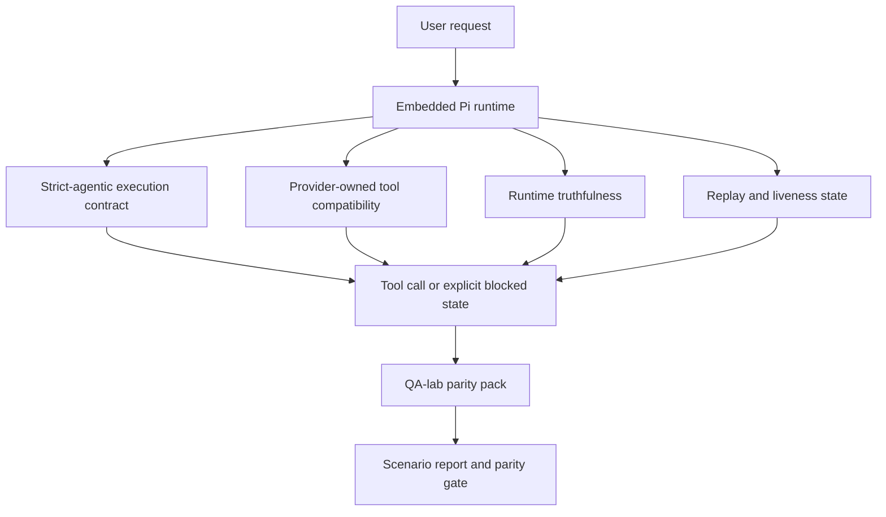
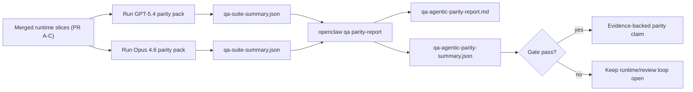

# Parité agentique GPT-5.4 / Codex dans OpenClaw

OpenClaw fonctionnait déjà bien avec les modèles de pointe utilisant des outils, mais les modèles GPT-5.4 et de style Codex étaient encore en dessous du potentiel dans quelques aspects pratiques :

- ils pouvaient s'arrêter après la planification au lieu d'effectuer le travail
- ils pouvaient utiliser incorrectement les schémas d'outils stricts OpenAI/Codex
- ils pouvaient demander `/elevated full` même lorsque l'accès complet était impossible
- ils pouvaient perdre l'état des tâches de longue durée lors de la relecture ou de la compaction
- les revendications de parité avec Claude Opus 4.6 reposaient sur des anecdotes plutôt que sur des scénarios reproductibles

Ce programme de parité corrige ces lacunes en quatre tranches révisables.

## Ce qui a changé

### PR A : exécution stricte-agentique

Cette tranche ajoute un contrat d'exécution `strict-agentic` optionnel pour les exécutions GPT-5 Pi intégrées.

Lorsqu'elle est activée, OpenClaw cesse d'accepter les tours de planification seule comme une complétion « suffisamment bonne ». Si le modèle dit seulement ce qu'il a l'intention de faire et n'utilise pas réellement d'outils ou ne progresse pas, OpenClaw réessaie avec une directive d'action immédiate, puis échoue de manière fermée avec un état bloqué explicite au lieu de terminer silencieusement la tâche.

Cela améliore principalement l'expérience GPT-5.4 sur :

- les courts suivis du type « ok fais-le »
- les tâches de code où la première étape est évidente
- les flux où `update_plan` devrait être un suivi de la progression plutôt qu'un texte de remplissage

### PR B : véracité de l'exécution

Cette tranche oblige OpenClaw à dire la vérité sur deux choses :

- pourquoi l'appel fournisseur/exécution a échoué
- si `/elevated full` est réellement disponible

Cela signifie que GPT-5.4 reçoit de meilleurs signaux d'exécution pour les étendues manquantes, les échecs de rafraîchissement de l'authentification, les échecs d'authentification HTML 403, les problèmes de proxy, les échecs DNS ou d'expiration, et les modes d'accès complet bloqués. Le modèle est moins susceptible d'halluciner la mauvaise correction ou de continuer à demander un mode d'autorisation que l'exécution ne peut pas fournir.

### PR C : correction de l'exécution

Cette tranche améliore deux types de correction :

- compatibilité des schémas d'outils OpenAI/Codex détenue par le fournisseur
- mise en surface de la relecture et de la vivacité des tâches longues

Le travail de compatibilité des outils réduit la friction des schémas pour l'enregistrement d'outils stricts OpenAI/Codex, en particulier autour des outils sans paramètres et des attentes strictes de racine d'objet. Le travail de relecture/vivacité rend les tâches de longue durée plus observables, de sorte que les états en pause, bloqués et abandonnés sont visibles au lieu de disparaître dans un texte d'échec générique.

### PR D : faisceau de parité

Cette partie ajoute le premier pack de parité du laboratoire QA afin que GPT-5.4 et Opus 4.6 puissent être testés via les mêmes scénarios et comparés à l'aide de preuves partagées.

Le pack de parité est la couche de preuve. Il ne modifie pas le comportement à l'exécution par lui-même.

Une fois que vous avez deux artefacts `qa-suite-summary.json`, générez la comparaison de porte de version avec :

```bash
pnpm openclaw qa parity-report \
  --repo-root . \
  --candidate-summary .artifacts/qa-e2e/gpt54/qa-suite-summary.json \
  --baseline-summary .artifacts/qa-e2e/opus46/qa-suite-summary.json \
  --output-dir .artifacts/qa-e2e/parity
```

Cette commande écrit :

- un rapport Markdown lisible par l'homme
- un verdict JSON lisible par la machine
- un résultat de porte `pass` / `fail` explicite

## Pourquoi cela améliore GPT-5.4 en pratique

Avant ce travail, GPT-5.4 sur OpenClaw pouvait sembler moins agentique qu'Opus dans de vraies sessions de codage, car l'exécution tolérait des comportements particulièrement nuisibles pour les modèles de style GPT-5 :

- tours composés uniquement de commentaires
- frictions de schéma autour des outils
- retours d'autorisation vagues
- répétition silencieuse ou rupture de compactage

L'objectif n'est pas de faire imiter Opus à GPT-5.4. L'objectif est de donner à GPT-5.4 un contrat d'exécution qui récompense les progrès réels, fournit des sémantiques d'outil et d'autorisation plus claires, et transforme les modes d'échec en états explicites lisibles par la machine et l'homme.

Cela change l'expérience utilisateur de :

- « le modèle avait un bon plan mais s'est arrêté »

à :

- « le modèle a soit agi, soit OpenClaw a affiché la raison exacte pour laquelle il ne le pouvait pas »

## Avant et après pour les utilisateurs de GPT-5.4

| Avant ce programme                                                                                                      | Après les PR A-D                                                                                                 |
| ----------------------------------------------------------------------------------------------------------------------- | ---------------------------------------------------------------------------------------------------------------- |
| GPT-5.4 pouvait s'arrêter après un plan raisonnable sans effectuer l'étape d'outil suivante                             | La PR A transforme « planification uniquement » en « agir maintenant ou afficher un état bloqué »                |
| Les schémas d'outils stricts pouvaient rejeter les outils sans paramètre ou de forme OpenAI/Codex de manière déroutante | La PR C rend l'enregistrement et l'invocation des outils détenus par le provider plus prévisibles                |
| Les conseils `/elevated full` pouvaient être vagues ou incorrects dans les exécutions bloquées                          | La PR B fournit à GPT-5.4 et à l'utilisateur des indications véridiques sur l'exécution et les autorisations     |
| Les échecs de répétition ou de compactage pouvaient donner l'impression que la tâche avait disparu silencieusement      | La PR C expose explicitement les résultats en pause, bloqués, abandonnés et invalides pour la répétition         |
| « GPT-5.4 semble pire qu'Opus » était principalement anecdotique                                                        | La PR D transforme cela en le même pack de scénarios, les mêmes métriques et une porte de réussite/échec stricte |

## Architecture



## Flux de publication



## Pack de scénarios

Le pack de parité de la première vague couvre actuellement cinq scénarios :

### `approval-turn-tool-followthrough`

Vérifie que le modèle ne s'arrête pas à « Je vais faire ça » après une courte approbation. Il devrait entreprendre la première action concrète lors du même tour.

### `model-switch-tool-continuity`

Vérifie que le travail utilisant des outils reste cohérent à travers les limites de basculement entre modèle/exécution (runtime), au lieu de réinitialiser en commentaire ou de perdre le contexte d'exécution.

### `source-docs-discovery-report`

Vérifie que le modèle peut lire le code source et la documentation, synthétiser les résultats, et poursuivre la tâche de manière agentic plutôt que de produire un résumé superficiel et de s'arrêter prématurément.

### `image-understanding-attachment`

Vérifie que les tâches en mode mixte impliquant des pièces jointes restent actionnables et ne s'effondrent pas en une narration vague.

### `compaction-retry-mutating-tool`

Vérifie qu'une tâche avec une écriture mutante réelle garde explicitement le caractère non sûr en relecture (replay-unsafety) au lieu de paraître silencieusement sûr en relecture si l'exécution compresse, réessaie ou perd l'état de réponse sous pression.

## Matrice de scénarios

| Scénario                           | Ce qu'il teste                                                              | Bon comportement de GPT-5.4                                                                             | Signal d'échec                                                                                         |
| ---------------------------------- | --------------------------------------------------------------------------- | ------------------------------------------------------------------------------------------------------- | ------------------------------------------------------------------------------------------------------ |
| `approval-turn-tool-followthrough` | Tours d'approbation courts après un plan                                    | Commence immédiatement la première action concrète d'outil au lieu de reformuler l'intention            | suivi de plan uniquement, aucune activité d'outil, ou tour bloqué sans un véritable bloqueur           |
| `model-switch-tool-continuity`     | Basculement exécution/modèle (runtime/model) pendant l'utilisation d'outils | Préserve le contexte de la tâche et continue à agir de manière cohérente                                | réinitialise en commentaire, perd le contexte de l'outil, ou s'arrête après le basculement             |
| `source-docs-discovery-report`     | Lecture des sources + synthèse + action                                     | Trouve les sources, utilise les outils et produit un rapport utile sans caler                           | résumé superficiel, travail d'outil manquant, ou arrêt sur un tour incomplet                           |
| `image-understanding-attachment`   | Travail agentic piloté par les pièces jointes                               | Interprète la pièce jointe, la relie aux outils et poursuit la tâche                                    | narration vague, pièce jointe ignorée, ou aucune prochaine action concrète                             |
| `compaction-retry-mutating-tool`   | Travail de mutation sous pression de compression                            | Effectue une écriture réelle et garde le caractère non sûr en relecture explicite après l'effet de bord | l'écriture de mutation a lieu mais la sécurité de relecture est implicite, manquante ou contradictoire |

## Critère de version (Release gate)

GPT-5.4 ne peut être considéré à parité ou supérieur que lorsque l'exécution (runtime) fusionnée passe le pack de parité et les régressions de véracité de l'exécution (runtime-truthfulness) en même temps.

Résultats requis :

- aucun arrêt par plan uniquement lorsque la prochaine action d'outil est claire
- pas de fausse complétion sans exécution réelle
- pas de fausse orientation `/elevated full`
- pas de relecture silencieuse ou d'abandon de compactage
- mesures du parity-pack au moins aussi solides que la référence Opus 4.6 convenue

Pour le harnais de première vague, la porte compare :

- taux de complétion
- taux d'arrêt involontaire
- taux d'appel de tool valide
- nombre de faux succès

Les preuves de parité sont intentionnellement réparties sur deux couches :

- PR D prouve le comportement de GPT-5.4 par rapport à Opus 4.6 pour le même scénario avec le laboratoire QA
- Les suites déterministes de la PR B prouvent la véracité de l'auth, du proxy, du DNS et du `/elevated full` en dehors du harnais

## Matrice objectif-preuve

| Élément de porte de complétion                                    | PR propriétaire | Source de preuve                                                                  | Signal de réussite                                                                                                          |
| ----------------------------------------------------------------- | --------------- | --------------------------------------------------------------------------------- | --------------------------------------------------------------------------------------------------------------------------- |
| GPT-5.4 ne cale plus après la planification                       | PR A            | `approval-turn-tool-followthrough` plus les suites d'exécution de la PR A         | les tours d'approbation déclenchent un travail réel ou un état bloqué explicite                                             |
| GPT-5.4 ne simule plus de progrès ni de fausse complétion de tool | PR A + PR D     | résultats de scénario du rapport de parité et nombre de faux succès               | pas de résultats de réussite suspects et pas de complétion avec commentaires uniquement                                     |
| GPT-5.4 ne donne plus de fausse orientation `/elevated full`      | PR B            | suites de véracité déterministes                                                  | les raisons de blocage et les indices d'accès complet restent exacts lors de l'exécution                                    |
| Les échecs de relecture/dynamisme restent explicites              | PR C + PR D     | suites de cycle de vie/relecture de la PR C plus `compaction-retry-mutating-tool` | le travail de mutation maintient l'insécurité de relecture explicite au lieu de disparaître silencieusement                 |
| GPT-5.4 égale ou surpasse Opus 4.6 sur les mesures convenues      | PR D            | `qa-agentic-parity-report.md` et `qa-agentic-parity-summary.json`                 | même couverture de scénario et aucune régression sur la complétion, le comportement d'arrêt ou l'utilisation valide de tool |

## Comment lire le verdict de parité

Utilisez le verdict dans `qa-agentic-parity-summary.json` comme décision finale lisible par machine pour le pack de parité de première vague.

- `pass` signifie que GPT-5.4 a couvert les mêmes scénarios qu'Opus 4.6 et n'a pas régressé sur les mesures agrégées convenues.
- `fail` signifie qu'au moins une porte stricte a été déclenchée : complétion plus faible, arrêts involontaires pires, utilisation valide de tool plus faible, tout cas de faux succès, ou couverture de scénario inadéquate.
- « shared/base CI issue » n'est pas en soi un résultat de parité. Si le bruit CI en dehors de la PR D bloque une exécution, le verdict doit attendre une exécution propre en runtime fusionné au lieu d'être déduit des journaux de l'époque de la branche.
- L'authentification, le proxy, le DNS et la véracité de `/elevated full` proviennent toujours des suites déterministes de la PR B, donc la revendication de publication finale nécessite les deux : un verdict de parité réussi pour la PR D et une couverture de véracité positive pour la PR B.

## Qui doit activer `strict-agentic`

Utilisez `strict-agentic` lorsque :

- l'agent est censé agir immédiatement lorsqu'une prochaine étape est évidente
- GPT-5.4 ou les modèles de la famille Codex sont le runtime principal
- vous préférez des états bloqués explicites plutôt que des réponses « utiles » ne consistant qu'en un résumé

Conservez le contrat par défaut lorsque :

- vous souhaitez le comportement existant plus souple
- vous n'utilisez pas de modèles de la famille GPT-5
- vous testez des invites (prompts) plutôt que l'exécution runtime
