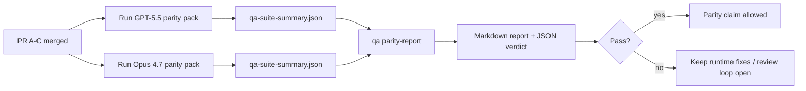

Cette note explique comment réviser le programme de parité GPT-5.5 / Codex en quatre unités de fusion sans perdre l'architecture originale à six contrats.

## Unités de fusion

### PR A : exécution agentique stricte

Possède :

- `executionContract`
- Suivi immédat en priorité GPT-5
- `update_plan` en tant que suivi de progression non terminal
- états bloqués explicites au lieu d'arrêts silencieux basés uniquement sur le plan

Ne possède pas :

- classification des échecs d'authentification/execution
- exactitude des autorisations
- refonte de la reprise/continuation
- benchmark de parité

### PR B : exactitude à l'exécution

Possède :

- Exactitude de la portée Codex OAuth
- classification typée des échecs de fournisseur/exécution
- disponibilité véridique et raisons de blocage `/elevated full`

Ne possède pas :

- normalisation du schéma de tool
- état de reprise/vivacité
- activation des benchmarks

### PR C : exactitude de l'exécution

Possède :

- compatibilité des tools OpenAI/Codex détenue par le fournisseur
- gestion stricte de schéma sans paramètre
- signalement des reprises invalides
- visibilité de l'état des tâches longues en pause, bloquées et abandonnées

Ne possède pas :

- continuation auto-élue
- comportement générique du dialecte Codex en dehors des hooks du fournisseur
- activation des benchmarks

### PR D : harnais de parité

Possède :

- pack de scénarios de première vague GPT-5.5 contre Opus 4.7
- documentation de parité
- rapport de parité et mécanismes de verrouillage de release

Ne possède pas :

- modifications du comportement à l'exécution en dehors du QA-lab
- simulation auth/proxy/DNS à l'intérieur du harnais

## Correspondance avec les six contrats d'origine

| Contrat d'origine                                            | Unité de fusion |
| ------------------------------------------------------------ | --------------- |
| Exactitude du transport/de l'authentification du fournisseur | PR B            |
| Compatibilité du contrat/du schéma de Tool                   | PR C            |
| Exécution immédiate                                          | PR A            |
| Exactitude des autorisations                                 | PR B            |
| Exactitude de la reprise/continuation/vivacité               | PR C            |
| Verrou de benchmark/release                                  | PR D            |

## Ordre de révision

1. PR A
2. PR B
3. PR C
4. PR D

La PR D est la couche de preuve. Elle ne doit pas être la raison du retard des PR d'exactitude de l'exécution.

## Ce qu'il faut surveiller

### PR A

- Les exécutions GPT-5 agissent ou échouent de manière fermée au lieu de s'arrêter sur des commentaires
- `update_plan` n'apparaît plus comme une progression par lui-même
- le comportement reste prioritaire pour GPT-5 et délimité à Pi embarqué

### PR B

- les échecs d'authentification/proxy/runtime ne s'effondrent plus dans la gestion générique "model failed"
- `/elevated full` est décrit comme disponible uniquement lorsqu'il est réellement disponible
- les raisons du blocage sont visibles à la fois pour le modèle et le runtime orienté utilisateur

### PR C

- l'enregistrement strict des outils OpenAI/Codex se comporte de manière prévisible
- les outils sans paramètres ne font pas échouer les vérifications strictes du schéma
- les résultats de la relecture et de la compaction préservent l'état de vivacité véridique

### PR D

- le pack de scénarios est compréhensible et reproductible
- le pack inclut une voie de sécurité de relecture mutante, et pas seulement des flux en lecture seule
- les rapports sont lisibles par les humains et l'automatisation
- les affirmations de parité sont étayées par des preuves, et non anecdotiques

Artefacts attendus du PR D :

- `qa-suite-report.md` / `qa-suite-summary.json` pour chaque exécution de modèle
- `qa-agentic-parity-report.md` avec une comparaison agrégée et au niveau du scénario
- `qa-agentic-parity-summary.json` avec un verdict lisible par machine

## Porte de version (Release gate)

Ne prétendez pas à la parité ou à la supériorité de GPT-5.5 sur Opus 4.7 avant :

- PR A, PR B et PR C sont fusionnés
- PR D exécute proprement le pack de parité de la première vague
- les suites de régression de véracité de l'exécution (runtime-truthfulness) restent vertes
- le rapport de parité ne montre aucun cas de fausse réussite et aucune régression du comportement d'arrêt

Le harnais de parité n'est pas la seule source de preuves. Gardez cette séparation explicite lors de la révision :

- La PR D est responsable de la comparaison scénario par scénario entre GPT-5.5 et Opus 4.7
- les suites déterministes du PR B détiennent toujours les preuves de véracité auth/proxy/DNS et d'accès complet

## Workflow rapide de fusion par le mainteneur

Utilisez ceci lorsque vous êtes prêt à intégrer un PR de parité et que vous souhaitez une séquence reproductible et à faible risque.

1. Confirmez que le niveau de preuve est atteint avant la fusion :
   - symptôme reproductible ou test en échec
   - cause racine vérifiée dans le code touché
   - correction dans le chemin impliqué
   - test de régression ou note explicite de vérification manuelle
2. Triage/étiquetage avant la fusion :
   - appliquer toutes les étiquettes de fermeture automatique `r:*` lorsque le PR ne doit pas être intégré
   - garder les candidats à la fusion exempts de fils de blocage non résolus
3. Valider localement sur la surface touchée :
   - `pnpm check:changed`
   - `pnpm test:changed` lorsque les tests ont changé ou que la confiance dans la correction de bug dépend de la couverture des tests
4. Intégrer avec le workflow standard du mainteneur (processus `/landpr`), puis vérifier :
   - comportement de fermeture automatique des problèmes liés
   - CI et état post-fusion sur `main`
5. Après l'intégration, lancez une recherche de doublons pour les PR/issues ouverts connexes et ne les fermez qu'avec une référence canonique.

Si l'un des éléments de la barre de preuves est manquant, demandez des modifications au lieu de fusionner.

## Tableau objectif-preuve

| Élément de porte d'achèvement                             | Propriétaire principal | Artefact de révision                                                          |
| --------------------------------------------------------- | ---------------------- | ----------------------------------------------------------------------------- |
| Pas d'arrêts planification uniquement                     | PR A                   | tests d'exécution strict-agentic et `approval-turn-tool-followthrough`        |
| Pas de fausse progression ni de fausse achèvement d'outil | PR A + PR D            | nombre de faux succès de parité plus détails du rapport au niveau du scénario |
| Pas de fausse orientation `/elevated full`                | PR B                   | suites de véracité d'exécution déterministes                                  |
| Les échecs de reprise/activité restent explicites         | PR C + PR D            | suites cycle de vie/reprise plus `compaction-retry-mutating-tool`             |
| GPT-5.5 est équivalent ou supérieur à Opus 4.7            | PR D                   | `qa-agentic-parity-report.md` et `qa-agentic-parity-summary.json`             |

## Raccourci réviseur : avant vs après

| Problème visible par l'utilisateur avant                                        | Signal de révision après                                                                                  |
| ------------------------------------------------------------------------------- | --------------------------------------------------------------------------------------------------------- |
| GPT-5.5 s'est arrêté après la planification                                     | La PR A montre un comportement d'action ou de blocage au lieu d'une achèvement par commentaire uniquement |
| L'utilisation de l'outil semblait fragile avec les schémas stricts OpenAI/Codex | La PR C maintient l'enregistrement de l'outil et l'invocation sans paramètre prévisibles                  |
| Les indices `/elevated full` étaient parfois trompeurs                          | La PR B lie l'orientation à la capacité d'exécution réelle et aux raisons du blocage                      |
| Les tâches longues pouvaient disparaître dans l'ambiguïté reprise/compactage    | La PR C émet un état explicite de pause, blocage, abandon et invalidité de reprise                        |
| Les affirmations de parité étaient anecdotiques                                 | La PR D produit un rapport plus un verdict JSON avec la même couverture de scénario sur les deux modèles  |

## Connexes

- [Parité agentic GPT-5.5 / Codex](/fr/help/gpt55-codex-agentic-parity)
