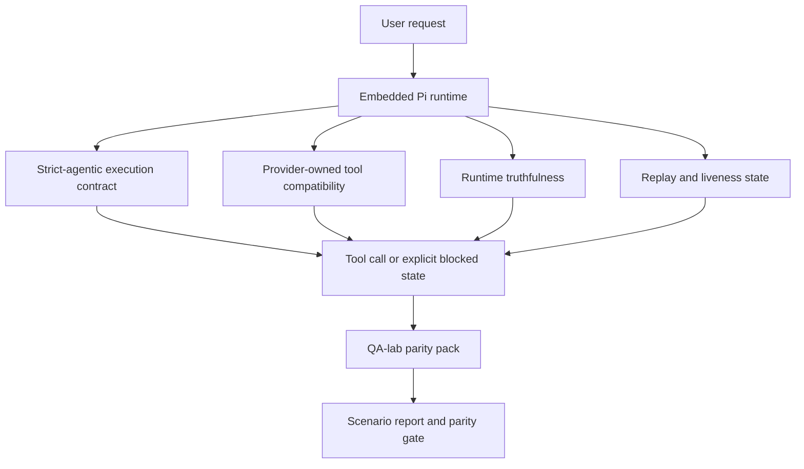

OpenClaw fonctionnait déjà bien avec les modèles de pointe utilisant des outils, mais les modèles GPT-5.5 et de style Codex présentaient encore des lacunes dans quelques cas pratiques :

- ils pouvaient s'arrêter après avoir planifié au lieu de faire le travail
- ils pouvaient utiliser de manière incorrecte les schémas d'outils stricts OpenAI/Codex
- ils pouvaient demander `/elevated full` même lorsqu'un accès complet était impossible
- ils pouvaient perdre l'état des tâches de longue durée lors de la relecture ou de la compaction
- les affirmations de parité avec Claude Opus 4.7 reposaient sur des anecdotes plutôt que sur des scénarios reproductibles

Ce programme de parité corrige ces lacunes en quatre tranches examinables.

## Ce qui a changé

### PR A : exécution stricte-agent

Cette tranche ajoute un contrat d'exécution `strict-agentic` optionnel pour les exécutions Pi GPT-5 intégrées.

Lorsqu'elle est activée, OpenClaw cesse d'accepter les tours de planification pure comme une achèvement « suffisant ». Si le modèle se contente de dire ce qu'il compte faire sans utiliser d'outils ni progresser, OpenClaw réessaie avec une directive d'action immédiate, puis échoue de manière fermée avec un état bloqué explicite au lieu de terminer silencieusement la tâche.

Cela améliore principalement l'expérience GPT-5.5 pour :

- les courts suivis « ok fais-le »
- les tâches de code où la première étape est évidente
- les flux où `update_plan` devrait être un suivi de la progression plutôt que du texte de remplissage

### PR B : véracité de l'exécution

Cette tranche amène OpenClaw à dire la vérité sur deux choses :

- pourquoi l'appel au fournisseur/exécution a échoué
- si `/elevated full` est réellement disponible

Cela signifie que GPT-5.5 reçoit de meilleurs signaux d'exécution pour les portées manquantes, les échecs de rafraîchissement d'auth, les échecs d'auth HTML 403, les problèmes de proxy, les échecs DNS ou d'expiration, et les modes d'accès complet bloqués. Le modèle est moins susceptible d'halluciner la mauvaise correction ou de continuer à demander un mode d'autorisation que l'exécution ne peut pas fournir.

### PR C : exactitude de l'exécution

Cette tranche améliore deux types d'exactitude :

- compatibilité des schémas d'outils OpenAI/Codex détenus par le fournisseur
- la mise en évidence de la vivacité lors de la relecture et des tâches longues

Le travail de compatibilité des outils réduit la friction de schéma pour l'enregistrement strict des outils OpenAI/Codex, en particulier autour des outils sans paramètres et des attentes strictes de racine d'objet. Le travail de relecture/dynamisme rend les tâches de longue durée plus observables, de sorte que les états en pause, bloqués et abandonnés sont visibles au lieu de disparaître dans un texte d'échec générique.

### PR D : harnais de parité

Cette tranche ajoute le premier pack de parité du labo QA afin que GPT-5.5 et Opus 4.7 puissent être testés via les mêmes scénarios et comparés à l'aide de preuves partagées.

Le pack de parité est la couche de preuve. Il ne modifie pas le comportement d'exécution par lui-même.

Une fois que vous avez deux artefacts `qa-suite-summary.json`, générez la comparaison de porte de version avec :

```bash
pnpm openclaw qa parity-report \
  --repo-root . \
  --candidate-summary .artifacts/qa-e2e/openai-candidate/qa-suite-summary.json \
  --baseline-summary .artifacts/qa-e2e/anthropic-baseline/qa-suite-summary.json \
  --output-dir .artifacts/qa-e2e/parity
```

Cette commande écrit :

- un rapport Markdown lisible par l'homme
- un verdict JSON lisible par la machine
- un résultat de porte explicite `pass` / `fail`

## Pourquoi cela améliore GPT-5.5 en pratique

Avant ce travail, GPT-5.5 sur OpenClaw pouvait sembler moins agentique qu'Opus dans de vraies sessions de codage, car l'exécution tolérait des comportements particulièrement nuisibles pour les modèles de style GPT-5 :

- tours de commentaires uniquement
- friction de schéma autour des outils
- retour sur les autorisations vague
- relecture silencieuse ou rupture de compactage

L'objectif n'est pas de faire imiter Opus à GPT-5.5. L'objectif est de donner à GPT-5.5 un contrat d'exécution qui récompense les progrès réels, fournit des sémantiques d'outils et d'autorisations plus propres, et transforme les modes d'échec en états explicites lisibles par la machine et par l'homme.

Cela change l'expérience utilisateur de :

- "le modèle avait un bon plan mais s'est arrêté"

à :

- "le modèle a soit agi, soit OpenClaw a exposé la raison exacte pour laquelle il ne le pouvait pas"

## Avant et après pour les utilisateurs de GPT-5.5

| Avant ce programme                                                                                                       | Après les PR A-D                                                                                                 |
| ------------------------------------------------------------------------------------------------------------------------ | ---------------------------------------------------------------------------------------------------------------- |
| GPT-5.5 pouvait s'arrêter après un plan raisonnable sans prendre la prochaine étape d'outil                              | La PR A transforme "planifier uniquement" en "agir maintenant ou exposer un état bloqué"                         |
| Les schémas d'outils stricts pouvaient rejeter les outils sans paramètres ou de forme OpenAI/Codex de manière déroutante | La PR C rend l'enregistrement et l'invocation des outils détenus par le fournisseur plus prévisibles             |
| Les conseils `/elevated full` pouvaient être vagues ou incorrects dans les exécutions bloquées                           | La PR B donne à GPT-5.5 et à l'utilisateur des indices véridiques sur l'exécution et les autorisations           |
| Les échecs de relecture ou de compactage pouvaient donner l'impression que la tâche avait silencieusement disparu        | La PR C expose explicitement les résultats en pause, bloqués, abandonnés et invalides pour la relecture          |
| L'affirmation « GPT-5.5 semble pire qu'Opus » était surtout anecdotique                                                  | La PR D transforme cela en le même pack de scénarios, les mêmes métriques et une porte de réussite/échec stricte |

## Architecture



## Flux de publication


## Pack de scénarios

Le pack de parité de la première vague couvre actuellement cinq scénarios :

### `approval-turn-tool-followthrough`

Vérifie que le modèle ne s'arrête pas à "Je vais le faire" après une approbation courte. Il devrait prendre la première action concrète lors du même tour.

### `model-switch-tool-continuity`

Vérifie que le travail utilisant des outils reste cohérent à travers les limites de changement de modèle/runtime au lieu de réinitialiser en commentaire ou de perdre le contexte d'exécution.

### `source-docs-discovery-report`

Vérifie que le modèle peut lire la source et les docs, synthétiser les résultats et continuer la tâche de manière ag plutôt que de produire un résumé succinct et de s'arrêter prématurément.

### `image-understanding-attachment`

Vérifie que les tâches en mode mixte impliquant des pièces jointes restent actionnables et ne s'effondrent pas en une narration vague.

### `compaction-retry-mutating-tool`

Vérifie qu'une tâche avec une écriture réelle de mutation garde l'insécurité de relecture explicite au lieu de paraître silencieusement sûre pour la relecture si l'exécution compresse, réessaie ou perd l'état de réponse sous pression.

## Matrice de scénarios

| Scénario                           | Ce qu'il teste                                        | Bon comportement de GPT-5.5                                                                     | Signal d'échec                                                                                             |
| ---------------------------------- | ----------------------------------------------------- | ----------------------------------------------------------------------------------------------- | ---------------------------------------------------------------------------------------------------------- |
| `approval-turn-tool-followthrough` | Tours d'approbation courts après un plan              | Commence immédiatement la première action d'outil concrète au lieu de reformuler l'intention    | suite de plan uniquement, aucune activité d'outil, ou tour bloqué sans véritable bloqueur                  |
| `model-switch-tool-continuity`     | Changement de runtime/modèle sous utilisation d'outil | Préserve le contexte de la tâche et continue à agir de manière cohérente                        | réinitialise en commentaire, perd le contexte de l'outil, ou s'arrête après le changement                  |
| `source-docs-discovery-report`     | Lecture de la source + synthèse + action              | Trouve les sources, utilise les outils et produit un rapport utile sans caler                   | résumé succinct, travail d'outil manquant, ou arrêt incomplet du tour                                      |
| `image-understanding-attachment`   | Travail ag piloté par les pièces jointes              | Interprète la pièce jointe, la relie aux outils et continue la tâche                            | narration vague, pièce jointe ignorée, ou aucune prochaine action concrète                                 |
| `compaction-retry-mutating-tool`   | Mutation de travail sous pression de compactage       | Effectue une écriture réelle et garde le danger de relecture explicite après l'effet secondaire | l'écriture de mutation se produit mais la sécurité de relecture est implicite, manquante ou contradictoire |

## Critère de version

GPT-5.5 ne peut être considérée comme à parité ou meilleure que lorsque l'exécution fusionnée réussit le pack de parité et les régressions de véracité de l'exécution en même temps.

Résultats requis :

- pas d'arrêt de planification uniquement lorsque l'action d'outil suivante est claire
- pas de fausse complétion sans exécution réelle
- pas de conseils incorrects `/elevated full`
- pas d'abandon silencieux de relecture ou de compactage
- les métriques du pack de parité qui sont au moins aussi solides que la base de référence convenue pour Opus 4.7

Pour le harnais de première vague, le critère compare :

- taux de complétion
- taux d'arrêt involontaire
- taux d'appel d'outil valide
- nombre de faux succès

Les preuves de parité sont intentionnellement réparties sur deux niveaux :

- PR D prouve le comportement de GPT-5.5 par rapport à Opus 4.7 dans les mêmes scénarios avec le labo QA
- Les suites déterministes de la PR B prouvent la véracité de l'auth, du proxy, du DNS et de `/elevated full` en dehors du harnais

## Matrice objectif-preuve

| Élément du critère de complétion                                     | PR propriétaire | Source de preuve                                                                  | Signal de succès                                                                                                               |
| -------------------------------------------------------------------- | --------------- | --------------------------------------------------------------------------------- | ------------------------------------------------------------------------------------------------------------------------------ |
| GPT-5.5 ne s'arrête plus après la planification                      | PR A            | `approval-turn-tool-followthrough` plus les suites d'exécution de la PR A         | les tours d'approbation déclenchent un travail réel ou un état bloqué explicite                                                |
| GPT-5.5 ne falsifie plus les progrès ou la fausse complétion d'outil | PR A + PR D     | résultats des scénarios du rapport de parité et nombre de faux succès             | pas de résultats de réussite suspects et pas de complétion avec uniquement des commentaires                                    |
| GPT-5.5 ne donne plus de faux conseils `/elevated full`              | PR B            | suites de véracité déterministes                                                  | les raisons de blocage et les indices d'accès complet restent précis au niveau de l'exécution                                  |
| les échecs de relecture/vivacité restent explicites                  | PR C + PR D     | suites de cycle de vie/relecture de la PR C plus `compaction-retry-mutating-tool` | le travail de mutation garde le danger de relecture explicite au lieu de disparaître silencieusement                           |
| GPT-5.5 égale ou surpasse Opus 4.7 sur les métriques convenues       | PR D            | `qa-agentic-parity-report.md` et `qa-agentic-parity-summary.json`                 | même couverture de scénario et aucune régression sur la complétion, le comportement d'arrêt ou l'utilisation valide de l'outil |

## Comment lire le verdict de parité

Utilisez le verdict dans `qa-agentic-parity-summary.json` comme décision finale lisible par machine pour le pack de parité de première vague.

- `pass` signifie que GPT-5.5 a couvert les mêmes scénarios qu'Opus 4.7 et n'a pas régressé sur les métriques globales convenues.
- `fail` signifie qu'au moins une porte stricte s'est déclenchée : achèvement plus faible, arrêts non intentionnels pires, utilisation valide des outils plus faible, tout cas de fausse réussite, ou couverture de scénario non concordante.
- "shared/base CI issue" n'est pas en soi un résultat de parité. Si le bruit CI en dehors de la PR D bloque une exécution, le verdict doit attendre une exécution runtime fusionnée propre plutôt que d'être déduit des journaux de l'époque de la branche.
- Auth, proxy, DNS et la véracité `/elevated full` proviennent toujours des suites déterministes de la PR B, donc la déclaration de version finale nécessite les deux : un verdict de parité PR D réussi et une couverture de véracité PR B verte.

## Qui doit activer `strict-agentic`

Utilisez `strict-agentic` lorsque :

- l'agent est censé agir immédiatement lorsqu'une prochaine étape est évidente
- les modèles GPT-5.5 ou de la famille Codex sont le runtime principal
- vous préférez des états bloqués explicites plutôt que des réponses "utiles" se limitant à un résumé

Conservez le contrat par défaut lorsque :

- vous souhaitez le comportement actuel plus souple
- vous n'utilisez pas de modèles de la famille GPT-5
- vous testez des invites plutôt que l'exécution runtime

## Connexes

- [Notes du responsable de maintenance GPT-5.5 / Codex parity](/fr/help/gpt55-codex-agentic-parity-maintainers)
