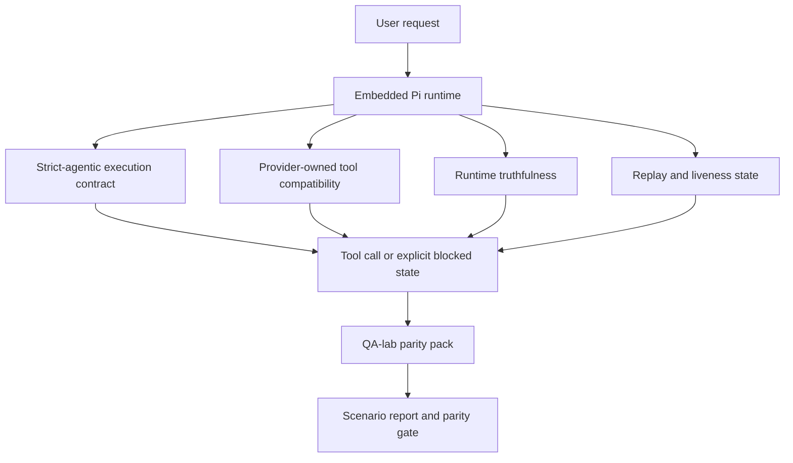
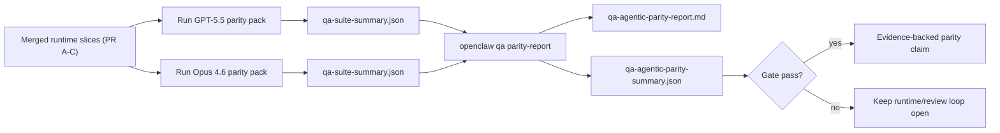

# Parité agentique GPT-5.5 / Codex dans OpenClaw

OpenClaw fonctionnait déjà bien avec les modèles frontières utilisant des outils, mais les modèles GPT-5.5 et de type Codex étaient encore en dessous du niveau attendu de quelques manières pratiques :

- ils pouvaient s'arrêter après la planification au lieu de faire le travail
- ils pouvaient utiliser incorrectement les schémas d'outils stricts OpenAI/Codex
- ils pouvaient demander `/elevated full` même lorsqu'un accès complet était impossible
- ils pouvaient perdre l'état des tâches longues pendant la relecture ou la compactage
- les revendications de parité avec Claude Opus 4.6 étaient basées sur des anecdotes plutôt que sur des scénarios reproductibles

Ce programme de parité corrige ces lacunes en quatre tranches examinables.

## Ce qui a changé

### PR A : exécution agentique stricte

Cette tranche ajoute un contrat d'exécution `strict-agentic` optionnel pour les exécutions Pi GPT-5 intégrées.

Lorsqu'elle est activée, OpenClaw cesse d'accepter les tours de planification uniquement comme une complétion « suffisamment bonne ». Si le modèle dit seulement ce qu'il a l'intention de faire et n'utilise pas réellement d'outils ou ne progresse pas, OpenClaw réessaie avec une incitation à l'action immédiate, puis échoue de manière fermée avec un état bloqué explicite au lieu de terminer silencieusement la tâche.

Cela améliore l'expérience GPT-5.5 principalement sur :

- les courts suivis du type « ok fais-le »
- les tâches de code où la première étape est évidente
- les flux où `update_plan` devrait être un suivi de progression plutôt qu'un texte de remplissage

### PR B : véracité lors de l'exécution

Cette tranche oblige OpenClaw à dire la vérité sur deux choses :

- pourquoi l'appel fournisseur/runtime a échoué
- si `/elevated full` est réellement disponible

Cela signifie que GPT-5.5 reçoit de meilleurs signaux d'exécution pour les portées manquantes, les échecs de rafraîchissement de l'authentification, les échecs d'authentification HTML 403, les problèmes de proxy, les échecs DNS ou d'expiration, et les modes d'accès complet bloqués. Le modèle est moins susceptible d'halluciner une mauvaise solution ou de continuer à demander un mode d'autorisation que l'exécution ne peut pas fournir.

### PR C : correction de l'exécution

Cette tranche améliore deux types de correction :

- compatibilité des schémas d'outils OpenAI/Codex détenus par le fournisseur
- la mise en évidence de la vivacité de la relecture et des tâches longues

Le travail de compatibilité des outils réduit la friction du schéma pour l'enregistrement strict des outils OpenAI/Codex, en particulier autour des outils sans paramètres et des attentes strictes de racine d'objet. Le travail de relecture/vivacité rend les tâches de longue durée plus observables, de sorte que les états en pause, bloqués et abandonnés sont visibles au lieu de disparaître dans un texte d'échec générique.

### PR D : harnais de parité

Cette tranche ajoute le premier pack de parité QA-lab afin que GPT-5.5 et Opus 4.6 puissent être exercés à travers les mêmes scénarios et comparés en utilisant des preuves partagées.

Le pack de parité est la couche de preuve. Il ne modifie pas le comportement à l'exécution par lui-même.

Une fois que vous avez deux artefacts `qa-suite-summary.json`, générez la comparaison de validation de sortie (release-gate) avec :

```bash
pnpm openclaw qa parity-report \
  --repo-root . \
  --candidate-summary .artifacts/qa-e2e/gpt55/qa-suite-summary.json \
  --baseline-summary .artifacts/qa-e2e/opus46/qa-suite-summary.json \
  --output-dir .artifacts/qa-e2e/parity
```

Cette commande écrit :

- un rapport Markdown lisible par l'homme
- un verdict JSON lisible par la machine
- un résultat de porte (gate) explicite `pass` / `fail`

## Pourquoi cela améliore GPT-5.5 en pratique

Avant ce travail, GPT-5.5 sur OpenClaw pouvait sembler moins agentique qu'Opus dans les vraies sessions de codage, car le runtime tolérait des comportements particulièrement nuisibles pour les modèles de type GPT-5 :

- tours de commentaire uniquement
- friction de schéma autour des outils
- retour d'autorisation vague
- échec silencieux de la relecture ou de la compaction

L'objectif n'est pas de faire imiter Opus à GPT-5.5. L'objectif est de donner à GPT-5.5 un contrat d'exécution qui récompense les progrès réels, fournit des sémantiques d'outils et d'autorisations plus propres, et transforme les modes d'échec en états explicites lisibles par la machine et par l'homme.

Cela change l'expérience utilisateur de :

- « le modèle avait un bon plan mais s'est arrêté »

à :

- « le modèle a soit agi, soit OpenClaw a affiché la raison exacte pour laquelle il ne le pouvait pas »

## Avant et après pour les utilisateurs de GPT-5.5

| Avant ce programme                                                                                                       | Après les PR A-D                                                                                                     |
| ------------------------------------------------------------------------------------------------------------------------ | -------------------------------------------------------------------------------------------------------------------- |
| GPT-5.5 pouvait s'arrêter après un plan raisonnable sans prendre la prochaine étape d'outil                              | La PR A transforme « plan uniquement » en « agir maintenant ou afficher un état bloqué »                             |
| Les schémas d'outils stricts pouvaient rejeter les outils sans paramètres ou de forme OpenAI/Codex de manière déroutante | La PR C rend l'enregistrement et l'invocation des outils détenus par le fournisseur plus prévisibles                 |
| Les conseils `/elevated full` pouvaient être vagues ou incorrects dans les runtimes bloqués                              | La PR B donne à GPT-5.5 et à l'utilisateur des indications de runtime et d'autorisation véridiques                   |
| Les échecs de relecture ou de compaction pouvaient donner l'impression que la tâche avait disparu silencieusement        | La PR C expose explicitement les résultats mis en pause, bloqués, abandonnés et invalides pour la relecture          |
| « GPT-5.5 semble moins performant qu'Opus » était principalement anecdotique                                             | La PR D transforme cela en le même pack de scénarios, les mêmes métriques et une barrière de réception/échec stricte |

## Architecture



## Flux de publication



## Pack de scénarios

Le pack de parité de la première vague couvre actuellement cinq scénarios :

### `approval-turn-tool-followthrough`

Vérifie que le modèle ne s'arrête pas à « Je vais faire ça » après une courte approbation. Il devrait prendre la première action concrète lors du même tour.

### `model-switch-tool-continuity`

Vérifie que le travail utilisant des outils reste cohérent à travers les limites de changement de modèle/runtime au lieu de réinitialiser en commentaire ou de perdre le contexte d'exécution.

### `source-docs-discovery-report`

Vérifie que le modèle peut lire les sources et les docs, synthétiser les résultats et continuer la tâche de manière agentic plutôt que de produire un résumé superficiel et de s'arrêter prématurément.

### `image-understanding-attachment`

Vérifie que les tâches en mode mixte impliquant des pièces jointes restent actionnables et ne s'effondrent pas en une narration vague.

### `compaction-retry-mutating-tool`

Vérifie qu'une tâche avec une écriture mutante réelle garde le caractère non sécurisé de la relecture explicite au lieu de paraître silencieusement sûr pour la relecture si l'exécution compresse, réessaie ou perd l'état de réponse sous pression.

## Matrice de scénarios

| Scénario                           | Ce qu'il teste                                        | Comportement GPT-5.5 correct                                                                       | Signal d'échec                                                                                            |
| ---------------------------------- | ----------------------------------------------------- | -------------------------------------------------------------------------------------------------- | --------------------------------------------------------------------------------------------------------- |
| `approval-turn-tool-followthrough` | Courts tours d'approbation après un plan              | Commence immédiatement la première action concrète d'outil au lieu de reformuler l'intention       | suivi de plan uniquement, aucune activité d'outil, ou tour bloqué sans vrai bloqueur                      |
| `model-switch-tool-continuity`     | Changement de runtime/modèle sous utilisation d'outil | Préserve le contexte de la tâche et continue à agir de manière cohérente                           | réinitialise en commentaire, perd le contexte de l'outil, ou s'arrête après le changement                 |
| `source-docs-discovery-report`     | Lecture de sources + synthèse + action                | Trouve les sources, utilise les outils et produit un rapport utile sans caler                      | résumé superficiel, travail d'outil manquant, ou arrêt sur tour incomplet                                 |
| `image-understanding-attachment`   | Travail agentic piloté par pièce jointe               | Interprète la pièce jointe, la connecte aux outils et continue la tâche                            | narration vague, pièce jointe ignorée, ou aucune prochaine action concrète                                |
| `compaction-retry-mutating-tool`   | Travail mutant sous pression de compactage            | Effectue une écriture réelle et garde l'insécurité de relecture explicite après l'effet secondaire | l'écriture modifiante se produit mais la sécurité de relecture est implicite, manquante ou contradictoire |

## Porte de sortie

GPT-5.5 ne peut être considéré à parité ou mieux que lorsque l'exécution fusionnée réussit le pack de parité et les régressions de véracité de l'exécution en même temps.

Résultats requis :

- pas d'arrêt de planification uniquement lorsque la prochaine action d'outil est claire
- pas de fausse achèvement sans exécution réelle
- pas de `/elevated full` incorrecte
- pas d'abandon silencieux de la relecture ou de la compaction
- métriques du pack de parité qui sont au moins aussi solides que la base de référence Opus 4.6 convenue

Pour le harnais de première vague, la porte compare :

- taux d'achèvement
- taux d'arrêt involontaire
- taux d'appel d'outil valide
- nombre de faux succès

Les preuves de parité sont intentionnellement réparties sur deux couches :

- La PR D prouve le comportement GPT-5.5 vs Opus 4.6 dans le même scénario avec le QA-lab
- Les suites déterministes de la PR B prouvent l'auth, le proxy, le DNS et la véracité `/elevated full` en dehors du harnais

## Matrice objectif-preuve

| Élément de la porte d'achèvement                             | PR propriétaire | Source de preuve                                                            | Signal de réussite                                                                                                            |
| ------------------------------------------------------------ | --------------- | --------------------------------------------------------------------------- | ----------------------------------------------------------------------------------------------------------------------------- |
| GPT-5.5 ne cale plus après la planification                  | PR A            | `approval-turn-tool-followthrough` plus les suites d'exécution de la PR A   | les tours d'approbation déclenchent un vrai travail ou un état bloqué explicite                                               |
| GPT-5.5 ne simule plus le progrès ou l'achèvement de l'outil | PR A + PR D     | résultats des scénarios du rapport de parité et nombre de faux succès       | pas de résultats de passage suspects et pas d'achèvement par commentaires uniquement                                          |
| GPT-5.5 ne donne plus de fausse `/elevated full`             | PR B            | suites de véracité déterministes                                            | les raisons de blocage et les indices d'accès complet restent exacts lors de l'exécution                                      |
| Les échecs de relecture/vivacité restent explicites          | PR C + PR D     | suites de cycle de vie/relecture PR C plus `compaction-retry-mutating-tool` | le travail modifiant garde l'insécurité de relecture explicite au lieu de disparaître silencieusement                         |
| GPT-5.5 égale ou bat Opus 4.6 sur les métriques convenues    | PR D            | `qa-agentic-parity-report.md` et `qa-agentic-parity-summary.json`           | même couverture de scénario et aucune régression sur l'achèvement, le comportement d'arrêt ou l'utilisation valide de l'outil |

## Comment lire le verdict de parité

Utilisez le verdict dans `qa-agentic-parity-summary.json` comme décision finale lisible par machine pour le pack de parité de première vague.

- `pass` signifie que GPT-5.5 couvre les mêmes scénarios qu'Opus 4.6 et n'a pas régressé sur les métriques agrégées convenues.
- `fail` signifie qu'au moins une porte stricte s'est déclenchée : achèvement plus faible, arrêts non intentionnels pires, utilisation valide d'outil plus faible, tout cas de fausse réussite, ou couverture de scénario non concordante.
- « shared/base CI issue » n'est pas en soi un résultat de parité. Si le bruit CI en dehors de la PR D bloque une exécution, le verdict doit attendre une exécution propre du runtime fusionné au lieu d'être déduit des journaux de l'époque de la branche.
- L'exactitude d'Auth, proxy, DNS et `/elevated full` provient toujours des suites déterministes de la PR B, donc la déclaration de version finale nécessite les deux : un verdict de parité PR D réussi et une couverture d'exactitude PR B verte.

## Qui doit activer `strict-agentic`

Utilisez `strict-agentic` lorsque :

- l'agent est censé agir immédiatement lorsqu'une étape suivante est évidente
- les modèles GPT-5.5 ou de la famille Codex sont le runtime principal
- vous préférez des états bloqués explicites plutôt que des réponses « utiles » se limitant à un résumé

Conservez le contrat par défaut lorsque :

- vous souhaitez le comportement plus souple existant
- vous n'utilisez pas les modèles de la famille GPT-5
- vous testez les invites (prompts) plutôt que l'application du runtime

## Connexes

- [Notes de maintenance pour la parité GPT-5.5 / Codex](/fr/help/gpt55-codex-agentic-parity-maintainers)
