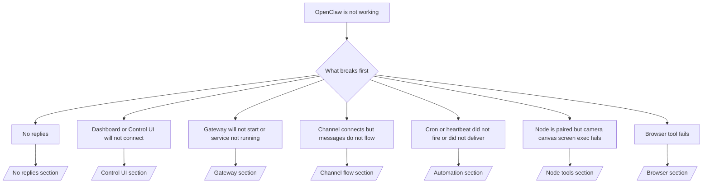

Si vous n'avez que 2 minutes, utilisez cette page comme porte d'entrée de triage.

## Premières 60 secondes

Exécutez cette échelle exacte dans l'ordre :

```bash
openclaw status
openclaw status --all
openclaw gateway probe
openclaw gateway status
openclaw doctor
openclaw channels status --probe
openclaw logs --follow
```

Bon résultat en une ligne :

- `openclaw status` → affiche les canaux configurés et aucune erreur d'auth évidente.
- `openclaw status --all` → le rapport complet est présent et partageable.
- `openclaw gateway probe` → la passerelle cible attendue est joignable (`Reachable: yes`). `Capability: ...` indique le niveau d'auth que la sonde a pu prouver, et `Read probe: limited - missing scope: operator.read` est un diagnostic dégradé, pas un échec de connexion.
- `openclaw gateway status` → `Runtime: running`, `Connectivity probe: ok` et une ligne `Capability: ...` plausible. Utilisez `--require-rpc` si vous avez besoin d'une preuve RPC avec un champ de lecture aussi.
- `openclaw doctor` → aucune erreur de configuration/service bloquante.
- `openclaw channels status --probe` → une passerelle joignable renvoie l'état de transport en direct par compte
  ainsi que les résultats de sonde/audit tels que `works` ou `audit ok` ; si la
  passerelle est injoignable, la commande se rabat sur des résumés basés uniquement sur la configuration.
- `openclaw logs --follow` → activité régulière, aucune erreur fatale répétitive.

## Anthropic contexte long 429

Si vous voyez :
`HTTP 429: rate_limit_error: Extra usage is required for long context requests`,
allez sur [/gateway/troubleshooting#anthropic-429-extra-usage-required-for-long-context](/fr/gateway/troubleshooting#anthropic-429-extra-usage-required-for-long-context).

## Le backend local compatible OpenAI fonctionne directement mais échoue dans OpenClaw

Si votre backend `/v1` local ou auto-hébergé répond à de petites sondes `/v1/chat/completions` directes
mais échoue sur `openclaw infer model run` ou les tours normaux
de l'agent :

1. Si l'erreur mentionne `messages[].content` attendant une chaîne, définissez
   `models.providers.<provider>.models[].compat.requiresStringContent: true`.
2. Si le backend échoue toujours uniquement sur les tours de l'agent OpenClaw, définissez
   `models.providers.<provider>.models[].compat.supportsTools: false` et réessayez.
3. Si les petits appels directs fonctionnent toujours mais que les gros OpenClaw font planter le
   backend, considérez le problème restant comme une limitation en amont du modèle/serveur et
   continuez avec le runbook approfondi :
   [/gateway/troubleshooting#local-openai-compatible-backend-passes-direct-probes-but-agent-runs-fail](/fr/gateway/troubleshooting#local-openai-compatible-backend-passes-direct-probes-but-agent-runs-fail)

## L'installation du plugin échoue en raison d'extensions openclaw manquantes

Si l'installation échoue avec `package.json missing openclaw.extensions`, le package du plugin
utilise une ancienne forme que OpenClaw n'accepte plus.

Corrigez dans le package du plugin :

1. Ajoutez `openclaw.extensions` à `package.json`.
2. Faites pointer les entrées vers les fichiers d'exécution construits (généralement `./dist/index.js`).
3. Publiez à nouveau le plugin et exécutez `openclaw plugins install <package>` à nouveau.

Exemple :

```json
{
  "name": "@openclaw/my-plugin",
  "version": "1.2.3",
  "openclaw": {
    "extensions": ["./dist/index.js"]
  }
}
```

Référence : [Architecture du plugin](/fr/plugins/architecture)

## Plugin présent mais bloqué par une propriété suspecte

Si des avertissements de `openclaw doctor`, de configuration ou de démarrage s'affichent :

```text
blocked plugin candidate: suspicious ownership (... uid=1000, expected uid=0 or root)
plugin present but blocked
```

les fichiers du plugin sont détenus par un utilisateur Unix différent de celui du processus les
chargeant. Ne supprimez pas la configuration du plugin. Corrigez la propriété des fichiers ou exécutez OpenClaw en tant que
le même utilisateur que celui qui possède le répertoire d'état.

Les installations Docker s'exécutent normalement en tant que `node` (uid `1000`). Pour la configuration
Docker par défaut, réparez les montages de liaison de l'hôte :

```bash
sudo chown -R 1000:1000 /path/to/openclaw-config /path/to/openclaw-workspace
openclaw doctor --fix
```

Si vous exécutez intentionnellement OpenClaw en tant que root, réparez à la place la racine du plugin géré
pour une propriété root :

```bash
sudo chown -R root:root /path/to/openclaw-config/npm
openclaw doctor --fix
```

Documentation approfondie :

- [Propriété du chemin du plugin](/fr/tools/plugin#blocked-plugin-path-ownership)
- [Permissions Docker](/fr/install/docker#permissions-and-eacces)

## Arbre de décision



<AccordionGroup>
  <Accordion title="No replies">
    ```bash
    openclaw status
    openclaw gateway status
    openclaw channels status --probe
    openclaw pairing list --channel <channel> [--account <id>]
    openclaw logs --follow
    ```

    Le bon résultat ressemble à :

    - `Runtime: running`
    - `Connectivity probe: ok`
    - `Capability: read-only`, `write-capable`, ou `admin-capable`
    - Votre channel affiche un transport connecté et, si pris en charge, `works` ou `audit ok` dans `channels status --probe`
    - L'expéditeur semble approuvé (ou la politique DM est ouverte/liste verte)

    Signatures de journal courantes :

    - `drop guild message (mention required` → le filtrage par mention a bloqué le message dans Discord.
    - `pairing request` → l'expéditeur n'est pas approuvé et attend l'approbation de jumelage DM.
    - `blocked` / `allowlist` dans les journaux du channel → l'expéditeur, la salle ou le groupe est filtré.

    Pages approfondies :

    - [/gateway/troubleshooting#no-replies](/fr/gateway/troubleshooting#no-replies)
    - [/channels/troubleshooting](/fr/channels/troubleshooting)
    - [/channels/pairing](/fr/channels/pairing)

  </Accordion>

  <Accordion title="Le tableau de bord ou l'interface de contrôle ne se connecte pas">
    ```bash
    openclaw status
    openclaw gateway status
    openclaw logs --follow
    openclaw doctor
    openclaw channels status --probe
    ```

    Un bon résultat ressemble à :

    - `Dashboard: http://...` est affiché dans `openclaw gateway status`
    - `Connectivity probe: ok`
    - `Capability: read-only`, `write-capable` ou `admin-capable`
    - Pas de boucle d'auth dans les journaux

    Signatures de journal courantes :

    - `device identity required` → Le contexte HTTP/non sécurisé ne peut pas terminer l'auth de l'appareil.
    - `origin not allowed` → le navigateur `Origin` n'est pas autorisé pour la cible de passerelle
      de l'interface de contrôle.
    - `AUTH_TOKEN_MISMATCH` avec des indices de nouvelle tentative (`canRetryWithDeviceToken=true`) → une nouvelle tentative de jeton d'appareil de confiance peut se produire automatiquement.
    - Cette nouvelle tentative à jeton en cache réutilise l'ensemble de portées en cache stocké avec le jeton
      d'appareil associé. Les appelants avec `deviceToken` explicite / `scopes` explicite conservent
      leur ensemble de portées demandé à la place.
    - Sur le chemin asynchrone de l'interface de contrôle Tailscale Serve Tailscale, les tentatives échouées pour le même
      `{scope, ip}` sont sérialisées avant que le limiteur n'enregistre l'échec, donc une
      seconde mauvaise nouvelle tentative simultanée peut déjà afficher `retry later`.
    - `too many failed authentication attempts (retry later)` à partir d'une origine de navigateur
      localhost → des échecs répétés de cette même origine `Origin` sont temporairement
      bloqués ; une autre origine localhost utilise un compartiment séparé.
    - `unauthorized` répétés après cette nouvelle tentative → mauvais jeton/mot de passe, inadéquation du mode d'auth ou jeton d'appareil associé périmé.
    - `gateway connect failed:` → L'interface cible la mauvaise URL/port ou une passerelle injoignable.

    Pages approfondies :

    - [/gateway/troubleshooting#dashboard-control-ui-connectivity](/fr/gateway/troubleshooting#dashboard-control-ui-connectivity)
    - [/web/control-ui](/fr/web/control-ui)
    - [/gateway/authentication](/fr/gateway/authentication)

  </Accordion>

  <Accordion title="GatewayLe Gateway ne démarre pas ou le service est installé mais pas en cours d'exécution">
    ```bash
    openclaw status
    openclaw gateway status
    openclaw logs --follow
    openclaw doctor
    openclaw channels status --probe
    ```

    Un résultat correct ressemble à :

    - `Service: ... (loaded)`
    - `Runtime: running`
    - `Connectivity probe: ok`
    - `Capability: read-only`, `write-capable`, ou `admin-capable`

    Signatures de journal courantes :

    - `Gateway start blocked: set gateway.mode=local` ou `existing config is missing gateway.mode` → le mode Gateway est distant, ou le fichier de configuration manque le tampon de mode local et doit être réparé.
    - `refusing to bind gateway ... without auth` → liaison non bouclée sans chemin d'authentification Gateway valide (jeton/mot de passe, ou proxy de confiance si configuré).
    - `another gateway instance is already listening` ou `EADDRINUSE` → port déjà utilisé.

    Pages approfondies :

    - [/gateway/troubleshooting#gateway-service-not-running](/fr/gateway/troubleshooting#gateway-service-not-running)
    - [/gateway/background-process](/fr/gateway/background-process)
    - [/gateway/configuration](/fr/gateway/configuration)

  </Accordion>

  <Accordion title="Le channel se connecte mais les messages ne passent pas">
    ```bash
    openclaw status
    openclaw gateway status
    openclaw logs --follow
    openclaw doctor
    openclaw channels status --probe
    ```

    Un résultat correct ressemble à :

    - Le transport du channel est connecté.
    - Les vérifications de jumelage/liste blanche réussissent.
    - Les mentions sont détectées lorsque cela est requis.

    Signatures de journal courantes :

    - `mention required` → le blocage de mention de groupe a empêché le traitement.
    - `pairing` / `pending` → l'expéditeur DM n'est pas encore approuvé.
    - `not_in_channel`, `missing_scope`, `Forbidden`, `401/403` → problème de jeton d'autorisation de channel.

    Pages approfondies :

    - [/gateway/troubleshooting#channel-connected-messages-not-flowing](/fr/gateway/troubleshooting#channel-connected-messages-not-flowing)
    - [/channels/troubleshooting](/fr/channels/troubleshooting)

  </Accordion>

  <Accordion title="Cron ou heartbeat ne s'est pas déclenché ou n'a pas été délivré">
    ```bash
    openclaw status
    openclaw gateway status
    openclaw cron status
    openclaw cron list
    openclaw cron runs --id <jobId> --limit 20
    openclaw logs --follow
    ```

    Un bon résultat ressemble à ceci :

    - `cron.status` indique activé avec un prochain réveil.
    - `cron runs` montre des entrées `ok` récentes.
    - Le heartbeat est activé et n'est pas en dehors des heures actives.

    Signatures de journal courantes :

    - `cron: scheduler disabled; jobs will not run automatically` → cron est désactivé.
    - `heartbeat skipped` avec `reason=quiet-hours` → en dehors des heures actives configurées.
    - `heartbeat skipped` avec `reason=empty-heartbeat-file` → `HEARTBEAT.md` existe mais ne contient qu'une structure vide ou uniquement des en-têtes.
    - `heartbeat skipped` avec `reason=no-tasks-due` → le mode de tâche `HEARTBEAT.md` est actif mais aucun des intervalles de tâche n'est encore dû.
    - `heartbeat skipped` avec `reason=alerts-disabled` → toute la visibilité du heartbeat est désactivée (`showOk`, `showAlerts` et `useIndicator` sont tous désactivés).
    - `requests-in-flight` → voie principale occupée ; le réveil du heartbeat a été différé.
    - `unknown accountId` → le compte cible de livraison du heartbeat n'existe pas.

    Pages approfondies :

    - [/gateway/troubleshooting#cron-and-heartbeat-delivery](/fr/gateway/troubleshooting#cron-and-heartbeat-delivery)
    - [/automation/cron-jobs#troubleshooting](/fr/automation/cron-jobs#troubleshooting)
    - [/gateway/heartbeat](/fr/gateway/heartbeat)

  </Accordion>

  <Accordion title="Node is paired but tool fails camera canvas screen exec">
    ```bash
    openclaw status
    openclaw gateway status
    openclaw nodes status
    openclaw nodes describe --node <idOrNameOrIp>
    openclaw logs --follow
    ```

    Un résultat correct ressemble à ceci :

    - Le nœud est répertorié comme connecté et associé pour le rôle `node`.
    - La capacité existe pour la commande que vous invoquez.
    - L'état de l'autorisation est accordé pour l'tool.

    Signatures de journal courantes :

    - `NODE_BACKGROUND_UNAVAILABLE` → mettre l'application du nœud au premier plan.
    - `*_PERMISSION_REQUIRED` → l'autorisation du système d'exploitation a été refusée ou est manquante.
    - `SYSTEM_RUN_DENIED: approval required` → l'approbation d'exécution est en attente.
    - `SYSTEM_RUN_DENIED: allowlist miss` → la commande n'est pas sur la liste d'autorisation d'exécution.

    Pages approfondies :

    - [/gateway/troubleshooting#node-paired-tool-fails](/fr/gateway/troubleshooting#node-paired-tool-fails)
    - [/nodes/troubleshooting](/fr/nodes/troubleshooting)
    - [/tools/exec-approvals](/fr/tools/exec-approvals)

  </Accordion>

  <Accordion title="Exécution demande soudainement une approbation">
    ```bash
    openclaw config get tools.exec.host
    openclaw config get tools.exec.security
    openclaw config get tools.exec.ask
    openclaw gateway restart
    ```

    Ce qui a changé :

    - Si `tools.exec.host` n'est pas défini, la valeur par défaut est `auto`.
    - `host=auto` correspond à `sandbox` lorsqu'un runtime de bac à sable est actif, `gateway` sinon.
    - `host=auto` ne gère que le routage ; le comportement "YOLO" sans invite provient de `security=full` associé à `ask=off` sur la passerelle/le nœud.
    - Sur `gateway` et `node`, si `tools.exec.security` n'est pas défini, la valeur par défaut est `full`.
    - Si `tools.exec.ask` n'est pas défini, la valeur par défaut est `off`.
    - Résultat : si vous voyez des demandes d'approbation, une stratégie locale à l'hôte ou par session a resserré l'exécution par rapport aux valeurs par défaut actuelles.

    Rétablir le comportement par défaut actuel sans approbation :

    ```bash
    openclaw config set tools.exec.host gateway
    openclaw config set tools.exec.security full
    openclaw config set tools.exec.ask off
    openclaw gateway restart
    ```

    Alternatives plus sûres :

    - Définissez uniquement `tools.exec.host=gateway` si vous souhaitez simplement un routage d'hôte stable.
    - Utilisez `security=allowlist` avec `ask=on-miss` si vous souhaitez une exécution sur l'hôte tout en conservant une révision pour les absences de liste autorisée.
    - Activez le mode bac à sable si vous voulez que `host=auto` corresponde à nouveau à `sandbox`.

    Signatures de journaux courantes :

    - `Approval required.` → la commande est en attente de `/approve ...`.
    - `SYSTEM_RUN_DENIED: approval required` → l'approbation d'exécution node-host est en attente.
    - `exec host=sandbox requires a sandbox runtime for this session` → sélection de bac à sable implicite/explicite mais le mode bac à sable est désactivé.

    Pages approfondies :

    - [/tools/exec](/fr/tools/exec)
    - [/tools/exec-approvals](/fr/tools/exec-approvals)
    - [/gateway/security#what-the-audit-checks-high-level](/fr/gateway/security#what-the-audit-checks-high-level)

  </Accordion>

  <Accordion title="Échec de l'outil navigateur">
    ```bash
    openclaw status
    openclaw gateway status
    openclaw browser status
    openclaw logs --follow
    openclaw doctor
    ```

    Une sortie correcte ressemble à ceci :

    - Le statut du navigateur affiche `running: true` et un navigateur/profil choisi.
    - `openclaw` démarre, ou `user` peut voir les onglets Chrome locaux.

    Signatures de journal courantes :

    - `unknown command "browser"` ou `unknown command 'browser'` → `plugins.allow` est défini et n'inclut pas `browser`.
    - `Failed to start Chrome CDP on port` → le démarrage du navigateur local a échoué.
    - `browser.executablePath not found` → le chemin binaire configuré est incorrect.
    - `browser.cdpUrl must be http(s) or ws(s)` → l'URL CDP configurée utilise un schéma non pris en charge.
    - `browser.cdpUrl has invalid port` → l'URL CDP configurée a un port incorrect ou hors plage.
    - `No Chrome tabs found for profile="user"` → le profil de connexion MCP Chrome n'a aucun onglet Chrome local ouvert.
    - `Remote CDP for profile "<name>" is not reachable` → le point de terminaison CDP distant configuré n'est pas accessible depuis cet hôte.
    - `Browser attachOnly is enabled ... not reachable` ou `Browser attachOnly is enabled and CDP websocket ... is not reachable` → le profil de connexion uniquement n'a pas de cible CDP active.
    - substitutions de viewport obsolète / mode sombre / langue / hors ligne sur les profils CDP distants ou de connexion uniquement → exécutez `openclaw browser stop --browser-profile <name>` pour fermer la session de contrôle active et libérer l'état d'émulation sans redémarrer la passerelle.

    Pages approfondies :

    - [/gateway/troubleshooting#browser-tool-fails](/fr/gateway/troubleshooting#browser-tool-fails)
    - [/tools/browser#missing-browser-command-or-tool](/fr/tools/browser#missing-browser-command-or-tool)
    - [/tools/browser-linux-troubleshooting](/fr/tools/browser-linux-troubleshooting)
    - [/tools/browser-wsl2-windows-remote-cdp-troubleshooting](/fr/tools/browser-wsl2-windows-remote-cdp-troubleshooting)

  </Accordion>

</AccordionGroup>

## Connexes

- [FAQ](/fr/help/faq) — questions fréquentes
- [Gateway Troubleshooting](/fr/gateway/troubleshooting) — problèmes spécifiques à la passerelle
- [Doctor](/fr/gateway/doctor) — vérifications de santé et réparations automatisées
- [Channel Troubleshooting](/fr/channels/troubleshooting) — problèmes de connectivité des canaux
- [Automation Troubleshooting](/fr/automation/cron-jobs#troubleshooting) — problèmes cron et heartbeat
