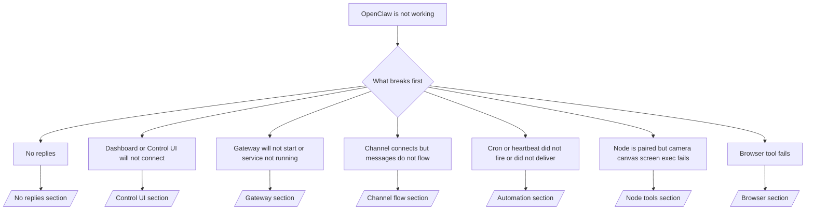

# Troubleshooting

Si vous n'avez que 2 minutes, utilisez cette page comme porte d'entrée de triage.

## Premières 60 secondes

Exécutez cette échelle exacte dans l'ordre :

```bash
openclaw status
openclaw status --all
openclaw gateway probe
openclaw gateway status
openclaw doctor
openclaw channels status --probe
openclaw logs --follow
```

Bonne sortie en une ligne :

- `openclaw status` → affiche les canaux configurés et aucune erreur d'authentification évidente.
- `openclaw status --all` → le rapport complet est présent et partageable.
- `openclaw gateway probe` → la passerelle cible attendue est accessible (`Reachable: yes`). `Capability: ...` indique le niveau d'authentification que la sonde a pu prouver, et `Read probe: limited - missing scope: operator.read` correspond à des diagnostics dégradés, et non à un échec de connexion.
- `openclaw gateway status` → `Runtime: running`, `Connectivity probe: ok` et une ligne `Capability: ...` plausible. Utilisez `--require-rpc` si vous avez également besoin d'une preuve RPC de portée de lecture.
- `openclaw doctor` → aucune erreur de configuration/service bloquante.
- `openclaw channels status --probe` → une passerelle accessible renvoie l'état du transport en direct par compte
  ainsi que les résultats de la sonde/de l'audit tels que `works` ou `audit ok` ; si la
  passerelle est inaccessible, la commande revient à des résumés basés uniquement sur la configuration.
- `openclaw logs --follow` → activité stable, aucune erreur fatale répétitive.

## Anthropic long context 429

Si vous voyez :
`HTTP 429: rate_limit_error: Extra usage is required for long context requests`,
allez sur [/gateway/troubleshooting#anthropic-429-extra-usage-required-for-long-context](/fr/gateway/troubleshooting#anthropic-429-extra-usage-required-for-long-context).

## Le backend local compatible OpenAI fonctionne directement mais échoue dans OpenClaw

Si votre backend local ou auto-hébergé `/v1` répond à de petites sondes directes
`/v1/chat/completions` mais échoue sur `openclaw infer model run` ou les tours normaux
de l'agent :

1. Si l'erreur mentionne `messages[].content` attendant une chaîne, définissez
   `models.providers.<provider>.models[].compat.requiresStringContent: true`.
2. Si le backend échoue toujours uniquement sur les tours de l'agent OpenClaw, définissez
   `models.providers.<provider>.models[].compat.supportsTools: false` et réessayez.
3. Si de minuscules appels directs fonctionnent toujours mais que des invites OpenClaw plus importantes plantent le
   backend, traitez le problème restant comme une limitation du modèle/serveur en amont et
   continuez dans le runbook approfondi :
   [/gateway/troubleshooting#local-openai-compatible-backend-passes-direct-probes-but-agent-runs-fail](/fr/gateway/troubleshooting#local-openai-compatible-backend-passes-direct-probes-but-agent-runs-fail)

## L'installation du plugin échoue en raison d'extensions openclaw manquantes

Si l'installation échoue avec `package.json missing openclaw.extensions`, le package du plugin
utilise une ancienne forme que OpenClaw n'accepte plus.

Corrigez dans le package du plugin :

1. Ajoutez `openclaw.extensions` à `package.json`.
2. Faites pointer les entrées vers les fichiers d'exécution construits (généralement `./dist/index.js`).
3. Republichez le plugin et exécutez `openclaw plugins install <package>` à nouveau.

Exemple :

```json
{
  "name": "@openclaw/my-plugin",
  "version": "1.2.3",
  "openclaw": {
    "extensions": ["./dist/index.js"]
  }
}
```

Référence : [Architecture des plugins](/fr/plugins/architecture)

## Arbre de décision



<AccordionGroup>
  <Accordion title="Pas de réponses">
    ```bash
    openclaw status
    openclaw gateway status
    openclaw channels status --probe
    openclaw pairing list --channel <channel> [--account <id>]
    openclaw logs --follow
    ```

    Un bon résultat ressemble à :

    - `Runtime: running`
    - `Connectivity probe: ok`
    - `Capability: read-only`, `write-capable`, ou `admin-capable`
    - Votre channel affiche un transport connecté et, si pris en charge, `works` ou `audit ok` dans `channels status --probe`
    - L'expéditeur apparaît approuvé (ou la politique DM est ouverte/liste blanche)

    Signatures de journal courantes :

    - `drop guild message (mention required` → le blocage par mention a bloqué le message dans Discord.
    - `pairing request` → l'expéditeur n'est pas approuvé et attend l'approbation de l'appairage DM.
    - `blocked` / `allowlist` dans les journaux du channel → l'expéditeur, la salle ou le groupe est filtré.

    Pages approfondies :

    - [/gateway/troubleshooting#no-replies](/fr/gateway/troubleshooting#no-replies)
    - [/channels/troubleshooting](/fr/channels/troubleshooting)
    - [/channels/pairing](/fr/channels/pairing)

  </Accordion>

  <Accordion title="Le tableau de bord ou l'interface de contrôle ne se connecte pas">
    ```bash
    openclaw status
    openclaw gateway status
    openclaw logs --follow
    openclaw doctor
    openclaw channels status --probe
    ```

    Un bon résultat ressemble à ceci :

    - `Dashboard: http://...` est affiché dans `openclaw gateway status`
    - `Connectivity probe: ok`
    - `Capability: read-only`, `write-capable` ou `admin-capable`
    - Pas de boucle d'authentification dans les journaux

    Signatures de journal courantes :

    - `device identity required` → Le contexte HTTP/non sécurisé ne peut pas terminer l'authentification de l'appareil.
    - `origin not allowed` → le navigateur `Origin` n'est pas autorisé pour la cible
      de la passerelle de l'interface de contrôle.
    - `AUTH_TOKEN_MISMATCH` avec des indices de réessai (`canRetryWithDeviceToken=true`) → une nouvelle tentative de jeton d'appareil de confiance peut se produire automatiquement.
    - Cette nouvelle tentative à jeton mis en cache réutilise l'ensemble d'étendues mises en cache stockées avec le jeton
      d'appareil apparié. Les appelants explicites `deviceToken` / explicites `scopes` conservent
      leur ensemble d'étendues demandées à la place.
    - Sur le chemin de l'interface de contrôle asynchrone Tailscale Serve, les tentatives échouées pour le même
      `{scope, ip}` sont sérialisées avant que le limiteur n'enregistre l'échec, de sorte qu'une
      deuxième mauvaise tentative simultanée peut déjà afficher `retry later`.
    - `too many failed authentication attempts (retry later)` à partir d'une origine de
      navigateur localhost → les échecs répétés de cette même `Origin` sont temporairement
      bloqués ; une autre origine localhost utilise un compartiment séparé.
    - `unauthorized` répétés après cette tentative → mauvais jeton/mot de passe, inadéquation du mode d'authentification ou jeton d'appareil apparié périmé.
    - `gateway connect failed:` → l'interface cible la mauvaise URL/port ou une passerelle inaccessible.

    Pages approfondies :

    - [/gateway/troubleshooting#dashboard-control-ui-connectivity](/fr/gateway/troubleshooting#dashboard-control-ui-connectivity)
    - [/web/control-ui](/fr/web/control-ui)
    - [/gateway/authentication](/fr/gateway/authentication)

  </Accordion>

  <Accordion title="Le Gateway ne démarre pas ou le service est installé mais ne s'exécute pas">
    ```bash
    openclaw status
    openclaw gateway status
    openclaw logs --follow
    openclaw doctor
    openclaw channels status --probe
    ```

    La sortie correcte ressemble à :

    - `Service: ... (loaded)`
    - `Runtime: running`
    - `Connectivity probe: ok`
    - `Capability: read-only`, `write-capable`, ou `admin-capable`

    Signatures de journal courantes :

    - `Gateway start blocked: set gateway.mode=local` ou `existing config is missing gateway.mode` → le mode passerelle est distant, ou le fichier de configuration manque le tampon de mode local et doit être réparé.
    - `refusing to bind gateway ... without auth` → liaison non bouclée sans chemin d'authentification passerelle valide (jeton/mot de passe, ou proxy de confiance si configuré).
    - `another gateway instance is already listening` ou `EADDRINUSE` → port déjà utilisé.

    Pages approfondies :

    - [/gateway/troubleshooting#gateway-service-not-running](/fr/gateway/troubleshooting#gateway-service-not-running)
    - [/gateway/background-process](/fr/gateway/background-process)
    - [/gateway/configuration](/fr/gateway/configuration)

  </Accordion>

  <Accordion title="Le canal se connecte mais les messages ne circulent pas">
    ```bash
    openclaw status
    openclaw gateway status
    openclaw logs --follow
    openclaw doctor
    openclaw channels status --probe
    ```

    La sortie correcte ressemble à :

    - Le transport du canal est connecté.
    - Les vérifications d'appariement/liste blanche réussissent.
    - Les mentions sont détectées là où elles sont requises.

    Signatures de journal courantes :

    - `mention required` → le blocage de gating par mention de groupe a bloqué le traitement.
    - `pairing` / `pending` → l'expéditeur DM n'est pas encore approuvé.
    - `not_in_channel`, `missing_scope`, `Forbidden`, `401/403` → problème de jeton d'autorisation de canal.

    Pages approfondies :

    - [/gateway/troubleshooting#channel-connected-messages-not-flowing](/fr/gateway/troubleshooting#channel-connected-messages-not-flowing)
    - [/channels/troubleshooting](/fr/channels/troubleshooting)

  </Accordion>

  <Accordion title="Le cron ou le battement de cœur (heartbeat) ne s'est pas déclenché ou n'a pas été livré">
    ```bash
    openclaw status
    openclaw gateway status
    openclaw cron status
    openclaw cron list
    openclaw cron runs --id <jobId> --limit 20
    openclaw logs --follow
    ```

    Un résultat correct ressemble à ceci :

    - `cron.status` indique qu'il est activé avec un prochain réveil.
    - `cron runs` montre des entrées `ok` récentes.
    - Le battement de cœur est activé et n'est pas en dehors des heures actives.

    Signatures de journal courantes :

    - `cron: scheduler disabled; jobs will not run automatically` → le cron est désactivé.
    - `heartbeat skipped` avec `reason=quiet-hours` → en dehors des heures actives configurées.
    - `heartbeat skipped` avec `reason=empty-heartbeat-file` → `HEARTBEAT.md` existe mais ne contient qu'une structure vide ou avec uniquement des en-têtes.
    - `heartbeat skipped` avec `reason=no-tasks-due` → le mode de tâche `HEARTBEAT.md` est actif mais aucun des intervalles de tâche n'est encore échu.
    - `heartbeat skipped` avec `reason=alerts-disabled` → toute la visibilité du battement de cœur est désactivée (`showOk`, `showAlerts` et `useIndicator` sont tous désactivés).
    - `requests-in-flight` → la voie principale est occupée ; le réveil du battement de cœur a été différé.
    - `unknown accountId` → le compte cible de la livraison du battement de cœur n'existe pas.

    Pages approfondies :

    - [/gateway/troubleshooting#cron-and-heartbeat-delivery](/fr/gateway/troubleshooting#cron-and-heartbeat-delivery)
    - [/automation/cron-jobs#troubleshooting](/fr/automation/cron-jobs#troubleshooting)
    - [/gateway/heartbeat](/fr/gateway/heartbeat)

    </Accordion>

    <Accordion title="Node is paired but tool fails camera canvas screen exec">
      ```bash
      openclaw status
      openclaw gateway status
      openclaw nodes status
      openclaw nodes describe --node <idOrNameOrIp>
      openclaw logs --follow
      ```

      Un résultat correct ressemble à :

      - Le nœud est répertorié comme connecté et apparié pour le rôle `node`.
      - La capacité existe pour la commande que vous invoquez.
      - L'état de l'autorisation est accordé pour l'outil.

      Signatures de journal courantes :

      - `NODE_BACKGROUND_UNAVAILABLE` → mettre l'application du nœud au premier plan.
      - `*_PERMISSION_REQUIRED` → l'autorisation du système d'exploitation a été refusée ou est manquante.
      - `SYSTEM_RUN_DENIED: approval required` → l'approbation d'exécution est en attente.
      - `SYSTEM_RUN_DENIED: allowlist miss` → la commande ne figure pas sur la liste d'autorisation d'exécution.

      Pages approfondies :

      - [/gateway/troubleshooting#node-paired-tool-fails](/fr/gateway/troubleshooting#node-paired-tool-fails)
      - [/nodes/troubleshooting](/fr/nodes/troubleshooting)
      - [/tools/exec-approvals](/fr/tools/exec-approvals)

    </Accordion>

    <Accordion title="Exec soudain demande une approbation">
      ```bash
      openclaw config get tools.exec.host
      openclaw config get tools.exec.security
      openclaw config get tools.exec.ask
      openclaw gateway restart
      ```

      Ce qui a changé :

      - Si `tools.exec.host` n'est pas défini, la valeur par défaut est `auto`.
      - `host=auto` est résolu en `sandbox` lorsqu'un runtime de bac à sable est actif, `gateway` sinon.
      - `host=auto` est uniquement du routage ; le comportement "YOLO" sans invite provient de `security=full` plus `ask=off` sur la passerelle/le nœud.
      - Sur `gateway` et `node`, `tools.exec.security` non défini correspond par défaut à `full`.
      - `tools.exec.ask` non défini correspond par défaut à `off`.
      - Résultat : si vous voyez des approbations, une stratégie locale à l'hôte ou par session a restreint l'exécution par rapport aux valeurs par défaut actuelles.

      Restaurer le comportement actuel par défaut sans approbation :

      ```bash
      openclaw config set tools.exec.host gateway
      openclaw config set tools.exec.security full
      openclaw config set tools.exec.ask off
      openclaw gateway restart
      ```

      Alternatives plus sûres :

      - Définissez uniquement `tools.exec.host=gateway` si vous voulez simplement un routage hôte stable.
      - Utilisez `security=allowlist` avec `ask=on-miss` si vous voulez une exécution hôte mais que vous souhaitez toujours une révision en cas d'absence dans la liste blanche.
      - Activez le mode bac à sable si vous voulez que `host=auto` soit résolu à nouveau en `sandbox`.

      Signatures de journal courantes :

      - `Approval required.` → la commande attend `/approve ...`.
      - `SYSTEM_RUN_DENIED: approval required` → l'approbation d'exécution node-host est en attente.
      - `exec host=sandbox requires a sandbox runtime for this session` → sélection implicite/explicite du bac à sable mais le mode bac à sable est désactivé.

      Pages approfondies :

      - [/tools/exec](/fr/tools/exec)
      - [/tools/exec-approvals](/fr/tools/exec-approvals)
      - [/gateway/security#what-the-audit-checks-high-level](/fr/gateway/security#what-the-audit-checks-high-level)

    </Accordion>

    <Accordion title="Échec de l'outil de navigation">
      ```bash
      openclaw status
      openclaw gateway status
      openclaw browser status
      openclaw logs --follow
      openclaw doctor
      ```

      Un bon résultat ressemble à ceci :

      - L'état du navigateur affiche `running: true` et un navigateur/profil choisi.
      - `openclaw` démarre, ou `user` peut voir les onglets Chrome locaux.

      Signatures de journal courantes :

      - `unknown command "browser"` ou `unknown command 'browser'` → `plugins.allow` est défini et n'inclut pas `browser`.
      - `Failed to start Chrome CDP on port` → le lancement du navigateur local a échoué.
      - `browser.executablePath not found` → le chemin binaire configuré est incorrect.
      - `browser.cdpUrl must be http(s) or ws(s)` → l'URL CDP configurée utilise un schéma non pris en charge.
      - `browser.cdpUrl has invalid port` → l'URL CDP configurée a un port incorrect ou hors plage.
      - `No Chrome tabs found for profile="user"` → le profil de rattachement Chrome MCP n'a aucun onglet Chrome local ouvert.
      - `Remote CDP for profile "<name>" is not reachable` → le point de terminaison CDP distant configuré n'est pas accessible à partir de cet hôte.
      - `Browser attachOnly is enabled ... not reachable` ou `Browser attachOnly is enabled and CDP websocket ... is not reachable` → le profil de rattachement uniquement n'a aucune cible CDP active.
      - remplacements obsolètes de la fenêtre d'affichage / du mode sombre / des paramètres régionaux / du mode hors ligne sur les profils CDP distants ou de rattachement uniquement → exécutez `openclaw browser stop --browser-profile <name>` pour fermer la session de contrôle active et libérer l'état d'émulation sans redémarrer la passerelle.

      Pages détaillées :

      - [/gateway/troubleshooting#browser-tool-fails](/fr/gateway/troubleshooting#browser-tool-fails)
      - [/tools/browser#missing-browser-command-or-tool](/fr/tools/browser#missing-browser-command-or-tool)
      - [/tools/browser-linux-troubleshooting](/fr/tools/browser-linux-troubleshooting)
      - [/tools/browser-wsl2-windows-remote-cdp-troubleshooting](/fr/tools/browser-wsl2-windows-remote-cdp-troubleshooting)

    </Accordion>

  </AccordionGroup>

## Connexes

- [FAQ](/fr/help/faq) — questions fréquentes
- [Gateway Troubleshooting](/fr/gateway/troubleshooting) — problèmes spécifiques à la passerelle
- [Doctor](/fr/gateway/doctor) — vérifications de santé et réparations automatisées
- [Channel Troubleshooting](/fr/channels/troubleshooting) — problèmes de connectivité du canal
- [Automation Troubleshooting](/fr/automation/cron-jobs#troubleshooting) — problèmes de cron et de heartbeat
