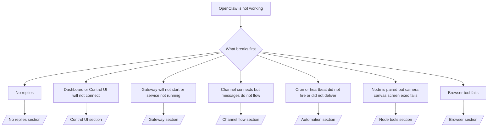

# Troubleshooting

Si vous n'avez que 2 minutes, utilisez cette page comme porte d'entrée de triage.

## Premières 60 secondes

Exécutez cette échelle exacte dans l'ordre :

```bash
openclaw status
openclaw status --all
openclaw gateway probe
openclaw gateway status
openclaw doctor
openclaw channels status --probe
openclaw logs --follow
```

Bonne sortie en une ligne :

- `openclaw status` → affiche les canaux configurés et aucune erreur d'authentification évidente.
- `openclaw status --all` → le rapport complet est présent et partageable.
- `openclaw gateway probe` → la passerelle cible attendue est joignable (`Reachable: yes`). `RPC: limited - missing scope: operator.read` indique des diagnostics dégradés, et non un échec de connexion.
- `openclaw gateway status` → `Runtime: running` et `RPC probe: ok`.
- `openclaw doctor` → aucune erreur de configuration/service bloquante.
- `openclaw channels status --probe` → les canaux signalent `connected` ou `ready`.
- `openclaw logs --follow` → activité régulière, aucune erreur fatale répétée.

## Anthropic long context 429

Si vous voyez :
`HTTP 429: rate_limit_error: Extra usage is required for long context requests`,
allez sur [/gateway/troubleshooting#anthropic-429-extra-usage-required-for-long-context](/en/gateway/troubleshooting#anthropic-429-extra-usage-required-for-long-context).

## L'échec de l'installation du plugin avec les extensions openclaw manquantes

Si l'installation échoue avec `package.json missing openclaw.extensions`, le package du plugin
utilise une ancienne structure qu'OpenClaw n'accepte plus.

Correction dans le paquet du plugin :

1. Ajoutez `openclaw.extensions` à `package.json`.
2. Faites pointer les entrées vers les fichiers d'exécution construits (généralement `./dist/index.js`).
3. Republichez le plugin et exécutez `openclaw plugins install <package>` à nouveau.

Exemple :

```json
{
  "name": "@openclaw/my-plugin",
  "version": "1.2.3",
  "openclaw": {
    "extensions": ["./dist/index.js"]
  }
}
```

Référence : [Architecture du plugin](/en/plugins/architecture)

## Arbre de décision



<AccordionGroup>
  <Accordion title="No replies">
    ```bash
    openclaw status
    openclaw gateway status
    openclaw channels status --probe
    openclaw pairing list --channel <channel> [--account <id>]
    openclaw logs --follow
    ```

    Le bon résultat ressemble à :

    - `Runtime: running`
    - `RPC probe: ok`
    - Votre channel affiche connecté/prêt dans `channels status --probe`
    - L'expéditeur semble approuvé (ou la politique DM est ouverte/liste autorisée)

    Signatures de journal courantes :

    - `drop guild message (mention required` → mention gating a bloqué le message dans Discord.
    - `pairing request` → l'expéditeur n'est pas approuvé et attend l'approbation de l'appariement DM.
    - `blocked` / `allowlist` dans les journaux du channel → l'expéditeur, la salle ou le groupe est filtré.

    Pages approfondies :

    - [/gateway/troubleshooting#no-replies](/en/gateway/troubleshooting#no-replies)
    - [/channels/troubleshooting](/en/channels/troubleshooting)
    - [/channels/pairing](/en/channels/pairing)

  </Accordion>

  <Accordion title="Dashboard or Control UI will not connect">
    ```bash
    openclaw status
    openclaw gateway status
    openclaw logs --follow
    openclaw doctor
    openclaw channels status --probe
    ```

    Le bon résultat ressemble à :

    - `Dashboard: http://...` est affiché dans `openclaw gateway status`
    - `RPC probe: ok`
    - Pas de boucle d'auth dans les journaux

    Signatures de journal courantes :

    - `device identity required` → Le contexte HTTP/non sécurisé ne peut pas terminer l'authentification de l'appareil.
    - `AUTH_TOKEN_MISMATCH` avec des indices de réessai (`canRetryWithDeviceToken=true`) → une nouvelle tentative de jeton d'appareil de confiance peut se produire automatiquement.
    - `unauthorized` répété après cette nouvelle tentative → mauvais jeton/mot de passe, inadéquation du mode d'auth, ou jeton d'appareil apparié périmé.
    - `gateway connect failed:` → l'interface utilisateur cible la mauvaise URL/port ou une passerelle inaccessible.

    Pages approfondies :

    - [/gateway/troubleshooting#dashboard-control-ui-connectivity](/en/gateway/troubleshooting#dashboard-control-ui-connectivity)
    - [/web/control-ui](/en/web/control-ui)
    - [/gateway/authentication](/en/gateway/authentication)

  </Accordion>

  <Accordion title="Gateway ne démarre pas ou service installé mais non exécuté">
    ```bash
    openclaw status
    openclaw gateway status
    openclaw logs --follow
    openclaw doctor
    openclaw channels status --probe
    ```

    Un bon résultat ressemble à :

    - `Service: ... (loaded)`
    - `Runtime: running`
    - `RPC probe: ok`

    Signatures de journal courantes :

    - `Gateway start blocked: set gateway.mode=local` → le mode gateway n'est pas défini/est distant.
    - `refusing to bind gateway ... without auth` → liaison non-boucle sans jeton/mot de passe.
    - `another gateway instance is already listening` ou `EADDRINUSE` → port déjà pris.

    Pages approfondies :

    - [/gateway/troubleshooting#gateway-service-not-running](/en/gateway/troubleshooting#gateway-service-not-running)
    - [/gateway/background-process](/en/gateway/background-process)
    - [/gateway/configuration](/en/gateway/configuration)

  </Accordion>

  <Accordion title="Le canal se connecte mais les messages ne circulent pas">
    ```bash
    openclaw status
    openclaw gateway status
    openclaw logs --follow
    openclaw doctor
    openclaw channels status --probe
    ```

    Un bon résultat ressemble à :

    - Le transport du canal est connecté.
    - Les contrôles de couplage/liste blanche réussissent.
    - Les mentions sont détectées là où c'est requis.

    Signatures de journal courantes :

    - `mention required` → le blocage de la mention de groupe a empêché le traitement.
    - `pairing` / `pending` → l'expéditeur DM n'est pas encore approuvé.
    - `not_in_channel`, `missing_scope`, `Forbidden`, `401/403` → problème de jeton d'autorisation de canal.

    Pages approfondies :

    - [/gateway/troubleshooting#channel-connected-messages-not-flowing](/en/gateway/troubleshooting#channel-connected-messages-not-flowing)
    - [/channels/troubleshooting](/en/channels/troubleshooting)

  </Accordion>

  <Accordion title="Cron or heartbeat did not fire or did not deliver">
    ```bash
    openclaw status
    openclaw gateway status
    openclaw cron status
    openclaw cron list
    openclaw cron runs --id <jobId> --limit 20
    openclaw logs --follow
    ```

    Un bon résultat ressemble à :

    - `cron.status` indique qu'il est activé avec un prochain réveil.
    - `cron runs` montre des entrées `ok` récentes.
    - Le heartbeat est activé et ne se trouve pas hors des heures actives.

    Signatures de journal courantes :

    - `cron: scheduler disabled; jobs will not run automatically` → cron est désactivé.
    - `heartbeat skipped` avec `reason=quiet-hours` → hors des heures actives configurées.
    - `requests-in-flight` → voie principale occupée ; le réveil du heartbeat a été différé.
    - `unknown accountId` → le compte cible de livraison du heartbeat n'existe pas.

    Pages détaillées :

    - [/gateway/troubleshooting#cron-and-heartbeat-delivery](/en/gateway/troubleshooting#cron-and-heartbeat-delivery)
    - [/automation/troubleshooting](/en/automation/troubleshooting)
    - [/gateway/heartbeat](/en/gateway/heartbeat)

  </Accordion>

  <Accordion title="Node is paired but tool fails camera canvas screen exec">
    ```bash
    openclaw status
    openclaw gateway status
    openclaw nodes status
    openclaw nodes describe --node <idOrNameOrIp>
    openclaw logs --follow
    ```

    Un bon résultat ressemble à :

    - Le nœud est répertorié comme connecté et apparié pour le rôle `node`.
    - La capacité existe pour la commande que vous invoquez.
    - L'état de l'autorisation est accordé pour le tool.

    Signatures de journal courantes :

    - `NODE_BACKGROUND_UNAVAILABLE` → mettre l'application du nœud au premier plan.
    - `*_PERMISSION_REQUIRED` → l'autorisation du système d'exploitation a été refusée ou est manquante.
    - `SYSTEM_RUN_DENIED: approval required` → l'approbation exec est en attente.
    - `SYSTEM_RUN_DENIED: allowlist miss` → commande non présente sur la liste d'autorisation exec.

    Pages détaillées :

    - [/gateway/troubleshooting#node-paired-tool-fails](/en/gateway/troubleshooting#node-paired-tool-fails)
    - [/nodes/troubleshooting](/en/nodes/troubleshooting)
    - [/tools/exec-approvals](/en/tools/exec-approvals)

  </Accordion>

  <Accordion title="Exécution demande soudainement une approbation">
    ```bash
    openclaw config get tools.exec.host
    openclaw config get tools.exec.security
    openclaw config get tools.exec.ask
    openclaw gateway restart
    ```

    Ce qui a changé :

    - Si `tools.exec.host` n'est pas défini, la valeur par défaut est `auto`.
    - `host=auto` résout à `sandbox` lorsqu'un runtime de bac à sable est actif, `gateway` sinon.
    - Sur `gateway` et `node`, si `tools.exec.security` n'est pas défini, la valeur par défaut est `allowlist`.
    - Si `tools.exec.ask` n'est pas défini, la valeur par défaut est `on-miss`.
    - Résultat : les commandes d'hôte ordinaires peuvent désormais être mises en pause avec `Approval required` au lieu de s'exécuter immédiatement.

    Restaurer l'ancien comportement sans approbation de la passerelle :

    ```bash
    openclaw config set tools.exec.host gateway
    openclaw config set tools.exec.security full
    openclaw config set tools.exec.ask off
    openclaw gateway restart
    ```

    Alternatives plus sûres :

    - Définissez uniquement `tools.exec.host=gateway` si vous souhaitez simplement un routage d'hôte stable et souhaitez toujours des approbations.
    - Conservez `security=allowlist` avec `ask=on-miss` si vous souhaitez une exécution sur l'hôte mais souhaitez toujours une révision en cas d'absence dans la liste d'autorisation.
    - Activez le mode bac à sable si vous souhaitez que `host=auto` résolve à nouveau vers `sandbox`.

    Signatures de journal courantes :

    - `Approval required.` → la commande est en attente sur `/approve ...`.
    - `SYSTEM_RUN_DENIED: approval required` → l'approbation d'exécution node-host est en attente.
    - `exec host=sandbox requires a sandbox runtime for this session` → sélection implicite/explicite du bac à sable mais le mode bac à sable est désactivé.

    Pages approfondies :

    - [/tools/exec](/en/tools/exec)
    - [/tools/exec-approvals](/en/tools/exec-approvals)
    - [/gateway/security#runtime-expectation-drift](/en/gateway/security#runtime-expectation-drift)

  </Accordion>

  <Accordion title="Échec de l'outil de navigateur">
    ```bash
    openclaw status
    openclaw gateway status
    openclaw browser status
    openclaw logs --follow
    openclaw doctor
    ```

    Un résultat correct ressemble à ceci :

    - L'état du navigateur affiche `running: true` et un navigateur/profil choisi.
    - `openclaw` démarre, ou `user` peut voir les onglets Chrome locaux.

    Signatures de journal courantes :

    - `unknown command "browser"` ou `unknown command 'browser'` → `plugins.allow` est défini et n'inclut pas `browser`.
    - `Failed to start Chrome CDP on port` → le lancement du navigateur local a échoué.
    - `browser.executablePath not found` → le chemin binaire configuré est incorrect.
    - `No Chrome tabs found for profile="user"` → le profil de attachement Chrome MCP n'a pas d'onglets Chrome locaux ouverts.
    - `Browser attachOnly is enabled ... not reachable` → le profil attachement uniquement n'a pas de cible CDP active.

    Pages approfondies :

    - [/gateway/troubleshooting#browser-tool-fails](/en/gateway/troubleshooting#browser-tool-fails)
    - [/tools/browser#missing-browser-command-or-tool](/en/tools/browser#missing-browser-command-or-tool)
    - [/tools/browser-linux-troubleshooting](/en/tools/browser-linux-troubleshooting)
    - [/tools/browser-wsl2-windows-remote-cdp-troubleshooting](/en/tools/browser-wsl2-windows-remote-cdp-troubleshooting)

  </Accordion>
</AccordionGroup>

## Connexes

- [FAQ](/en/help/faq) — questions fréquentes
- [Gateway Troubleshooting](/en/gateway/troubleshooting) — problèmes spécifiques à la passerelle
- [Doctor](/en/gateway/doctor) — vérifications de santé automatisées et réparations
- [Channel Troubleshooting](/en/channels/troubleshooting) — problèmes de connectivité des canaux
- [Automation Troubleshooting](/en/automation/troubleshooting) — problèmes cron et de battement de cœur (heartbeat)
