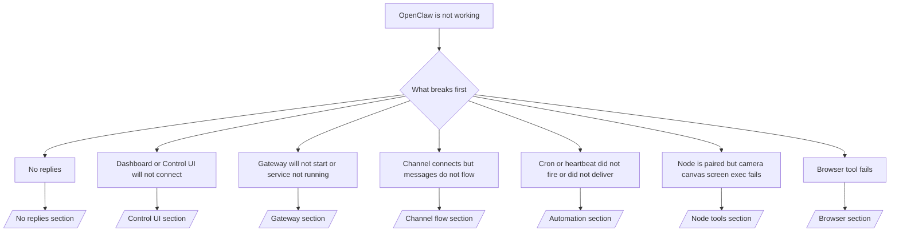

Si vous n'avez que 2 minutes, utilisez cette page comme porte d'entrée de triage.

## Premières 60 secondes

Exécutez cette échelle exacte dans l'ordre :

```bash
openclaw status
openclaw status --all
openclaw gateway probe
openclaw gateway status
openclaw doctor
openclaw channels status --probe
openclaw logs --follow
```

Bon résultat en une ligne :

- `openclaw status` → affiche les canaux configurés et aucune erreur d'auth évidente.
- `openclaw status --all` → le rapport complet est présent et partageable.
- `openclaw gateway probe` → la cible attendue est joignable (`Reachable: yes`). `Capability: ...` vous indique le niveau d'auth que la sonde a pu prouver, et `Read probe: limited - missing scope: operator.read` est un diagnostic dégradé, pas un échec de connexion.
- `openclaw gateway status` → `Runtime: running`, `Connectivity probe: ok` et une ligne `Capability: ...` plausible. Utilisez `--require-rpc` si vous avez également besoin d'une preuve RPC de lecture.
- `openclaw doctor` → aucune erreur de configuration/service bloquante.
- `openclaw channels status --probe` → la joignable renvoie l'état de transport en temps réel par compte
  ainsi que les résultats de sonde/audit tels que `works` ou `audit ok` ; si la
  est injoignable, la commande revient à des résumés basés uniquement sur la configuration.
- `openclaw logs --follow` → activité régulière, aucune erreur fatale répétée.

## L'assistant semble limité ou les outils sont manquants

Si l'assistant ne peut pas inspecter les fichiers, exécuter des commandes, utiliser l'automatisation du navigateur ou
voir les outils attendus, vérifiez d'abord le profil d'outil effectif :

```bash
openclaw status
openclaw status --all
openclaw doctor
```

Causes courantes :

- `tools.profile: "messaging"` est intentionnellement restreint pour les agents de chat uniquement.
- `tools.profile: "coding"` est le profil habituel pour les workflows de dépôt, de fichier, de shell
  et d'exécution.
- `tools.profile: "full"` expose l'ensemble d'outils le plus large et doit être limité
  aux agents de confiance contrôlés par l'opérateur.
- Les surcharges `agents.list[].tools` par agent peuvent restreindre ou étendre le profil
  racine pour un agent.

Modifiez le profil d'outil racine ou par agent, puis redémarrez ou rechargez la Gateway
et exécutez à nouveau `openclaw status --all`. Consultez [Outils](/fr/tools) pour le modèle
de profil et les surcharges d'autorisation/refus.

## Anthropic contexte long 429

Si vous voyez :
`HTTP 429: rate_limit_error: Extra usage is required for long context requests`,
allez sur [/gateway/troubleshooting#anthropic-429-extra-usage-required-for-long-context](/fr/gateway/troubleshooting#anthropic-429-extra-usage-required-for-long-context).

## Le backend local compatible OpenAI fonctionne directement mais échoue dans OpenClaw

Si votre backend local ou auto-hébergé `/v1` répond à de petites sondes directes
`/v1/chat/completions` mais échoue sur `openclaw infer model run` ou les tours normaux
de l'agent :

1. Si l'erreur mentionne `messages[].content` attendant une chaîne, définissez
   `models.providers.<provider>.models[].compat.requiresStringContent: true`.
2. Si le backend échoue toujours uniquement sur les tours de l'agent OpenClaw, définissez
   `models.providers.<provider>.models[].compat.supportsTools: false` et réessayez.
3. Si de minuscules appels directs fonctionnent toujours mais que des invites OpenClaw plus importantes plantent le
   backend, considérez le problème restant comme une limitation du modèle/serveur amont et
   continuez dans le guide de dépannage approfondi :
   [/gateway/troubleshooting#local-openai-compatible-backend-passes-direct-probes-but-agent-runs-fail](/fr/gateway/troubleshooting#local-openai-compatible-backend-passes-direct-probes-but-agent-runs-fail)

## L'installation du plugin échoue en raison d'extensions openclaw manquantes

Si l'installation échoue avec `package.json missing openclaw.extensions`, le package du plugin
utilise une ancienne forme que OpenClaw n'accepte plus.

Corrigez dans le package du plugin :

1. Ajoutez `openclaw.extensions` à `package.json`.
2. Faites pointer les entrées vers les fichiers d'exécution construits (généralement `./dist/index.js`).
3. Publiez à nouveau le plugin et exécutez `openclaw plugins install <package>` à nouveau.

Exemple :

```json
{
  "name": "@openclaw/my-plugin",
  "version": "1.2.3",
  "openclaw": {
    "extensions": ["./dist/index.js"]
  }
}
```

Référence : [Plugin architecture](/fr/plugins/architecture)

## Plugin présent mais bloqué par une propriété suspecte

Si les avertissements `openclaw doctor`, d'installation ou de démarrage indiquent :

```text
blocked plugin candidate: suspicious ownership (... uid=1000, expected uid=0 or root)
plugin present but blocked
```

les fichiers du plugin sont détenus par un utilisateur Unix différent du processus qui les
charge. Ne supprimez pas la configuration du plugin. Corrigez la propriété des fichiers ou exécutez OpenClaw en
tant que même utilisateur qui possède le répertoire d'état.

Les installations Docker s'exécutent normalement en tant que `node` (uid `1000`). Pour la configuration par défaut de
Docker, réparez les montages de liaison de l'hôte :

```bash
sudo chown -R 1000:1000 /path/to/openclaw-config /path/to/openclaw-workspace
openclaw doctor --fix
```

Si vous exécutez intentionnellement OpenClaw en tant que root, réparez la racine du plugin géré pour qu'elle appartienne à root à la place :

```bash
sudo chown -R root:root /path/to/openclaw-config/npm
openclaw doctor --fix
```

Documentation approfondie :

- [Propriété du chemin du plugin](/fr/tools/plugin#blocked-plugin-path-ownership)
- [Permissions Docker](/fr/install/docker#permissions-and-eacces)

## Arbre de décision



<AccordionGroup>
  <Accordion title="Aucune réponse">
    ```bash
    openclaw status
    openclaw gateway status
    openclaw channels status --probe
    openclaw pairing list --channel <channel> [--account <id>]
    openclaw logs --follow
    ```

    Un bon résultat ressemble à :

    - `Runtime: running`
    - `Connectivity probe: ok`
    - `Capability: read-only`, `write-capable`, ou `admin-capable`
    - Votre channel indique que le transport est connecté et, si pris en charge, `works` ou `audit ok` dans `channels status --probe`
    - L'expéditeur semble approuvé (ou la stratégie de DM est ouverte/liste d'autorisation)

    Signatures de journal courantes :

    - `drop guild message (mention required` → le filtrage par mention a bloqué le message dans Discord.
    - `pairing request` → l'expéditeur n'est pas approuvé et attend l'approbation du jumelage DM.
    - `blocked` / `allowlist` dans les journaux du channel → l'expéditeur, la salle ou le groupe est filtré.

    Pages approfondies :

    - [/gateway/troubleshooting#no-replies](/fr/gateway/troubleshooting#no-replies)
    - [/channels/troubleshooting](/fr/channels/troubleshooting)
    - [/channels/pairing](/fr/channels/pairing)

  </Accordion>

  <Accordion title="Le tableau de bord ou l'interface de contrôle ne se connecte pas">
    ```bash
    openclaw status
    openclaw gateway status
    openclaw logs --follow
    openclaw doctor
    openclaw channels status --probe
    ```

    Un bon résultat ressemble à :

    - `Dashboard: http://...` est affiché dans `openclaw gateway status`
    - `Connectivity probe: ok`
    - `Capability: read-only`, `write-capable` ou `admin-capable`
    - Pas de boucle d'authentification dans les journaux

    Signatures de journal courantes :

    - `device identity required` → Le contexte HTTP/non sécurisé ne peut pas terminer l'authentification de l'appareil.
    - `origin not allowed` → le navigateur `Origin` n'est pas autorisé pour la cible
      de passerelle de l'interface de contrôle.
    - `AUTH_TOKEN_MISMATCH` avec des indices de réessai (`canRetryWithDeviceToken=true`) → une nouvelle tentative automatique du jeton d'appareil de confiance peut se produire.
    - Ce nouvel essai avec jeton en cache réutilise l'ensemble d'étendues en cache stocké avec le jeton
      d'appareil associé. Les appelants explicites `deviceToken` / explicites `scopes` conservent
      leur ensemble d'étendues demandées à la place.
    - Sur le chemin asynchrone de l'interface de contrôle de Tailscale Serve, les tentatives échouées pour le même
      `{scope, ip}` sont sérialisées avant que le limiteur n'enregistre l'échec, de sorte qu'une
      seconde mauvaise tentative simultanée peut déjà afficher `retry later`.
    - `too many failed authentication attempts (retry later)` depuis une origine de navigateur
      localhost → des échecs répétés de cette même `Origin` sont temporairement
      bloqués ; une autre origine localhost utilise un compartiment séparé.
    - `unauthorized` répétés après cette nouvelle tentative → mauvais jeton/mot de passe, inadéquation du mode d'authentification ou jeton d'appareil associé obsolète.
    - `gateway connect failed:` → l'interface cible la mauvaise URL/port ou une passerelle inaccessible.

    Pages approfondies :

    - [/gateway/troubleshooting#dashboard-control-ui-connectivity](/fr/gateway/troubleshooting#dashboard-control-ui-connectivity)
    - [/web/control-ui](/fr/web/control-ui)
    - [/gateway/authentication](/fr/gateway/authentication)

  </Accordion>

  <Accordion title="GatewayLe Gateway ne démarre pas ou le service est installé mais non exécuté">
    ```bash
    openclaw status
    openclaw gateway status
    openclaw logs --follow
    openclaw doctor
    openclaw channels status --probe
    ```

    Une bonne sortie ressemble à :

    - `Service: ... (loaded)`
    - `Runtime: running`
    - `Connectivity probe: ok`
    - `Capability: read-only`, `write-capable`, ou `admin-capable`

    Signatures de journal courantes :

    - `Gateway start blocked: set gateway.mode=local` ou `existing config is missing gateway.mode` → le mode gateway est distant, ou le fichier de configuration manque le tampon de mode local et doit être réparé.
    - `refusing to bind gateway ... without auth` → liaison non-boucle sans chemin d'authentification de gateway valide (jeton/mot de passe, ou proxy approuvé où configuré).
    - `another gateway instance is already listening` ou `EADDRINUSE` → port déjà pris.

    Pages approfondies :

    - [/gateway/troubleshooting#gateway-service-not-running](/fr/gateway/troubleshooting#gateway-service-not-running)
    - [/gateway/background-process](/fr/gateway/background-process)
    - [/gateway/configuration](/fr/gateway/configuration)

  </Accordion>

  <Accordion title="Le channel se connecte mais les messages ne circulent pas">
    ```bash
    openclaw status
    openclaw gateway status
    openclaw logs --follow
    openclaw doctor
    openclaw channels status --probe
    ```

    Une bonne sortie ressemble à :

    - Le transport du channel est connecté.
    - Les vérifications de couplage/liste blanche réussissent.
    - Les mentions sont détectées lorsque requis.

    Signatures de journal courantes :

    - `mention required` → le blocage par filtrage des mentions de groupe a empêché le traitement.
    - `pairing` / `pending` → l'expéditeur du DM n'est pas encore approuvé.
    - `not_in_channel`, `missing_scope`, `Forbidden`, `401/403` → problème de jeton d'autorisation de channel.

    Pages approfondies :

    - [/gateway/troubleshooting#channel-connected-messages-not-flowing](/fr/gateway/troubleshooting#channel-connected-messages-not-flowing)
    - [/channels/troubleshooting](/fr/channels/troubleshooting)

  </Accordion>

  <Accordion title="Cron ou heartbeat n'a pas été déclenché ou n'a pas été livré">
    ```bash
    openclaw status
    openclaw gateway status
    openclaw cron status
    openclaw cron list
    openclaw cron runs --id <jobId> --limit 20
    openclaw logs --follow
    ```

    Un bon résultat ressemble à ceci :

    - `cron.status` indique activé avec un prochain réveil.
    - `cron runs` montre des entrées `ok` récentes.
    - Le heartbeat est activé et n'est pas en dehors des heures actives.

    Signatures de journal courantes :

    - `cron: scheduler disabled; jobs will not run automatically` → cron est désactivé.
    - `heartbeat skipped` avec `reason=quiet-hours` → en dehors des heures actives configurées.
    - `heartbeat skipped` avec `reason=empty-heartbeat-file` → `HEARTBEAT.md` existe mais ne contient qu'une structure vide ou avec uniquement des en-têtes.
    - `heartbeat skipped` avec `reason=no-tasks-due` → le mode de tâche `HEARTBEAT.md` est actif mais aucun des intervalles de tâche n'est encore échu.
    - `heartbeat skipped` avec `reason=alerts-disabled` → toute la visibilité du heartbeat est désactivée (`showOk`, `showAlerts` et `useIndicator` sont tous désactivés).
    - `requests-in-flight` → voie principale occupée ; le réveil du heartbeat a été différé.
    - `unknown accountId` → le compte cible de livraison du heartbeat n'existe pas.

    Pages approfondies :

    - [/gateway/troubleshooting#cron-and-heartbeat-delivery](/fr/gateway/troubleshooting#cron-and-heartbeat-delivery)
    - [/automation/cron-jobs#troubleshooting](/fr/automation/cron-jobs#troubleshooting)
    - [/gateway/heartbeat](/fr/gateway/heartbeat)

  </Accordion>

  <Accordion title="Le nœud est appairé mais le tool échoue pour l'appareil photo le canevas l'écran l'exécution">
    ```bash
    openclaw status
    openclaw gateway status
    openclaw nodes status
    openclaw nodes describe --node <idOrNameOrIp>
    openclaw logs --follow
    ```

    Un bon résultat ressemble à ceci :

    - Le nœud est répertorié comme connecté et appairé pour le rôle `node`.
    - La capacité existe pour la commande que vous invoquez.
    - L'état de l'autorisation est accordé pour le tool.

    Signatures de journal courantes :

    - `NODE_BACKGROUND_UNAVAILABLE` → mettre l'application du nœud au premier plan.
    - `*_PERMISSION_REQUIRED` → l'autorisation du système d'exploitation a été refusée ou est manquante.
    - `SYSTEM_RUN_DENIED: approval required` → l'approbation d'exécution est en attente.
    - `SYSTEM_RUN_DENIED: allowlist miss` → la commande n'est pas sur la liste d'autorisation d'exécution.

    Pages approfondies :

    - [/gateway/troubleshooting#node-paired-tool-fails](/fr/gateway/troubleshooting#node-paired-tool-fails)
    - [/nodes/troubleshooting](/fr/nodes/troubleshooting)
    - [/tools/exec-approvals](/fr/tools/exec-approvals)

  </Accordion>

  <Accordion title="Exec demande soudainement une approbation">
    ```bash
    openclaw config get tools.exec.host
    openclaw config get tools.exec.security
    openclaw config get tools.exec.ask
    openclaw gateway restart
    ```

    Ce qui a changé :

    - Si `tools.exec.host` n'est pas défini, la valeur par défaut est `auto`.
    - `host=auto` résout à `sandbox` lorsqu'un runtime de bac à sable est actif, `gateway` sinon.
    - `host=auto` concerne uniquement le routage ; le comportement "YOLO" sans invite provient de `security=full` plus `ask=off` sur la passerelle/le nœud.
    - Sur `gateway` et `node`, si `tools.exec.security` n'est pas défini, la valeur par défaut est `full`.
    - Si `tools.exec.ask` n'est pas défini, la valeur par défaut est `off`.
    - Résultat : si vous voyez des demandes d'approbation, une stratégie locale à l'hôte ou par session a resserré exec par rapport aux valeurs par défaut actuelles.

    Restaurer le comportement par défaut actuel sans approbation :

    ```bash
    openclaw config set tools.exec.host gateway
    openclaw config set tools.exec.security full
    openclaw config set tools.exec.ask off
    openclaw gateway restart
    ```

    Alternatives plus sûres :

    - Définissez uniquement `tools.exec.host=gateway` si vous voulez simplement un routage d'hôte stable.
    - Utilisez `security=allowlist` avec `ask=on-miss` si vous voulez exec sur l'hôte mais que vous souhaitez toujours une révision en cas d'absence de la liste autorisée.
    - Activez le mode bac à sable si vous voulez que `host=auto` résolve à nouveau vers `sandbox`.

    Signatures de journal courantes :

    - `Approval required.` → la commande attend `/approve ...`.
    - `SYSTEM_RUN_DENIED: approval required` → l'approbation exec node-host est en attente.
    - `exec host=sandbox requires a sandbox runtime for this session` → sélection implicite/explicite du bac à sable mais le mode bac à sable est désactivé.

    Pages approfondies :

    - [/tools/exec](/fr/tools/exec)
    - [/tools/exec-approvals](/fr/tools/exec-approvals)
    - [/gateway/security#what-the-audit-checks-high-level](/fr/gateway/security#what-the-audit-checks-high-level)

  </Accordion>

  <Accordion title="Échec de l'outil de navigation">
    ```bash
    openclaw status
    openclaw gateway status
    openclaw browser status
    openclaw logs --follow
    openclaw doctor
    ```

    Un résultat correct ressemble à ceci :

    - L'état du navigateur affiche `running: true` et un navigateur/profil choisi.
    - `openclaw` démarre, ou `user` peut voir les onglets Chrome locaux.

    Signatures de journal courantes :

    - `unknown command "browser"` ou `unknown command 'browser'` → `plugins.allow` est défini et n'inclut pas `browser`.
    - `Failed to start Chrome CDP on port` → le lancement du navigateur local a échoué.
    - `browser.executablePath not found` → le chemin binaire configuré est incorrect.
    - `browser.cdpUrl must be http(s) or ws(s)` → l'URL CDP configurée utilise un schéma non pris en charge.
    - `browser.cdpUrl has invalid port` → l'URL CDP configurée a un port incorrect ou hors plage.
    - `No Chrome tabs found for profile="user"` → le profil de attachement Chrome MCP n'a aucun onglet Chrome local ouvert.
    - `Remote CDP for profile "<name>" is not reachable` → le point de terminaison CDP distant configuré n'est pas accessible à partir de cet hôte.
    - `Browser attachOnly is enabled ... not reachable` ou `Browser attachOnly is enabled and CDP websocket ... is not reachable` → le profil attachement uniquement n'a pas de cible CDP active.
    - remplacements obsolètes de la zone d'affichage / du mode sombre / de la langue / du mode hors ligne sur les profils CDP attachement uniquement ou distants → exécutez `openclaw browser stop --browser-profile <name>` pour fermer la session de contrôle active et libérer l'état d'émulation sans redémarrer la passerelle.

    Pages approfondies :

    - [/gateway/troubleshooting#browser-tool-fails](/fr/gateway/troubleshooting#browser-tool-fails)
    - [/tools/browser#missing-browser-command-or-tool](/fr/tools/browser#missing-browser-command-or-tool)
    - [/tools/browser-linux-troubleshooting](/fr/tools/browser-linux-troubleshooting)
    - [/tools/browser-wsl2-windows-remote-cdp-troubleshooting](/fr/tools/browser-wsl2-windows-remote-cdp-troubleshooting)

  </Accordion>

</AccordionGroup>

## Connexes

- [FAQ](/fr/help/faq) — questions fréquemment posées
- [Gateway Troubleshooting](/fr/gateway/troubleshooting) — problèmes spécifiques à la passerelle
- [Doctor](/fr/gateway/doctor) — vérifications de santé automatisées et réparations
- [Channel Troubleshooting](/fr/channels/troubleshooting) — problèmes de connectivité des canaux
- [Automation Troubleshooting](/fr/automation/cron-jobs#troubleshooting) — problèmes cron et heartbeat
