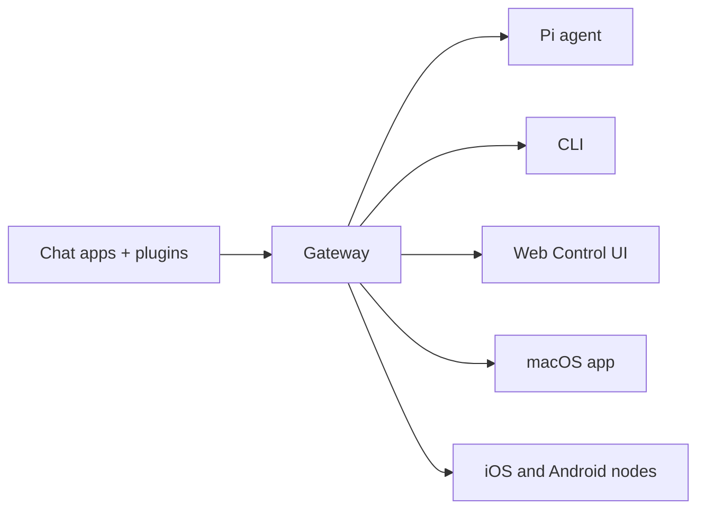

# OpenClaw 🦞

<p align="center">
  
  
</p>

> _"EXFOLIATE! EXFOLIATE!"_ — Une homarde spatiale, probablement

<p align="center">
  <strong>Passerelle multi-OS pour les agents d'IA sur WhatsApp, Telegram, Discord, iMessage, et plus encore.</strong>
  <br />
  Envoyez un message, obtenez une réponse d'agent depuis votre poche. Les plugins ajoutent Mattermost et plus encore.
</p>

<Columns>
  <Card title="Get Started" href="/en/start/getting-started" icon="rocket">
    Installez OpenClaw et lancez la Gateway en quelques minutes.
  </Card>
  <Card title="Exécuter l'onboarding" href="/en/start/wizard" icon="sparkles">
    Configuration guidée avec `openclaw onboard` et flux de couplage.
  </Card>
  <Card title="Ouvrir l'interface de contrôle" href="/en/web/control-ui" icon="layout-dashboard">
    Lancez le tableau de bord du navigateur pour le chat, la config et les sessions.
  </Card>
</Columns>

## Qu'est-ce que OpenClaw ?

OpenClaw est une **passerelle auto-hébergée** qui connecte vos applications de chat préférées — WhatsApp, Telegram, Discord, iMessage, et plus encore — aux agents de codage IA comme Pi. Vous exécutez un seul processus de passerelle sur votre propre machine (ou un serveur), et il devient le pont entre vos applications de messagerie et un assistant IA toujours disponible.

**À qui est-ce destiné ?** Aux développeurs et aux utilisateurs expérimentés qui souhaitent un assistant IA personnel qu'ils peuvent contacter de n'importe où — sans sacrifier le contrôle de leurs données ni dépendre d'un service hébergé.

**Qu'est-ce qui le rend différent ?**

- **Auto-hébergé** : fonctionne sur votre matériel, vos règles
- **Multi-canal** : un Gateway sert WhatsApp, Telegram, Discord et plus simultanément
- **Natif pour les agents** : conçu pour les agents de codation avec l'utilisation d'outils, les sessions, la mémoire et le routage multi-agents
- **Open source** : sous licence MIT, piloté par la communauté

**De quoi avez-vous besoin ?** Node 24 (recommandé) ou Node 22 LTS (`22.14+`) pour la compatibilité, une clé API de votre fournisseur choisi, et 5 minutes. Pour une meilleure qualité et sécurité, utilisez le modèle le plus puissant de dernière génération disponible.

## Fonctionnement



Le Gateway est la source unique de vérité pour les sessions, le routage et les connexions aux canaux.

## Fonctionnalités clés

<Columns>
  <Card title="Multi-channel gateway" icon="network">
    WhatsApp, Telegram, Discord et iMessage avec un seul processus Gateway.
  </Card>
  <Card title="Plugin channels" icon="plug">
    Ajoutez Mattermost et bien d'autres avec des packages d'extension.
  </Card>
  <Card title="Multi-agent routing" icon="route">
    Sessions isolées par agent, espace de travail ou expéditeur.
  </Card>
  <Card title="Media support" icon="image">
    Envoyez et recevez des images, de l'audio et des documents.
  </Card>
  <Card title="Web Control UI" icon="monitor">
    Tableau de bord du navigateur pour le chat, la configuration, les sessions et les nœuds.
  </Card>
  <Card title="Mobile nodes" icon="smartphone">
    Associez les nœuds iOS et Android pour Canvas, l'appareil photo et les flux de travail activés par la voix.
  </Card>
</Columns>

## Démarrage rapide

<Steps>
  <Step title="Install OpenClaw">
    ```bash
    npm install -g openclaw@latest
    ```
  </Step>
  <Step title="Onboard and install the service">
    ```bash
    openclaw onboard --install-daemon
    ```
  </Step>
  <Step title="Chat">
    Ouvrez l'interface de contrôle dans votre navigateur et envoyez un message :

    ```bash
    openclaw dashboard
    ```

    Ou connectez une chaîne ([Telegram](/en/channels/telegram) est le plus rapide) et chattez depuis votre téléphone.

  </Step>
</Steps>

Besoin de l'installation complète et de la configuration de développement ? Consultez [Getting Started](/en/start/getting-started).

## Dashboard

Ouvrez l'interface de contrôle du navigateur une fois la Gateway démarrée.

- Par défaut local : [http://127.0.0.1:18789/](http://127.0.0.1:18789/)
- Accès à distance : [Interfaces Web](/en/web) et [Tailscale](/en/gateway/tailscale)

<p align="center">
  
</p>

## Configuration (facultatif)

La configuration se trouve dans `~/.openclaw/openclaw.json`.

- Si vous **ne faites rien**, OpenClaw utilise le binaire Pi fourni en mode RPC avec des sessions par expéditeur.
- Si vous souhaitez le verrouiller, commencez par `channels.whatsapp.allowFrom` et (pour les groupes) les règles de mention.

Exemple :

```json5
{
  channels: {
    whatsapp: {
      allowFrom: ["+15555550123"],
      groups: { "*": { requireMention: true } },
    },
  },
  messages: { groupChat: { mentionPatterns: ["@openclaw"] } },
}
```

## Commencer ici

<Columns>
  <Card title="Centres de documentation" href="/en/start/hubs" icon="book-open">
    Toute la documentation et les guides, organisés par cas d'usage.
  </Card>
  <Card title="Configuration" href="/en/gateway/configuration" icon="settings">
    Paramètres principaux du Gateway, jetons et configuration du fournisseur.
  </Card>
  <Card title="Accès à distance" href="/en/gateway/remote" icon="globe">
    Modèles d'accès SSH et tailnet.
  </Card>
  <Card title="Chaînes" href="/en/channels/telegram" icon="message-square">
    Configuration spécifique à la chaîne pour WhatsApp, Telegram, Discord, et plus encore.
  </Card>
  <Card title="Nœuds" href="/en/nodes" icon="smartphone">
    Nœuds iOS et Android avec appairage, Canvas, caméra et actions d'appareil.
  </Card>
  <Card title="Aide" href="/en/help" icon="life-buoy">
    Solutions courantes et point d'entrée pour le troubleshooting.
  </Card>
</Columns>

## En savoir plus

<Columns>
  <Card title="Liste complète des fonctionnalités" href="/en/concepts/features" icon="list">
    Capacités complètes de chaîne, de routage et de média.
  </Card>
  <Card title="Routage multi-agent" href="/en/concepts/multi-agent" icon="route">
    Isolement de l'espace de travail et sessions par agent.
  </Card>
  <Card title="Sécurité" href="/en/gateway/security" icon="shield">
    Jetons, listes d'autorisation et contrôles de sécurité.
  </Card>
  <Card title="Troubleshooting" href="/en/gateway/troubleshooting" icon="wrench">
    Diagnostics de Gateway et erreurs courantes.
  </Card>
  <Card title="À propos et crédits" href="/en/reference/credits" icon="info">
    Origines du projet, contributeurs et licence.
  </Card>
</Columns>
