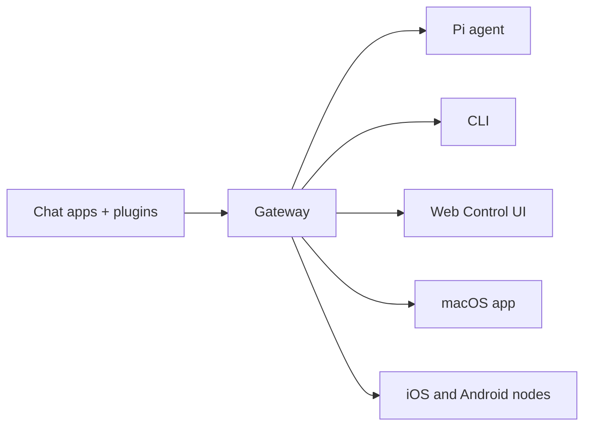

# OpenClaw 🦞

<p align="center">
  
  
</p>

> _"EXFOLIATE! EXFOLIATE!"_ — Une homarde spatiale, probablement

<p align="center">
  <strong>Une passerelle pour tout OS pour les agents IA sur Discord, Google Chat, iMessage, Matrix, Microsoft Teams, Signal, Slack, Telegram, WhatsApp, Zalo, et plus encore.</strong>
  <br />
  Envoyez un message, obtenez une réponse d'agent depuis votre poche. Exécutez une seule passerelle (Gateway) sur les canaux intégrés, les plugins de canal groupés, WebChat, et les nœuds mobiles.
</p>

<Columns>
  <Card title="Get Started" href="/fr/start/getting-started" icon="rocket">
    Installez OpenClaw et lancez la Gateway en quelques minutes.
  </Card>
  <Card title="Exécuter l'intégration" href="/fr/start/wizard" icon="sparkles">
    Configuration guidée avec `openclaw onboard` et flux d'appairage.
  </Card>
  <Card title="Ouvrir l'interface de contrôle" href="/fr/web/control-ui" icon="layout-dashboard">
    Lancez le tableau de bord du navigateur pour le chat, la config et les sessions.
  </Card>
</Columns>

## Qu'est-ce que OpenClaw ?

OpenClaw est une **passerelle auto-hébergée** qui connecte vos applications de chat préférées et les surfaces de canaux — canaux intégrés ainsi que plugins de canal groupés ou externes tels que Discord, Google Chat, iMessage, Matrix, Microsoft Teams, Signal, Slack, Telegram, WhatsApp, Zalo, et plus encore — aux agents de codage IA comme Pi. Vous exécutez un seul processus de passerelle (Gateway) sur votre propre machine (ou un serveur), et il devient le pont entre vos applications de messagerie et un assistant IA toujours disponible.

**À qui est-ce destiné ?** Aux développeurs et aux utilisateurs expérimentés qui souhaitent un assistant IA personnel qu'ils peuvent contacter de n'importe où — sans sacrifier le contrôle de leurs données ni dépendre d'un service hébergé.

**Qu'est-ce qui le rend différent ?**

- **Auto-hébergé** : fonctionne sur votre matériel, vos règles
- **Multi-canal** : une seule passerelle (Gateway) sert les canaux intégrés ainsi que les plugins de canal groupés ou externes simultanément
- **Natif pour les agents** : conçu pour les agents de codation avec l'utilisation d'outils, les sessions, la mémoire et le routage multi-agents
- **Open source** : sous licence MIT, piloté par la communauté

**De quoi avez-vous besoin ?** Node 24 (recommandé), ou Node 22 LTS (`22.14+`) pour la compatibilité, une clé API de votre fournisseur choisi, et 5 minutes. Pour une qualité et une sécurité optimales, utilisez le modèle le plus puissant de la dernière génération disponible.

## Fonctionnement



Le Gateway est la source unique de vérité pour les sessions, le routage et les connexions aux canaux.

## Fonctionnalités clés

<Columns>
  <Card title="Passerelle multi-canal" icon="network" href="/fr/channels">
    Discord, iMessage, Signal, Slack, Telegram, WhatsApp, WebChat, et plus encore avec un seul processus Gateway.
  </Card>
  <Card title="Canaux de plugins" icon="plug" href="/fr/tools/plugin">
    Les plugins inclus ajoutent Matrix, Nostr, Twitch, Zalo, et plus encore dans les versions actuelles normales.
  </Card>
  <Card title="Routage multi-agent" icon="route" href="/fr/concepts/multi-agent">
    Sessions isolées par agent, espace de travail ou expéditeur.
  </Card>
  <Card title="Support multimédia" icon="image" href="/fr/nodes/images">
    Envoyez et recevez des images, de l'audio et des documents.
  </Card>
  <Card title="Interface de contrôle Web" icon="monitor" href="/fr/web/control-ui">
    Tableau de bord du navigateur pour le chat, la configuration, les sessions et les nœuds.
  </Card>
  <Card title="Nœuds mobiles" icon="smartphone" href="/fr/nodes">
    Associez les nœuds iOS et Android pour les workflows Canvas, l'appareil photo et activés par voix.
  </Card>
</Columns>

## Démarrage rapide

<Steps>
  <Step title="Installer OpenClaw">
    ```bash
    npm install -g openclaw@latest
    ```
  </Step>
  <Step title="Intégration et installation du service">
    ```bash
    openclaw onboard --install-daemon
    ```
  </Step>
  <Step title="Discuter">
    Ouvrez l'interface de contrôle dans votre navigateur et envoyez un message :

    ```bash
    openclaw dashboard
    ```

    Ou connectez un channel ([Telegram](/fr/channels/telegram) est le plus rapide) et discutez depuis votre téléphone.

  </Step>
</Steps>

Besoin de la procédure d'installation complète et de la configuration de développement ? Voir [Getting Started](/fr/start/getting-started).

## Tableau de bord

Ouvrez l'interface utilisateur de contrôle du navigateur une fois le Gateway démarré.

- Défaut local : [http://127.0.0.1:18789/](http://127.0.0.1:18789/)
- Accès à distance : [Web surfaces](/fr/web) et [Tailscale](/fr/gateway/tailscale)

<p align="center">
  
</p>

## Configuration (facultatif)

La configuration se trouve dans `~/.openclaw/openclaw.json`.

- Si vous **ne faites rien**, OpenClaw utilise le binaire Pi inclus en mode RPC avec des sessions par expéditeur.
- Si vous souhaitez verrouiller l'accès, commencez par `channels.whatsapp.allowFrom` et (pour les groupes) les règles de mention.

Exemple :

```json5
{
  channels: {
    whatsapp: {
      allowFrom: ["+15555550123"],
      groups: { "*": { requireMention: true } },
    },
  },
  messages: { groupChat: { mentionPatterns: ["@openclaw"] } },
}
```

## Commencez ici

<Columns>
  <Card title="Centres de documentation" href="/fr/start/hubs" icon="book-open">
    Toute la documentation et les guides, organisés par cas d'usage.
  </Card>
  <Card title="Configuration" href="/fr/gateway/configuration" icon="settings">
    Paramètres du Gateway central, jetons et configuration du provider.
  </Card>
  <Card title="Accès à distance" href="/fr/gateway/remote" icon="globe">
    Modèles d'accès SSH et tailnet.
  </Card>
  <Card title="Canaux" href="/fr/channels/telegram" icon="message-square">
    Configuration spécifique aux channels pour Feishu, Microsoft Teams, WhatsApp, Telegram, Discord, et plus encore.
  </Card>
  <Card title="Nodes" href="/fr/nodes" icon="smartphone">
    Nœuds iOS et Android avec appairage, Canvas, caméra et actions d'appareil.
  </Card>
  <Card title="Help" href="/fr/help" icon="life-buoy">
    Solutions courantes et point d'entrée pour le dépannage.
  </Card>
</Columns>

## En savoir plus

<Columns>
  <Card title="Full feature list" href="/fr/concepts/features" icon="list">
    Fonctionnalités complètes de canal, de routage et multimédia.
  </Card>
  <Card title="Multi-agent routing" href="/fr/concepts/multi-agent" icon="route">
    Isolation de l'espace de travail et sessions par agent.
  </Card>
  <Card title="Security" href="/fr/gateway/security" icon="shield">
    Jetons, listes d'autorisation et contrôles de sécurité.
  </Card>
  <Card title="Troubleshooting" href="/fr/gateway/troubleshooting" icon="wrench">
    Diagnostics Gateway et erreurs courantes.
  </Card>
  <Card title="About and credits" href="/fr/reference/credits" icon="info">
    Origines du projet, contributeurs et licence.
  </Card>
</Columns>
