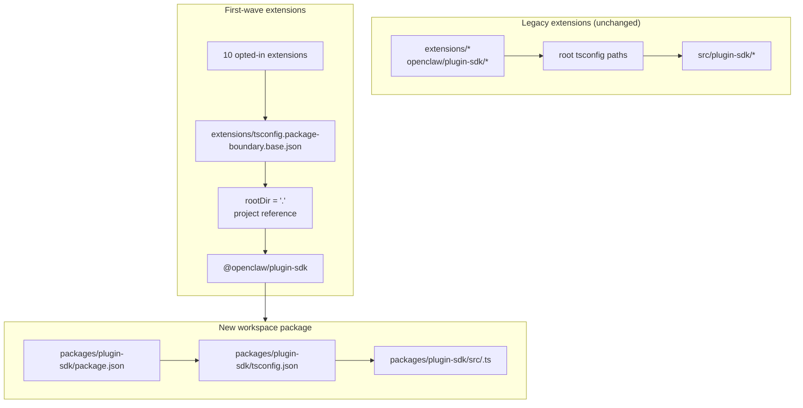

# refactor : Rendre plugin-sdk un véritable package d'espace de travail de manière incrémentale

## Aperçu

Ce plan introduit un véritable package d'espace de travail pour le SDK de plugin à
`packages/plugin-sdk` et l'utilise pour activer une première petite vague d'extensions pour
les limites de packages imposées par le compilateur. L'objectif est de faire échouer les importations relatives illégales
sous le `tsc` normal pour un ensemble sélectionné d'extensions provider
regroupées, sans forcer une migration à l'échelle du dépôt ou une géante surface de conflits de fusion.

La clé de ce passage incrémental est de faire fonctionner deux modes en parallèle pendant un certain temps :

| Mode              | Forme d'importation      | Qui l'utilise                                  | Application                                       |
| ----------------- | ------------------------ | ---------------------------------------------- | ------------------------------------------------- |
| Mode hérité       | `openclaw/plugin-sdk/*`  | toutes les extensions existantes non activées  | le comportement permissif actuel reste            |
| Mode d'activation | `@openclaw/plugin-sdk/*` | uniquement les extensions de la première vague | `rootDir` local au package + références de projet |

## Cadre du problème

Le dépôt actuel exporte une grande surface publique de SDK de plugin, mais ce n'est pas un véritable
package d'espace de travail. Au lieu de cela :

- la racine `tsconfig.json` mappe `openclaw/plugin-sdk/*` directement vers
  `src/plugin-sdk/*.ts`
- les extensions qui n'ont pas été activées lors de l'expérience précédente partagent toujours ce
  comportement global d'alias source
- l'ajout de `rootDir` ne fonctionne que lorsque les importations SDK autorisées cessent de résoudre vers la source brute
  du dépôt

Cela signifie que le dépôt peut décrire la politique de limites souhaitée, mais TypeScript
ne l'applique pas proprement pour la plupart des extensions.

Vous souhaitez un chemin incrémental qui :

- rend `plugin-sdk` réel
- fait avancer le SDK vers un package d'espace de travail nommé `@openclaw/plugin-sdk`
- ne modifie qu'environ 10 extensions dans la première PR
- laisse le reste de l'arborescence des extensions sur l'ancien schéma jusqu'au nettoyage ultérieur
- évite le flux de travail `tsconfig.plugin-sdk.dts.json` + déclarations générées par postinstall
  en tant que mécanisme principal pour le déploiement de la première vague

## Traçabilité des exigences

- R1. Créer un véritable package d'espace de travail pour le SDK de plugin sous `packages/`.
- R2. Nommer le nouveau package `@openclaw/plugin-sdk`.
- R3. Donner au nouveau package SDK son propre `package.json` et `tsconfig.json`.
- R4. Garder les `openclaw/plugin-sdk/*` imports legacy fonctionnels pour les extensions non optées
  durant la fenêtre de migration.
- R5. N'opter que pour une petite première vague d'extensions dans la première PR.
- R6. Les extensions de la première vague doivent échouer fermement pour les imports relatifs qui quittent
  leur racine de package.
- R7. Les extensions de la première vague doivent consommer le SDK via une dépendance de package
  et une référence de projet TS, et non via des alias racine `paths`.
- R8. Le plan doit éviter une étape de génération postinstall obligatoire à l'échelle du repo pour
  la correction de l'éditeur.
- R9. Le déploiement de la première vague doit être examinable et fusionnable en tant que PR modérée,
  et non une refactorisation de plus de 300 fichiers à l'échelle du repo.

## Limites de la portée

- Aucune migration complète de toutes les extensions groupées dans la première PR.
- Aucune obligation de supprimer `src/plugin-sdk` dans la première PR.
- Aucune obligation de recâbler chaque chemin de build ou de test racine pour utiliser le nouveau package
  immédiatement.
- Aucune tentative de forcer les traits ondulés de VS Code pour chaque extension non optée.
- Aucun nettoyage de lint large pour le reste de l'arborescence des extensions.
- Aucun changement important de comportement d'exécution au-delà de la résolution des imports, de la propriété des packages
  et de l'application des limites pour les extensions optées.

## Contexte et recherche

### Code et modèles pertinents

- `pnpm-workspace.yaml` inclut déjà `packages/*` et `extensions/*`, donc un
  nouveau package d'espace de travail sous `packages/plugin-sdk` s'inscrit dans la disposition actuelle du
  dépôt.
- Les packages d'espace de travail existants tels que `packages/memory-host-sdk/package.json`
  et `packages/plugin-package-contract/package.json` utilisent déjà des cartes `exports` locales au package
  ancrées dans `src/*.ts`.
- La racine `package.json` publie actuellement la surface du SDK via `./plugin-sdk`
  et des exports `./plugin-sdk/*` soutenus par `dist/plugin-sdk/*.js` et
  `dist/plugin-sdk/*.d.ts`.
- `src/plugin-sdk/entrypoints.ts` et `scripts/lib/plugin-sdk-entrypoints.json`
  agissent déjà comme l'inventaire canonique des points d'entrée pour la surface du SDK.
- La racine `tsconfig.json` mappe actuellement :
  - `openclaw/plugin-sdk` -> `src/plugin-sdk/index.ts`
  - `openclaw/plugin-sdk/*` -> `src/plugin-sdk/*.ts`
- L'expérience précédente sur les limites a montré que `rootDir` local au package fonctionne pour
  les importations relatives illégales uniquement après que les importations SDK autorisées ont cessé de résoudre vers la source
  brute en dehors du package d'extension.

### Ensemble d'extensions de première vague

Ce plan suppose que la première vague est l'ensemble centré sur les providers qui est le moins susceptible
d'entraîner des cas limites complexes liés au channel-runtime :

- `extensions/anthropic`
- `extensions/exa`
- `extensions/firecrawl`
- `extensions/groq`
- `extensions/mistral`
- `extensions/openai`
- `extensions/perplexity`
- `extensions/tavily`
- `extensions/together`
- `extensions/xai`

### Inventaire de la surface SDK de la première vague

Les extensions de la première vague importent actuellement un sous-ensemble gérable de sous-chemins du SDK.
Le package initial `@openclaw/plugin-sdk` doit uniquement couvrir ceux-ci :

- `agent-runtime`
- `cli-runtime`
- `config-runtime`
- `core`
- `image-generation`
- `media-runtime`
- `media-understanding`
- `plugin-entry`
- `plugin-runtime`
- `provider-auth`
- `provider-auth-api-key`
- `provider-auth-login`
- `provider-auth-runtime`
- `provider-catalog-shared`
- `provider-entry`
- `provider-http`
- `provider-model-shared`
- `provider-onboard`
- `provider-stream-family`
- `provider-stream-shared`
- `provider-tools`
- `provider-usage`
- `provider-web-fetch`
- `provider-web-search`
- `realtime-transcription`
- `realtime-voice`
- `runtime-env`
- `secret-input`
- `security-runtime`
- `speech`
- `testing`

### Enseignements institutionnels

- Aucune entrée `docs/solutions/` pertinente n'était présente dans cet arborescence de travail.

### Références externes

- Aucune recherche externe n'était nécessaire pour ce plan. Le dépôt contient déjà les modèles pertinents de package d'espace de travail et d'exportation du SDK.

## Décisions techniques clés

- Introduire `@openclaw/plugin-sdk` comme un nouveau package d'espace de travail tout en maintenant la surface de la `openclaw/plugin-sdk/*` racine héritée active pendant la migration.
  Raison : cela permet à un premier ensemble d'extensions de passer à une véritable résolution de packages sans forcer chaque extension et chaque chemin de build racine à changer en une seule fois.

- Utiliser une configuration de base de limite d'adhésion dédiée telle que
  `extensions/tsconfig.package-boundary.base.json` au lieu de remplacer la
  base d'extension existante pour tout le monde.
  Raison : le dépôt doit prendre en charge simultanément les modes d'extension hérités et d'adhésion pendant la migration.

- Utiliser les références de projet TS à partir des extensions de la première vague vers
  `packages/plugin-sdk/tsconfig.json` et définir
  `disableSourceOfProjectReferenceRedirect` pour le mode de limite d'adhésion.
  Raison : cela donne `tsc` un véritable graphe de packages tout en décourageant l'éditeur et le compilateur de revenir au parcours de la source brute.

- Garder `@openclaw/plugin-sdk` privé lors de la première vague.
  Raison : l'objectif immédiat est l'application des limites internes et la sécurité de la migration, et non la publication d'un second contrat SDK externe avant que la surface ne soit stable.

- Ne déplacer que les sous-chemins du SDK de la première vague dans la première tranche de mise en œuvre, et conserver des ponts de compatibilité pour le reste.
  Raison : déplacer physiquement les 315 fichiers `src/plugin-sdk/*.ts` dans une seule PR est exactement la surface de conflits de fusion que ce plan essaie d'éviter.

- Ne pas s'appuyer sur `scripts/postinstall-bundled-plugins.mjs` pour construire les déclarations du SDK
  pour la première vague.
  Raison : les flux de build/référence explicites sont plus faciles à comprendre et rendent le comportement du dépôt plus prévisible.

## Questions ouvertes

### Résolu lors de la planification

- Quelles extensions doivent figurer dans la première vague ?
  Utiliser les 10 extensions provider/web-search répertoriées ci-dessus car elles sont plus structurellement isolées que les packages channel plus lourds.

- La première PR doit-elle remplacer l'arborescence d'extension entière ?
  Non. La première PR doit prendre en charge deux modes en parallèle et n'activer que la première vague.

- La première vague nécessite-t-elle un build de déclaration postinstall ?
  Non. Le graphe de package/référence doit être explicite, et la CI doit exécuter intentionnellement le typecheck local pertinent au package.

### Reporté à la mise en œuvre

- Si le premier paquet (first-wave) peut pointer directement vers des `src/*.ts`
  locaux au paquet via les références de projet seules, ou si une petite étape
  d'émission de déclaration est toujours requise pour le paquet `@openclaw/plugin-sdk`.
  Il s'agit d'une question de validation du graphe TS relevant de la mise en œuvre.

- Si le paquet racine `openclaw` doit proxyer les sous-chemins SDK de la
  première vague vers les sorties `packages/plugin-sdk` immédiatement ou continuer à utiliser
  des shims de compatibilité générés sous `src/plugin-sdk`.
  Il s'agit d'un détail de compatibilité et de forme de build qui dépend du chemin
  de mise en œuvre minimal qui garde le CI vert.

## Conception technique de haut niveau

> Ceci illustre l'approche prévue et constitue une orientation directive pour la revue, et non une spécification de mise en œuvre. L'agent de mise en œuvre doit le considérer comme un contexte, et non comme du code à reproduire.

## Unités de mise en œuvre

- [ ] **Unité 1 : Introduire le véritable paquet d'espace de travail `@openclaw/plugin-sdk`**

**Objectif :** Créer un véritable paquet d'espace de travail pour le SDK qui peut posséder la surface de sous-chemin de la première vague sans forcer une migration à l'échelle du dépôt.

**Exigences :** R1, R2, R3, R8, R9

**Dépendances :** Aucune

**Fichiers :**

- Créer : `packages/plugin-sdk/package.json`
- Créer : `packages/plugin-sdk/tsconfig.json`
- Créer : `packages/plugin-sdk/src/index.ts`
- Créer : `packages/plugin-sdk/src/*.ts` pour les sous-chemins SDK de la première vague
- Modifier : `pnpm-workspace.yaml` uniquement si des ajustements de glob de paquet sont nécessaires
- Modifier : `package.json`
- Modifier : `src/plugin-sdk/entrypoints.ts`
- Modifier : `scripts/lib/plugin-sdk-entrypoints.json`
- Tester : `src/plugins/contracts/plugin-sdk-workspace-package.contract.test.ts`

**Approche :**

- Ajouter un nouveau paquet d'espace de travail nommé `@openclaw/plugin-sdk`.
- Commencer uniquement par les sous-chemins SDK de la première vague, et non par l'arborescence complète des 315 fichiers.
- Si déplacer directement un point d'entrée de la première vague créait une diff trop volumineuse,
  le premier PR peut introduire ce sous-chemin dans `packages/plugin-sdk/src` comme un mince
  wrapper de paquet d'abord, puis basculer la source de vérité vers le paquet dans un PR
  de suivi pour ce cluster de sous-chemins.
- Réutiliser la machinerie existante d'inventaire des points d'entrée afin que la surface du paquet de la première vague soit déclarée en un seul endroit canonique.
- Garder les exportations du package racine actives pour les utilisateurs hérités tandis que le package de l'espace de travail devient le nouveau contrat d'adhésion.

**Modèles à suivre :**

- `packages/memory-host-sdk/package.json`
- `packages/plugin-package-contract/package.json`
- `src/plugin-sdk/entrypoints.ts`

**Scénarios de test :**

- Chemin heureux : le package de l'espace de travail exporte chaque sous-chemin de la première vague répertorié dans le plan et aucune exportation requise de la première vague n'est manquante.
- Cas limite : les métadonnées d'exportation du package restent stables lorsque la liste des entrées de la première vague est régénérée ou comparée à l'inventaire canonique.
- Intégration : les exportations du SDK hérité du package racine restent présentes après l'introduction du nouveau package de l'espace de travail.

**Vérification :**

- Le dépôt contient un package de l'espace de travail `@openclaw/plugin-sdk` valide avec une carte d'exportation stable de la première vague et aucune régression d'exportation héritée dans le `package.json` racine.

- [ ] **Unité 2 : Ajouter un mode de limite TS d'adhésion pour les extensions imposées par le package**

**Objectif :** Définir le mode de configuration TS que les extensions ayant opté pour l'adhésion utiliseront, tout en laissant le comportement TS de l'extension existant inchangé pour tous les autres.

**Exigences :** R4, R6, R7, R8, R9

**Dépendances :** Unité 1

**Fichiers :**

- Créer : `extensions/tsconfig.package-boundary.base.json`
- Créer : `tsconfig.boundary-optin.json`
- Modifier : `extensions/xai/tsconfig.json`
- Modifier : `extensions/openai/tsconfig.json`
- Modifier : `extensions/anthropic/tsconfig.json`
- Modifier : `extensions/mistral/tsconfig.json`
- Modifier : `extensions/groq/tsconfig.json`
- Modifier : `extensions/together/tsconfig.json`
- Modifier : `extensions/perplexity/tsconfig.json`
- Modifier : `extensions/tavily/tsconfig.json`
- Modifier : `extensions/exa/tsconfig.json`
- Modifier : `extensions/firecrawl/tsconfig.json`
- Tester : `src/plugins/contracts/extension-package-project-boundaries.test.ts`
- Tester : `test/extension-package-tsc-boundary.test.ts`

**Approche :**

- Laisser `extensions/tsconfig.base.json` en place pour les extensions héritées.
- Ajouter une nouvelle configuration de base d'adhésion qui :
  - définit `rootDir: "."`
  - référence `packages/plugin-sdk`
  - active `composite`
  - désactive la redirection de source des références de projet si nécessaire
- Ajouter une configuration de solution dédiée pour le graphe de vérification de type de la première vague au lieu de remodeler le projet TS du dépôt racine dans la même PR.

**Note d'exécution :** Commencer par un contrôle de type canari local au paquet pour une
extension optée avant d'appliquer le modèle aux 10.

**Modèles à suivre :**

- Modèle d'extension `tsconfig.json` locale au paquet existant à partir du travail
  précédent sur les frontières
- Modèle de paquet d'espace de travail à partir de `packages/memory-host-sdk`

**Scénarios de test :**

- Chemin heureux : chaque extension optée passe avec succès le contrôle de type via la
  configuration TS de frontière de paquet.
- Chemin d'erreur : une importation relative canari à partir de `../../src/cli/acp-cli.ts` échoue
  avec `TS6059` pour une extension optée.
- Intégration : les extensions non optées restent intactes et n'ont pas besoin de
  participer à la nouvelle configuration de solution.

**Vérification :**

- Il existe un graphe de contrôle de type dédié pour les 10 extensions optées, et les mauvaises
  importations relatives de l'une d'elles échouent via le `tsc` normal.

- [ ] **Unité 3 : Migrer les extensions de la première vague vers `@openclaw/plugin-sdk`**

**Objectif :** Modifier les extensions de la première vague pour qu'elles consomment le véritable paquet SDK
via les métadonnées de dépendance, les références de projet et les importations par nom de paquet.

**Exigences :** R5, R6, R7, R9

**Dépendances :** Unité 2

**Fichiers :**

- Modifier : `extensions/anthropic/package.json`
- Modifier : `extensions/exa/package.json`
- Modifier : `extensions/firecrawl/package.json`
- Modifier : `extensions/groq/package.json`
- Modifier : `extensions/mistral/package.json`
- Modifier : `extensions/openai/package.json`
- Modifier : `extensions/perplexity/package.json`
- Modifier : `extensions/tavily/package.json`
- Modifier : `extensions/together/package.json`
- Modifier : `extensions/xai/package.json`
- Modifier les importations de production et de test sous chacune des 10 racines d'extension qui
  font actuellement référence à `openclaw/plugin-sdk/*`

**Approche :**

- Ajouter `@openclaw/plugin-sdk: workspace:*` à l'extension de la première vague
  `devDependencies`.
- Remplacer les importations `openclaw/plugin-sdk/*` dans ces paquets par
  `@openclaw/plugin-sdk/*`.
- Conserver les importations internes locales de l'extension sur les barils locaux tels que `./api.ts` et
  `./runtime-api.ts`.
- Ne pas modifier les extensions non optées dans ce PR.

**Modèles à suivre :**

- Tonneaux d'importation locaux aux extensions existants (`api.ts`, `runtime-api.ts`)
- Forme de dépendance de package utilisée par d'autres packages de l'espace de travail `@openclaw/*`

**Scénarios de test :**

- Chemin heureux : chaque extension migrée s'enregistre/charge toujours via ses tests de plugin existants après la réécriture des importations.
- Cas limite : les importations SDK réservées aux tests dans l'ensemble d'extensions admissibles se résolvent toujours correctement via le nouveau package.
- Intégration : les extensions migrées ne nécessitent pas d'alias `openclaw/plugin-sdk/*` racine pour la vérification de type.

**Vérification :**

- Les extensions de la première vague sont construites et testées par rapport à `@openclaw/plugin-sdk` sans avoir besoin du chemin d'alias SDK racine hérité.

- [ ] **Unité 4 : Préserver la compatibilité héritée pendant que la migration est partielle**

**Objectif :** Garder le reste du dépôt fonctionnel pendant que le SDK existe sous forme héritée et sous forme de nouveau package pendant la migration.

**Exigences :** R4, R8, R9

**Dépendances :** Unités 1-3

**Fichiers :**

- Modifier : `src/plugin-sdk/*.ts` pour les shims de compatibilité de la première vague si nécessaire
- Modifier : `package.json`
- Modifier : la plomberie de build ou d'exportation qui assemble les artefacts SDK
- Test : `src/plugins/contracts/plugin-sdk-runtime-api-guardrails.test.ts`
- Test : `src/plugins/contracts/plugin-sdk-index.bundle.test.ts`

**Approche :**

- Conserver le `openclaw/plugin-sdk/*` racine comme surface de compatibilité pour les extensions héritées et pour les consommateurs externes qui ne bougent pas encore.
- Utiliser soit des shims générés, soit un câblage de proxy d'export racine pour les sous-chemins de la première vague qui ont été déplacés vers `packages/plugin-sdk`.
- Ne pas tenter de retirer la surface SDK racine dans cette phase.

**Modèles à suivre :**

- Génération d'exportation SDK racine existante via `src/plugin-sdk/entrypoints.ts`
- Compatibilité d'export de package existante dans le `package.json` racine

**Scénarios de test :**

- Chemin heureux : une importation SDK racine héritée se résout toujours pour une extension non admissible après l'existence du nouveau package.
- Cas limite : un sous-chemin de la première vague fonctionne à la fois via la surface racine héritée et via la surface du nouveau package pendant la fenêtre de migration.
- Intégration : les tests de contrat d'index/bundle de plugin-sdk continuent de voir une surface publique cohérente.

**Vérification :**

- Le dépôt prend en charge les modes de consommation du SDK hérités et optionnels sans
  briser les extensions inchangées.

- [ ] **Unité 5 : Ajouter une application portée et documenter le contrat de migration**

**Objectif :** Intégrer les directives CI et contributeur qui appliquent le nouveau comportement pour la
première vague sans prétendre que l'arborescence d'extensions entière est migrée.

**Exigences :** R5, R6, R8, R9

**Dépendances :** Unités 1-4

**Fichiers :**

- Modifier : `package.json`
- Modifier : Les fichiers de workflow CI qui doivent exécuter la vérification de type de limite optionnelle
- Modifier : `AGENTS.md`
- Modifier : `docs/plugins/sdk-overview.md`
- Modifier : `docs/plugins/sdk-entrypoints.md`
- Modifier : `docs/plans/2026-04-05-001-refactor-extension-package-resolution-boundary-plan.md`

**Approche :**

- Ajouter une porte de première vague explicite, telle qu'une exécution de solution `tsc -b` dédiée pour
  `packages/plugin-sdk` ainsi que les 10 extensions retenues.
- Documenter que le dépôt prend désormais en charge les modes d'extension hérités et optionnels,
  et que les nouveaux travaux sur les limites d'extension devraient privilégier la nouvelle voie du package.
- Enregistrer la règle de migration de la vague suivante afin que les PR ultérieurs puissent ajouter plus d'extensions
  sans remettre en cause l'architecture.

**Modèles à suivre :**

- Tests de contrat existants sous `src/plugins/contracts/`
- Mises à jour de documentation existantes expliquant les migrations échelonnées

**Scénarios de test :**

- Chemin heureux : la nouvelle porte de vérification de type de première passe pour le package de l'espace de travail
  et les extensions retenues.
- Chemin d'erreur : l'introduction d'un nouvel import relatif illégal dans une extension
  retenue fait échouer la porte de vérification de type portée.
- Intégration : le CI n'exige pas encore des extensions non retenues qu'elles satisfassent le nouveau
  mode de limite de package.

**Vérification :**

- Le chemin d'application de la première vague est documenté, testé et exécutable sans
  forcer la migration de toute l'arborescence des extensions.

## Impact système

- **Graphe d'interaction :** ce travail touche la source de vérité du SDK, les exportations du package racine,
  les métadonnées des packages d'extension, la disposition du graphe TS et la vérification CI.
- **Propagation d'erreur :** le principal mode d'échec prévu devient des erreurs TS au moment de la compilation
  (`TS6059`) dans les extensions retenues au lieu d'échecs personnalisés uniquement par script.
- **Risques du cycle de vie de l'état :** la migration à double surface introduit un risque de dérive entre
  les exportations de compatité racines et le nouveau package de l'espace de travail.
- **Parité de la surface API :** les sous-chemins de la première vague doivent rester sémantiquement identiques
  via `openclaw/plugin-sdk/*` et `@openclaw/plugin-sdk/*` pendant la
  transition.
- **Couverture de l'intégration :** les tests unitaires ne suffisent pas ; des vérifications de type
  du graphe de packages délimitées sont nécessaires pour prouver la frontière.
- **Invariants inchangés :** les extensions non volontaires conservent leur comportement actuel
  dans la PR 1. Ce plan ne prétend pas à une application stricte des frontières d'importation à l'échelle du dépôt.

## Risques et dépendances

| Risque                                                                                                                            | Atténuation                                                                                                                                        |
| --------------------------------------------------------------------------------------------------------------------------------- | -------------------------------------------------------------------------------------------------------------------------------------------------- |
| Le package de la première_wave résout toujours vers la source brute et `rootDir` ne échoue pas réellement en mode fermé           | Faire de la première étape de mise en œuvre un canary de référence de package sur une extension volontaire avant de l'élargir à l'ensemble complet |
| Déplacer trop de source SDK à la fois recrée le problème de conflit de fusion d'origine                                           | Ne déplacer que les sous-chemins de la première vague dans la première PR et conserver les ponts de compatibilité racines                          |
| Les surfaces SDK héritées et nouvelles dérivent sémantiquement                                                                    | Conserver un inventaire unique des points d'entrée, ajouter des tests de contrat de compatibilité et rendre la parité double surface explicite     |
| Les chemins de construction/test du dépôt racine commencent accidentellement à dépendre du nouveau package de manière incontrôlée | Utiliser une configuration de solution dédiée volontaire et garder les modifications de topologie TS à l'échelle racine hors de la première PR     |

## Livraison par phases

### Phase 1

- Introduire `@openclaw/plugin-sdk`
- Définir la surface du sous-chemin de la première vague
- Prouver qu'une extension volontaire peut échouer en mode fermé via `rootDir`

### Phase 2

- Opter pour les 10 extensions de la première vague
- Garder la compatité racine active pour tous les autres

### Phase 3

- Ajouter plus d'extensions dans les PR ultérieurs
- Déplacer plus de sous-chemins SDK vers le package de l'espace de travail
- Retirer la compatité racine uniquement après la disparition de l'ensemble d'extensions héritées

## Documentation / Notes opérationnelles

- La première PR doit se décrire explicitement comme une migration en mode double, et non comme une
  fin de l'application à l'échelle du dépôt.
- Le guide de migration doit faciliter l'ajout de plus d'extensions par les PR ultérieurs
  en suivant le même modèle package/dépendance/référence.

## Sources et références

- Plan antérieur : `docs/plans/2026-04-05-001-refactor-extension-package-resolution-boundary-plan.md`
- Configuration de l'espace de travail : `pnpm-workspace.yaml`
- Inventaire des points d'entrée SDK existants : `src/plugin-sdk/entrypoints.ts`
- Exportations SDK racine existantes : `package.json`
- Modèles de packages d'espace de travail existants :
  - `packages/memory-host-sdk/package.json`
  - `packages/plugin-package-contract/package.json`
