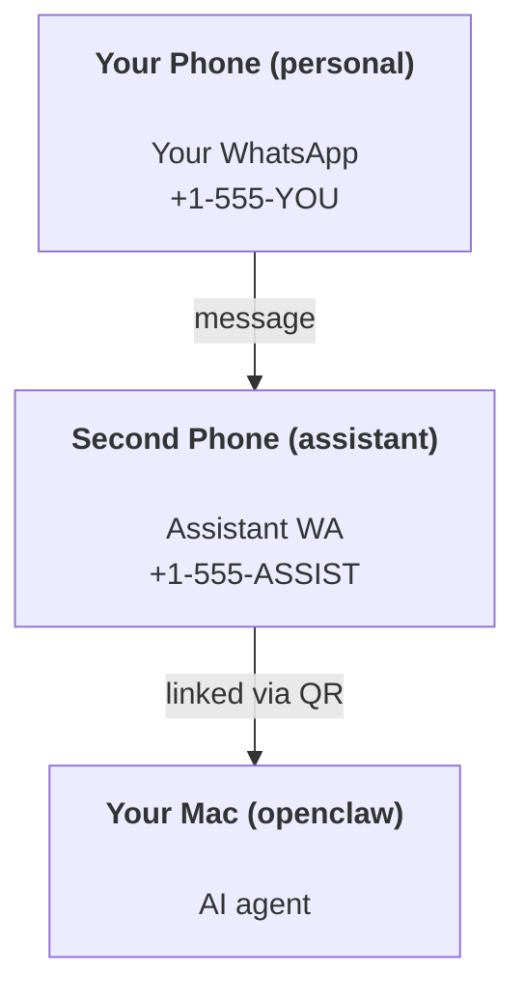

OpenClaw est une passerelle auto-hébergée qui connecte Discord, Google Chat, iMessage, Matrix, Microsoft Teams, Signal, Slack, Telegram, WhatsApp, Zalo, et plus encore à des agents IA. Ce guide couvre la configuration de l'« assistant personnel » : un numéro WhatsApp dédié qui se comporte comme votre assistant IA toujours actif.

## ⚠️ Sécurité d'abord

Vous placez un agent dans une position susceptible de :

- exécuter des commandes sur votre machine (en fonction de votre politique d'outil)
- lire/écrire des fichiers dans votre espace de travail
- renvoyer des messages via WhatsApp/Telegram/Discord/Mattermost et d'autres canaux inclus

Soyez prudent au début :

- Définissez toujours `channels.whatsapp.allowFrom` (n'exécutez jamais en accès mondial sur votre Mac personnel).
- Utilisez un numéro WhatsApp dédié pour l'assistant.
- Les signaux de présence (heartbeats) sont désormais par défaut toutes les 30 minutes. Désactivez-les jusqu'à ce que vous fassiez confiance à la configuration en définissant `agents.defaults.heartbeat.every: "0m"`.

## Prérequis

- OpenClaw installé et intégré - voir [Getting Started](OpenClaw/en/start/getting-started) si vous ne l'avez pas encore fait
- Un deuxième numéro de téléphone (SIM/eSIM/prépayé) pour l'assistant

## La configuration à deux téléphones (recommandée)

Vous voulez ceci :



Si vous liez votre WhatsApp personnel à OpenClaw, chaque message qui vous est adressé devient une « entrée d'agent ». Ce sont rarement les résultats que vous recherchez.

## Démarrage rapide en 5 minutes

1. Associer WhatsApp Web (affiche un QR code ; scannez avec le téléphone de l'assistant) :

```bash
openclaw channels login
```

2. Démarrez le Gateway (laissez-le en cours d'exécution) :

```bash
openclaw gateway --port 18789
```

3. Mettez une configuration minimale dans `~/.openclaw/openclaw.json` :

```json5
{
  gateway: { mode: "local" },
  channels: { whatsapp: { allowFrom: ["+15555550123"] } },
}
```

Envoyez maintenant un message au numéro de l'assistant depuis votre téléphone autorisé.

Lorsque l'embarquement est terminé, OpenClaw ouvre automatiquement le tableau de bord et affiche un lien propre (non tokenisé). Si le tableau de bord demande une authentification, collez le secret partagé configuré dans les paramètres du Control UI. L'embarquement utilise un jeton par défaut (`gateway.auth.token`), mais l'authentification par mot de passe fonctionne aussi si vous avez changé `gateway.auth.mode` pour `password`. Pour rouvrir plus tard : `openclaw dashboard`.

## Donner à l'agent un espace de travail (AGENTS)

OpenClaw lit les instructions de fonctionnement et la « mémoire » depuis son répertoire d'espace de travail.

Par défaut, OpenClaw utilise `~/.openclaw/workspace` comme espace de travail de l'agent, et le créera (ainsi que les fichiers de démarrage `AGENTS.md`, `SOUL.md`, `TOOLS.md`, `IDENTITY.md`, `USER.md`, `HEARTBEAT.md`) automatiquement lors de la configuration/première exécution de l'agent. `BOOTSTRAP.md` n'est créé que lorsque l'espace de travail est tout neuf (il ne devrait pas réapparaître après l'avoir supprimé). `MEMORY.md` est facultatif (non créé automatiquement) ; lorsqu'il est présent, il est chargé pour les sessions normales. Les sessions de sous-agent n'injectent que `AGENTS.md` et `TOOLS.md`.

<Tip>Traitez ce dossier comme la mémoire de OpenClaw et faites-en un dépôt git (idéalement privé) afin que vos `AGENTS.md` et fichiers de mémoire soient sauvegardés. Si git est installé, les nouveaux espaces de travail sont automatiquement initialisés.</Tip>

```bash
openclaw setup
```

Guide complet de l'espace de travail et de sauvegarde : [Agent workspace](/fr/concepts/agent-workspace)
Flux de travail de la mémoire : [Memory](/fr/concepts/memory)

Optionnel : choisir un espace de travail différent avec `agents.defaults.workspace` (prend en charge `~`).

```json5
{
  agents: {
    defaults: {
      workspace: "~/.openclaw/workspace",
    },
  },
}
```

Si vous fournissez déjà vos propres fichiers d'espace de travail depuis un dépôt, vous pouvez désactiver entièrement la création de fichiers d'amorçage :

```json5
{
  agents: {
    defaults: {
      skipBootstrap: true,
    },
  },
}
```

## La configuration qui le transforme en « assistant »

OpenClaw est configuré par défaut pour une bonne configuration d'assistant, mais vous voudrez généralement ajuster :

- persona/instructions dans [`SOUL.md`](/fr/concepts/soul)
- paramètres par défaut de réflexion (si souhaité)
- battements de cœur (heartbeats) (une fois que vous lui faites confiance)

Exemple :

```json5
{
  logging: { level: "info" },
  agents: {
    defaults: {
      model: { primary: "anthropic/claude-opus-4-6" },
      workspace: "~/.openclaw/workspace",
      thinkingDefault: "high",
      timeoutSeconds: 1800,
      // Start with 0; enable later.
      heartbeat: { every: "0m" },
    },
    list: [
      {
        id: "main",
        default: true,
        groupChat: {
          mentionPatterns: ["@openclaw", "openclaw"],
        },
      },
    ],
  },
  channels: {
    whatsapp: {
      allowFrom: ["+15555550123"],
      groups: {
        "*": { requireMention: true },
      },
    },
  },
  session: {
    scope: "per-sender",
    resetTriggers: ["/new", "/reset"],
    reset: {
      mode: "daily",
      atHour: 4,
      idleMinutes: 10080,
    },
  },
}
```

## Sessions et mémoire

- Fichiers de session : `~/.openclaw/agents/<agentId>/sessions/{{SessionId}}.jsonl`
- Métadonnées de session (utilisation des jetons, dernière route, etc.) : `~/.openclaw/agents/<agentId>/sessions/sessions.json` (obsolète : `~/.openclaw/sessions/sessions.json`)
- `/new` ou `/reset` lance une nouvelle session pour cette conversation (configurable via `resetTriggers`). S'il est envoyé seul, OpenClaw accuse réception de la réinitialisation sans invoquer le model.
- `/compact [instructions]` compacte le contexte de la session et signale le budget contextuel restant.

## Battements de cœur (mode proactif)

Par défaut, OpenClaw exécute un battement de cœur (heartbeat) toutes les 30 minutes avec le prompt :
`Read HEARTBEAT.md if it exists (workspace context). Follow it strictly. Do not infer or repeat old tasks from prior chats. If nothing needs attention, reply HEARTBEAT_OK.`
Définissez `agents.defaults.heartbeat.every: "0m"` pour désactiver.

- Si `HEARTBEAT.md` existe mais est effectivement vide (seulement des lignes vides et des en-têtes markdown comme `# Heading`), OpenClaw ignore l'exécution du battement de cœur pour économiser les appels à l'API.
- Si le fichier est manquant, le battement de cœur s'exécute toujours et le model décide de quoi faire.
- Si l'agent répond avec `HEARTBEAT_OK` (éventuellement avec un court remplissage ; voir `agents.defaults.heartbeat.ackMaxChars`), OpenClaw supprime la livraison sortante pour ce battement de cœur.
- Par défaut, la livraison du battement de cœur vers les cibles `user:<id>` de type DM est autorisée. Définissez `agents.defaults.heartbeat.directPolicy: "block"` pour supprimer la livraison directe tout en maintenant les exécutions du battement de cœur actives.
- Les battements de cœur exécutent des tours complets d'agent - des intervalles plus courts consomment plus de jetons.

```json5
{
  agents: {
    defaults: {
      heartbeat: { every: "30m" },
    },
  },
}
```

## Médias en entrée et en sortie

Les pièces jointes entrantes (images/audio/docs) peuvent être présentées à votre commande via des modèles :

- `{{MediaPath}}` (chemin de fichier temporaire local)
- `{{MediaUrl}}` (pseudo-URL)
- `{{Transcript}}` (si la transcription audio est activée)

Les pièces jointes sortantes de l'agent utilisent des champs de média structurés sur l'outil de message ou la charge utile de réponse, tels que `media`, `mediaUrl`, `mediaUrls`, `path`, ou `filePath`. Exemple d'arguments de l'outil de message :

```json
{
  "message": "Here's the screenshot.",
  "mediaUrl": "https://example.com/screenshot.png"
}
```

OpenClaw envoie des médias structurés avec le texte. Les réponses finales de l'assistant héritées peuvent toujours être normalisées pour des raisons de compatibilité, mais les résultats des outils, la sortie du navigateur, les blocs en continu et les actions de message n'analysent pas le texte comme des commandes de pièce jointe.

Le comportement des chemins locaux suit le même modèle de confiance de lecture de fichiers que l'agent :

- Si `tools.fs.workspaceOnly` est `true`OpenClaw, les chemins médias locaux sortants restent restreints à la racine temp d'OpenClaw, au cache média, aux chemins de l'espace de travail de l'agent et aux fichiers générés par le bac à sable.
- Si `tools.fs.workspaceOnly` est `false`, les médias locaux sortants peuvent utiliser des fichiers locaux à l'hôte que l'agent est déjà autorisé à lire.
- Les chemins locaux peuvent être absolus, relatifs à l'espace de travail ou relatifs au répertoire personnel avec `~/`.
- Les envois locaux à l'hôte n'autorisent toujours que les types de médias et de documents sécurisés (images, audio, vidéo, PDF, documents Office et documents texte validés tels que Markdown/MD, TXT, JSON, YAML et YML). Il s'agit d'une extension de la limite de confiance de lecture hôte existante, et non d'un scanner de secrets : si l'agent peut lire un `secret.txt` ou un `config.json` local à l'hôte, il peut joindre ce fichier lorsque l'extension et la validation du contenu correspondent.

Cela signifie que les images/fichiers générés en dehors de l'espace de travail peuvent maintenant être envoyés lorsque votre stratégie de système de fichiers autorise déjà ces lectures, tandis que les extensions de texte local arbitraires de l'hôte restent bloquées. Gardez les fichiers sensibles en dehors du système de fichiers lisible par l'agent, ou gardez `tools.fs.workspaceOnly=true` pour des envois de chemins locaux plus stricts.

## Liste de vérification des opérations

```bash
openclaw status          # local status (creds, sessions, queued events)
openclaw status --all    # full diagnosis (read-only, pasteable)
openclaw status --deep   # asks the gateway for a live health probe with channel probes when supported
openclaw health --json   # gateway health snapshot (WS; default can return a fresh cached snapshot)
```

Les journaux se trouvent sous `/tmp/openclaw/` (par défaut : `openclaw-YYYY-MM-DD.log`).

## Prochaines étapes

- WebChat : [WebChat](WebChatWebChat/en/web/webchat)
- Opérations Gateway : [Gateway runbook](GatewayGateway/en/gateway)
- Cron + réveils : [Cron jobs](/fr/automation/cron-jobs)
- Compagnon de barre de menus macOS : [OpenClaw macOS app](macOSOpenClawmacOS/en/platforms/macos)
- Application de nœud iOS : [iOS app](iOSiOS/en/platforms/ios)
- Application de nœud Android : [Android app](AndroidAndroid/en/platforms/android)
- Statut Windows : [Windows (WSL2)](WindowsWindowsWSL2/en/platforms/windows)
- Statut Linux : [Linux app](LinuxLinux/en/platforms/linux)
- Sécurité : [Security](/fr/gateway/security)

## Connexes

- [Getting started](/fr/start/getting-started)
- [Configuration](/fr/start/setup)
- [Vue d'ensemble des canaux](/fr/channels)
