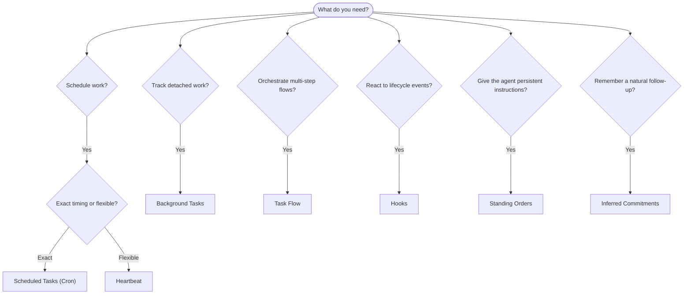

OpenClaw 在後台透過任務、排程工作、推斷承諾、事件 Hook 和常駐指令來運作工作。本頁面協助您選擇合適的機制，並了解它們如何協同運作。

## 快速決策指南

| 使用案例                         | 建議機制       | 原因                                            |
| -------------------------------- | -------------- | ----------------------------------------------- |
| 在早上 9 點整發送每日報告        | 排程任務       | 精確計時，隔離執行                              |
| 在 20 分鐘後提醒我               | 排程任務       | 具有精確計時的單次執行 (`--at`)                 |
| 執行每週深度分析                 | 排程任務       | 獨立任務，可使用不同的模型                      |
| 每 30 分鐘檢查一次收件匣         | Heartbeat      | 與其他檢查批次處理，具有情境感知能力            |
| 監控日曆中的即將來臨的事件       | Heartbeat      | 非常適合週期性感知                              |
| 在提及的面試後進行確認           | 推斷承諾       | 類似記憶的後續追蹤，無確切提醒請求              |
| 在使用者情境後進行溫柔的關懷確認 | 推斷承諾       | 範圍限定於相同的代理程式和頻道                  |
| 檢查子代理程式或 ACP 執行的狀態  | 後台任務       | 任務帳本追蹤所有分離的工作                      |
| 稽核執行了什麼及何時執行         | 後台任務       | `openclaw tasks list` 和 `openclaw tasks audit` |
| 多步驟研究然後總結               | 任務流         | 具有修訂追蹤的持續性協調流程                    |
| 在工作階段重設時執行腳本         | Hooks          | 事件驅動，在生命週期事件時觸發                  |
| 在每次工具呼叫時執行程式碼       | 外掛程式 Hooks | 程序內 Hook 可以攔截工具呼叫                    |
| 回覆前始終檢查合規性             | 常駐指令       | 自動注入到每個工作階段                          |

### 排程任務 vs 心跳

| 維度         | 排程任務                 | 心跳                     |
| ------------ | ------------------------ | ------------------------ |
| 時機         | 精確 (cron 表達式，單次) | 近似 (預設每 30 分鐘)    |
| 工作階段情境 | 全新 (隔離) 或共享       | 完整的主工作階段情境     |
| 任務記錄     | 始終建立                 | 從不建立                 |
| 傳遞         | 頻道、Webhook 或靜默     | 在主工作階段中內聯       |
| 最適用於     | 報告、提醒、後台工作     | 收件匣檢查、行事曆、通知 |

當您需要精確時機或隔離執行時，請使用排程任務。當工作受益於完整的工作階段情境且近似時機可接受時，請使用心跳。

## 核心概念

### 排程任務

Cron 是 Gateway 內建的排程器，用於精確的時機控制。它會保存工作、在適當的時間喚醒代理程式，並可以將輸出傳送到聊天頻道或 Webhook 端點。支援單次提醒、循環表達式和傳入的 Webhook 觸發器。

請參閱 [排程任務](/zh-Hant/automation/cron-jobs)。

### 任務

背景任務帳本會追蹤所有分離的工作：ACP 執行、子代理生成、獨立的 cron 執行以及 CLI 操作。任務是記錄，而非排程器。請使用 `openclaw tasks list` 和 `openclaw tasks audit` 來檢查它們。

參閱 [背景任務](/zh-Hant/automation/tasks)。

### 推斷承諾

承諾是可選的、短期的後續記憶。OpenClaw 從正常對話中推斷它們，將其範圍限定於相同的代理和頻道，並透過心跳傳送到期的檢查。確切的使用者要求的提醒仍屬於 cron。

參閱 [推斷承諾](/zh-Hant/concepts/commitments)。

### 任務流程

任務流程是背景任務之上的流程編排基底。它管理具有受管理和鏡像同步模式、修訂追蹤的持久化多步驟流程，以及用於檢查的 `openclaw tasks flow list|show|cancel`。

參閱 [任務流程](/zh-Hant/automation/taskflow)。

### 常駐指令

常駐指令授予代理針對定義程式的永久操作權限。它們存在於工作區檔案中（通常是 `AGENTS.md`）並且會被注入到每個會話中。可結合 cron 進行基於時間的執行。

參閱 [常駐指令](/zh-Hant/automation/standing-orders)。

### 鉤子

內部鉤子是由代理生命週期事件觸發的事件驅動腳本
(`/new`, `/reset`, `/stop`)、會話壓縮、閘道啟動和訊息
流程。它們會從目錄中自動被發現，並且可以使用 `openclaw hooks` 進行管理。對於程式內的工具呼叫攔截，請使用
[外掛鉤子](/zh-Hant/plugins/hooks)。

參閱 [鉤子](/zh-Hant/automation/hooks)。

### 心跳

Heartbeat 是一種週期性的主會話輪詢（預設每 30 分鐘一次）。它會在一次代理輪詢中批次處理多項檢查（收件匣、行事曆、通知），並擁有完整的會語情境。Heartbeat 輪詢不會建立任務記錄，也不會延長每日/閒置會語重設的新鮮度。請使用 `HEARTBEAT.md` 進行小型檢查清單，或者在想要於 heartbeat 內部進行僅到期週期性檢查時，使用 `tasks:` 區塊。空的 heartbeat 檔案會以 `empty-heartbeat-file` 跳過；僅到期任務模式會以 `no-tasks-due` 跳過。當 cron 工作處於啟用或佇列狀態時，Heartbeat 會延遲執行，而 `heartbeat.skipWhenBusy` 也可以在該代理的會語金鑰子代理或巢狀通道忙碌時延遲該代理。

請參閱 [Heartbeat](/zh-Hant/gateway/heartbeat)。

## 它們如何協同運作

- **Cron** 處理精確的排程（每日報告、每週檢視）和一次性提醒。所有 cron 執行都會建立任務記錄。
- **Heartbeat** 每 30 分鐘在一次批次處理輪次中處理例行監控（收件匣、日曆、通知）。
- **Hooks** 透過自訂腳本對特定事件（會話重設、壓縮、訊息流）做出反應。外掛掛鉤涵蓋工具呼叫。
- **Standing orders** 為代理提供持續的上下文和權限邊界。
- **Task Flow** 協調個別任務之上的多步驟流程。
- **Tasks** 自動追蹤所有分離的工作，以便您進行檢查和稽核。

## 相關

- [Scheduled Tasks](/zh-Hant/automation/cron-jobs) — 精確排程和一次性提醒
- [Inferred Commitments](/zh-Hant/concepts/commitments) — 類似記憶的後續檢查
- [Background Tasks](/zh-Hant/automation/tasks) — 所有分離工作的任務分類帳
- [Task Flow](/zh-Hant/automation/taskflow) — 持久的多步驟流程編排
- [Hooks](/zh-Hant/automation/hooks) — 事件驅動的生命週期腳本
- [Plugin hooks](/zh-Hant/plugins/hooks) — 程序內工具、提示、訊息和生命週期掛鉤
- [Standing Orders](/zh-Hant/automation/standing-orders) — 持續的代理指示
- [Heartbeat](/zh-Hant/gateway/heartbeat) — 週期性主會話輪次
- [Configuration Reference](/zh-Hant/gateway/configuration-reference) — 所有配置鍵
