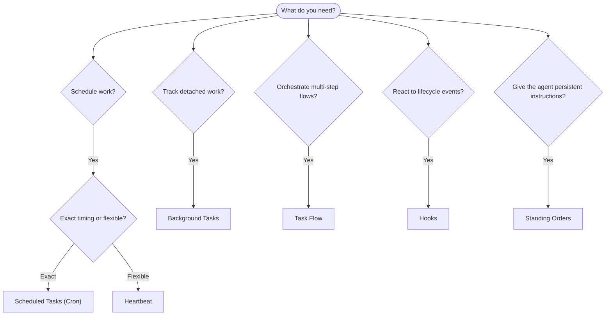

# 自動化與任務

OpenClaw 通過任務、排程作業、事件鉤子和常駐指令在後台執行工作。本頁面將幫助您選擇合適的機制並了解它們如何協同運作。

## 快速決策指南

| 使用案例                    | 建議機制  | 原因                                            |
| --------------------------- | --------- | ----------------------------------------------- |
| 在早上 9 點整發送每日報告   | 排程任務  | 精確計時，隔離執行                              |
| 在 20 分鐘後提醒我          | 排程任務  | 具有精確計時的單次執行 (`--at`)                 |
| 執行每週深度分析            | 排程任務  | 獨立任務，可使用不同的模型                      |
| 每 30 分鐘檢查一次收件匣    | Heartbeat | 與其他檢查批次處理，具有情境感知能力            |
| 監控日曆中的即將來臨的事件  | Heartbeat | 非常適合週期性感知                              |
| 檢查子代理或 ACP 執行的狀態 | 背景任務  | 任務分類帳追蹤所有分離的工作                    |
| 稽核執行了什麼以及何時執行  | 背景任務  | `openclaw tasks list` 和 `openclaw tasks audit` |
| 多步驟研究然後總結          | 任務流程  | 具有修訂追蹤的持久協調流程                      |
| 在工作階段重設時執行腳本    | 鉤子      | 事件驅動，在生命週期事件上觸發                  |
| 在每次工具呼叫時執行程式碼  | 鉤子      | 鉤子可以按事件類型過濾                          |
| 回覆前始終檢查合規性        | 常駐指令  | 自動注入到每個工作階段中                        |

### 排程任務 vs Heartbeat

| 維度         | 排程任務                     | Heartbeat              |
| ------------ | ---------------------------- | ---------------------- |
| 計時         | 精確 (cron 表達式，單次執行) | 近似 (預設每 30 分鐘)  |
| 工作階段情境 | 全新 (隔離) 或共享           | 完整的母工作階段情境   |
| 任務記錄     | 始終建立                     | 從不建立               |
| 傳遞方式     | 頻道、Webhook 或靜默         | 在母工作階段內聯       |
| 最適用於     | 報告、提醒、背景作業         | 收件匣檢查、日曆、通知 |

當您需要精確計時或隔離執行時，請使用排程任務。當工作受益於完整的工作階段情境且近似計時可接受時，請使用 Heartbeat。

## 核心概念

### 排程任務

Cron 是 Gateway 內建的排程器，用於精確計時。它會持久化工作，在正確的時間喚醒代理，並可以將輸出傳送到聊天頻道或 webhook 端點。支援一次性提醒、週期性表達式和傳入 webhook 觸發器。

請參閱[排程工作](/zh-Hant/automation/cron-jobs)。

### 工作

背景工作帳本會追蹤所有分離的工作：ACP 執行、子代理產生、隔離的 cron 執行和 CLI 操作。工作是記錄，而不是排程器。使用 `openclaw tasks list` 和 `openclaw tasks audit` 來檢查它們。

請參閱[背景工作](/zh-Hant/automation/tasks)。

### 工作流程

工作流程是位於背景工作之上的流程編排基層。它管理具有受管和鏡像同步模式、修訂追蹤以及 `openclaw tasks flow list|show|cancel` 用於檢查的持久多步驟流程。

請參閱[工作流程](/zh-Hant/automation/taskflow)。

### 常駐指令

常駐指令授予代理對於定義程式的永久操作權限。它們存在於工作區檔案中（通常是 `AGENTS.md`），並會被注入到每個工作階段中。與 cron 結合以進行基於時間的執行。

請參閱[常駐指令](/zh-Hant/automation/standing-orders)。

### 掛鉤

掛鉤是由代理生命週期事件（`/new`、`/reset`、`/stop`）、工作階段壓縮、Gateway 啟動、訊息流程和工具呼叫所觸發的事件驅動腳本。掛鉤會從目錄中自動發現，並可以使用 `openclaw hooks` 進行管理。

請參閱[掛鉤](/zh-Hant/automation/hooks)。

### 心跳

心跳是週期性的主工作階段輪次（預設每 30 分鐘一次）。它在一個具有完整工作階段內容的代理輪次中將多項檢查（收件匣、行事曆、通知）批次處理。心跳輪次不會建立工作記錄。使用 `HEARTBEAT.md` 作為小型檢查清單，或是當您希望在心跳內部進行僅到期週期性檢查時，使用 `tasks:` 區塊。空的心跳檔案會跳過為 `empty-heartbeat-file`；僅到期工作模式會跳過為 `no-tasks-due`。

請參閱[心跳](/zh-Hant/gateway/heartbeat)。

## 它們如何協同運作

- **Cron** 處理精確排程（每日報告、每週檢閱）和一次性提醒。所有的 cron 執行都會建立任務記錄。
- **Heartbeat** 每 30 分鐘以一個批次回合處理常規監控（收件匣、行事曆、通知）。
- **Hooks** 使用自訂腳本回應特定事件（工具呼叫、工作階段重設、壓縮）。
- **Standing orders** 提供代理程式持續的上下文和權限邊界。
- **Task Flow** 在個別任務之上協調多步驟流程。
- **Tasks** 自動追蹤所有分離工作，以便您檢查和稽核。

## 相關

- [Scheduled Tasks](/zh-Hant/automation/cron-jobs) — 精確排程和一次性提醒
- [Background Tasks](/zh-Hant/automation/tasks) — 所有分離工作的任務分類帳
- [Task Flow](/zh-Hant/automation/taskflow) — 耐久的多步驟流程協調
- [Hooks](/zh-Hant/automation/hooks) — 事件驅動的生命週期腳本
- [Standing Orders](/zh-Hant/automation/standing-orders) — 持續的代理程式指令
- [Heartbeat](/zh-Hant/gateway/heartbeat) — 週期性主工作階段回合
- [Configuration Reference](/zh-Hant/gateway/configuration-reference) — 所有設定金鑰
