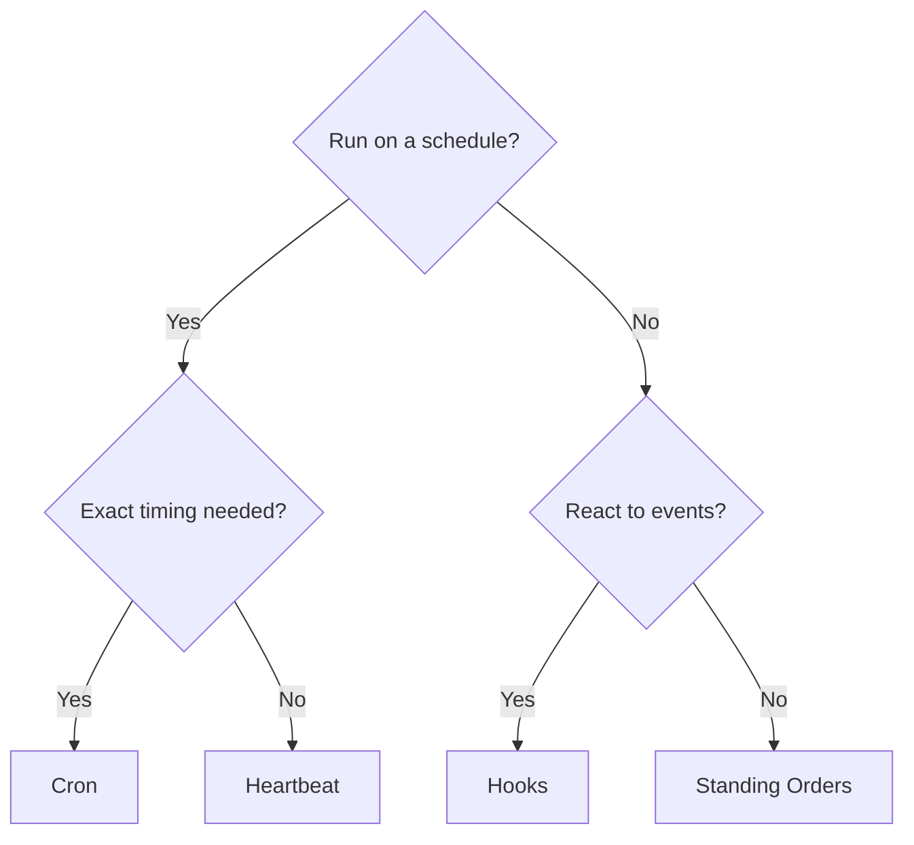

# 自動化

OpenClaw 提供了幾種自動化機制，每種都適用於不同的使用案例。本頁面協助您選擇合適的機制。

## 快速決策指南

## 機制一覽

| 機制                                              | 作用                                        | 運行於           | 建立任務記錄  |
| ------------------------------------------------- | ------------------------------------------- | ---------------- | ------------- |
| [Heartbeat](/en/gateway/heartbeat)                | 週期性主會話週期 — 批次處理多項檢查         | 主會話           | 否            |
| [Cron](/en/automation/cron-jobs)                  | 具有精確時間安排的排程工作                  | 主會話或隔離會話 | 是 (所有類型) |
| [Background Tasks](/en/automation/tasks)          | 追蹤分離的工作 (cron、ACP、子代理程式、CLI) | 不適用 (帳本)    | 不適用        |
| [Hooks](/en/automation/hooks)                     | 由代理程式生命週期事件觸發的事件驅動腳本    | Hook 執行器      | 否            |
| [Standing Orders](/en/automation/standing-orders) | 注入到系統提示中的持續性指令                | 主會話           | 否            |
| [Webhooks](/en/automation/webhook)                | 接收連入的 HTTP 事件並路由至代理程式        | Gateway HTTP     | 否            |

### 專用自動化

| 機制                                              | 作用                                   |
| ------------------------------------------------- | -------------------------------------- |
| [Gmail PubSub](/en/automation/gmail-pubsub)       | 透過 Google PubSub 實現即時 Gmail 通知 |
| [Polling](/en/automation/poll)                    | 週期性資料來源檢查 (RSS、API 等)       |
| [Auth Monitoring](/en/automation/auth-monitoring) | 憑證健康狀況與過期警示                 |

## 它們如何協同運作

最有效的設定會結合多種機制：

1. **Heartbeat** 在每 30 分鐘的一次批次週期中處理常規監控 (收件匣、行事曆、通知)。
2. **Cron** 處理精確排程 (每日報告、每週審查) 和一次性提醒。
3. **Hooks** 會使用自訂腳本回應特定事件 (工具呼叫、會話重設、壓縮)。
4. **Standing Orders** 為代理程式提供持續性內容 (「回覆前務必檢查專案看板」)。
5. **Background Tasks** 會自動追蹤所有分離的工作，以便您進行檢查與稽核。

請參閱 [Cron vs Heartbeat](/en/automation/cron-vs-heartbeat) 以深入了解這兩種排程機制的比較。

## 較舊的 ClawFlow 參考資料

較舊的版本說明和文件可能會提及 `ClawFlow` 或 `openclaw flows`，但此存儲庫中目前的 CLI 介面為 `openclaw tasks`。

請參閱 [Background Tasks](/en/automation/tasks) 以了解支援的工作總帳命令，並參閱 [ClawFlow](/en/automation/clawflow) 和 [CLI: flows](/en/cli/flows) 以了解相容性說明。

## 相關

- [Cron vs Heartbeat](/en/automation/cron-vs-heartbeat) — 詳細比較指南
- [ClawFlow](/en/automation/clawflow) — 舊版文件和版本說明的相容性說明
- [Troubleshooting](/en/automation/troubleshooting) — 除錯自動化問題
- [Configuration Reference](/en/gateway/configuration-reference) — 所有配置鍵
