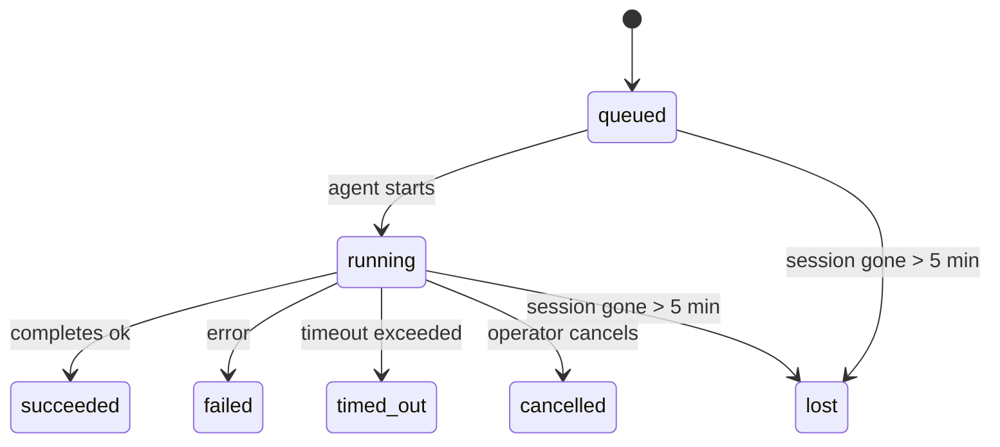

<Note>正在尋找排程功能？請參閱 [自動化與任務](/zh-Hant/automation) 以選擇合適的機制。本頁面是背景工作的活動記錄帳，而非排程器。</Note>

背景任務會追蹤在您的主要對話工作階段**之外**執行的工作：ACP 執行、子代理生成、隔離的 cron 工作執行，以及 CLI 初始化的操作。

任務並**不**取代工作階段、cron 工作或心跳——它們是記錄已發生的分離工作、其發生時間及是否成功的**活動帳本**。

<Note>並非每個代理執行都會建立任務。心跳週期和正常的互動式聊天不會。所有的 cron 執行、ACP 衍生、子代理衍生和 CLI 代理指令都會。</Note>

## TL;DR

- 任務是**紀錄**，而非排程器——cron 和 heartbeat 決定工作*何時*執行，任務則追蹤*發生了什麼*。
- ACP、子代理、所有 cron 工作和 CLI 操作都會建立任務。心跳週期則不會。
- 每個任務都會經過 `queued → running → terminal`（succeeded、failed、timed_out、cancelled 或 lost）。
- 只要 cron 執行時期仍擁有該工作，Cron 任務就會保持活躍；如果記憶體中的執行時期狀態消失，任務維護程式會在將任務標記為 lost 之前，先檢查持久化的 cron 執行記錄。
- 完成作業是由推送驅動的：分離的工作可以在完成時直接通知或喚醒請求者工作階段/心跳，因此狀態輪詢迴圈通常是不正確的模式。
- 獨立的 cron 執行和子代理完成作業會在進行最終清理簿記之前，盡力清理其子工作階段的追蹤瀏覽器分頁/程序。
- 隔離的 cron 傳送會在後代子代理工作仍在排空時抑制過時的中繼父層回覆，並且如果最終的後代輸出在傳送之前抵達，則會優先採用該輸出。
- 完成通知會直接傳送到頻道，或排入佇列等待下一次心跳。
- `openclaw tasks list` 會顯示所有任務；`openclaw tasks audit` 則會呈現問題。
- 終端記錄會保留 7 天，然後自動修剪。

## 快速入門

<Tabs>
  <Tab title="列出與篩選">
    ```bash
    # List all tasks (newest first)
    openclaw tasks list

    # Filter by runtime or status
    openclaw tasks list --runtime acp
    openclaw tasks list --status running
    ```

  </Tab>
  <Tab title="Inspect">
    ```bash
    # Show details for a specific task (by ID, run ID, or session key)
    openclaw tasks show <lookup>
    ```
  </Tab>
  <Tab title="Cancel and notify">
    ```bash
    # Cancel a running task (kills the child session)
    openclaw tasks cancel <lookup>

    # Change notification policy for a task
    openclaw tasks notify <lookup> state_changes
    ```

  </Tab>
  <Tab title="Audit and maintenance">
    ```bash
    # Run a health audit
    openclaw tasks audit

    # Preview or apply maintenance
    openclaw tasks maintenance
    openclaw tasks maintenance --apply
    ```

  </Tab>
  <Tab title="Task flow">
    ```bash
    # Inspect TaskFlow state
    openclaw tasks flow list
    openclaw tasks flow show <lookup>
    openclaw tasks flow cancel <lookup>
    ```
  </Tab>
</Tabs>

## 什麼會建立任務

| 來源                  | 執行時期類型 | 建立任務記錄的時機                   | 預設通知原則 |
| --------------------- | ------------ | ------------------------------------ | ------------ |
| ACP 背景執行          | `acp`        | 產生子 ACP 工作階段                  | `done_only`  |
| 子代理協調流程        | `subagent`   | 透過 `sessions_spawn` 產生子代理     | `done_only`  |
| Cron 工作（所有類型） | `cron`       | 每次 cron 執行（主要工作階段與隔離） | `silent`     |
| CLI 操作              | `cli`        | 透過閘道執行的 `openclaw agent` 指令 | `silent`     |
| 代理媒體工作          | `cli`        | 工作階段支援的 `video_generate` 執行 | `silent`     |

<AccordionGroup>
  <Accordion title="Cron 與媒體的預設通知">
    主會話 cron 任務預設使用 `silent` 通知原則 — 它們會建立記錄以便追蹤，但不會產生通知。獨立 cron 任務也預設為 `silent`，但因為它們在自己的會話中執行，所以更加顯眼。

    由會話支援的 `video_generate` 執行也使用 `silent` 通知原則。它們仍然會建立任務記錄，但完成狀態會以內部喚醒 (internal wake) 的形式交回給原始代理程式會話，以便代理程式撰寫後續訊息並自行附加完成的影片。如果您選擇加入 `tools.media.asyncCompletion.directSend`，非同步 `music_generate` 和 `video_generate` 完成會先嘗試直接通道傳遞，然後再回退到請求者會話喚醒路徑。

  </Accordion>
  <Accordion title="並行 video_generate 防護機制">
    當由會話支援的 `video_generate` 任務仍處於活動狀態時，該工具也會充當防護機制：在同一會話中重複呼叫 `video_generate` 將傳回活動任務狀態，而不是啟動第二個並行產生程序。當您想要從代理程式端明確查詢進度/狀態時，請使用 `action: "status"`。
  </Accordion>
  <Accordion title="什麼不會建立任務">
    - Heartbeat 週期 — 主會話；請參閱 [Heartbeat](/zh-Hant/gateway/heartbeat)
    - 一般互動式聊天週期
    - 直接 `/command` 回應
  </Accordion>
</AccordionGroup>

## 任務生命週期



| 狀態        | 含義                                        |
| ----------- | ------------------------------------------- |
| `queued`    | 已建立，正在等待代理程式開始                |
| `running`   | 代理程式週期正在主動執行                    |
| `succeeded` | 成功完成                                    |
| `failed`    | 完成但發生錯誤                              |
| `timed_out` | 超過設定的逾時時間                          |
| `cancelled` | 由操作員透過 `openclaw tasks cancel` 停止   |
| `lost`      | 運行時在 5 分鐘寬限期後失去了權威的備份狀態 |

轉換會自動發生 — 當關聯的代理運行結束時，任務狀態會更新以保持一致。

代理運行完成對活動任務記錄具有權威性。成功的分離運行最終確定為 `succeeded`，普通運行錯誤最終確定為 `failed`，超時或中止結果最終確定為 `timed_out`。如果操作員已取消任務，或者運行時已記錄了更強的最終狀態（例如 `failed`、`timed_out` 或 `lost`），則後續的成功信號不會降級該最終狀態。

`lost` 具有運行時感知能力：

- ACP 任務：備份 ACP 子會話元數據已消失。
- 子代理任務：備份子會話從目標代理存儲中消失。
- Cron 任務：cron 運行時不再追蹤該任務為活動和持久狀態，
  且 cron 運行歷史未顯示該運行的最終結果。離線 CLI
  審計不會將其自己空的進程中 cron 運行時狀態視為權威。
- CLI 任務：隔離的子會話任務使用子會話；聊天支援的
  CLI 任務改用即時運行上下文，因此殘留的
  頻道/群組/直接會話行不會保持它們活動狀態。閘道支援的
  `openclaw agent` 運行也會根據其運行結果最終確定，因此已完成的運行
  不會保持活動狀態，直到清理程序將其標記為 `lost`。

## 交付與通知

當任務達到最終狀態時，OpenClaw 會通知您。有兩種交付途徑：

**直接交付** — 如果任務具有頻道目標（即 `requesterOrigin`），完成訊息會直接發送到該頻道（Telegram、Discord、Slack 等）。對於子代理完成，OpenClaw 還會在可用時保留綁定的執行緒/主題路由，並可以在放棄直接交付之前，從請求者會話的存儲路由（`lastChannel` / `lastTo` / `lastAccountId`）填充缺失的 `to` / 帳戶。

**會話排隊傳遞** — 如果直接傳遞失敗或未設定來源，更新將作為系統事件加入請求者的會話佇列，並在下次心跳時顯示。

<Tip>任務完成會觸發立即的心跳喚醒，以便您快速查看結果 — 您無需等待下一次排程的心跳週期。</Tip>

這意味著常見的工作流程是基於推送的：啟動一次分離工作，然後讓執行時在完成時喚醒或通知您。僅在需要偵錯、干預或明確稽核時才輪詢任務狀態。

### 通知原則

控制您收到每個任務的資訊量：

| 原則               | 傳遞內容                                           |
| ------------------ | -------------------------------------------------- |
| `done_only` (預設) | 僅終止狀態 (succeeded, failed 等) — **這是預設值** |
| `state_changes`    | 每次狀態轉換和進度更新                             |
| `silent`           | 完全不傳遞                                         |

在任務執行時變更原則：

```bash
openclaw tasks notify <lookup> state_changes
```

## CLI 參考

<AccordionGroup>
  <Accordion title="tasks list">
    ```bash
    openclaw tasks list [--runtime <acp|subagent|cron|cli>] [--status <status>] [--json]
    ```

    輸出欄位：Task ID, Kind, Status, Delivery, Run ID, Child Session, Summary。

  </Accordion>
  <Accordion title="tasks show">
    ```bash
    openclaw tasks show <lookup>
    ```

    查詢權杖接受任務 ID、Run ID 或會話金鑰。顯示完整紀錄，包括計時、傳遞狀態、錯誤和終止摘要。

  </Accordion>
  <Accordion title="tasks cancel">
    ```bash
    openclaw tasks cancel <lookup>
    ```

    對於 ACP 和子代理程式任務，這會終止子會話。對於 CLI 追蹤的任務，取消動作會記錄在任務登錄檔中 (沒有獨立的子執行時控制代碼)。狀態轉換為 `cancelled`，並在適用時發送傳遞通知。

  </Accordion>
  <Accordion title="tasks notify">
    ```bash
    openclaw tasks notify <lookup> <done_only|state_changes|silent>
    ```
  </Accordion>
  <Accordion title="tasks audit">
    ```bash
    openclaw tasks audit [--json]
    ```

    顯示操作問題。當偵測到問題時，發現結果也會出現在 `openclaw status` 中。

    | 發現結果                   | 嚴重性   | 觸發條件                                                                                                      |
    | ------------------------- | ---------- | ------------------------------------------------------------------------------------------------------------ |
    | `stale_queued`            | warn       | 排隊超過 10 分鐘                                                                              |
    | `stale_running`           | error      | 執行超過 30 分鐘                                                                             |
    | `lost`                    | warn/error | Runtime 支援的工作所有權消失；保留的遺失任務會發出警告直到 `cleanupAfter`，然後變成錯誤 |
    | `delivery_failed`         | warn       | 傳遞失敗且通知原則不是 `silent`                                                            |
    | `missing_cleanup`         | warn       | 沒有清理時間戳記的終端任務                                                                      |
    | `inconsistent_timestamps` | warn       | 時間軸違規（例如在開始前結束）                                                        |

  </Accordion>
  <Accordion title="tasks maintenance">
    ```bash
    openclaw tasks maintenance [--json]
    openclaw tasks maintenance --apply [--json]
    ```

    使用此指令來預覽或套用針對工作和任務流程狀態的調和、清理標記以及修剪。

    調和具有執行時感知能力：

    - ACP/子代理任務會檢查其支援的子工作階段。
    - Cron 任務會檢查 cron 執行時是否仍擁有該工作，然後在回退到 `lost` 之前，從保存的 cron 執行記錄/工作狀態中恢復終端狀態。只有 Gateway 程序對記憶體中的 cron 活躍工作集合具有權威性；離線 CLI 稽核會使用持久歷史記錄，但不會僅因為該本機集合為空就將 cron 任務標記為遺失。
    - 支援 Chat 的 CLI 任務會檢查擁有的即時執行內容，而不僅僅是聊天工作階段記錄。

    完成清理也具有執行時感知能力：

    - 子代理完成會在繼續公告清理之前，盡最大努力關閉子工作階段的追蹤瀏覽器分頁/程序。
    - 隔離 cron 完成會在執行完全終止之前，盡最大努力關閉 cron 工作階段的追蹤瀏覽器分頁/程序。
    - 隔離 cron 傳遞會在需要時等待子代理後續回應，並抑制過時的父級確認文字，而不是公告該文字。
    - 子代理完成傳遞偏好最新的可見助理文字；如果該文字為空，則回退到清理過的最新工具/toolResult 文字，且僅逾時的工具呼叫執行可以折疊為簡短的局部進度摘要。終端失敗的執行會公告失敗狀態，而不重播擷取的回覆文字。
    - 清理失敗不會遮蔽真實的工作結果。

  </Accordion>
  <Accordion title="tasks flow list | show | cancel">
    ```bash
    openclaw tasks flow list [--status <status>] [--json]
    openclaw tasks flow show <lookup> [--json]
    openclaw tasks flow cancel <lookup>
    ```

    當您關心的是協調任務流程而非單一背景工作記錄時，請使用這些指令。

  </Accordion>
</AccordionGroup>

## Chat task board (`/tasks`)

在任何聊天工作階段中使用 `/tasks` 以查看連結至該工作階段的背景工作。看板會顯示活躍及最近完成的工作，包含執行時、狀態、時序，以及進度或錯誤詳細資訊。

當目前會話沒有可見的連結任務時，`/tasks` 會退回到代理程式本機任務計數，因此您仍可以在不洩露其他會話詳情的情況下獲得概覽。

若要查看完整的操作員記錄，請使用 CLI：`openclaw tasks list`。

## 狀態整合 (任務壓力)

`openclaw status` 包含一目瞭然的任務摘要：

```
Tasks: 3 queued · 2 running · 1 issues
```

摘要回報：

- **active** — `queued` + `running` 的計數
- **failures** — `failed` + `timed_out` + `lost` 的計數
- **byRuntime** — 按 `acp`、`subagent`、`cron`、`cli` 細分

`/status` 和 `session_status` 工具都使用具有清理感知功能的任務快照：優先顯示作用中任務，隱藏過時的已完成列，並且僅在沒有剩餘作用中工作時才顯示最近的失敗。這讓狀態卡專注於當下重要的事項。

## 儲存與維護

### 任務儲存位置

任務記錄會持久保存在 SQLite 的以下位置：

```
$OPENCLAW_STATE_DIR/tasks/runs.sqlite
```

登錄表會在閘道啟動時載入至記憶體中，並將寫入同步至 SQLite 以確保重新啟動後的持久性。
閘道透過使用 SQLite 的預設
自動檢查點閾值加上定期和關機 `TRUNCATE` 檢查點，來保持 SQLite 預寫式記錄 (WAL) 的界限。

### 自動維護

掃描器每 **60 秒** 執行一次，並處理三件事：

<Steps>
  <Step title="Reconciliation">檢查作用中任務是否仍然具有權威的執行階段支援。ACP/子代理程式任務使用子會話狀態，cron 任務使用作用中工作擁有權，而聊天支援的 CLI 任務則使用擁有的執行內容。如果該支援狀態消失超過 5 分鐘，任務將被標記為 `lost`。</Step>
  <Step title="清理標記">在終止任務上設定 `cleanupAfter` 時間戳（endedAt + 7 天）。在保留期間，遺失的任務仍會在稽核中顯示為警告；在 `cleanupAfter` 過期或缺少清理元數據後，它們會變成錯誤。</Step>
  <Step title="修剪">刪除超過 `cleanupAfter` 日期的記錄。</Step>
</Steps>

<Note>**保留期：** 終止任務記錄會保留 **7 天**，之後會自動修剪。無需任何配置。</Note>

## 任務如何與其他系統相關聯

<AccordionGroup>
  <Accordion title="任務與工作流">
    [Task Flow](/zh-Hant/automation/taskflow) 是位於背景任務之上的流程編排層。單一流程可能在其生命週期內使用受管或鏡像同步模式協調多個任務。使用 `openclaw tasks` 檢查單個任務記錄，並使用 `openclaw tasks flow` 檢查編排流程。

    詳情請參閱 [Task Flow](/zh-Hant/automation/taskflow)。

  </Accordion>
  <Accordion title="任務與 cron">
    cron 工作 **定義** 駐留在 `~/.openclaw/cron/jobs.json` 中；執行時期狀態駐留在旁邊的 `~/.openclaw/cron/jobs-state.json` 中。**每次** cron 執行都會建立一個任務記錄——包括主會話和獨立的。主會話 cron 任務預設使用 `silent` 通知策略，以便在不產生通知的情況下進行追蹤。

    請參閱 [Cron Jobs](/zh-Hant/automation/cron-jobs)。

  </Accordion>
  <Accordion title="任務與心跳">
    心跳執行是主會話輪次——它們不會建立任務記錄。當任務完成時，它可以觸發心跳喚醒，以便您能立即看到結果。

    請參閱 [Heartbeat](/zh-Hant/gateway/heartbeat)。

  </Accordion>
  <Accordion title="Tasks and sessions">
    任務可能會參照到一個 `childSessionKey`（工作執行的地方）和一個 `requesterSessionKey`（發起它的人）。Sessions 是對話上下文；而 tasks 是建立在對話之上的活動追蹤。
  </Accordion>
  <Accordion title="Tasks and agent runs">
    任務的 `runId` 會連結到執行該工作的 agent run。Agent 生命週期事件（開始、結束、錯誤）會自動更新任務狀態——您無需手動管理生命週期。
  </Accordion>
</AccordionGroup>

## 相關

- [Automation & Tasks](/zh-Hant/automation) — 所有自動化機制一覽
- [CLI: Tasks](/zh-Hant/cli/tasks) — CLI 指令參考
- [Heartbeat](/zh-Hant/gateway/heartbeat) — 定期的主要會話週期
- [Scheduled Tasks](/zh-Hant/automation/cron-jobs) — 排程背景工作
- [Task Flow](/zh-Hant/automation/taskflow) — 位於任務之上的流程編排
