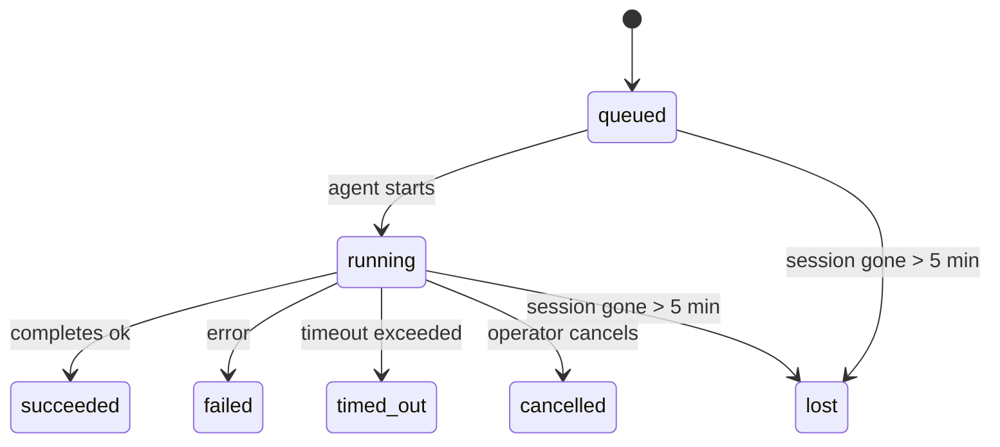

# 背景任務

> **正在尋找排程功能嗎？** 請參閱 [Automation & Tasks](/en/automation) 以選擇正確的機制。本頁面涵蓋的是**追蹤**背景工作，而非排程。

背景任務會追蹤在您的主要對話工作階段**之外**執行的工作：
ACP 執行、子代理衍生、獨立 cron 工作執行，以及 CLI 初始的操作。

任務並**不**取代工作階段、cron 工作或心跳——它們是記錄已發生的分離工作、其發生時間及是否成功的**活動帳本**。

<Note>並非每個代理執行都會建立任務。心跳週期和正常的互動式聊天不會。所有的 cron 執行、ACP 衍生、子代理衍生和 CLI 代理指令都會。</Note>

## TL;DR

- 任務是**紀錄**，而非排程器——cron 和 heartbeat 決定工作*何時*執行，任務則追蹤*發生了什麼*。
- ACP、子代理、所有 cron 工作和 CLI 操作都會建立任務。心跳週期則不會。
- 每個工作都會流經 `queued → running → terminal` (succeeded、failed、timed_out、cancelled 或 lost)。
- 只要 cron 執行時期仍擁有該工作，Cron 工作就會保持運作；由聊天支援的 CLI 工作僅在其擁有的執行內容仍處於啟用狀態時才會保持運作。
- 完成作業是由推送驅動的：分離的工作可以在完成時直接通知或喚醒請求者工作階段/心跳，因此狀態輪詢迴圈通常是不正確的模式。
- 獨立的 cron 執行和子代理完成作業會在進行最終清理簿記之前，盡力清理其子工作階段的追蹤瀏覽器分頁/程序。
- 當後代子代理工作仍在排空時，獨立的 cron 傳送會抑制過時的暫時父代回覆，並且當最終後代輸出在傳送之前抵達時，會優先採用該輸出。
- 完成通知會直接傳送到頻道，或排入佇列等待下一次心跳。
- `openclaw tasks list` 顯示所有工作；`openclaw tasks audit` 顯示問題。
- 終端記錄會保留 7 天，然後自動修剪。

## 快速入門

```bash
# List all tasks (newest first)
openclaw tasks list

# Filter by runtime or status
openclaw tasks list --runtime acp
openclaw tasks list --status running

# Show details for a specific task (by ID, run ID, or session key)
openclaw tasks show <lookup>

# Cancel a running task (kills the child session)
openclaw tasks cancel <lookup>

# Change notification policy for a task
openclaw tasks notify <lookup> state_changes

# Run a health audit
openclaw tasks audit

# Preview or apply maintenance
openclaw tasks maintenance
openclaw tasks maintenance --apply

# Inspect TaskFlow state
openclaw tasks flow list
openclaw tasks flow show <lookup>
openclaw tasks flow cancel <lookup>
```

## 什麼會建立工作

| 來源                 | 執行時期類型 | 建立工作記錄的時機                   | 預設通知政策 |
| -------------------- | ------------ | ------------------------------------ | ------------ |
| ACP 背景執行         | `acp`        | 產生子 ACP 工作階段                  | `done_only`  |
| 子代理協調           | `subagent`   | 透過 `sessions_spawn` 產生子代理     | `done_only`  |
| Cron 工作 (所有類型) | `cron`       | 每次 cron 執行 (主工作階段和獨立)    | `silent`     |
| CLI 操作             | `cli`        | 透過閘道執行的 `openclaw agent` 指令 | `silent`     |
| 代理媒體工作         | `cli`        | 工作階段支援的 `video_generate` 執行 | `silent`     |

主會話 cron 任務預設使用 `silent` 通知原則 — 它們會建立記錄以進行追蹤，但不會產生通知。獨立 cron 任務也預設為 `silent`，但因為它們在自己的會話中運行，所以更為可見。

會話支援的 `video_generate` 執行也使用 `silent` 通知原則。它們仍會建立任務記錄，但完成狀態會作為內部喚醒傳回原始代理程式會話，以便代理程式可以撰寫後續訊息並自行附加完成的影片。如果您選擇加入 `tools.media.asyncCompletion.directSend`，異步 `music_generate` 和 `video_generate` 完成會先嘗試直接通道傳遞，然後再退回到請求者會話喚醒路徑。

當會話支援的 `video_generate` 任務仍處於活動狀態時，該工具也充當防護機制：在同一會話中重複的 `video_generate` 呼叫會傳回活動任務狀態，而不是啟動第二次並行生成。當您想要從代理程式端進行明確的進度/狀態查詢時，請使用 `action: "status"`。

**什麼不會建立任務：**

- Heartbeat 輪次 — 主會話；請參閱 [Heartbeat](/en/gateway/heartbeat)
- 一般的互動式聊天輪次
- 直接的 `/command` 回應

## 任務生命週期



| 狀態        | 含義                                        |
| ----------- | ------------------------------------------- |
| `queued`    | 已建立，等待代理程式啟動                    |
| `running`   | 代理程式輪次正在主動執行                    |
| `succeeded` | 成功完成                                    |
| `failed`    | 完成時發生錯誤                              |
| `timed_out` | 超過設定的逾時時間                          |
| `cancelled` | 由操作員透過 `openclaw tasks cancel` 停止   |
| `lost`      | 執行時在 5 分鐘寬限期後失去了授權的支援狀態 |

轉換會自動發生 — 當相關聯的代理程式執行結束時，任務狀態會更新以匹配。

`lost` 具有執行時感知能力：

- ACP 任務：支援 ACP 子會話的中繼資料已消失。
- 子代理任務：支援子會話已從目標代理儲存中消失。
- Cron 任務：Cron 執行時不再追蹤該作業為活動狀態。
- CLI 任務：隔離子會話任務使用子會話；聊天支援的 CLI 任務則改用即時執行上下文，因此殘留的頻道/群組/直接訊息會話記錄不會使其保持活動狀態。

## 傳遞與通知

當任務達到終止狀態時，OpenClaw 會通知您。有兩種傳遞路徑：

**直接傳遞** — 如果任務具有頻道目標 (`requesterOrigin`)，完成訊息會直接發送到該頻道 (Telegram、Discord、Slack 等)。對於子代理完成項，OpenClaw 還會在可用時保留綁定的執行緒/主題路由，並可以在放棄直接傳遞之前，從請求者會話的儲存路由 (`lastChannel` / `lastTo` / `lastAccountId`) 中填入遺失的 `to` / 帳戶。

**會話排隊傳遞** — 如果直接傳遞失敗或未設定來源，更新會作為系統事件排隊在請求者的會話中，並在下一次心跳時浮現。

<Tip>任務完成會觸發立即的心跳喚醒，以便您快速查看結果 — 您無需等待下一次排程的心跳跳動。</Tip>

這意味著通常的工作流程是基於推送的：啟動一次分離工作，然後讓執行時在完成時喚醒或通知您。僅在您需要除錯、干預或明確審計時才輪詢任務狀態。

### 通知策略

控制您對每個任務的了解程度：

| 策略               | 傳遞內容                                   |
| ------------------ | ------------------------------------------ |
| `done_only` (預設) | 僅終止狀態 (成功、失敗等) — **這是預設值** |
| `state_changes`    | 每個狀態轉換和進度更新                     |
| `silent`           | 完全不                                     |

在任務執行期間變更策略：

```bash
openclaw tasks notify <lookup> state_changes
```

## CLI 參考

### `tasks list`

```bash
openclaw tasks list [--runtime <acp|subagent|cron|cli>] [--status <status>] [--json]
```

輸出欄位：任務 ID、類型、狀態、傳遞、執行 ID、子會話、摘要。

### `tasks show`

```bash
openclaw tasks show <lookup>
```

查找令牌接受任務 ID、執行 ID 或會話金鑰。顯示完整記錄，包括計時、傳遞狀態、錯誤和終止摘要。

### `tasks cancel`

```bash
openclaw tasks cancel <lookup>
```

對於 ACP 和子代理任務，這會終止子會話。狀態轉換為 `cancelled` 並發送傳送通知。

### `tasks notify`

```bash
openclaw tasks notify <lookup> <done_only|state_changes|silent>
```

### `tasks audit`

```bash
openclaw tasks audit [--json]
```

顯示操作問題。當檢測到問題時，發現也會出現在 `openclaw status` 中。

| 發現                      | 嚴重性 | 觸發                             |
| ------------------------- | ------ | -------------------------------- |
| `stale_queued`            | 警告   | 排隊超過 10 分鐘                 |
| `stale_running`           | 錯誤   | 運行超過 30 分鐘                 |
| `lost`                    | 錯誤   | Runtime 支援的任務所有權已消失   |
| `delivery_failed`         | 警告   | 傳送失敗且通知策略不為 `silent`  |
| `missing_cleanup`         | 警告   | 終端任務沒有清理時間戳           |
| `inconsistent_timestamps` | 警告   | 時間線違規（例如在開始之前結束） |

### `tasks maintenance`

```bash
openclaw tasks maintenance [--json]
openclaw tasks maintenance --apply [--json]
```

使用此指令預覽或應用任務和任務流程狀態的對帳、清理標記和修剪。

對帳具有 Runtime 感知能力：

- ACP/子代理任務會檢查其支援的子會話。
- Cron 任務會檢查 cron Runtime 是否仍擁有該作業。
- Chat 支援的 CLI 任務會檢查擁有的即時運行上下文，而不僅僅是聊天會話行。

完成清理也具有 Runtime 感知能力：

- 子代理完成會在公告清理繼續之前，盡力關閉子會話的追蹤瀏覽器分頁/行程。
- 隔離的 Cron 完成會在運行完全終止之前，盡力關閉 cron 會話的追蹤瀏覽器分頁/行程。
- 隔離的 Cron 傳送會在需要時等待子代理後續跟進，並抑制過期的父級確認文字，而不是公告它。
- 子代理完成傳送偏好最新的可見助手文字；如果為空，則回退到清理過的最新工具/toolResult 文字，並且僅超時的工具呼叫運行可以折疊為簡短的部分進度摘要。
- 清理失敗不會掩蓋真實的任務結果。

### `tasks flow list|show|cancel`

```bash
openclaw tasks flow list [--status <status>] [--json]
openclaw tasks flow show <lookup> [--json]
openclaw tasks flow cancel <lookup>
```

當您關注的是編排任務流程而不是單個後台任務記錄時，請使用這些指令。

## 聊天任務看板 (`/tasks`)

在任何聊天會話中使用 `/tasks` 以查看與該會話關聯的背景任務。儀表板會顯示
活躍及最近完成的任務，以及其執行時間、狀態、時間安排和進度或錯誤詳細資訊。

當目前會話沒有可見的關聯任務時，`/tasks` 會退回到代理本機任務計數
這樣您仍可獲得概覽，而不會洩漏其他會話的細節。

如需完整的操作員帳本，請使用 CLI：`openclaw tasks list`。

## 狀態整合

`openclaw status` 包含一覽無遺的任務摘要：

```
Tasks: 3 queued · 2 running · 1 issues
```

摘要報告顯示：

- **活躍** — `queued` + `running` 的計數
- **失敗** — `failed` + `timed_out` + `lost` 的計數
- **byRuntime** — 依 `acp`、`subagent`、`cron`、`cli` 細分

`/status` 和 `session_status` 工具都使用具清理感知能力的任務快照：優先顯示活躍任務，隱藏過期的已完成列，且僅當沒有活躍工作剩餘時才顯示最近的失敗。這使狀態卡片專注於當下重要的事項。

## 儲存與維護

### 任務儲存位置

任務記錄持久儲存在以下位置的 SQLite 中：

```
$OPENCLAW_STATE_DIR/tasks/runs.sqlite
```

登錄表會在閘道啟動時載入到記憶體中，並將寫入同步到 SQLite，以確保重啟後的持久性。

### 自動維護

掃描程式每 **60 秒** 執行一次，並處理三件事：

1. **協調** — 檢查活躍任務是否仍有權威的執行時期後端支援。ACP/子代理任務使用子會話狀態，cron 任務使用活躍工作擁有權，而聊天支援的 CLI 任務使用擁有的執行上下文。如果該後端狀態消失超過 5 分鐘，任務將標記為 `lost`。
2. **清理標記** — 在終端任務上設定 `cleanupAfter` 時間戳記 (endedAt + 7 天)。
3. **修剪** — 刪除超過其 `cleanupAfter` 日期的記錄。

**保留**：終端任務記錄會保留 **7 天**，然後自動修剪。無需配置。

## 任務與其他系統的關聯

### 任務與任務流程

[Task Flow](/en/automation/taskflow) 是位於背景任務之上的流程編排層。單一流程可以在其生命週期內使用受管理或鏡像同步模式協調多個任務。使用 `openclaw tasks` 檢查單個任務記錄，並使用 `openclaw tasks flow` 檢查編排流程。

詳情請參閱 [Task Flow](/en/automation/taskflow)。

### 任務與排程

Cron 工作**定義**位於 `~/.openclaw/cron/jobs.json` 中。**每次** cron 執行都會建立一個任務記錄——包括主會話和獨立執行。主會話 cron 任務預設使用 `silent` 通知策略，以便在追蹤時不產生通知。

請參閱 [Cron Jobs](/en/automation/cron-jobs)。

### 任務與心跳

Heartbeat 執行是主會話輪次——它們不會建立任務記錄。當任務完成時，它可以觸發心跳喚醒，以便您能立即看到結果。

請參閱 [Heartbeat](/en/gateway/heartbeat)。

### 任務與會話

任務可能會參考 `childSessionKey`（工作執行的地方）和 `requesterSessionKey`（誰啟動了它）。會話是對話上下文；任務是基於此之上的活動追蹤。

### 任務與代理執行

任務的 `runId` 連結到執行工作的代理執行。代理生命週期事件（開始、結束、錯誤）會自動更新任務狀態——您無需手動管理生命週期。

## 相關

- [Automation & Tasks](/en/automation) — 所有自動化機制一覽
- [Task Flow](/en/automation/taskflow) — 任務之上的流程編排
- [Scheduled Tasks](/en/automation/cron-jobs) — 排程背景工作
- [Heartbeat](/en/gateway/heartbeat) — 定期主會話輪次
- [CLI: Tasks](/en/cli/index#tasks) — CLI 指令參考
