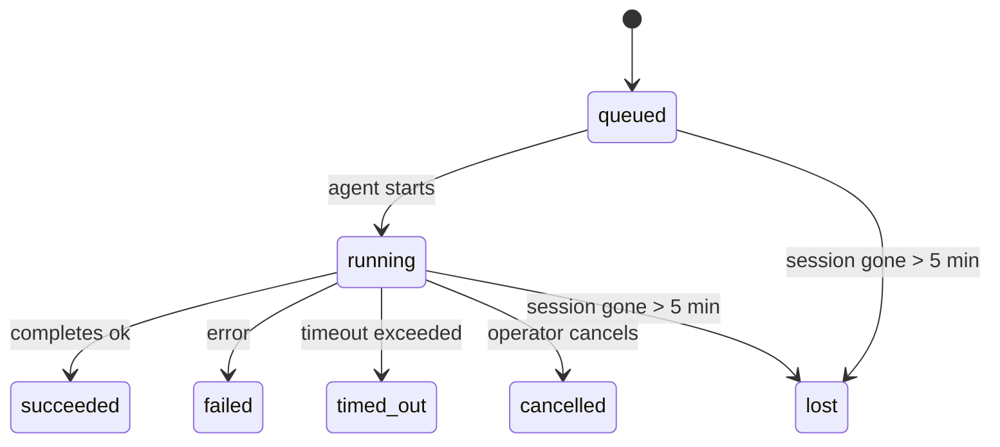

<Note>正在尋找排程功能？請參閱 [Automation](/zh-Hant/automation) 以選擇合適的機制。此頁面是背景工作的活動記錄，而非排程器。</Note>

背景任務會追蹤在您的主要對話工作階段**之外**執行的工作：ACP 執行、子代理生成、隔離的 cron 工作執行，以及 CLI 初始化的操作。

工作**不會**取代對話階段、cron 排程工作或心跳——它們是記錄已分離工作發生時間、內容及成功與否的 **活動記錄帳**。

<Note>並非每個代理執行都會建立任務。心跳週期和正常的互動式聊天不會。所有的 cron 執行、ACP 衍生、子代理衍生和 CLI 代理指令都會。</Note>

## TL;DR

- 工作是 **記錄**，而非排程器——cron 和心跳決定工作*何時*執行，而工作追蹤*發生了什麼*。
- ACP、子代理、所有 cron 工作和 CLI 操作都會建立任務。心跳週期則不會。
- 每個工作都會經過 `queued → running → terminal`（succeeded、failed、timed_out、cancelled 或 lost）。
- 只要 cron 執行時期仍擁有該工作，Cron 任務就會保持活躍；如果記憶體中的執行時期狀態消失，任務維護程式會在將任務標記為 lost 之前，先檢查持久化的 cron 執行記錄。
- 完成作業是由推送驅動的：分離的工作可以在完成時直接通知或喚醒請求者工作階段/心跳，因此狀態輪詢迴圈通常是不正確的模式。
- 獨立的 cron 執行和子代理完成作業會在進行最終清理簿記之前，盡力清理其子工作階段的追蹤瀏覽器分頁/程序。
- 隔離的 cron 傳送會在後代子代理工作仍在排空時抑制過時的中繼父層回覆，並且如果最終的後代輸出在傳送之前抵達，則會優先採用該輸出。
- 完成通知會直接傳送到頻道，或排入佇列等待下一次心跳。
- `openclaw tasks list` 顯示所有工作；`openclaw tasks audit` 則會顯示問題。
- 終端記錄會保留 7 天，然後自動修剪。

## 快速入門

<Tabs>
  <Tab title="列出與篩選">
    ```bash
    # List all tasks (newest first)
    openclaw tasks list

    # Filter by runtime or status
    openclaw tasks list --runtime acp
    openclaw tasks list --status running
    ```

  </Tab>
  <Tab title="Inspect">
    ```bash
    # Show details for a specific task (by ID, run ID, or session key)
    openclaw tasks show <lookup>
    ```
  </Tab>
  <Tab title="Cancel and notify">
    ```bash
    # Cancel a running task (kills the child session)
    openclaw tasks cancel <lookup>

    # Change notification policy for a task
    openclaw tasks notify <lookup> state_changes
    ```

  </Tab>
  <Tab title="Audit and maintenance">
    ```bash
    # Run a health audit
    openclaw tasks audit

    # Preview or apply maintenance
    openclaw tasks maintenance
    openclaw tasks maintenance --apply
    ```

  </Tab>
  <Tab title="Task flow">
    ```bash
    # Inspect TaskFlow state
    openclaw tasks flow list
    openclaw tasks flow show <lookup>
    openclaw tasks flow cancel <lookup>
    ```
  </Tab>
</Tabs>

## 什麼會建立任務

| 來源                  | 執行時期類型 | 建立任務記錄的時機                                      | 預設通知原則 |
| --------------------- | ------------ | ------------------------------------------------------- | ------------ |
| ACP 背景執行          | `acp`        | 產生子 ACP 工作階段                                     | `done_only`  |
| 子代理協調流程        | `subagent`   | 透過 `sessions_spawn` 產生子代理                        | `done_only`  |
| Cron 工作（所有類型） | `cron`       | 每次 cron 執行（主要工作階段與隔離）                    | `silent`     |
| CLI 操作              | `cli`        | 透過閘道執行的 `openclaw agent` 指令                    | `silent`     |
| 代理媒體工作          | `cli`        | 由對話階段支援的 `music_generate`/`video_generate` 執行 | `silent`     |

<AccordionGroup>
  <Accordion title="Cron 和媒體的預設通知方式">
    主會話 cron 任務預設使用 `silent` 通知原則——它們會建立記錄以便追蹤，但不會產生通知。隔離 cron 任務同樣預設為 `silent`，但因為它們在自己的會話中執行，所以更為顯眼。

    會話支援的 `music_generate` 和 `video_generate` 執行也使用 `silent` 通知原則。它們仍會建立任務記錄，但完成狀態會作為內部喚醒返回給原始代理會話，以便代理能撰寫後續訊息並自行附加完成的媒體。群組/頻道完成作業遵循正常的可見回覆原則，因此當來源傳遞需要時，代理會使用訊息工具。如果完成代理在僅限工具的路由中未能產生訊息工具傳遞證據，OpenClaw 會直接將完成後備傳送至原始頻道，而不會將媒體保留為私人。

  </Accordion>
  <Accordion title="並發 video_generate 防護機制">
    當會話支援的 `video_generate` 任務仍處於活動狀態時，該工具也充當防護機制：在同一會話中重複的 `video_generate` 呼叫會傳回活動任務狀態，而不是啟動第二次並發生成。當您想要從代理端明確查詢進度/狀態時，請使用 `action: "status"`。
  </Accordion>
  <Accordion title="什麼不會建立任務">
    - Heartbeat 週期——主會話；請參閱 [Heartbeat](/zh-Hant/gateway/heartbeat)
    - 正常的互動式聊天週期
    - 直接的 `/command` 回應

  </Accordion>
</AccordionGroup>

## 任務生命週期



| 狀態        | 含義                                        |
| ----------- | ------------------------------------------- |
| `queued`    | 已建立，正在等待代理程式開始                |
| `running`   | 代理程式週期正在主動執行                    |
| `succeeded` | 成功完成                                    |
| `failed`    | 完成但發生錯誤                              |
| `timed_out` | 超過設定的逾時時間                          |
| `cancelled` | 由操作員透過 `openclaw tasks cancel` 停止   |
| `lost`      | 運行時在 5 分鐘寬限期後失去了權威的備份狀態 |

轉換會自動發生——當關聯的代理執行結束時，任務狀態會隨之更新以相符。

Agent 執行完成對於活動任務記錄具有決定性。成功的獨立執行會定稿為 `succeeded`，一般執行錯誤會定稿為 `failed`，而逾時或中止結果會定稿為 `timed_out`。如果操作員已取消該任務，或執行時環境已記錄了更強的終止狀態（例如 `failed`、`timed_out` 或 `lost`），則後續的成功訊號不會降低該終止狀態。

`lost` 感知執行時環境：

- ACP 任務：備份 ACP 子會話元數據已消失。
- 子代理任務：備份子會話從目標代理存儲中消失。
- Cron 任務：cron 運行時不再追蹤該任務為活動和持久狀態，
  且 cron 運行歷史未顯示該運行的最終結果。離線 CLI
  審計不會將其自己空的進程中 cron 運行時狀態視為權威。
- CLI 任務：具有執行 ID / 來源 ID 的任務會使用即時執行上下文，因此在閘道擁有的執行消失後，殘留的子會話或聊天會話記錄不會使它們保持活動狀態。沒有執行身分的舊版 CLI 任務仍然會回退到子會話。由閘道支援的 `openclaw agent` 執行也會根據其執行結果定稿，因此已完成的執行不會處於活動狀態，直到清理程式將其標記為 `lost`。

## 交付與通知

當任務達到最終狀態時，OpenClaw 會通知您。有兩種交付途徑：

**直接傳遞** - 如果任務具有頻道目標 (即 `requesterOrigin`)，完成訊息會直接傳送至該頻道 (Telegram、Discord、Slack 等)。群組和頻道任務的完成訊息則會改由請求者工作階段路由，以便父代理程式能撰寫可見的回覆。對於子代理程式的完成項目，OpenClaw 還會在可用時保留綁定的執行緒/主題路由，並且可以在放棄直接傳遞之前，從請求者工作階段的儲存路由 (`lastChannel` / `lastTo` / `lastAccountId`) 中填入遺漏的 `to` / 帳號。

**會話排隊傳遞** - 如果直接傳遞失敗或未設定來源，更新會作為系統事件在請求者的會話中排隊，並在下次心跳時顯示。

<Tip>任務完成會觸發立即的心跳喚醒，因此您可以快速看到結果 - 您不必等待下一次排程的心跳跳動。</Tip>

這意味著常見的工作流程是基於推送的：啟動一次分離工作，然後讓執行時在完成時喚醒或通知您。僅在需要偵錯、干預或明確稽核時才輪詢任務狀態。

### 通知原則

控制您收到每個任務的資訊量：

| 原則               | 傳遞內容                                   |
| ------------------ | ------------------------------------------ |
| `done_only` (預設) | 僅終止狀態 (成功、失敗等) - **這是預設值** |
| `state_changes`    | 每次狀態轉換和進度更新                     |
| `silent`           | 完全不傳遞                                 |

在任務執行時變更原則：

```bash
openclaw tasks notify <lookup> state_changes
```

## CLI 參考

<AccordionGroup>
  <Accordion title="tasks list">
    ```bash
    openclaw tasks list [--runtime <acp|subagent|cron|cli>] [--status <status>] [--json]
    ```

    輸出欄位：Task ID, Kind, Status, Delivery, Run ID, Child Session, Summary。

  </Accordion>
  <Accordion title="tasks show">
    ```bash
    openclaw tasks show <lookup>
    ```

    查詢權杖接受任務 ID、Run ID 或會話金鑰。顯示完整紀錄，包括計時、傳遞狀態、錯誤和終止摘要。

  </Accordion>
  <Accordion title="tasks cancel">
    ```bash
    openclaw tasks cancel <lookup>
    ```

    對於 ACP 和子代理任務，這會終止子會話。對於 CLI 追蹤的任務，取消會記錄在任務註冊表中（沒有單獨的子執行時句柄）。狀態轉換為 `cancelled`，並在適用時發送傳遞通知。

  </Accordion>
  <Accordion title="tasks notify">
    ```bash
    openclaw tasks notify <lookup> <done_only|state_changes|silent>
    ```
  </Accordion>
  <Accordion title="tasks audit">
    ```bash
    openclaw tasks audit [--json]
    ```

    顯示操作問題。當檢測到問題時，發現結果也會出現在 `openclaw status` 中。

    | 發現                   | 嚴重性   | 觸發條件                                                                                                      |
    | ------------------------- | ---------- | ------------------------------------------------------------------------------------------------------------ |
    | `stale_queued`            | warn       | 排隊超過 10 分鐘                                                                              |
    | `stale_running`           | error      | 執行超過 30 分鐘                                                                             |
    | `lost`                    | warn/error | 執行時支援的任務所有權消失；保留的遺失任務會發出警告直到 `cleanupAfter`，然後變為錯誤 |
    | `delivery_failed`         | warn       | 傳遞失敗且通知策略不是 `silent`                                                            |
    | `missing_cleanup`         | warn       | 終端任務沒有清理時間戳                                                                      |
    | `inconsistent_timestamps` | warn       | 時間線違規（例如在開始前結束）                                                        |

  </Accordion>
  <Accordion title="tasks maintenance">
    ```bash
    openclaw tasks maintenance [--json]
    openclaw tasks maintenance --apply [--json]
    ```

    使用此項目來預覽或套用對任務、Task Flow 狀態及過時 cron 執行階段註冊表項目的對帳、清理標記與修剪。

    對帳具有執行時期感知能力：

    - ACP/subagent 任務會檢查其備援的子階段。
    - 若子階段具有重新啟動-復原標記，subagent 任務將被標記為遺失，而非視為可復原的備援階段。
    - Cron 任務會檢查 cron 執行時期是否仍擁有該工作，然後在退回至 `lost` 之前，從持久化的 cron 執行日誌/工作狀態復原終端狀態。僅 Gateway 程序對記憶體中的 cron 活動工作集具有權威性；離線 CLI 審計會使用持久歷史紀錄，但不會僅因為本機 Set 為空就將 cron 任務標記為遺失。
    - 具有執行身分識別的 CLI 任務會檢查擁有的即時執行內容，而不僅是子階段或聊天階段項目。

    完成清理也具有執行時期感知能力：

    - Subagent 完成會在宣布清理繼續之前，盡力為子階段關閉受追蹤的瀏覽器分頁/程序。
    - 隔離 cron 完成會在執行完全拆除之前，盡力為 cron 階段關閉受追蹤的瀏覽器分頁/程序。
    - 隔離 cron 傳遞會在需要時等待後代 subagent 的後續動作，並抑制過時的父層確認文字，而不是宣布它。
    - Subagent 完成傳遞偏好最新的可見助理文字；如果為空，則退回至經過清理的最新 tool/toolResult 文字，且僅逾時的工具呼叫執行可以折疊為簡短的部分進度摘要。終端失敗的執行會宣布失敗狀態，而不重新播放捕獲的回覆文字。
    - 清理失敗不會遮蔽真正的任務結果。

    當套用維護時，OpenClaw 也會移除超過 7 天的過時 `cron:<jobId>:run:<uuid>` 階段註冊表項目，同時保留目前執行中 cron 工作的項目，並保留非 cron 階段項目不變。

  </Accordion>
  <Accordion title="tasks flow list | show | cancel">
    ```bash
    openclaw tasks flow list [--status <status>] [--json]
    openclaw tasks flow show <lookup> [--json]
    openclaw tasks flow cancel <lookup>
    ```

    當您關心的是協調任務流程而非單一背景工作記錄時，請使用這些指令。

  </Accordion>
</AccordionGroup>

## 聊天任務看板 (`/tasks`)

在任何聊天階段中使用 `/tasks` 來查看連結至該階段的背景任務。看板會顯示作用中及最近完成的任務，並包含執行時期、狀態、時序以及進度或錯誤詳細資訊。

當前工作階段若沒有可見的連結任務，`/tasks` 會退回使用代理本地的任務計數，讓您仍然能獲得概覽，而不會洩漏其他工作階段的細節。

若要查看完整的操作員帳本，請使用 CLI：`openclaw tasks list`。

## 狀態整合 (任務壓力)

`openclaw status` 包含一目瞭然的任務摘要：

```
Tasks: 3 queued · 2 running · 1 issues
```

摘要回報：

- **active** - `queued` + `running` 的計數
- **failures** - `failed` + `timed_out` + `lost` 的計數
- **byRuntime** - 依 `acp`、`subagent`、`cron`、`cli` 細分

`/status` 和 `session_status` 工具都使用具備清理感知的任務快照：優先顯示作用中任務，隱藏陳舊的已完成項目，且僅當沒有作用中工作時才顯示最近的失敗。這能讓狀態卡片專注於當下重要的事項。

## 儲存與維護

### 任務儲存位置

任務記錄會持久保存在 SQLite 的以下位置：

```
$OPENCLAW_STATE_DIR/tasks/runs.sqlite
```

註冊表會在閘道啟動時載入記憶體，並將寫入同步至 SQLite 以確保重啟後的持久性。
閘道透過使用 SQLite 預設的自動檢查點 (autocheckpoint) 臨界值，加上定期與關機時的 `TRUNCATE` 檢查點，來讓 SQLite 的預寫日誌 (write-ahead log) 保持受限。

### 自動維護

掃掠程式 (sweeper) 每 **60 秒** 執行一次，並處理四件事：

<Steps>
  <Step title="Reconciliation">檢查作用中任務是否仍具備具權威性的執行期後端。ACP/子代理任務使用子工作階段狀態，Cron 任務使用作用中工作擁有權，而具備執行身分的 CLI 任務則使用擁有該執行的內容。如果該後端狀態消失超過 5 分鐘，任務會被標記為 `lost`。</Step>
  <Step title="ACP session repair">關閉終結或孤立的父擁有一次性 ACP 工作階段，並僅當沒有剩餘的作用中對話連結時，才關閉陳舊的終結或孤立持久式 ACP 工作階段。</Step>
  <Step title="清理標記">在終止任務上設定 `cleanupAfter` 時間戳（endedAt + 7 天）。在保留期間，遺失的任務仍會在稽核中以警告形式顯示；在 `cleanupAfter` 過期或缺少清理元數據時，它們會變為錯誤。</Step>
  <Step title="修剪">刪除超過其 `cleanupAfter` 日期的記錄。</Step>
</Steps>

<Note>**保留期限：** 終止任務記錄會保留 **7 天**，然後自動修剪。無需配置。</Note>

## 任務與其他系統的關聯

<AccordionGroup>
  <Accordion title="任務與任務流程">
    [任務流程](/zh-Hant/automation/taskflow) 是位於背景任務之上的流程編排層。單一流程可在其生命週期內使用受管或鏡像同步模式協調多個任務。使用 `openclaw tasks` 檢查個別任務記錄，並使用 `openclaw tasks flow` 檢查編排流程。

    詳情請參閱 [任務流程](/zh-Hant/automation/taskflow)。

  </Accordion>
  <Accordion title="任務與 cron">
    cron 工作 **定義** 駐留在 `~/.openclaw/cron/jobs.json` 中；執行階段執行狀態則駐留在旁邊的 `~/.openclaw/cron/jobs-state.json` 中。**每** 次 cron 執行都會建立一個任務記錄——包括主工作階段和隔離式。主工作階段的 cron 任務預設使用 `silent` 通知政策，以便在不產生通知的情況下進行追蹤。

    請參閱 [Cron 工作](/zh-Hant/automation/cron-jobs)。

  </Accordion>
  <Accordion title="任務與心跳">
    心跳執行是主工作階段的輪次——它們不會建立任務記錄。當任務完成時，它可以觸發心跳喚醒，以便您即時查看結果。

    請參閱 [心跳](/zh-Hant/gateway/heartbeat)。

  </Accordion>
  <Accordion title="Tasks and sessions">
    任務可能會參考 `childSessionKey`（工作執行的地方）和 `requesterSessionKey`（誰啟動了它）。Session 是對話上下文；任務則是在其之上的活動追蹤。
  </Accordion>
  <Accordion title="Tasks and agent runs">
    任務的 `runId` 會連結到執行工作的 agent run。Agent 生命週期事件（開始、結束、錯誤）會自動更新任務狀態 - 您不需要手動管理生命週期。
  </Accordion>
</AccordionGroup>

## 相關

- [Automation](/zh-Hant/automation) - 所有自動化機制一覽
- [CLI: Tasks](/zh-Hant/cli/tasks) - CLI 指令參考
- [Heartbeat](/zh-Hant/gateway/heartbeat) - 定期主會話回合
- [Scheduled Tasks](/zh-Hant/automation/cron-jobs) - 排程背景工作
- [Task Flow](/zh-Hant/automation/taskflow) - 任務之上的流程編排
