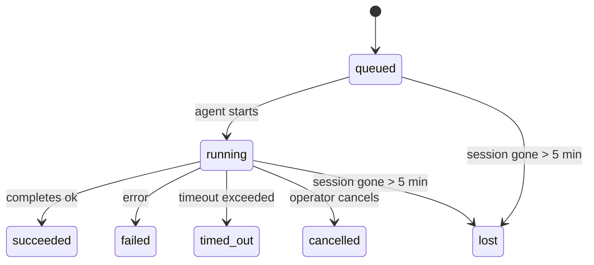

<Note>在尋找排程功能嗎？請參閱 [Automation](/zh-Hant/automation) 以選擇正確的機制。此頁面是背景工作的活動記錄帳，而非排程器。</Note>

背景任務會追蹤在您的主要對話工作階段**之外**執行的工作：ACP 執行、子代理生成、隔離的 cron 工作執行，以及 CLI 初始化的操作。

工作**不會**取代對話階段、cron 排程工作或心跳——它們是記錄已分離工作發生時間、內容及成功與否的 **活動記錄帳**。

<Note>並非每個代理執行都會建立任務。心跳週期和正常的互動式聊天不會。所有的 cron 執行、ACP 衍生、子代理衍生和 CLI 代理指令都會。</Note>

## TL;DR

- 工作是 **記錄**，而非排程器——cron 和心跳決定工作*何時*執行，而工作追蹤*發生了什麼*。
- ACP、子代理、所有 cron 工作和 CLI 操作都會建立任務。心跳週期則不會。
- 每個工作都會經過 `queued → running → terminal`（succeeded、failed、timed_out、cancelled 或 lost）。
- 只要 cron 執行時期仍擁有該工作，Cron 任務就會保持活躍；如果記憶體中的執行時期狀態消失，任務維護程式會在將任務標記為 lost 之前，先檢查持久化的 cron 執行記錄。
- 完成作業是由推送驅動的：分離的工作可以在完成時直接通知或喚醒請求者工作階段/心跳，因此狀態輪詢迴圈通常是不正確的模式。
- 獨立的 cron 執行和子代理完成作業會在進行最終清理簿記之前，盡力清理其子工作階段的追蹤瀏覽器分頁/程序。
- 隔離的 cron 傳送會在後代子代理工作仍在排空時抑制過時的中繼父層回覆，並且如果最終的後代輸出在傳送之前抵達，則會優先採用該輸出。
- 完成通知會直接傳送到頻道，或排入佇列等待下一次心跳。
- `openclaw tasks list` 顯示所有工作；`openclaw tasks audit` 則會顯示問題。
- 終端記錄會保留 7 天，然後自動修剪。

## 快速入門

<Tabs>
  <Tab title="列出與篩選">
    ```bash
    # List all tasks (newest first)
    openclaw tasks list

    # Filter by runtime or status
    openclaw tasks list --runtime acp
    openclaw tasks list --status running
    ```

  </Tab>
  <Tab title="Inspect">
    ```bash
    # Show details for a specific task (by ID, run ID, or session key)
    openclaw tasks show <lookup>
    ```
  </Tab>
  <Tab title="Cancel and notify">
    ```bash
    # Cancel a running task (kills the child session)
    openclaw tasks cancel <lookup>

    # Change notification policy for a task
    openclaw tasks notify <lookup> state_changes
    ```

  </Tab>
  <Tab title="Audit and maintenance">
    ```bash
    # Run a health audit
    openclaw tasks audit

    # Preview or apply maintenance
    openclaw tasks maintenance
    openclaw tasks maintenance --apply
    ```

  </Tab>
  <Tab title="Task flow">
    ```bash
    # Inspect TaskFlow state
    openclaw tasks flow list
    openclaw tasks flow show <lookup>
    openclaw tasks flow cancel <lookup>
    ```
  </Tab>
</Tabs>

## 什麼會建立任務

| 來源                  | 執行時期類型 | 建立任務記錄的時機                                                     | 預設通知原則 |
| --------------------- | ------------ | ---------------------------------------------------------------------- | ------------ |
| ACP 背景執行          | `acp`        | 產生子 ACP 工作階段                                                    | `done_only`  |
| 子代理協調流程        | `subagent`   | 透過 `sessions_spawn` 產生子代理                                       | `done_only`  |
| Cron 工作（所有類型） | `cron`       | 每次 cron 執行（主要工作階段與隔離）                                   | `silent`     |
| CLI 操作              | `cli`        | 透過閘道執行的 `openclaw agent` 指令                                   | `silent`     |
| 代理媒體工作          | `cli`        | Session-backed `image_generate`/`music_generate`/`video_generate` runs | `silent`     |

<AccordionGroup>
  <Accordion title="Cron 和媒體的預設通知設定">
    主會話 cron 工作預設使用 `silent` 通知原則——它們會建立記錄以供追蹤，但不會產生通知。隔離的 cron 工作同樣預設為 `silent`，但由於它們在自己的會話中執行，因此更加顯眼。

    由會話支援的 `image_generate`、`music_generate` 和 `video_generate` 執行也使用 `silent` 通知原則。它們仍會建立工作記錄，但完成狀態會作為內部喚醒交還給原始代理程式會話，以便代理程式能夠撰寫後續訊息並自行附加完成的媒體。產生媒體的完成事件需要訊息工具傳遞：代理程式必須使用 `message` 工具傳送完成的媒體，然後回覆 `NO_REPLY`。如果完成代理程式僅撰寫私有的最終回覆或遺漏媒體附件，OpenClaw 會將完成交接標記為失敗；它不會自動發布產生的媒體作為後備方案。

  </Accordion>
  <Accordion title="並行媒體生成防護機制">
    當由會話支援的媒體生成任務仍處於活躍狀態時，媒體工具也充當防止意外重試的防護機制。針對相同提示詞重複呼叫 `image_generate` 會傳回相符的活躍任務狀態，而不同的圖片提示詞則可以啟動其自身的任務。`music_generate` 和 `video_generate` 的呼叫仍然會傳回該會話的活躍任務狀態，而不是啟動第二次並行生成。當您想要從代理程式端進行明確的進度/狀態查詢時，請使用 `action: "status"`。
  </Accordion>
  <Accordion title="什麼情況不會建立工作">
    - Heartbeat 週期——主會話；請參閱 [Heartbeat](/zh-Hant/gateway/heartbeat)
    - 一般的互動式聊天週期
    - 直接的 `/command` 回應

  </Accordion>
</AccordionGroup>

## 任務生命週期



| 狀態        | 含義                                        |
| ----------- | ------------------------------------------- |
| `queued`    | 已建立，正在等待代理程式開始                |
| `running`   | 代理程式週期正在主動執行                    |
| `succeeded` | 成功完成                                    |
| `failed`    | 完成但發生錯誤                              |
| `timed_out` | 超過設定的逾時時間                          |
| `cancelled` | 由操作員透過 `openclaw tasks cancel` 停止   |
| `lost`      | 運行時在 5 分鐘寬限期後失去了權威的備份狀態 |

轉換會自動發生——當關聯的代理執行結束時，任務狀態會隨之更新以相符。

Agent 執行的完成狀態是作用中任務記錄的依據。成功的分離執行會定案為 `succeeded`，一般執行錯誤會定案為 `failed`，而逾時或中止結果會定案為 `timed_out`。如果操作員已經取消任務，或者執行時環境已經記錄了更強的終端狀態，例如 `failed`、`timed_out` 或 `lost`，則後續的成功訊號不會降級該終端狀態。

`lost` 具備執行時感知能力：

- ACP 任務：備份 ACP 子會話元數據已消失。
- 子代理任務：備份子會話從目標代理存儲中消失。
- Cron 任務：cron 運行時不再追蹤該任務為活動和持久狀態，
  且 cron 運行歷史未顯示該運行的最終結果。離線 CLI
  審計不會將其自己空的進程中 cron 運行時狀態視為權威。
- CLI 任務：具有執行 ID/來源 ID 的任務會使用即時執行內文，因此當閘道擁有的執行消失後，殘留的子會話 (child-session) 或聊天會話 (chat-session) 記錄不會讓它們保持活躍。沒有執行身分的舊版 CLI 任務仍然會退回到子會話。由閘道支援的 `openclaw agent` 執行也會根據其執行結果定案，因此已完成的執行不會一直保持作用中，直到清理程式 (sweeper) 將其標記為 `lost`。

## 交付與通知

當任務達到最終狀態時，OpenClaw 會通知您。有兩種交付途徑：

**直接傳送** - 如果任務具有頻道目標 (即 `requesterOrigin`)，完成訊息會直接傳送到該頻道（Telegram、Discord、Slack 等）。群組和頻道任務的完成則會改透過請求者的會話進行路由，讓父 Agent 能夠撰寫可見的回覆。對於子 Agent 的完成項目，OpenClaw 也會在可用時保留綁定的執行緒/主題路由，並且可以在放棄直接傳送之前，從請求者會話的儲存路由 (`lastChannel` / `lastTo` / `lastAccountId`) 填補缺失的 `to` / 帳戶。

**會話排隊傳遞** - 如果直接傳遞失敗或未設定來源，更新會作為系統事件在請求者的會話中排隊，並在下次心跳時顯示。

<Tip>任務完成會觸發立即的心跳喚醒，因此您可以快速看到結果 - 您不必等待下一次排程的心跳跳動。</Tip>

這意味著常見的工作流程是基於推送的：啟動一次分離工作，然後讓執行時在完成時喚醒或通知您。僅在需要偵錯、干預或明確稽核時才輪詢任務狀態。

### 通知原則

控制您收到每個任務的資訊量：

| 原則               | 傳遞內容                                   |
| ------------------ | ------------------------------------------ |
| `done_only` (預設) | 僅終止狀態 (成功、失敗等) - **這是預設值** |
| `state_changes`    | 每次狀態轉換和進度更新                     |
| `silent`           | 完全不傳遞                                 |

在任務執行時變更原則：

```bash
openclaw tasks notify <lookup> state_changes
```

## CLI 參考

<AccordionGroup>
  <Accordion title="tasks list">
    ```bash
    openclaw tasks list [--runtime <acp|subagent|cron|cli>] [--status <status>] [--json]
    ```

    輸出欄位：Task ID, Kind, Status, Delivery, Run ID, Child Session, Summary。

  </Accordion>
  <Accordion title="tasks show">
    ```bash
    openclaw tasks show <lookup>
    ```

    查詢權杖接受任務 ID、Run ID 或會話金鑰。顯示完整紀錄，包括計時、傳遞狀態、錯誤和終止摘要。

  </Accordion>
  <Accordion title="tasks cancel">
    ```bash
    openclaw tasks cancel <lookup>
    ```

    對於 ACP 和子代理程式任務，這會終止子工作階段。對於 CLI 追蹤的任務，取消操作會記錄在任務登錄檔中（沒有個別的子執行時期控制代碼）。狀態轉變為 `cancelled`，並在適用時發送傳送通知。

  </Accordion>
  <Accordion title="tasks notify">
    ```bash
    openclaw tasks notify <lookup> <done_only|state_changes|silent>
    ```
  </Accordion>
  <Accordion title="tasks audit">
    ```bash
    openclaw tasks audit [--json]
    ```

    顯示操作問題。當偵測到問題時，發現結果也會出現在 `openclaw status` 中。

    | Finding                   | Severity   | Trigger                                                                                                      |
    | ------------------------- | ---------- | ------------------------------------------------------------------------------------------------------------ |
    | `stale_queued`            | warn       | 排隊超過 10 分鐘                                                                               |
    | `stale_running`           | error      | 執行超過 30 分鐘                                                                              |
    | `lost`                    | warn/error | 執行時期支援的任務擁有權已消失；保留的遺失任務會發出警告直到 `cleanupAfter`，然後變成錯誤 |
    | `delivery_failed`         | warn       | 傳送失敗且通知原則不是 `silent`                                                            |
    | `missing_cleanup`         | warn       | 沒有清理時間戳記的終端任務                                                                       |
    | `inconsistent_timestamps` | warn       | 時間線違規（例如在開始前結束）                                                           |

  </Accordion>
  <Accordion title="tasks maintenance">
    ```bash
    openclaw tasks maintenance [--json]
    openclaw tasks maintenance --apply [--json]
    ```

    使用此功能來預覽或套用對任務、Task Flow 狀態及過時 cron 執行階段註冊表資料列的調和、清理標記與修剪。

    調和具備執行時感知能力：

    - ACP/子代理任務會檢查其支援的子階段。
    - 若子代理任務的子階段具有重啟恢復墓碑，則會被標記為遺失，而不是視為可恢復的支援階段。
    - Cron 任務會檢查 cron 執行時是否仍擁有該工作，然後從保存的 cron 執行記錄/工作狀態恢復終端狀態，最後才回退到 `lost`。只有 Gateway 程序對記憶體中的 cron 活躍工作集合具有決定權；離線 CLI 審計使用持久化歷史記錄，但不會僅因本地 Set 為空就將 cron 任務標記為遺失。
    - 具有執行身分的 CLI 任務會檢查擁有的即時執行內容，而不僅是子階段或聊天階段資料列。

    完成清理也具備執行時感知能力：

    - 子代理完成時會盡力關閉子階段追蹤的瀏覽器分頁/程序，之後才繼續公告清理。
    - 隔離 cron 完成時會盡力關閉 cron 階段追蹤的瀏覽器分頁/程序，然後再完全終結執行。
    - 隔離 cron 傳遞會在必要時等待子代理後續追蹤，並抑制過時的父層確認文字，而不是公告它。
    - 子代理完成傳遞偏好最新的可見助理文字；若為空，則回退到清理過的最新 tool/toolResult 文字，且僅逾時的 tool-call 執行可折疊為簡短的部分進度摘要。終端失敗的執行會公告失敗狀態，而不重播擷取的回覆文字。
    - 清理失敗不會掩蓋真正的任務結果。

    套用維護時，OpenClaw 也會移除超過 7 天的過時 `cron:<jobId>:run:<uuid>` 階段註冊表資料列，同時保留目前執行中 cron 工作的資料列，並保持非 cron 階段資料列不變。

  </Accordion>
  <Accordion title="tasks flow list | show | cancel">
    ```bash
    openclaw tasks flow list [--status <status>] [--json]
    openclaw tasks flow show <lookup> [--json]
    openclaw tasks flow cancel <lookup>
    ```

    當您關心的是協調任務流程而非單一背景工作記錄時，請使用這些指令。

  </Accordion>
</AccordionGroup>

## 聊天任務看板 (`/tasks`)

在任何聊天階段中使用 `/tasks` 以查看連結至該階段的背景任務。看板會顯示作用中及最近完成的任務，並包含執行時、狀態、時間，以及進度或錯誤細節。

當目前的工作階段沒有可見的連結任務時，`/tasks` 會改為顯示代理程式本機的任務計數，讓您仍能獲得概覺，而不會洩漏其他工作階段的細節。

若要查看完整的操作員帳本，請使用 CLI：`openclaw tasks list`。

## 狀態整合 (任務壓力)

`openclaw status` 包含一目了然的任務摘要：

```
Tasks: 3 queued · 2 running · 1 issues
```

摘要回報：

- **active** - `queued` + `running` 的計數
- **failures** - `failed` + `timed_out` + `lost` 的計數
- **byRuntime** - 依 `acp`、`subagent`、`cron`、`cli` 細分

`/status` 和 `session_status` 工具都使用具有清理感知能力的任務快照：優先顯示作用中任務，隱藏過期的已完成列，且僅當無作用中工作時才顯示最近的失敗。這可讓狀態卡專注於當下重要的事項。

## 儲存與維護

### 任務儲存位置

任務記錄會持久保存在 SQLite 的以下位置：

```
$OPENCLAW_STATE_DIR/tasks/runs.sqlite
```

登錄檔會在閘道啟動時載入至記憶體，並將寫入同步至 SQLite 以確保重新啟動後的持久性。
閘道透過使用 SQLite 預設的自動檢查點閾值，加上定期與關閉 `TRUNCATE` 檢查點，將 SQLite 的預寫式日誌保持在一定範圍內。

### 自動維護

掃掠程式 (sweeper) 每 **60 秒** 執行一次，並處理四件事：

<Steps>
  <Step title="Reconciliation">檢查作用中任務是否仍具備權威的執行期支援。ACP/子代理程式任務使用子工作階段狀態，Cron 任務使用作用中工作擁有權，而具備執行身分的 CLI 任務則使用擁有的執行內容。如果該支援狀態消失超過 5 分鐘，任務會被標記為 `lost`。</Step>
  <Step title="ACP session repair">關閉終結或孤立的父擁有一次性 ACP 工作階段，並僅當沒有剩餘的作用中對話連結時，才關閉陳舊的終結或孤立持久式 ACP 工作階段。</Step>
  <Step title="Cleanup stamping">在終端任務上設定 `cleanupAfter` 時間戳記 (endedAt + 7 天)。在保留期間，遺失的任務仍會在稽核中以警告顯示；在 `cleanupAfter` 過期或缺少清理中繼資料後，它們會變成錯誤。</Step>
  <Step title="Pruning">刪除超過其 `cleanupAfter` 日期的記錄。</Step>
</Steps>

<Note>**保留期限：** 終止任務記錄會保留 **7 天**，然後自動修剪。無需配置。</Note>

## 任務與其他系統的關聯

<AccordionGroup>
  <Accordion title="Tasks and Task Flow">
    [Task Flow](/zh-Hant/automation/taskflow) 是位於背景任務之上的流程編排層。單一流程可能會在其生命週期內使用受管或鏡像同步模式來協調多個任務。請使用 `openclaw tasks` 來檢查個別任務記錄，並使用 `openclaw tasks flow` 來檢查協調流程。

    詳情請參閱 [Task Flow](/zh-Hant/automation/taskflow)。

  </Accordion>
  <Accordion title="Tasks and cron">
    cron 工作**定義**存在於 `~/.openclaw/cron/jobs.json` 中；執行時期執行狀態則存在於旁邊的 `~/.openclaw/cron/jobs-state.json` 中。**每個** cron 執行都會建立一個任務記錄 — 包含主會話和隔離式。主會話 cron 任務預設為 `silent` 通知原則，因此它們會進行追蹤而不產生通知。

    請參閱 [Cron Jobs](/zh-Hant/automation/cron-jobs)。

  </Accordion>
  <Accordion title="Tasks and heartbeat">
    Heartbeat 執行是主會話輪次 — 它們不會建立任務記錄。當任務完成時，它可以觸發 heartbeat 喚醒，讓您即時看到結果。

    請參閱 [Heartbeat](/zh-Hant/gateway/heartbeat)。

  </Accordion>
  <Accordion title="Tasks and sessions">
    任務可能會參照 `childSessionKey` (工作執行的地方) 和 `requesterSessionKey` (發起它的人)。會話是對話上下文；任務則是建構在之上的活動追蹤。
  </Accordion>
  <Accordion title="Tasks and agent runs">
    任務的 `runId` 會連結至執行工作的 agent 執行。Agent 生命週期事件 (開始、結束、錯誤) 會自動更新任務狀態 — 您不需要手動管理生命週期。
  </Accordion>
</AccordionGroup>

## 相關

- [Automation](/zh-Hant/automation) - 所有自動化機制一覽
- [CLI: Tasks](/zh-Hant/cli/tasks) - CLI 指令參考
- [Heartbeat](/zh-Hant/gateway/heartbeat) - 週期性主會話輪次
- [Scheduled Tasks](/zh-Hant/automation/cron-jobs) - 排程背景工作
- [Task Flow](/zh-Hant/automation/taskflow) - 任務之上的流程編排
