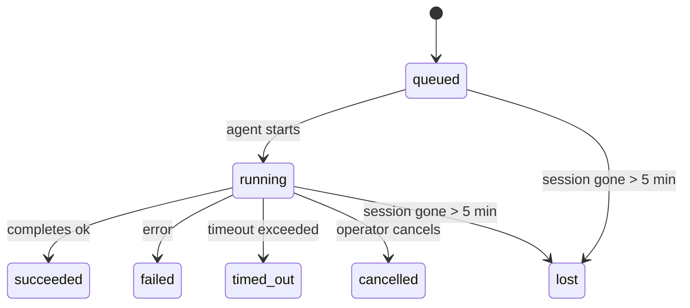

# 背景任務

> **Cron 與 Heartbeat 與 Tasks 的比較？** 請參閱 [Cron vs Heartbeat](/en/automation/cron-vs-heartbeat) 以選擇合適的排程機制。本頁面涵蓋背景工作的**追蹤**，而非其排程。

背景任務會追蹤在您的主要對話工作階段**之外**執行的工作：
ACP 執行、子代理衍生、獨立 cron 工作執行，以及 CLI 初始的操作。

任務並**不**取代工作階段、cron 工作或心跳——它們是記錄已發生的分離工作、其發生時間及是否成功的**活動帳本**。

<Note>並非每個代理執行都會建立任務。心跳週期和正常的互動式聊天不會。所有的 cron 執行、ACP 衍生、子代理衍生和 CLI 代理指令都會。</Note>

## TL;DR

- 任務是**紀錄**，而非排程器——cron 和 heartbeat 決定工作*何時*執行，任務則追蹤*發生了什麼*。
- ACP、子代理、所有 cron 工作和 CLI 操作都會建立任務。心跳週期則不會。
- 每個任務都會經歷 `queued → running → terminal` (succeeded、failed、timed_out、cancelled 或 lost)。
- 完成通知會直接傳送到頻道，或是排入佇列等待下一次心跳。
- `openclaw tasks list` 顯示所有任務；`openclaw tasks audit` 顯示問題。
- 終端紀錄會保留 7 天，之後會自動修剪。

## 快速開始

```bash
# List all tasks (newest first)
openclaw tasks list

# Filter by runtime or status
openclaw tasks list --runtime acp
openclaw tasks list --status running

# Show details for a specific task (by ID, run ID, or session key)
openclaw tasks show <lookup>

# Cancel a running task (kills the child session)
openclaw tasks cancel <lookup>

# Change notification policy for a task
openclaw tasks notify <lookup> state_changes

# Run a health audit
openclaw tasks audit
```

## 什麼會建立任務

| 來源                 | 執行時期類型 | 建立任務紀錄的時機                   | 預設通知原則 |
| -------------------- | ------------ | ------------------------------------ | ------------ |
| ACP 背景執行         | `acp`        | 衍生子 ACP 工作階段時                | `done_only`  |
| 子代理協調           | `subagent`   | 透過 `sessions_spawn` 衍生子代理時   | `done_only`  |
| Cron 工作 (所有類型) | `cron`       | 每次 cron 執行 (主工作階段和獨立)    | `silent`     |
| CLI 操作             | `cli`        | 透過閘道執行的 `openclaw agent` 指令 | `done_only`  |

主會話 cron 任務預設使用 `silent` 通知策略——它們會建立記錄以供追蹤，但不會產生通知。隔離的 cron 任務也預設為 `silent`，但由於它們在自己的會話中執行，因此更為顯眼。

**不會建立任務的情況：**

- Heartbeat 輪次——主會話；請參閱 [Heartbeat](/en/gateway/heartbeat)
- 一般的互動式聊天輪次
- 直接的 `/command` 回應

## 任務生命週期



| 狀態        | 含義                                      |
| ----------- | ----------------------------------------- |
| `queued`    | 已建立，等待代理程式啟動                  |
| `running`   | 代理程式輪次正在主動執行中                |
| `succeeded` | 成功完成                                  |
| `failed`    | 完成時發生錯誤                            |
| `timed_out` | 超過設定的逾時時間                        |
| `cancelled` | 由操作員透過 `openclaw tasks cancel` 停止 |
| `lost`      | 後端子會話消失（在 5 分鐘寬限期後偵測到） |

狀態轉換會自動發生——當關聯的代理程式執行結束時，任務狀態會隨之更新。

## 傳遞與通知

當任務達到終止狀態時，OpenClaw 會通知您。有兩種傳遞路徑：

**直接傳遞** —— 如果任務具有頻道目標（即 `requesterOrigin`），完成訊息會直接傳送到該頻道（Telegram、Discord、Slack 等）。

**會話佇列傳遞** —— 如果直接傳遞失敗或未設定來源，更新會作為系統事件在請求者的會話中排隊，並在下次 heartbeat 時顯示。

<Tip>任務完成會觸發立即的 heartbeat 喚醒，以便您快速看到結果——您無需等待下一次排定的 heartbeat 滴答聲。</Tip>

### 通知策略

控制您對每個任務的接收程度：

| 策略               | 傳遞內容                                     |
| ------------------ | -------------------------------------------- |
| `done_only` (預設) | 僅限終止狀態（成功、失敗等）——**這是預設值** |
| `state_changes`    | 每次狀態轉換和進度更新                       |
| `silent`           | 完全沒有通知                                 |

在任務執行期間變更策略：

```bash
openclaw tasks notify <lookup> state_changes
```

## CLI 參考

### `tasks list`

```bash
openclaw tasks list [--runtime <acp|subagent|cron|cli>] [--status <status>] [--json]
```

輸出欄位：Task ID、Kind、Status、Delivery、Run ID、Child Session、Summary。

### `tasks show`

```bash
openclaw tasks show <lookup>
```

查詢令牌接受任務 ID、運行 ID 或會話金鑰。顯示完整記錄，包括時間、傳遞狀態、錯誤和終端摘要。

### `tasks cancel`

```bash
openclaw tasks cancel <lookup>
```

對於 ACP 和子代理任務，這會終止子會話。狀態轉換為 `cancelled` 並發送傳遞通知。

### `tasks notify`

```bash
openclaw tasks notify <lookup> <done_only|state_changes|silent>
```

### `tasks audit`

```bash
openclaw tasks audit [--json]
```

顯示操作問題。當檢測到問題時，發現結果也會出現在 `openclaw status` 中。

| 發現                      | 嚴重性 | 觸發條件                        |
| ------------------------- | ------ | ------------------------------- |
| `stale_queued`            | 警告   | 已排隊超過 10 分鐘              |
| `stale_running`           | 錯誤   | 執行超過 30 分鐘                |
| `lost`                    | 錯誤   | 支援會話已消失                  |
| `delivery_failed`         | 警告   | 傳遞失敗且通知策略不是 `silent` |
| `missing_cleanup`         | 警告   | 沒有清理時間戳記的終端任務      |
| `inconsistent_timestamps` | 警告   | 時間線違規（例如在開始前結束）  |

## 聊天任務看板 (`/tasks`)

在任何聊天會話中使用 `/tasks` 以查看與該會話連結的背景任務。看板顯示
活動和最近完成的任務，以及執行時間、狀態、時間進度和錯誤詳情。

當前會話沒有可見的連結任務時，`/tasks` 會回退到代理本機任務計數
，因此您仍然可以獲得概覽而不會洩露其他會話的詳情。

若要查看完整的操作員分類帳，請使用 CLI：`openclaw tasks list`。

## 狀態整合（任務壓力）

`openclaw status` 包含一目瞭然的任務摘要：

```
Tasks: 3 queued · 2 running · 1 issues
```

摘要報告：

- **active** — `queued` + `running` 的計數
- **failures** — `failed` + `timed_out` + `lost` 的計數
- **byRuntime** — 按 `acp`、`subagent`、`cron`、`cli` 細分

`/status` 和 `session_status` 工具都使用一種具有清理感知的任務快照：優先顯示活動任務，隱藏過時的已完成行，且僅當沒有活動工作時才顯示最近的失敗。這使狀態卡片能專注於當前重要的事項。

## 儲存與維護

### 任務儲存位置

任務記錄持久化儲存在 SQLite 的以下位置：

```
$OPENCLAW_STATE_DIR/tasks/runs.sqlite
```

註冊表會在閘道啟動時載入到記憶體中，並將寫入同步到 SQLite 以確保重新啟動後的持久性。

### 自動維護

清理程式每 **60 秒** 執行一次並處理三件事：

1. **調和** — 檢查活動任務的底層會話是否仍然存在。如果子會話已消失超過 5 分鐘，該任務將被標記為 `lost`。
2. **清理標記** — 在終端任務上設定 `cleanupAfter` 時間戳記 (endedAt + 7 天)。
3. **修剪** — 刪除超過其 `cleanupAfter` 日期的記錄。

**保留期限**：終端任務記錄將保留 **7 天**，之後會自動修剪。無需配置。

## 任務與其他系統的關係

### 任務與舊版流程參考

一些較舊的 OpenClaw 版本說明和文件將任務管理稱為 `ClawFlow`，並記錄了 `openclaw flows` 指令介面。

在目前的程式碼庫中，支援的操作員介面是 `openclaw tasks`。請參閱 [ClawFlow](/en/automation/clawflow) 和 [CLI: flows](/en/cli/flows) 瞭解相容性說明，這些說明將那些較舊的參考對應到目前的任務指令。

### 任務與 cron

cron 工作 **定義** 儲存在 `~/.openclaw/cron/jobs.json` 中。**每次** cron 執行都會建立一個任務記錄 — 包括主會話和隔離模式。主會話 cron 任務預設使用 `silent` 通知策略，以便它們進行追蹤而不產生通知。

請參閱 [Cron Jobs](/en/automation/cron-jobs)。

### 任務與心跳

心跳執行是主會話輪次 — 它們不建立任務記錄。當任務完成時，它可以觸發心跳喚醒，以便您即時查看結果。

請參閱 [Heartbeat](/en/gateway/heartbeat)。

### 任務與會話

任務可能會引用 `childSessionKey`（工作執行的地方）和 `requesterSessionKey`（啟動它的人）。Session 是對話語境；任務是在此基礎上的活動追蹤。

### 任務與 Agent 執行

任務的 `runId` 連結到執行工作的 agent 執行個體。Agent 生命週期事件（開始、結束、錯誤）會自動更新任務狀態 — 您無需手動管理生命週期。

## 相關

- [Automation Overview](/en/automation) — 自動化機制一覽
- [ClawFlow](/en/automation/clawflow) — 舊版文件和發行說明的相容性說明
- [Cron Jobs](/en/automation/cron-jobs) — 排程背景工作
- [Cron vs Heartbeat](/en/automation/cron-vs-heartbeat) — 選擇合適的機制
- [Heartbeat](/en/gateway/heartbeat) — 週期性主會話輪次
- [CLI: flows](/en/cli/flows) — 錯誤指令名稱的相容性說明
- [CLI: Tasks](/en/cli/index#tasks) — CLI 指令參考
