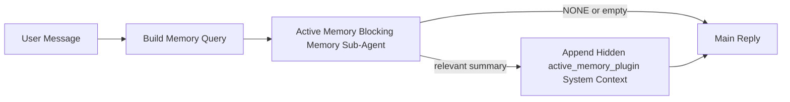

# 主動記憶

主動記憶是一個可選的外掛擁有的阻斷式記憶子代理，它會在符合條件的對話會話產生主要回覆之前執行。

它的存在是因為大多數記憶系統雖然強大但卻是被動的。它們依賴主要代理來決定何時搜尋記憶，或是依賴使用者說出「記住這個」或「搜尋記憶」之類的話。到那時，記憶本來能讓回覆顯得自然的時機已經錯過了。

主動記憶給予系統一個有限的機會，在產生主要回覆之前浮現相關記憶。

## 將此貼上到您的代理

如果您希望使用包含式且預設安全的設定來啟用主動記憶，請將此貼上到您的代理中：

```json5
{
  plugins: {
    entries: {
      "active-memory": {
        enabled: true,
        config: {
          enabled: true,
          agents: ["main"],
          allowedChatTypes: ["direct"],
          modelFallbackPolicy: "default-remote",
          queryMode: "recent",
          promptStyle: "balanced",
          timeoutMs: 15000,
          maxSummaryChars: 220,
          persistTranscripts: false,
          logging: true,
        },
      },
    },
  },
}
```

這會為 `main` 代理啟用此外掛，預設將其限制在直接訊息風格的會話中，讓它優先繼承目前的會話模型，並且如果沒有明確或繼承的模型可用，仍然允許內建遠端後備機制。

之後，重新啟動閘道：

```bash
node scripts/run-node.mjs gateway --profile dev
```

若要在對話中即時檢查它：

```text
/verbose on
```

## 開啟主動記憶

最安全的設定是：

1. 啟用外掛
2. 指定一個對話代理
3. 僅在調整期間開啟日誌

首先在 `openclaw.json` 中開始：

```json5
{
  plugins: {
    entries: {
      "active-memory": {
        enabled: true,
        config: {
          agents: ["main"],
          allowedChatTypes: ["direct"],
          modelFallbackPolicy: "default-remote",
          queryMode: "recent",
          promptStyle: "balanced",
          timeoutMs: 15000,
          maxSummaryChars: 220,
          persistTranscripts: false,
          logging: true,
        },
      },
    },
  },
}
```

然後重新啟動閘道：

```bash
node scripts/run-node.mjs gateway --profile dev
```

這代表：

- `plugins.entries.active-memory.enabled: true` 啟用外掛
- `config.agents: ["main"]` 僅選擇 `main` 代理使用主動記憶
- `config.allowedChatTypes: ["direct"]` 預設僅對直接訊息風格的會話保持主動記憶開啟
- 如果未設定 `config.model`，主動記憶會優先繼承目前的會話模型
- `config.modelFallbackPolicy: "default-remote"` 在沒有明確或繼承的模型可用時，將內建遠端後備機制保持為預設值
- `config.promptStyle: "balanced"` 使用預設的通用提示樣式進行 `recent` 模式
- 主動記憶仍然僅在符合條件的互動式持久聊天會話上執行

## 如何查看它

Active memory 會為模型注入隱藏的系統上下文。它不會向客戶端公開原始 `<active_memory_plugin>...</active_memory_plugin>` 標籤。

## Session toggle

當您想要暫停或恢復目前聊天工作階段的 active memory 而不編輯設定時，請使用外掛程式指令：

```text
/active-memory status
/active-memory off
/active-memory on
```

這是工作階段範圍的。它不會改變
`plugins.entries.active-memory.enabled`、代理程式目標或其他全域
組態。

如果您希望該指令寫入設定並針對所有工作階段暫停或恢復 active memory，請使用明確的全域形式：

```text
/active-memory status --global
/active-memory off --global
/active-memory on --global
```

全域形式會寫入 `plugins.entries.active-memory.config.enabled`。它會讓
`plugins.entries.active-memory.enabled` 保持開啟，以便稍後可以使用該指令
重新開啟 active memory。

如果您想要查看 active memory 在即時工作階段中的運作情況，請為該工作階段開啟詳細模式：

```text
/verbose on
```

啟用詳細模式後，OpenClaw 可以顯示：

- active memory 狀態行，例如 `Active Memory: ok 842ms recent 34 chars`
- 可讀的除錯摘要，例如 `Active Memory Debug: Lemon pepper wings with blue cheese.`

這些行源自於提供隱藏系統上下文的同一個 active memory 傳遞過程，但它們是為了人類閱讀而格式化的，而不是公開原始提示標記。

根據預設，阻塞性記憶體子代理程式的文字紀錄是暫時的，並且在執行完成後會被刪除。

範例流程：

```text
/verbose on
what wings should i order?
```

預期的可見回覆形狀：

```text
...normal assistant reply...

🧩 Active Memory: ok 842ms recent 34 chars
🔎 Active Memory Debug: Lemon pepper wings with blue cheese.
```

## When it runs

Active memory 使用兩個閘門：

1. **Config opt-in**
   必須啟用外掛程式，並且目前的代理程式 id 必須出現在
   `plugins.entries.active-memory.config.agents` 中。
2. **Strict runtime eligibility**
   即使已啟用且有目標，active memory 僅針對符合資格的
   互動式持續性聊天工作階段執行。

實際規則如下：

```text
plugin enabled
+
agent id targeted
+
allowed chat type
+
eligible interactive persistent chat session
=
active memory runs
```

如果其中任何一項失敗，active memory 將不會執行。

## Session types

`config.allowedChatTypes` 控制哪些類型的對話可以執行 Active
Memory。

預設值為：

```json5
allowedChatTypes: ["direct"]
```

這意味著 Active Memory 根據預設在直接訊息風格的工作階段中執行，但不會在群組或頻道工作階段中執行，除非您明確選擇加入。

範例：

```json5
allowedChatTypes: ["direct"]
```

```json5
allowedChatTypes: ["direct", "group"]
```

```json5
allowedChatTypes: ["direct", "group", "channel"]
```

## Where it runs

Active memory 是一個對話式增強功能，而不是平台範圍的推論功能。

| Surface                                                             | Runs active memory?                                     |
| ------------------------------------------------------------------- | ------------------------------------------------------- |
| Control UI / web chat persistent sessions                           | Yes, if the plugin is enabled and the agent is targeted |
| Other interactive channel sessions on the same persistent chat path | Yes, if the plugin is enabled and the agent is targeted |
| 無介面單次執行                                                      | 否                                                      |
| 心跳/背景執行                                                       | 否                                                      |
| 通用內部 `agent-command` 路徑                                       | 否                                                      |
| 子代理程式/內部協助程式執行                                         | 否                                                      |

## 為何使用它

在以下情況使用主動記憶：

- 對話階段是持續性且面向使用者的
- 代理程式有意義的長期記憶可供搜尋
- 連續性和個人化比原始提示詞決定性更重要

它特別適用於：

- 穩定的偏好
- 經常性的習慣
- 應自然浮現的長期使用者情境

它非常不適用於：

- 自動化
- 內部工作程式
- 單次 API 任務
- 隱藏的個人化會令人感到意外的地方

## 運作方式

執行時期形態如下：



阻斷式記憶子代理程式僅能使用：

- `memory_search`
- `memory_get`

如果連結薄弱，它應該回傳 `NONE`。

## 查詢模式

`config.queryMode` 控制阻斷式記憶子代理程式能看到多少對話內容。

## 提示詞樣式

`config.promptStyle` 控制阻斷式記憶子代理程式
在決定是否回傳記憶時的積極或嚴格程度。

可用樣式：

- `balanced`：`recent` 模式的通用預設值
- `strict`：最不積極；當您希望鄰近情境的干擾極少時最佳
- `contextual`：最利於連續性；當對話歷史記錄更重要時最佳
- `recall-heavy`：更願意在較軟但仍合理的匹配上浮現記憶
- `precision-heavy`：積極偏好 `NONE`，除非匹配明顯
- `preference-only`：針對最愛、習慣、常規、品味和經常性個人事實進行最佳化

當 `config.promptStyle` 未設定時的預設對應：

```text
message -> strict
recent -> balanced
full -> contextual
```

如果您明確設定 `config.promptStyle`，則該覆寫值優先。

範例：

```json5
promptStyle: "preference-only"
```

## 模型後援原則

如果未設定 `config.model`，主動記憶會嘗試依以下順序解析模型：

```text
explicit plugin model
-> current session model
-> agent primary model
-> optional built-in remote fallback
```

`config.modelFallbackPolicy` 控制最後一個步驟。

預設值：

```json5
modelFallbackPolicy: "default-remote"
```

其他選項：

```json5
modelFallbackPolicy: "resolved-only"
```

如果沒有可用的明確或繼承模型，而且您希望 Active Memory 跳過檢索而不是回退到內建的遠端預設，請使用 `resolved-only`。

## 進階逃生門

這些選項刻意不包含在推薦設定中。

`config.thinking` 可以覆寫阻斷式記憶子代理的思考層級：

```json5
thinking: "medium"
```

預設值：

```json5
thinking: "off"
```

請勿預設啟用此功能。Active Memory 在回覆路徑中運作，因此額外的思考時間會直接增加使用者可見的延遲。

`config.promptAppend` 會在預設 Active Memory 提示之後、對話內容之前，新增額外的操作員指示：

```json5
promptAppend: "Prefer stable long-term preferences over one-off events."
```

`config.promptOverride` 會取代預設的 Active Memory 提示。OpenClaw 仍會在之後附加對話內容：

```json5
promptOverride: "You are a memory search agent. Return NONE or one compact user fact."
```

除非您刻意測試不同的檢索合約，否則不建議自訂提示。預設提示經過調整，可傳回 `NONE` 或給主模型的精簡使用者事實內容。

### `message`

僅傳送最新的使用者訊息。

```text
Latest user message only
```

在以下情況使用：

- 您想要最快的行為
- 您想要最強的穩定偏好檢索偏誤
- 後續回合不需要對話內容

建議逾時：

- 從 `3000` 到 `5000` 毫秒左右開始

### `recent`

會傳送最新的使用者訊息以及少量最近的對話尾部。

```text
Recent conversation tail:
user: ...
assistant: ...
user: ...

Latest user message:
...
```

在以下情況使用：

- 您想要速度與對話基礎之間取得更好的平衡
- 後續問題通常取決於最後幾個回合

建議逾時：

- 從 `15000` 毫秒左右開始

### `full`

完整的對話會傳送到阻斷式記憶子代理。

```text
Full conversation context:
user: ...
assistant: ...
user: ...
...
```

在以下情況使用：

- 最強的檢索品質比延遲更重要
- 對話包含回溯很遠的重要設定

建議逾時：

- 與 `message` 或 `recent` 相比，大幅增加
- 從 `15000` 毫秒或更高開始，視執行緒大小而定

一般來說，逾時應隨內容大小增加：

```text
message < recent < full
```

## 文字記錄持久性

Active memory 封鎖式記憶子代理執行會在封鎖式記憶子代理呼叫期間建立一個真實的 `session.jsonl`
transcript。

預設情況下，該文字記錄是暫時的：

- 它會被寫入到一個暫存目錄
- 它僅用於封鎖式記憶子代理的執行
- 它會在執行完成後立即刪除

如果您想要將那些封鎖式記憶子代理的文字記錄保留在磁碟上以進行除錯或
檢查，請明確開啟持續性（persistence）：

```json5
{
  plugins: {
    entries: {
      "active-memory": {
        enabled: true,
        config: {
          agents: ["main"],
          persistTranscripts: true,
          transcriptDir: "active-memory",
        },
      },
    },
  },
}
```

啟用後，active memory 會將文字記錄儲存在
目標代理的 sessions 資料夾下的一個獨立目錄中，而不是在主要使用者對話的記錄
路徑中。

預設的佈局概念上如下：

```text
agents/<agent>/sessions/active-memory/<blocking-memory-sub-agent-session-id>.jsonl
```

您可以使用 `config.transcriptDir` 來變更相對子目錄。

請小心使用：

- 封鎖式記憶子代理的文字記錄可能會在繁忙的對話中快速累積
- `full` 查詢模式可能會複製大量的對話上下文
- 這些文字記錄包含隱藏的提示上下文和召回的記憶

## 設定

所有 active memory 設定都位於：

```text
plugins.entries.active-memory
```

最重要的欄位是：

| 鍵                          | 類型                                                                                                 | 含義                                                                           |
| --------------------------- | ---------------------------------------------------------------------------------------------------- | ------------------------------------------------------------------------------ |
| `enabled`                   | `boolean`                                                                                            | 啟用外掛本身                                                                   |
| `config.agents`             | `string[]`                                                                                           | 可使用 active memory 的代理 ID                                                 |
| `config.model`              | `string`                                                                                             | 選用的封鎖式記憶子代理模型參照；未設定時，active memory 使用目前的工作階段模型 |
| `config.queryMode`          | `"message" \| "recent" \| "full"`                                                                    | 控制封鎖式記憶子代理能看到多少對話內容                                         |
| `config.promptStyle`        | `"balanced" \| "strict" \| "contextual" \| "recall-heavy" \| "precision-heavy" \| "preference-only"` | 控制封鎖式記憶子代理在決定是否傳回記憶時的積極或嚴格程度                       |
| `config.thinking`           | `"off" \| "minimal" \| "low" \| "medium" \| "high" \| "xhigh" \| "adaptive"`                         | 封鎖式記憶子代理的進階思考覆寫；預設為 `off` 以提升速度                        |
| `config.promptOverride`     | `string`                                                                                             | 進階的完整提示替換；不建議正常使用                                             |
| `config.promptAppend`       | `string`                                                                                             | 附加到預設或覆寫提示的進階額外指令                                             |
| `config.timeoutMs`          | `number`                                                                                             | 阻斷式記憶子代理的強制逾時時間                                                 |
| `config.maxSummaryChars`    | `number`                                                                                             | 主動記憶摘要中允許的最大總字元數                                               |
| `config.logging`            | `boolean`                                                                                            | 微調時輸出主動記憶日誌                                                         |
| `config.persistTranscripts` | `boolean`                                                                                            | 將阻斷式記憶子代理的逐字稿保留在磁碟上，而不是刪除暫存檔案                     |
| `config.transcriptDir`      | `string`                                                                                             | 代理工作階段資料夾下的相對阻斷式記憶子代理逐字稿目錄                           |

有用的微調欄位：

| 鍵                            | 類型     | 含義                                                |
| ----------------------------- | -------- | --------------------------------------------------- |
| `config.maxSummaryChars`      | `number` | 主動記憶摘要中允許的最大總字元數                    |
| `config.recentUserTurns`      | `number` | 當 `queryMode` 為 `recent` 時要包含的先前使用者輪次 |
| `config.recentAssistantTurns` | `number` | 當 `queryMode` 為 `recent` 時要包含的先前助理輪次   |
| `config.recentUserChars`      | `number` | 每個近期使用者輪次的最大字元數                      |
| `config.recentAssistantChars` | `number` | 每個近期助理輪次的最大字元數                        |
| `config.cacheTtlMs`           | `number` | 重複相同查詢的快取重複使用                          |

## 建議設定

從 `recent` 開始。

```json5
{
  plugins: {
    entries: {
      "active-memory": {
        enabled: true,
        config: {
          agents: ["main"],
          queryMode: "recent",
          promptStyle: "balanced",
          timeoutMs: 15000,
          maxSummaryChars: 220,
          logging: true,
        },
      },
    },
  },
}
```

如果您想在微調時檢查即時行為，請在工作階段中使用 `/verbose on`，而不是尋找單獨的主動記憶偵錯指令。

然後移至：

- `message` 如果您想要更低的延遲
- `full` 如果您認為額外的語境值得以較慢的阻斷式記憶子代理為代價

## 偵錯

如果主動記憶沒有顯示在您預期的位置：

1. 確認外掛程式已在 `plugins.entries.active-memory.enabled` 下啟用。
2. 確認目前的代理 ID 已列在 `config.agents` 中。
3. 確認您是透過互動式持續聊天工作階段進行測試。
4. 打開 `config.logging: true` 並監視 gateway 日誌。
5. 使用 `openclaw memory status --deep` 驗證記憶體搜尋本身是否正常運作。

如果記憶體命中結果雜訊過多，請調緊：

- `maxSummaryChars`

如果主動記憶體太慢：

- 降低 `queryMode`
- 降低 `timeoutMs`
- 減少最近的輪次計數
- 降低每輪字數上限

## 相關頁面

- [記憶體搜尋](/en/concepts/memory-search)
- [記憶體設定參考](/en/reference/memory-config)
- [Plugin SDK 設定](/en/plugins/sdk-setup)
