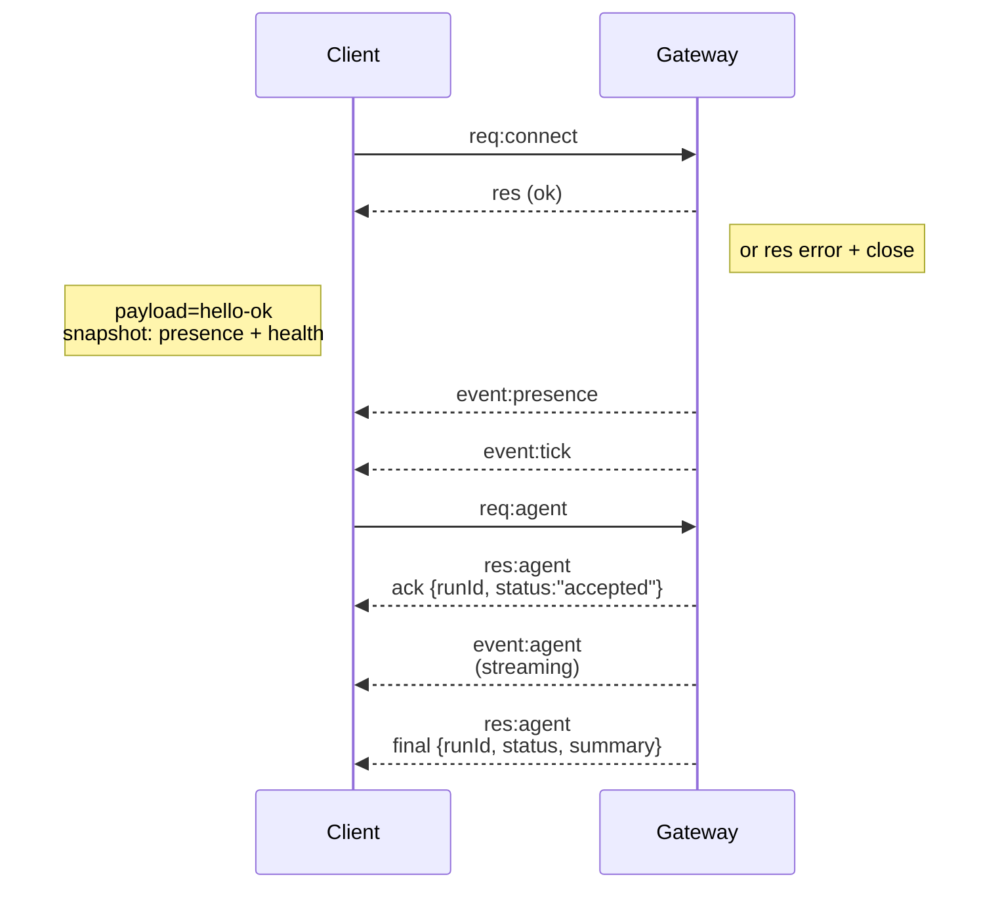

# 閘道架構

## 概觀

- 單一長壽命的 **Gateway（閘道）** 擁有所有訊息介面（WhatsApp 透過 Baileys、Telegram 透過 grammY、Slack、Discord、Signal、iMessage、WebChat）。
- 控制平面客戶端（macOS app、CLI、web UI、自動化工具）透過 **WebSocket** 連接到設定綁定主機上的 Gateway（預設為 `127.0.0.1:18789`）。
- **Nodes（節點）**（macOS/iOS/Android/headless）也透過 **WebSocket** 連接，但會使用明確的 capabilities/commands 宣告 `role: node`。
- 每台主機一個 Gateway；這是開啟 WhatsApp 會話的唯一位置。
- **canvas host** 由 Gateway HTTP 伺服器提供，位於：
  - `/__openclaw__/canvas/` （代理人可編輯的 HTML/CSS/JS）
  - `/__openclaw__/a2ui/` (A2UI host)
    它使用與 Gateway 相同的連接埠（預設為 `18789`）。

## 元件與流程

### Gateway (daemon)

- 維護提供者連線。
- 公開具類型的 WS API（請求、回應、伺服器推送事件）。
- 根據 JSON Schema 驗證輸入框架。
- 發出如 `agent`、`chat`、`presence`、`health`、`heartbeat`、`cron` 等事件。

### 用戶端 (mac app / CLI / web admin)

- 每個用戶端一個 WS 連線。
- 發送請求（`health`、`status`、`send`、`agent`、`system-presence`）。
- 訂閱事件 (`tick`, `agent`, `presence`, `shutdown`)。

### 節點 (macOS / iOS / Android / headless)

- 使用 `role: node` 連接到**相同的 WS 伺服器**。
- 在 `connect` 中提供裝置身分識別；配對是**基於裝置的** (角色 `node`)，且
  核准資訊存在於裝置配對存放區中。
- 公開諸如 `canvas.*`, `camera.*`, `screen.record`, `location.get` 等指令。

協議細節：

- [Gateway 協議](/zh-Hant/gateway/protocol)

### WebChat

- 使用 Gateway WS API 進行聊天歷史記錄和發送訊息的靜態 UI。
- 在遠端設定中，透過與其他用戶端相同的 SSH/Tailscale 隧道進行連線。

## 連線生命週期 (單一用戶端)



## Wire protocol (摘要)

- 傳輸：WebSocket，具有 JSON 負載的文字框架。
- 第一個框架**必須**是 `connect`。
- 交握後：
  - 請求：`{type:"req", id, method, params}` → `{type:"res", id, ok, payload|error}`
  - 事件：`{type:"event", event, payload, seq?, stateVersion?}`
- 如果設定了 `OPENCLAW_GATEWAY_TOKEN` (或 `--token`)，`connect.params.auth.token` 必須相符，否則 socket 會關閉。
- 具有副作用的方法 (`send`, `agent`) 需要等冪性金鑰才能安全重試；伺服器會保留短期去重快取。
- 節點必須在 `connect` 中包含 `role: "node"` 以及 caps/commands/permissions。

## 配對 + 本機信任

- 所有 WS 用戶端 (運營商 + 節點) 都在 `connect` 上包含**裝置識別** (device identity)。
- 新裝置 ID 需要配對批准；Gateway 會發出 **device token**
  以供後續連線。
- **Local** 連線（loopback 或 gateway 主機自己的 tailnet 位址）可以
  自動批准，以保持同主機的 UX 順暢。
- 所有連線必須對 `connect.challenge` nonce 進行簽署。
- 簽署載荷 `v3` 也會綁定 `platform` + `deviceFamily`；gateway
  會在重新連線時鎖定配對的元資料，並要求對元資料變更進行修復配對。
- **Non‑local** 連線仍然需要明確批准。
- Gateway 驗證 (`gateway.auth.*`) 仍然適用於 **所有** 連線，無論是本機還是
  遠端。

詳情：[Gateway protocol](/zh-Hant/gateway/protocol)、[Pairing](/zh-Hant/channels/pairing)、
[Security](/zh-Hant/gateway/security)。

## Protocol typing and codegen

- TypeBox schemas 定義了協議。
- JSON Schema 從這些 schemas 生成。
- Swift 模型從 JSON Schema 生成。

## 遠端存取

- 首選：Tailscale 或 VPN。
- 替代方案：SSH tunnel

  ```exec
  ssh -N -L 18789:127.0.0.1:18789 user@host
  ```

- 透過 tunnel 時使用相同的握手 + auth token。
- 在遠端設置中，可以為 WS 啟用 TLS + 選用的 pinning。

## 運作快照

- 啟動：`openclaw gateway`（前景，日誌輸出至 stdout）。
- 健康狀態：透過 WS 執行 `health`（也包含在 `hello-ok` 中）。
- 監控：使用 launchd/systemd 進行自動重啟。

## 不變性

- 每台主機上確實只有一個 Gateway 控制單一 Baileys session。
- 握手是強制性的；任何非 JSON 或非連接的第一幀都會導致強制關閉。
- 事件不會重播；客戶端必須在發生間隙時重新整理。
