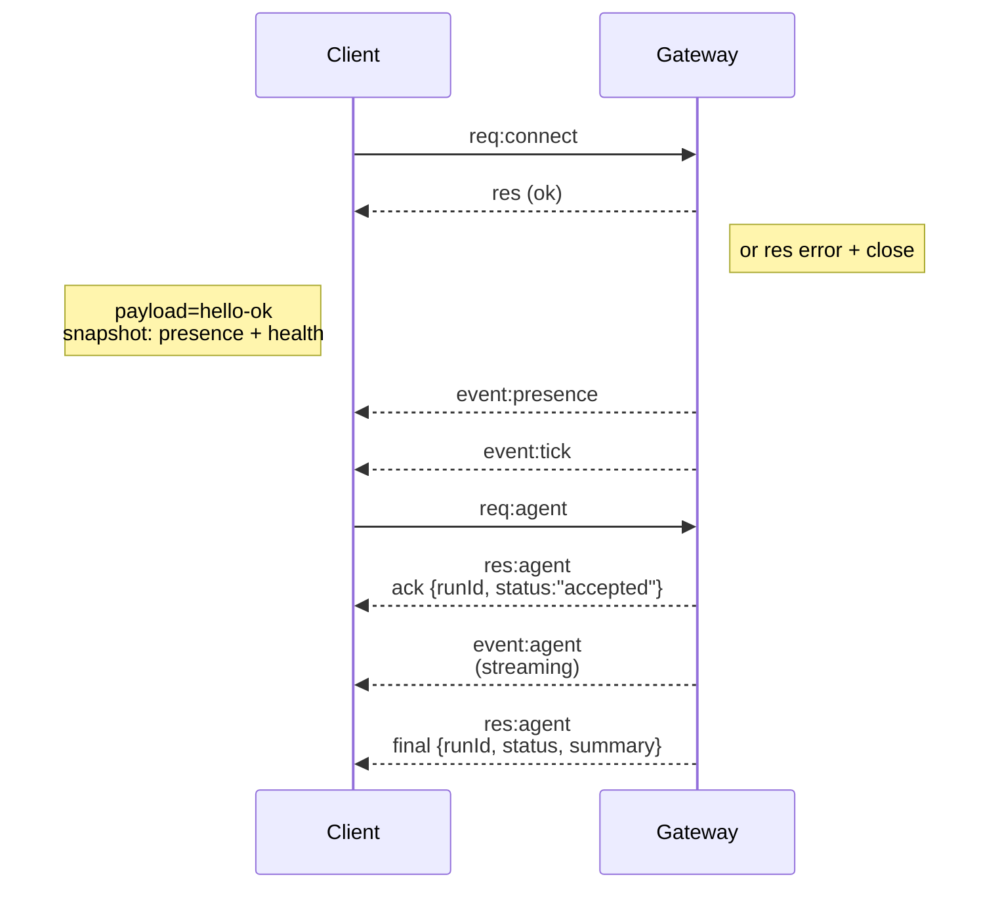

# 閘道架構

## 概觀

- 單一長期存活的 **Gateway** 擁有所有訊息介面（透過 Baileys 的 WhatsApp、透過 grammY 的 Telegram、Slack、Discord、Signal、iMessage、WebChat）。
- 控制平面用戶端（macOS 應用程式、CLI、Web UI、自動化）透過 **WebSocket** 連接到閘道，連接至設定的綁定主機（預設為
  `127.0.0.1:18789`）。
- **Nodes** (macOS/iOS/Android/headless) 也透過 **WebSocket** 連線，但
  宣告 `role: node` 並附帶明確的 caps/commands。
- 每個主機一個 Gateway；這是開啟 WhatsApp 會話的唯一位置。
- **canvas host** 由 Gateway HTTP 伺服器提供服務，位於：
  - `/__openclaw__/canvas/` (agent-editable HTML/CSS/JS)
  - `/__openclaw__/a2ui/` (A2UI host)
    它使用與 Gateway 相同的連接埠（預設 `18789`）。

## 元件與流程

### Gateway (daemon)

- 維護提供者連線。
- 公開類型化的 WS API（請求、回應、伺服器推送事件）。
- 根據 JSON Schema 驗證輸入幀。
- 發出諸如 `agent`、`chat`、`presence`、`health`、`heartbeat`、`cron` 的事件。

### 用戶端 (mac app / CLI / web admin)

- 每個用戶端一個 WS 連線。
- 發送請求 (`health`、`status`、`send`、`agent`、`system-presence`)。
- 訂閱事件 (`tick`、`agent`、`presence`、`shutdown`)。

### 節點 (macOS / iOS / Android / headless)

- 使用 `role: node` 連接到 **相同的 WS 伺服器**。
- 在 `connect` 中提供裝置身分識別；配對是 **以裝置為基礎** (role `node`)，且
  核准存儲在裝置配對存儲中。
- 公開指令如 `canvas.*`、`camera.*`、`screen.record`、`location.get`。

協議詳情：

- [Gateway 協議](/en/gateway/protocol)

### WebChat

- 使用 Gateway WS API 進行聊天歷史記錄與發送的靜態 UI。
- 在遠端設置中，透過與其他客戶端相同的 SSH/Tailscale 隧道連接。

## 連接生命週期（單一客戶端）



## 線路協議（摘要）

- 傳輸：WebSocket，帶有 JSON 載荷的文字幀。
- 第一幀**必須**為 `connect`。
- 交握後：
  - 請求：`{type:"req", id, method, params}` → `{type:"res", id, ok, payload|error}`
  - 事件：`{type:"event", event, payload, seq?, stateVersion?}`
- 如果設定了 `OPENCLAW_GATEWAY_TOKEN`（或 `--token`），`connect.params.auth.token`
  必須相符，否則 socket 會關閉。
- 具有副作用的方法（`send`、`agent`）需要冪等性金鑰以便安全重試；伺服器會維護短期的去重快取。
- 節點必須在 `connect` 中包含 `role: "node"` 以及 capabilities/commands/permissions。

## 配對 + 本地信任

- 所有 WS 客戶端（操作員 + 節點）都在 `connect` 上包含**裝置身分**。
- 新的裝置 ID 需要配對批准；Gateway 會發出**裝置權杖**
  供後續連接使用。
- **本地**連接（loopback 或 gateway 主機自身的 tailnet 位址）可以
  自動批准，以保持同主機的使用者體驗順暢。
- 所有連接都必須簽署 `connect.challenge` nonce。
- 簽章載荷 `v3` 也綁定了 `platform` + `deviceFamily`；gateway
  在重新連接時會鎖定配對的元數據，並且對元數據變更需要修復配對。
- **非本地**連接仍需要明確批准。
- Gateway 驗證（`gateway.auth.*`）仍然適用於**所有**連接，無論是本地還是
  遠端。

詳情：[Gateway 協議](/en/gateway/protocol)、[配對](/en/channels/pairing)、
[安全性](/en/gateway/security)。

## 協議類型定義與程式碼生成

- TypeBox schemas 定義協議。
- JSON Schema 是從這些 schemas 生成的。
- Swift 模型是從 JSON Schema 生成的。

## 遠端存取

- 首選：Tailscale 或 VPN。
- 替代方案：SSH 隧道

  ```bash
  ssh -N -L 18789:127.0.0.1:18789 user@host
  ```

- 透過隧道進行連線時，適用相同的握手 + auth token。
- 在遠端設置中，可以為 WS 啟用 TLS + 可選的憑證釘選。

## 操作快照

- 啟動：`openclaw gateway`（前景模式，日誌輸出至 stdout）。
- 健康狀態：透過 WS 傳輸 `health`（也包含在 `hello-ok` 中）。
- 監控：使用 launchd/systemd 進行自動重啟。

## 不變性

- 每個主機上只有一個 Gateway 控制單一 Baileys 工作階段。
- 握手是強制性的；任何非 JSON 或非 connect 的第一幀都會導致強制關閉連線。
- 事件不會重播；客戶端必須在發生遺漏時進行重新整理。
