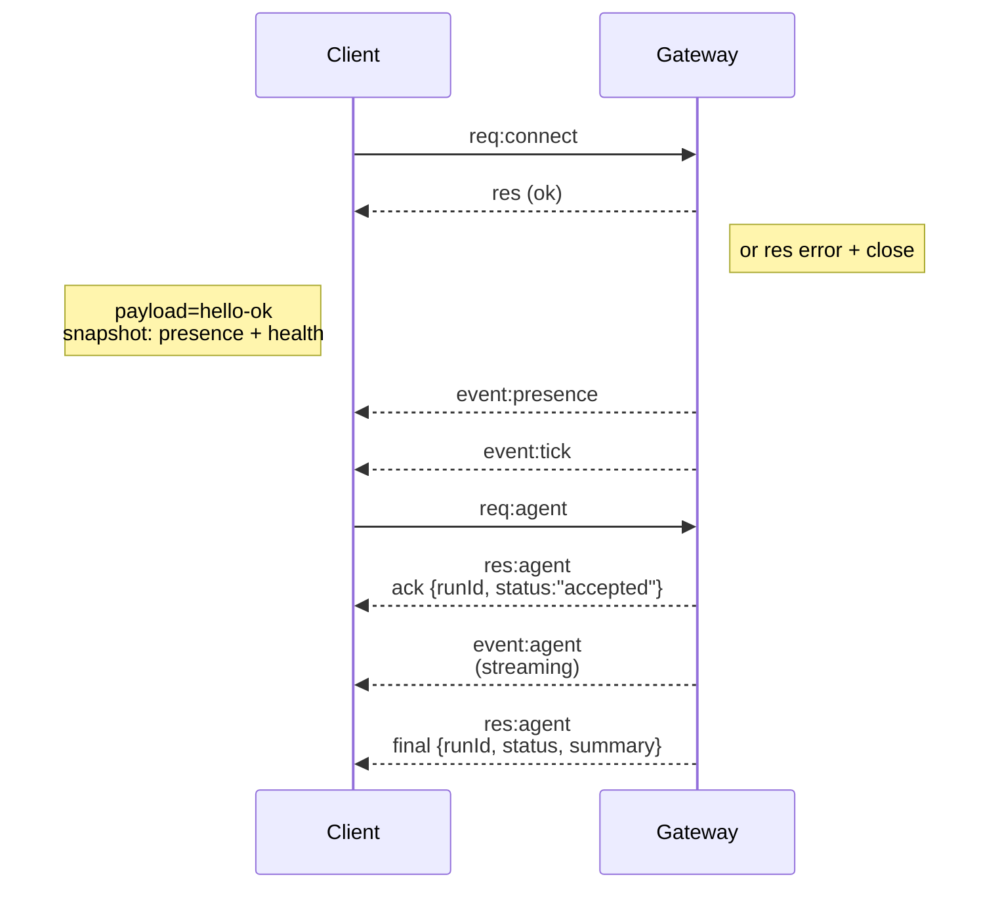

## 概觀

- 單一長期運行的 **Gateway** 擁有所有訊息傳遞介面（WhatsApp 透過 Baileys、Telegram 透過 grammY、Slack、Discord、Signal、iMessage、WebChat）。
- 控制平面用戶端（macOS app、CLI、web UI、自動化）透過 **WebSocket** 連接到設定好的綁定主機（預設為 `127.0.0.1:18789`）上的 Gateway。
- **Nodes** (macOS/iOS/Android/headless) 也透過 **WebSocket** 連接，但聲明 `role: node` 並帶有明確的 capabilities/commands。
- 每個主機一個 Gateway；它是唯一開啟 WhatsApp 會話的地方。
- **canvas host** 由 Gateway HTTP 伺服器提供於：
  - `/__openclaw__/canvas/` (agent-editable HTML/CSS/JS)
  - `/__openclaw__/a2ui/` (A2UI host)
    它使用與 Gateway 相同的連接埠（預設 `18789`）。

## 元件與流程

### Gateway (daemon)

- 維護提供者連線。
- 公開一個具類型的 WS API（請求、回應、伺服器推送事件）。
- 根據 JSON Schema 驗證傳入的框架。
- 發出如 `agent`、`chat`、`presence`、`health`、`heartbeat`、`cron` 等事件。

### 用戶端 (mac app / CLI / web admin)

- 每個用戶端一個 WS 連線。
- 發送請求 (`health`、`status`、`send`、`agent`、`system-presence`)。
- 訂閱事件 (`tick`、`agent`、`presence`、`shutdown`)。

### 節點 (macOS / iOS / Android / headless)

- 使用 `role: node` 連接到 **相同的 WS 伺服器**。
- 在 `connect` 中提供裝置身分；配對是**基於裝置**的（角色 `node`），且核准資訊儲存於裝置配對儲存中。
- 公開如 `canvas.*`、`camera.*`、`screen.record`、`location.get` 等命令。

協議詳情：

- [Gateway 協議](/zh-Hant/gateway/protocol)

### WebChat

- 使用 Gateway WS API 獲取聊天記錄和發送訊息的靜態 UI。
- 在遠端設定中，透過與其他客戶端相同的 SSH/Tailscale 隧道進行連線。

## 連線生命週期（單一客戶端）



## 傳輸協定（摘要）

- 傳輸方式：WebSocket，具有 JSON 載荷的文字幀 (text frames)。
- 第一個幀**必須**是 `connect`。
- 握手後：
  - 請求：`{type:"req", id, method, params}` → `{type:"res", id, ok, payload|error}`
  - 事件：`{type:"event", event, payload, seq?, stateVersion?}`
- `hello-ok.features.methods` / `events` 是探索元數據，而非每個可呼叫輔助路由的生成傾印。
- 共享金鑰驗證使用 `connect.params.auth.token` 或 `connect.params.auth.password`，具體取決於設定的 gateway 驗證模式。
- 承載身分的模式，例如 Tailscale Serve (`gateway.auth.allowTailscale: true`) 或非 loopback `gateway.auth.mode: "trusted-proxy"`，透過請求標頭滿足驗證，而非使用 `connect.params.auth.*`。
- Private-ingress `gateway.auth.mode: "none"` 會完全停用共享金鑰驗證；請勿將該模式暴露於公開/不受信任的入口。
- 具有副作用的方法（`send`、`agent`）需要等冪性金鑰（idempotency keys）以安全地重試；伺服器會維護一個短暫的去重快取。
- 節點必須在 `connect` 中包含 `role: "node"` 以及 capabilities/commands/permissions。

## 配對 + 本機信任

- 所有 WS 客戶端（操作員 + 節點）都必須在 `connect` 上包含 **device identity**（裝置身分）。
- 新的裝置 ID 需要配對批准；Gateway 會針對後續連線發出 **device token**（裝置權杖）。
- 直接的本機 loopback 連線可以自動批准，以保持同主機 UX 的順暢。
- OpenClaw 也有一個狹窄的後端/容器本機自連線路徑，用於受信任的共享金鑰輔助流程。
- Tailnet 和 LAN 連線（包括同主機 tailnet 綁定）仍然需要明確的配對批准。
- 所有連線都必須簽署 `connect.challenge` nonce。
- 簽署載荷 `v3` 也會綁定 `platform` + `deviceFamily`；Gateway 會在重新連線時固定配對的元數據，並要求對元數據變更進行修復配對。
- **非本機**連線仍然需要明確的核准。
- Gateway 驗證 (`gateway.auth.*`) 仍適用於 **所有** 連線，無論是本機還是遠端。

詳情：[Gateway protocol](/zh-Hant/gateway/protocol)、[Pairing](/zh-Hant/channels/pairing)、[Security](/zh-Hant/gateway/security)。

## Protocol typing and codegen

- TypeBox schemas 定義了協定。
- JSON Schema 是根據這些 schemas 產生的。
- Swift 模型是根據 JSON Schema 產生的。

## 遠端存取

- 首選：Tailscale 或 VPN。
- 替代方案：SSH tunnel

  ```bash
  ssh -N -L 18789:127.0.0.1:18789 user@host
  ```

- 相同的 handshake + auth token 適用於 tunnel 連線。
- 在遠端設定中，可以為 WS 啟用 TLS + 可選的 pinning。

## Operations snapshot

- 啟動：`openclaw gateway` (前景模式，日誌輸出至 stdout)。
- 健康檢查：`health` over WS (也包含在 `hello-ok` 中)。
- 監控：使用 launchd/systemd 進行自動重啟。

## 不變性

- 每個主機上，只有一個 Gateway 控制單一 Baileys session。
- 握手是強制性的；任何非 JSON 或非連線的第一幀都會導致強制中斷連線。
- 事件不會重播；客戶端必須在有間隙時重新整理。

## 相關

- [Agent Loop](/zh-Hant/concepts/agent-loop) — 詳細的 agent 執行循環
- [Gateway Protocol](/zh-Hant/gateway/protocol) — WebSocket 協定合約
- [Queue](/zh-Hant/concepts/queue) — 指令佇列與並發
- [Security](/zh-Hant/gateway/security) — 信任模型與加固
