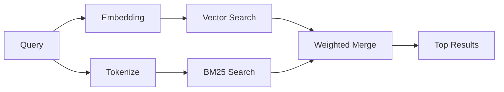

# 記憶體搜尋

`memory_search` 從您的記憶檔案中找出相關筆記，即使措辭與原文不同也能做到。它的運作方式是將記憶索引成小區塊，並使用嵌入、關鍵字或兩者來進行搜尋。

## 快速開始

如果您已設定 GitHub Copilot 訂閱、OpenAI、Gemini、Voyage 或 Mistral
API 金鑰，記憶體搜尋會自動運作。若要明確設定供應商：

```json5
{
  agents: {
    defaults: {
      memorySearch: {
        provider: "openai", // or "gemini", "local", "ollama", etc.
      },
    },
  },
}
```

若要使用沒有 API 金鑰的本機嵌入，請使用 `provider: "local"`（需要 node-llama-cpp）。

## 支援的提供者

| 提供者         | ID               | 需要 API 金鑰 | 備註                        |
| -------------- | ---------------- | ------------- | --------------------------- |
| Bedrock        | `bedrock`        | 否            | 當 AWS 憑證鏈解析時自動偵測 |
| Gemini         | `gemini`         | 是            | 支援圖片/音訊索引           |
| GitHub Copilot | `github-copilot` | 否            | 自動偵測，使用 Copilot 訂閱 |
| 本機           | `local`          | 否            | GGUF 模型，約需下載 0.6 GB  |
| Mistral        | `mistral`        | 是            | 自動偵測                    |
| Ollama         | `ollama`         | 否            | 本地，必須明確設定          |
| OpenAI         | `openai`         | 是            | 自動偵測，快速              |
| Voyage         | `voyage`         | 是            | 自動偵測                    |

## 搜尋運作方式

OpenClaw 並行執行兩個檢索路徑並合併結果：



- **向量搜尋** 尋找語意相似的筆記（例如「gateway host」符合
  「執行 OpenClaw 的機器」）。
- **BM25 關鍵字搜尋** 尋找精確相符項（ID、錯誤字串、設定
  金鑰）。

如果只有一個路徑可用（沒有嵌入或沒有 FTS），另一個會單獨運作。

當嵌入功能無法使用時，OpenClaw 仍會對 FTS 結果使用詞彙排名，而不是僅回退到原始的精確相符排序。這種降級模式會加強查詢詞覆蓋率較高且相關檔案路徑的區塊，即使沒有 `sqlite-vec` 或嵌入供應商，也能保持召回率的實用性。

## 改善搜尋品質

當您有大量的筆記紀錄時，有兩個可選功能可以提供幫助：

### 時間衰減

舊筆記會逐漸失去排名權重，讓最新資訊優先顯示。
使用預設的 30 天半衰期，上個月的筆記得分為其原始權重的
50%。像 `MEMORY.md` 這類常青檔案永不衰減。

<Tip>如果您的代理程式有數月的每日筆記，且過時資訊的排名持續高於近期 情境，請啟用時間衰減。</Tip>

### MMR (多樣性)

減少重複結果。如果有五則筆記都提及相同的路由器設定，MMR
會確保主要結果涵蓋不同的主題，而不是重複出現。

<Tip>如果 `memory_search` 持續從不同的每日筆記傳回近乎重複的 片段，請啟用 MMR。</Tip>

### 同時啟用兩者

```json5
{
  agents: {
    defaults: {
      memorySearch: {
        query: {
          hybrid: {
            mmr: { enabled: true },
            temporalDecay: { enabled: true },
          },
        },
      },
    },
  },
}
```

## 多模態記憶

使用 Gemini Embedding 2，您可以與 Markdown 一起索引圖像和音訊檔案。搜尋查詢仍為文字，但它們會與視覺和音訊內容進行比對。請參閱 [Memory configuration reference](/zh-Hant/reference/memory-config) 以了解設定方式。

## Session memory search

您可以選擇性地索引 session 轉錄內容，以便 `memory_search` 能夠回憶先前的對話。這是透過
`memorySearch.experimental.sessionMemory` 選擇加入的功能。詳情請參閱
[configuration reference](/zh-Hant/reference/memory-config)。

## 疑難排解

**沒有結果？** 執行 `openclaw memory status` 以檢查索引。如果是空的，請執行
`openclaw memory index --force`。

**只有關鍵字符合？** 您的 embedding provider 可能尚未設定。請檢查
`openclaw memory status --deep`。

**找不到 CJK 文字？** 使用
`openclaw memory index --force` 重建 FTS 索引。

## 延伸閱讀

- [Active Memory](/zh-Hant/concepts/active-memory) -- 用於互動式聊天會話的子代理程式記憶體
- [Memory](/zh-Hant/concepts/memory) -- 檔案佈局、後端、工具
- [Memory configuration reference](/zh-Hant/reference/memory-config) -- 所有設定選項
