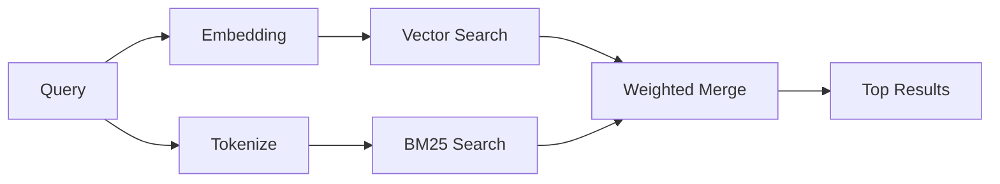

`memory_search` 會從您的記憶檔案中找出相關筆記，即使措辭與原文不同。其運作方式是將記憶索引成小區塊，並使用嵌入、關鍵字或兩者結合來進行搜尋。

## 快速開始

記憶搜尋預設使用 OpenAI 嵌入。若要使用其他嵌入後端，請明確設定供應商：

```json5
{
  agents: {
    defaults: {
      memorySearch: {
        provider: "openai", // or "gemini", "local", "ollama", "openai-compatible", etc.
      },
    },
  },
}
```

對於具有記憶專用供應商的多端點設定，當該供應商設定 `api: "ollama"` 或其他記憶嵌入適配器擁有者時，`provider` 也可以是自訂 `models.providers.<id>` 項目，例如 `ollama-5080`。

對於沒有 API 金鑰的本機嵌入，請設定 `provider: "local"`。來源檢出
可能仍需要原生建置核准：`pnpm approve-builds` 然後
`pnpm rebuild node-llama-cpp`。

某些與 OpenAI 相容的嵌入端點需要非對稱標籤，例如用於搜尋的 `input_type: "query"` 和用於索引區塊的 `input_type: "document"` 或 `"passage"`。使用 `memorySearch.queryInputType` 和 `memorySearch.documentInputType` 進行設定；請參閱 [記憶設定參考](/zh-Hant/reference/memory-config#provider-specific-config)。

## 支援的供應商

| 供應商         | ID                  | 需要 API 金鑰 | 備註                          |
| -------------- | ------------------- | ------------- | ----------------------------- |
| Bedrock        | `bedrock`           | 否            | 使用 AWS 憑證鏈               |
| DeepInfra      | `deepinfra`         | 是            | 預設： `BAAI/bge-m3`          |
| Gemini         | `gemini`            | 是            | 支援圖片/音訊索引             |
| GitHub Copilot | `github-copilot`    | 否            | 使用 Copilot 訂閱             |
| 本機           | `local`             | 否            | GGUF 模型，約 0.6 GB 下載大小 |
| Mistral        | `mistral`           | 是            |                               |
| Ollama         | `ollama`            | 否            | 本機/自託管                   |
| OpenAI         | `openai`            | 是            | 預設                          |
| OpenAI 相容    | `openai-compatible` | 通常          | 通用 `/v1/embeddings`         |
| Voyage         | `voyage`            | 是            |                               |

## 搜尋運作方式

OpenClaw 並行執行兩條檢索路徑並合併結果：



- **向量搜尋** 尋找具有相似含義的筆記（"gateway host" 符合
  "the machine running OpenClaw"）。
- **BM25 關鍵字搜尋** 尋找完全匹配項（ID、錯誤字串、設定
  鍵）。

如果只有一條路徑可用（沒有嵌入或沒有 FTS），則另一條路徑單獨執行。

當嵌入不可用時，OpenClaw 仍會對 FTS 結果使用詞彙排序，而不是僅回退到原始的完全匹配排序。這種降級模式會提升查詢詞覆蓋率更強且相關檔案路徑的區塊，這使得即使沒有 `sqlite-vec` 或嵌入供應商，召回率仍然有用。

## 改善搜尋品質

當您有大量筆記歷史記錄時，有兩個可選功能可以提供幫助：

### 時間衰減

舊筆記的排名權重會逐漸降低，以便最新資訊優先顯示。
使用預設的 30 天半衰期，上個月的筆記得分為其原始權重的 50%。像 `MEMORY.md` 這類常青檔案永不衰減。

<Tip>如果您的代理擁有數個月的每日筆記，且過時資訊持續蓋過近期情境，請啟用時間衰減。</Tip>

### MMR (多樣性)

減少重複結果。如果有五則筆記都提及相同的路由器設定，MMR
會確保熱門結果涵蓋不同主題，而不僅是重複內容。

<Tip>如果 `memory_search` 持續從不同的每日筆記傳回近乎重複的片段，請啟用 MMR。</Tip>

### 同時啟用

```json5
{
  agents: {
    defaults: {
      memorySearch: {
        query: {
          hybrid: {
            mmr: { enabled: true },
            temporalDecay: { enabled: true },
          },
        },
      },
    },
  },
}
```

## 多模態記憶

使用 Gemini Embedding 2，您可以將圖片和音訊檔案與 Markdown
一起建立索引。搜尋查詢保持為文字，但會對應到視覺和音訊內容。請參閱 [記憶組態參考](/zh-Hant/reference/memory-config) 以了解設定方式。

## 工作階段記憶搜尋

您可以選擇為工作階段文字記錄建立索引，讓 `memory_search` 能夠
回憶先前的對話。這是透過
`memorySearch.experimental.sessionMemory` 選擇加入的功能。詳情請參閱
[組態參考](/zh-Hant/reference/memory-config)。

## 疑難排解

**沒有結果？** 執行 `openclaw memory status` 檢查索引。如果是空的，請執行
`openclaw memory index --force`。

**只有關鍵字相符？** 您的嵌入提供者可能尚未設定。請檢查
`openclaw memory status --deep`。

**本地嵌入逾時？** `ollama`、`lmstudio` 和 `local` 預設使用較長的
內聯批次逾時時間。如果主機單純只是很慢，請設定
`agents.defaults.memorySearch.sync.embeddingBatchTimeoutSeconds` 並重新執行
`openclaw memory index --force`。

**找不到 CJK 文字？** 使用
`openclaw memory index --force` 重建 FTS 索引。

## 延伸閱讀

- [Active Memory](/zh-Hant/concepts/active-memory) -- 用於互動式聊天工作階段的子代理記憶
- [Memory](/zh-Hant/concepts/memory) -- 檔案佈局、後端、工具
- [Memory configuration reference](/zh-Hant/reference/memory-config) -- 所有組態選項

## 相關內容

- [Memory overview](/zh-Hant/concepts/memory)
- [Active memory](/zh-Hant/concepts/active-memory)
- [內建記憶體引擎](/zh-Hant/concepts/memory-builtin)
