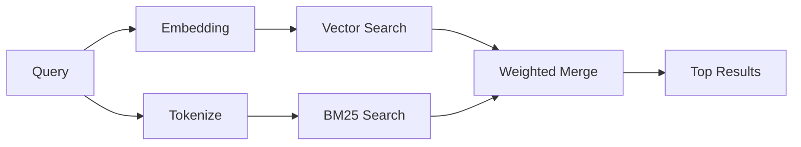

# 記憶體搜尋

`memory_search` 從您的記憶檔案中找出相關筆記，即使措辭與原文不同也能做到。它的運作方式是將記憶索引成小區塊，並使用嵌入、關鍵字或兩者來進行搜尋。

## 快速開始

如果您已設定 OpenAI、Gemini、Voyage 或 Mistral API 金鑰，記憶體搜尋會自動運作。若要明確設定提供者：

```json5
{
  agents: {
    defaults: {
      memorySearch: {
        provider: "openai", // or "gemini", "local", "ollama", etc.
      },
    },
  },
}
```

若要使用沒有 API 金鑰的本機嵌入，請使用 `provider: "local"`（需要 node-llama-cpp）。

## 支援的提供者

| 提供者  | ID        | 需要 API 金鑰 | 備註                          |
| ------- | --------- | ------------- | ----------------------------- |
| OpenAI  | `openai`  | 是            | 自動偵測，快速                |
| Gemini  | `gemini`  | 是            | 支援圖片/音訊索引             |
| Voyage  | `voyage`  | 是            | 自動偵測                      |
| Mistral | `mistral` | 是            | 自動偵測                      |
| Bedrock | `bedrock` | 否            | 當 AWS 憑證鏈解析時自動偵測   |
| Ollama  | `ollama`  | 否            | 本地，必須明確設定            |
| 本地    | `local`   | 否            | GGUF 模型，約 0.6 GB 下載大小 |

## 搜尋運作方式

OpenClaw 並行運行兩個檢索路徑並合併結果：



- **向量搜尋** 尋找含義相似的筆記（例如 "gateway host" 會匹配
  "the machine running OpenClaw"）。
- **BM25 關鍵字搜尋** 尋找完全匹配項（ID、錯誤字串、設定
  鍵）。

如果只有一個路徑可用（沒有嵌入或沒有 FTS），則另一個單獨運行。

## 改善搜尋品質

當您有大量筆記歷史記錄時，有兩個可選功能可以提供幫助：

### 時間衰減

舊筆記會逐漸失去排序權重，因此最近的資訊會優先顯示。
使用預設的 30 天半衰期，上個月的筆記得分為其原始權重的 50%。
像 `MEMORY.md` 這樣的常青檔案永遠不會衰減。

<Tip>如果您的代理程式有數月的每日筆記，且過時資訊持續排在 較新的語境之前，請啟用時間衰減。</Tip>

### MMR（多樣性）

減少冗餘結果。如果五個筆記都提到相同的路由器設定，MMR
會確保頂部結果涵蓋不同的主題，而不是重複。

<Tip>如果 `memory_search` 持續從不同的每日筆記中傳回近乎重複的片段，請啟用 MMR。</Tip>

### 同時啟用

```json5
{
  agents: {
    defaults: {
      memorySearch: {
        query: {
          hybrid: {
            mmr: { enabled: true },
            temporalDecay: { enabled: true },
          },
        },
      },
    },
  },
}
```

## 多模態記憶

使用 Gemini Embedding 2，您可以連同 Markdown 一起索引圖片和音訊檔案。
搜尋查詢仍然是文字，但它們會與視覺和音訊內容進行比對。請參閱
[記憶設定參考](/en/reference/memory-config) 以了解設定方法。

## 會話記憶搜尋

您可以選擇索引會話紀錄，以便 `memory_search` 能夠回憶
先前的對話。這是透過
`memorySearch.experimental.sessionMemory` 的選擇性加入功能。請參閱
[設定參考](/en/reference/memory-config) 了解詳情。

## 疑難排解

**沒有結果？** 執行 `openclaw memory status` 以檢查索引。如果是空的，請執行
`openclaw memory index --force`。

**只有關鍵字相符？** 您的嵌入供應商可能尚未設定。請檢查
`openclaw memory status --deep`。

**找不到 CJK 文字？** 使用
`openclaw memory index --force` 重建 FTS 索引。

## 延伸閱讀

- [記憶](/en/concepts/memory) -- 檔案佈局、後端、工具
- [記憶配置參考](/en/reference/memory-config) -- 所有配置選項
