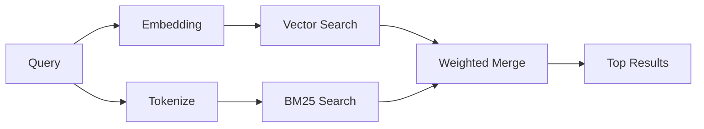

`memory_search` 會從您的記憶檔案中找出相關筆記，即使措辭與原文不同。其運作方式是將記憶索引成小區塊，並使用嵌入、關鍵字或兩者結合來進行搜尋。

## 快速開始

如果您已設定 GitHub Copilot 訂閱、OpenAI、Gemini、Voyage 或 Mistral API 金鑰，記憶搜尋會自動運作。若要明確設定提供者：

```json5
{
  agents: {
    defaults: {
      memorySearch: {
        provider: "openai", // or "gemini", "local", "ollama", etc.
      },
    },
  },
}
```

對於多端點設定，`provider` 也可以是自訂的
`models.providers.<id>` 項目，例如 `ollama-5080`，當該供應商設定
了 `api: "ollama"` 或其他嵌入配接器擁有者時。

對於沒有 API 金鑰的本機嵌入，請設定 `provider: "local"`。來源檢出
可能仍需要原生建置核准：`pnpm approve-builds` 然後
`pnpm rebuild node-llama-cpp`。

部分相容 OpenAI 的嵌入端點需要非對稱標籤，例如搜尋使用
`input_type: "query"`，而索引區塊使用 `input_type: "document"` 或 `"passage"`。
請使用 `memorySearch.queryInputType` 和
`memorySearch.documentInputType` 來設定這些項目；請參閱 [記憶體設定參考](/zh-Hant/reference/memory-config#provider-specific-config)。

## 支援的供應商

| 供應商         | ID               | 需要 API 金鑰 | 備註                        |
| -------------- | ---------------- | ------------- | --------------------------- |
| Bedrock        | `bedrock`        | 否            | 當 AWS 憑證鏈解析時自動偵測 |
| Gemini         | `gemini`         | 是            | 支援影像/音訊索引           |
| GitHub Copilot | `github-copilot` | 否            | 自動偵測，使用 Copilot 訂閱 |
| Local          | `local`          | 否            | GGUF 模型，約需下載 0.6 GB  |
| Mistral        | `mistral`        | 是            | 自動偵測                    |
| Ollama         | `ollama`         | 否            | 本機，必須明確設定          |
| OpenAI         | `openai`         | 是            | 自動偵測，快速              |
| Voyage         | `voyage`         | 是            | 自動偵測                    |

## 搜尋運作方式

OpenClaw 會並行執行兩個檢索路徑並合併結果：



- **向量搜尋** 尋找含義相似的筆記（「gateway host」會符合
  「the machine running OpenClaw」）。
- **BM25 關鍵字搜尋** 尋找完全相符的項目（ID、錯誤字串、設定
  鍵）。

如果只有一條路徑可用（沒有嵌入或沒有 FTS），另一條路徑會單獨執行。

當嵌入無法使用時，OpenClaw 仍會對 FTS 結果使用詞彙排序，而不是僅回退到原始的完全相符順序。這種降級模式會提升具有較強查詢詞涵蓋率和相關檔案路徑的區塊，即使沒有 `sqlite-vec` 或嵌入供應商，也能保持召回率的實用性。

## 改善搜尋品質

當您有大量的筆記歷史記錄時，有兩個可選功能可以提供幫助：

### 時間衰減

舊筆記會逐漸降低排名權重，因此近期資訊會優先顯示。使用預設的 30 天半衰期，上個月的筆記分數為其原始權重的 50%。像 `MEMORY.md` 這樣的常青檔案永遠不會衰減。

<Tip>如果您的代理程式擁有數月的每日筆記，且過時資訊的排名持續高於近期上下文，請啟用時間衰減。</Tip>

### MMR（多樣性）

減少重複結果。如果五則筆記都提及相同的路由器設定，MMR 會確保頂部結果涵蓋不同主題，而不是重複出現。

<Tip>如果 `memory_search` 持續從不同的每日筆記傳回近乎重複的片段，請啟用 MMR。</Tip>

### 同時啟用兩者

```json5
{
  agents: {
    defaults: {
      memorySearch: {
        query: {
          hybrid: {
            mmr: { enabled: true },
            temporalDecay: { enabled: true },
          },
        },
      },
    },
  },
}
```

## 多模態記憶

使用 Gemini Embedding 2，您可以將圖片和音訊檔案與 Markdown 一起建立索引。搜尋查詢保持為文字，但它們會與視覺和音訊內容進行比對。請參閱 [記憶體設定參考](/zh-Hant/reference/memory-config) 了解設定方式。

## 會話記憶搜尋

您可以選擇性地將會話逐字稿建立索引，以便 `memory_search` 能夠回憶先前的對話。這是透過 `memorySearch.experimental.sessionMemory` 啟用的。詳情請參閱 [設定參考](/zh-Hant/reference/memory-config)。

## 疑難排解

**沒有結果？** 執行 `openclaw memory status` 以檢查索引。如果是空的，請執行 `openclaw memory index --force`。

**只有關鍵字相符？** 您的嵌入供應商可能尚未設定。請檢查 `openclaw memory status --deep`。

**本機嵌入逾時？** `ollama`、`lmstudio` 和 `local` 預設使用較長的內聯批次逾時時間。如果主機只是速度較慢，請設定 `agents.defaults.memorySearch.sync.embeddingBatchTimeoutSeconds` 並重新執行 `openclaw memory index --force`。

**找不到 CJK 文字？** 使用 `openclaw memory index --force` 重建 FTS 索引。

## 延伸閱讀

- [Active Memory](/zh-Hant/concepts/active-memory) -- 用於互動式聊天會話的子代理記憶
- [Memory](/zh-Hant/concepts/memory) -- 檔案佈局、後端、工具
- [記憶體設定參考](/zh-Hant/reference/memory-config) -- 所有設定選項

## 相關

- [記憶體概觀](/zh-Hant/concepts/memory)
- [主動記憶](/zh-Hant/concepts/active-memory)
- [內建記憶引擎](/zh-Hant/concepts/memory-builtin)
