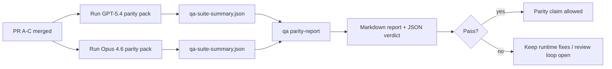

# GPT-5.4 / Codex 同等性維護者說明

本說明解釋如何在不失去原始六份合約架構的情況下，將 GPT-5.4 / Codex 同等性計畫作為四個合併單元進行審查。

## 合併單元

### PR A：strict-agentic 執行

負責：

- `executionContract`
- GPT-5 優先的同輪次貫徹
- `update_plan` 作為非終端進度追蹤
- 明確的封鎖狀態，而非僅限計劃的靜默停止

不負責：

- auth/runtime 失敗分類
- 權限真實性
- 重播/接續重新設計
- 同等性基準測試

### PR B：runtime 真實性

負責：

- Codex OAuth 範圍正確性
- 類型化 provider/runtime 失敗分類
- 真實的 `/elevated full` 可用性和封鎖原因

不負責：

- 工具架構標準化
- 重播/活性狀態
- 基準測試閘門

### PR C：執行正確性

負責：

- provider 擁有的 OpenAI/Codex 工具相容性
- 無參數的嚴格架構處理
- 重播無效呈現
- 暫停、封鎖和放棄的長任務狀態可見性

不負責：

- 自選接續
- provider hook 之外的通用 Codex 方言行為
- 基準測試閘門

### PR D：同等性工具

負責：

- 首批 GPT-5.4 vs Opus 4.6 情境套件
- 同等性文件
- 同等性報告和發布閘門機制

不負責：

- QA-lab 之外的 runtime 行為變更
- 工具內的 auth/proxy/DNS 模擬

## 對應回原始六份合約

| 原始合約                       | 合併單元 |
| ------------------------------ | -------- |
| Provider transport/auth 正確性 | PR B     |
| 工具合約/架構相容性            | PR C     |
| 同輪次執行                     | PR A     |
| 權限真實性                     | PR B     |
| 重播/接續/活性正確性           | PR C     |
| 基準測試/發布閘門              | PR D     |

## 審查順序

1. PR A
2. PR B
3. PR C
4. PR D

PR D 是證明層。它不應成為延遲 runtime 正確性 PR 的原因。

## 注意事項

### PR A

- GPT-5 執行動作或封閉式失敗，而非停止於註釋
- `update_plan` 本身不再看起來像進度
- 行為保持 GPT-5 優先和 embedded-Pi 範圍

### PR B

- auth/proxy/runtime 失敗不再折疊到通用的「模型失敗」處理中
- `/elevated full` 僅在實際可用時被描述為可用
- 封鎖原因對模型和使用者端執行時均為可見

### PR C

- 嚴格的 OpenAI/Codex 工具註冊行為可預測
- 無參數工具不會無法通過嚴格架構檢查
- 重放與壓縮結果保有真實的活躍狀態

### PR D

- 情境套件可理解且可重現
- 該套件包含變異式重放安全通道，而不僅是唯讀流程
- 報告可供人類與自動化閱讀
- 同位性聲明有證據支持，而非軼事

來自 PR D 的預期成品：

- 每次模型執行的 `qa-suite-report.md` / `qa-suite-summary.json`
- 包含彙總與情境層級比較的 `qa-agentic-parity-report.md`
- 附帶機器可讀取判斷的 `qa-agentic-parity-summary.json`

## 發布閘門

在以下情況之前，不得聲稱 GPT-5.4 與 Opus 4.6 同位或優於 Opus 4.6：

- PR A、PR B 和 PR C 已合併
- PR D 乾淨地執行第一波同位性套件
- 執行時真實性迴歸套組保持綠燈
- 同位性報告顯示無假成功案例，且停止行為無迴歸

同位性測試工具不是唯一的證據來源。在審查時保持此區分明確：

- PR D 擁有基於情境的 GPT-5.4 與 Opus 4.6 比較
- PR B 決定性套組仍擁有 auth/proxy/DNS 與完全存取真實性證據

## 目標至證據對應

| 完成閘門項目                   | 主要負責人  | 審查成品                                                          |
| ------------------------------ | ----------- | ----------------------------------------------------------------- |
| 無僅計畫的停滯                 | PR A        | 嚴格代理執行時測試與 `approval-turn-tool-followthrough`           |
| 無假進度或假工具完成           | PR A + PR D | 同位性假成功計數加上情境層級報告細節                              |
| 無錯誤的 `/elevated full` 指引 | PR B        | 決定性執行時真實性套組                                            |
| 重放/活躍失敗保持明確          | PR C + PR D | 生命週期/重放套組加上 `compaction-retry-mutating-tool`            |
| GPT-5.4 符合或超越 Opus 4.6    | PR D        | `qa-agentic-parity-report.md` 和 `qa-agentic-parity-summary.json` |

## 審查者簡稱：變更前與變更後

| 使用者可見的先前問題                         | 事後審查信號                                                      |
| -------------------------------------------- | ----------------------------------------------------------------- |
| GPT-5.4 在規劃後停止                         | PR A 顯示執行或封鎖行為，而非僅註解的完成                         |
| 在嚴格 OpenAI/Codex 架構下，工具使用感覺脆弱 | PR C 保持工具註冊與無參數呼叫的可預測性                           |
| `/elevated full` 提示有時會產生誤導          | PR B 將指引與實際執行時期能力及阻擋原因綁定                       |
| 長時間任務可能會在重放/壓縮歧義中消失        | PR C 發出明確的已暫停、已阻擋、已放棄和重放無效狀態               |
| 同等性聲明是基於軼事證據                     | PR D 產生一份報告以及 JSON 裁決，且兩個模型具有相同的情境覆蓋範圍 |
