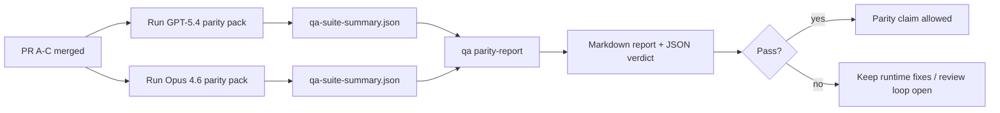

# GPT-5.4 / Codex Parity 維護者說明

本說明解釋如何將 GPT-5.4 / Codex parity 程式審查為四個合併單元，而不會失去原本的六項合約架構。

## 合併單元

### PR A：嚴格代理執行

包含：

- `executionContract`
- GPT-5-first 同回合跟進執行
- 作為非終端進度追蹤的 `update_plan`
- 明確的阻擋狀態，而非僅限計畫的靜默停止

不包含：

- auth/runtime 失敗分類
- 權限真實性
- replay/continuation 重新設計
- parity 基準測試

### PR B：runtime 真實性

包含：

- Codex OAuth 範圍正確性
- 類型化的 provider/runtime 失敗分類
- 真實的 `/elevated full` 可用性與阻擋原因

不包含：

- 工具架構正規化
- replay/liveness 狀態
- 基準測試閘道

### PR C：執行正確性

包含：

- provider 擁有的 OpenAI/Codex 工具相容性
- 無參數的嚴格架構處理
- replay-invalid 揭露
- 已暫停、阻擋與已放棄的長任務狀態可見性

不包含：

- 自選續行
- provider hooks 之外的一般 Codex 方言行為
- 基準測試閘道

### PR D：parity 鞍具

包含：

- 第一波 GPT-5.4 對比 Opus 4.6 情境套件
- parity 文件
- parity 報告與 release-gate 機制

不包含：

- QA-lab 之外的 runtime 行為變更
- 鞍具內部的 auth/proxy/DNS 模擬

## 對應回原本的六項合約

| 原始合約                            | 合併單元 |
| ----------------------------------- | -------- |
| Provider transport/auth 正確性      | PR B     |
| 工具合約/架構相容性                 | PR C     |
| 同回合執行                          | PR A     |
| 權限真實性                          | PR B     |
| Replay/continuation/liveness 正確性 | PR C     |
| 基準測試/release 閘道               | PR D     |

## 審查順序

1. PR A
2. PR B
3. PR C
4. PR D

PR D 是驗證層。它不應成為延遲 runtime-correctness PR 的原因。

## 檢查重點

### PR A

- GPT-5 執行 act 或 fail closed，而不是停留在評論階段
- `update_plan` 不再單獨被視為進度
- 行為保持 GPT-5-first 且範圍限於 embedded-Pi

### PR B

- auth/proxy/runtime failures stop collapsing into generic “model failed” handling
- `/elevated full` is only described as available when it is actually available
- blocked reasons are visible to both the model and the user-facing runtime

### PR C

- strict OpenAI/Codex tool registration behaves predictably
- parameter-free tools do not fail strict schema checks
- replay and compaction outcomes preserve truthful liveness state

### PR D

- the scenario pack is understandable and reproducible
- the pack includes a mutating replay-safety lane, not only read-only flows
- reports are readable by humans and automation
- parity claims are evidence-backed, not anecdotal

Expected artifacts from PR D:

- `qa-suite-report.md` / `qa-suite-summary.json` for each model run
- `qa-agentic-parity-report.md` with aggregate and scenario-level comparison
- `qa-agentic-parity-summary.json` with a machine-readable verdict

## Release gate

Do not claim GPT-5.4 parity or superiority over Opus 4.6 until:

- PR A, PR B, and PR C are merged
- PR D runs the first-wave parity pack cleanly
- runtime-truthfulness regression suites remain green
- the parity report shows no fake-success cases and no regression in stop behavior

The parity harness is not the only evidence source. Keep this split explicit in review:

- PR D owns the scenario-based GPT-5.4 vs Opus 4.6 comparison
- PR B deterministic suites still own auth/proxy/DNS and full-access truthfulness evidence

## Goal-to-evidence map

| Completion gate item                     | Primary owner | Review artifact                                                     |
| ---------------------------------------- | ------------- | ------------------------------------------------------------------- |
| No plan-only stalls                      | PR A          | strict-agentic runtime tests and `approval-turn-tool-followthrough` |
| No fake progress or fake tool completion | PR A + PR D   | parity fake-success count plus scenario-level report details        |
| No false `/elevated full` guidance       | PR B          | deterministic runtime-truthfulness suites                           |
| Replay/liveness failures remain explicit | PR C + PR D   | lifecycle/replay suites plus `compaction-retry-mutating-tool`       |
| GPT-5.4 matches or beats Opus 4.6        | PR D          | `qa-agentic-parity-report.md` and `qa-agentic-parity-summary.json`  |

## Reviewer shorthand: before vs after

| User-visible problem before                          | Review signal after                                                         |
| ---------------------------------------------------- | --------------------------------------------------------------------------- |
| GPT-5.4 stopped after planning                       | PR A shows act-or-block behavior instead of commentary-only completion      |
| 在嚴格的 OpenAI/Codex 架構下，工具使用感覺起來很脆弱 | PR C 讓工具註冊和無參數調用變得可預測                                       |
| `/elevated full` 提示有時會產生誤導                  | PR B 將指導方針與實際的運行時能力及阻斷原因聯繫起來                         |
| 長時間任務可能會在重放/壓縮的歧義中消失              | PR C 會發出明確的已暫停、已阻斷、已放棄和重放無效狀態                       |
| 對等性聲明缺乏系統性證據                             | PR D 會生成一份報告以及 JSON 判定，並確保兩個模型在相同場景覆蓋率下進行評估 |
