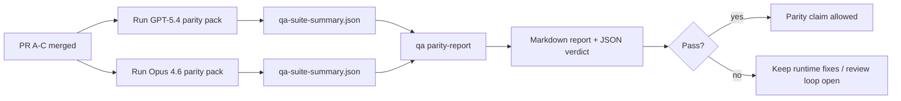

本說明解釋了如何在不遺失原始六個合約架構的情況下，將 GPT-5.4 / Codex parity 程式作為四個合併單元進行審查。

## 合併單元

### PR A：嚴格代理執行

擁有：

- `executionContract`
- GPT-5-first 同輪次跟進
- `update_plan` 作為非終端進度追蹤
- 明確的受阻狀態，而非僅計畫中的靜默停止

不擁有：

- auth/runtime 失敗分類
- 權限真實性
- 重播/延續重新設計
- parity 基準測試

### PR B：runtime 真實性

擁有：

- Codex OAuth 範圍正確性
- 型別化 provider/runtime 失敗分類
- 真實的 `/elevated full` 可用性及受阻原因

不擁有：

- 工具架構正規化
- 重播/存活狀態
- 基準閘道

### PR C：執行正確性

擁有：

- provider 擁有的 OpenAI/Codex 工具相容性
- 無參數嚴格架構處理
- 重播無效顯示
- 已暫停、受阻和已放棄的長任務狀態可見性

不擁有：

- 自選延續
- provider hooks 之外的通用 Codex 方言行為
- 基準閘道

### PR D：parity 駕馭

擁有：

- 第一波 GPT-5.4 對決 Opus 4.6 情境套件
- parity 文件
- parity 報告和發布閘道機制

不擁有：

- QA-lab 之外的 runtime 行為變更
- 駕馭內部的 auth/proxy/DNS 模擬

## 對映回原始六個合約

| 原始合約                  | 合併單元 |
| ------------------------- | -------- |
| Provider 傳輸/auth 正確性 | PR B     |
| 工具合約/架構相容性       | PR C     |
| 同輪次執行                | PR A     |
| 權限真實性                | PR B     |
| 重播/延續/存活正確性      | PR C     |
| 基準/發布閘道             | PR D     |

## 審查順序

1. PR A
2. PR B
3. PR C
4. PR D

PR D 是證明層。它不應成為延遲 runtime 正確性 PR 的原因。

## 注意事項

### PR A

- GPT-5 執行動作或封閉式失敗，而非停留在評論
- `update_plan` 本身不再看起來像是進度
- 行為保持 GPT-5-first 和 embedded-Pi 範圍

### PR B

- auth/proxy/runtime failures stop collapsing into generic “model failed” handling
- `/elevated full` is only described as available when it is actually available
- blocked reasons are visible to both the model and the user-facing runtime

### PR C

- strict OpenAI/Codex tool registration behaves predictably
- parameter-free tools do not fail strict schema checks
- replay and compaction outcomes preserve truthful liveness state

### PR D

- the scenario pack is understandable and reproducible
- the pack includes a mutating replay-safety lane, not only read-only flows
- reports are readable by humans and automation
- parity claims are evidence-backed, not anecdotal

Expected artifacts from PR D:

- `qa-suite-report.md` / `qa-suite-summary.json` for each model run
- `qa-agentic-parity-report.md` with aggregate and scenario-level comparison
- `qa-agentic-parity-summary.json` with a machine-readable verdict

## Release gate

Do not claim GPT-5.4 parity or superiority over Opus 4.6 until:

- PR A, PR B, and PR C are merged
- PR D runs the first-wave parity pack cleanly
- runtime-truthfulness regression suites remain green
- the parity report shows no fake-success cases and no regression in stop behavior

The parity harness is not the only evidence source. Keep this split explicit in review:

- PR D owns the scenario-based GPT-5.4 vs Opus 4.6 comparison
- PR B deterministic suites still own auth/proxy/DNS and full-access truthfulness evidence

## Goal-to-evidence map

| Completion gate item                     | Primary owner | Review artifact                                                     |
| ---------------------------------------- | ------------- | ------------------------------------------------------------------- |
| No plan-only stalls                      | PR A          | strict-agentic runtime tests and `approval-turn-tool-followthrough` |
| No fake progress or fake tool completion | PR A + PR D   | parity fake-success count plus scenario-level report details        |
| No false `/elevated full` guidance       | PR B          | deterministic runtime-truthfulness suites                           |
| Replay/liveness failures remain explicit | PR C + PR D   | lifecycle/replay suites plus `compaction-retry-mutating-tool`       |
| GPT-5.4 matches or beats Opus 4.6        | PR D          | `qa-agentic-parity-report.md` and `qa-agentic-parity-summary.json`  |

## Reviewer shorthand: before vs after

| User-visible problem before                    | Review signal after                                                    |
| ---------------------------------------------- | ---------------------------------------------------------------------- |
| GPT-5.4 stopped after planning                 | PR A shows act-or-block behavior instead of commentary-only completion |
| 在嚴格的 OpenAI/Codex 架構下，工具使用顯得脆弱 | PR C 讓工具註冊和無參數調用變得可預測                                  |
| `/elevated full` 提示有時會產生誤導            | PR B 將指導與實際執行時期能力及阻斷原因掛鉤                            |
| 長時間任務可能會消失在重放/合併的歧義中        | PR C 發出明確的暫停、阻斷、放棄和重放無效狀態                          |
| 平權聲明僅屬趣聞                               | PR D 產生一份報告以及 JSON 判決，並確保兩個模型具有相同的場景覆蓋率    |

## 相關

- [GPT-5.4 / Codex agentic parity](/zh-Hant/help/gpt54-codex-agentic-parity)
