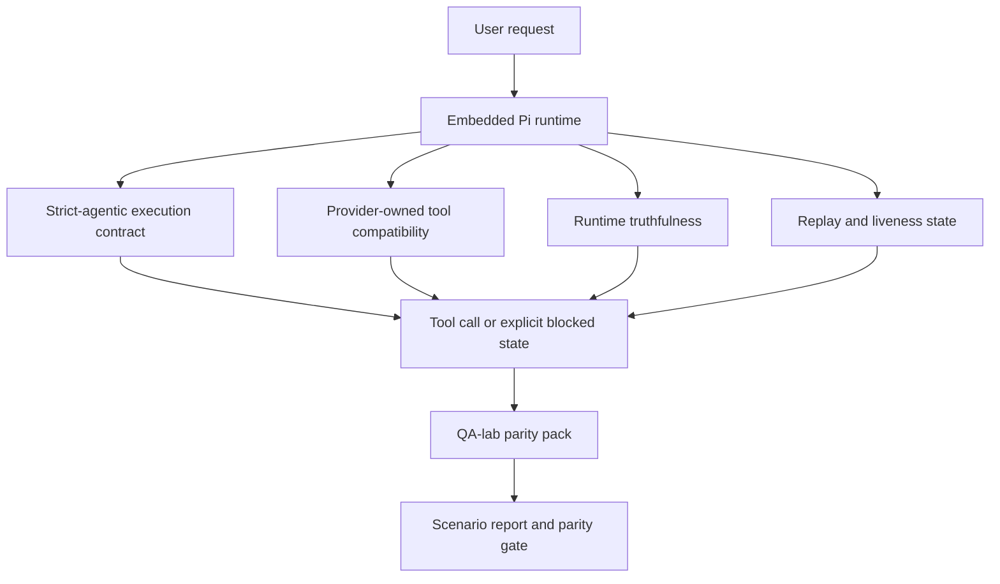
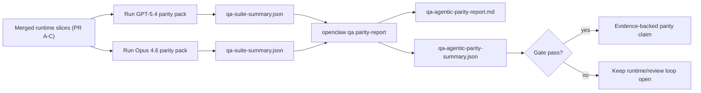

# OpenClaw 中的 GPT-5.4 / Codex Agentic Parity

OpenClaw 與使用工具的前沿模型已經配合得很好，但在某些實際應用方面，GPT-5.4 和 Codex 風格的模型仍表現不佳：

- 它們可能會在規劃後停止，而不是實際執行工作
- 它們可能會錯誤地使用嚴格的 OpenAI/Codex 工具架構
- 即使在完全存取是不可能的情況下，它們仍可能請求 `/elevated full`
- 它們可能在重放或壓縮期間遺失長時間執行任務的狀態
- 針對 Claude Opus 4.6 的同等性聲明是基於軼事，而非可重複的場景

此同等性計畫透過四個可審查的部分修復了這些落差。

## 有什麼變更

### PR A：嚴格代理執行

此部分為嵌入式 Pi GPT-5 執行新增了選用加入的 `strict-agentic` 執行合約。

啟用後，OpenClaw 將停止接受僅計劃的輪次作為「足夠好」的完成。如果模型僅說明其意圖做的事，而未實際使用工具或取得進展，OpenClaw 將使用立即行動引導進行重試，然後以明確的封鎖狀態失敗關閉，而不是無聲地結束任務。

這最能改善以下情況下的 GPT-5.4 體驗：

- 簡短的「好的，執行」後續動作
- 第一步很明顯的程式碼任務
- `update_plan` 應為進度追蹤而非填充文字的流程

### PR B：執行時期真實性

此部分讓 OpenClaw 對兩件事說出真話：

- 提供者/執行時期呼叫失敗的原因
- `/elevated full` 是否實際可用

這意味著 GPT-5.4 對於遺漏範圍、驗證重新整理失敗、HTML 403 驗證失敗、Proxy 問題、DNS 或逾時失敗，以及封鎖的完全存取模式，能獲得更好的執行時期信號。模型較不可能產生錯誤修復方式的幻覺，或持續請求執行時期無法提供的權限模式。

### PR C：執行正確性

此部分改善兩種正確性：

- 提供者擁有的 OpenAI/Codex 工具架構相容性
- 重放和長任務活躍性呈現

tool-compat 工作減少了嚴格 OpenAI/Codex 工具註冊的 schema 摩擦，特別是在無參數工具和嚴格物件根預期方面。replay/liveness 工作使長時間執行的任務更具可觀察性，因此暫停、阻塞和放棄的狀態是可見的，而不是消失在通用的失敗文字中。

### PR D：parity harness

此部分增加了第一波 QA-lab parity pack，以便 GPT-5.4 和 Opus 4.6 可以通過相同的場景進行測試，並使用共享的證據進行比較。

Parity pack 是驗證層。它本身不改變運行時行為。

在您擁有兩個 `qa-suite-summary.json` 構件後，使用以下指令生成 release-gate 比較：

```bash
pnpm openclaw qa parity-report \
  --repo-root . \
  --candidate-summary .artifacts/qa-e2e/gpt54/qa-suite-summary.json \
  --baseline-summary .artifacts/qa-e2e/opus46/qa-suite-summary.json \
  --output-dir .artifacts/qa-e2e/parity
```

該指令寫入：

- 人類可讀的 Markdown 報告
- 機器可讀的 JSON 判定
- 明確的 `pass` / `fail` 閘道結果

## 為何這能在實務上改善 GPT-5.4

在此工作之前，OpenClaw 上的 GPT-5.4 在實際編碼階段中可能會比 Opus 感覺更少代理性，因為運行時容忍了對 GPT-5 系列模型特別有害的行為：

- 僅評論的回合
- 圍繞工具的 schema 摩擦
- 模糊的許可權反饋
- 靜默重播或壓縮損壞

目標不是讓 GPT-5.4 模仿 Opus。目標是給予 GPT-5.4 一個運行時契約，該契約獎勵真正的進度，提供更清晰的工具和許可權語義，並將失敗模式轉化為明確的機器和人類可讀狀態。

這將用戶體驗從：

- 「模型有一個不錯的計劃但停止了」

改變為：

- 「模型要麼採取了行動，要麼 OpenClaw 浮現了它無法這樣做的確切原因」

## GPT-5.4 用戶的改變前後對比

| 在此計劃之前                                                                 | 在 PR A-D 之後                                                         |
| ---------------------------------------------------------------------------- | ---------------------------------------------------------------------- |
| GPT-5.4 可能會在制定合理的計劃後停止，而不採取下一步工具操作                 | PR A 將「僅計劃」轉變為「立即行動或浮現阻塞狀態」                      |
| 嚴格的工具 schema 可能會以令人困惑的方式拒絕無參數或 OpenAI/Codex 形狀的工具 | PR C 使提供者擁有的工具註冊和調用更具可預測性                          |
| `/elevated full` 指導在阻塞的運行時中可能模糊或不正確                        | PR B 為 GPT-5.4 和用戶提供真實的運行時和許可權提示                     |
| 重播或壓縮失敗可能感覺像是任務靜默消失了                                     | PR C 會明確顯示已暫停、已封鎖、已放棄以及重放無效的結果                |
| 「GPT-5.4 感覺比 Opus 差」這種說法大多只是坊間傳聞                           | PR D 將其轉化為相同的情境套件、相同的指標，以及一個嚴格的通過/失敗閘門 |

## 架構



## 發布流程



## 情境套件

第一波對等套件目前涵蓋五種情境：

### `approval-turn-tool-followthrough`

檢查模型是否不會在簡短批准後停止於「我會執行此操作」。它應在同一輪次中採取第一個具體行動。

### `model-switch-tool-continuity`

檢查使用工具的工作在模型/執行階段切換邊界上是否保持連貫，而不是重置為評論或失去執行語境。

### `source-docs-discovery-report`

檢查模型是否能閱讀原始碼和文件、綜合發現，並代理式地繼續任務，而不是生成簡略摘要並提早停止。

### `image-understanding-attachment`

檢查涉及附件的混合模式任務是否保持可執行，而不會淪為模糊的敘述。

### `compaction-retry-mutating-tool`

檢查包含實際變更寫入的任務，是否會在執行壓縮、重試或失去回覆狀態時，明確保持重放不安全，而不是靜默地看似重放安全。

## 情境矩陣

| 情境                               | 測試內容                      | 良好的 GPT-5.4 行為                                      | 失敗信號                                                             |
| ---------------------------------- | ----------------------------- | -------------------------------------------------------- | -------------------------------------------------------------------- |
| `approval-turn-tool-followthrough` | 計畫後的簡短批准輪次          | 立即開始第一個具體工具操作，而不是重述意圖               | 僅有計畫的後續追蹤、無工具活動，或在無真正封鎖器的情況下出現封鎖輪次 |
| `model-switch-tool-continuity`     | 使用工具時的執行階段/模型切換 | 保留任務語境並持續連貫地行動                             | 重置為評論、失去工具語境，或在切換後停止                             |
| `source-docs-discovery-report`     | 閱讀來源 + 綜合 + 行動        | 尋找來源、使用工具，並在不停止的情況下生成有用的報告     | 簡略摘要、缺少工具工作，或不完整輪次停止                             |
| `image-understanding-attachment`   | 附件驅動的代理式工作          | 解讀附件、將其連結至工具，並繼續任務                     | 模糊的敘述、忽略附件，或無具體的下一步行動                           |
| `compaction-retry-mutating-tool`   | 壓縮壓力下的變更工作          | 執行真正的寫入，並在副作用之後保持重放不安全性的顯式狀態 | 發生變異寫入，但重放安全性被暗示、遺漏或矛盾                         |

## 發布門檻

只有當合併後的運行時同時通過同等套件和運行時真實性回歸測試時，GPT-5.4 才能被視為達到同等或更好水準。

必要成果：

- 當下一個工具動作明確時，不會發生僅規劃的停頓
- 沒有真實執行就不會有假完成
- 沒有錯誤的 `/elevated full` 指引
- 沒有無聲的重放或壓縮放棄
- 同等套件指標至少與協議的 Opus 4.6 基準一樣強健

對於首波套件，門檻比較的是：

- 完成率
- 非預期停止率
- 有效工具調用率
- 假成功計數

同等的證據被有意地分為兩層：

- PR D 使用 QA 實驗室證明相同場景下 GPT-5.4 與 Opus 4.6 的行為
- PR B 確定性套件在套件之外證明 auth、proxy、DNS 和 `/elevated full` 的真實性

## 目標到證據矩陣

| 完成門檻項目                                 | 負責 PR     | 證據來源                                                          | 通過訊號                                                     |
| -------------------------------------------- | ----------- | ----------------------------------------------------------------- | ------------------------------------------------------------ |
| GPT-5.4 不再在規劃後停頓                     | PR A        | `approval-turn-tool-followthrough` 加上 PR A 運行時套件           | 批准回合會觸發真實工作或明確的阻擋狀態                       |
| GPT-5.4 不再偽造進度或假工具完成             | PR A + PR D | 同等報告場景結果和假成功計數                                      | 沒有可疑的通過結果且沒有僅註釋的完成                         |
| GPT-5.4 不再給出錯誤的 `/elevated full` 指引 | PR B        | 確定性真實性套件                                                  | 阻擋原因和完全存取提示保持運行時準確                         |
| 重放/活躍度失敗保持顯式                      | PR C + PR D | PR C 生命週期/重放套件加上 `compaction-retry-mutating-tool`       | 變異工作保持重放不安全性的顯式狀態，而不是無聲消失           |
| GPT-5.4 在協議指標上匹配或超越 Opus 4.6      | PR D        | `qa-agentic-parity-report.md` 和 `qa-agentic-parity-summary.json` | 相同的場景覆蓋率，且在完成、停止行為或有效工具使用上沒有回歸 |

## 如何閱讀同等評判

將 `qa-agentic-parity-summary.json` 中的評判作為首波同等套件的的最終機器可讀決策。

- `pass` 表示 GPT-5.4 涵蓋了與 Opus 4.6 相同的場景，並在既定的綜合指標上沒有退步。
- `fail` 表示至少觸發了一個嚴格閾值：較弱的完成度、更嚴重的非預期停止、較弱的有效工具使用、任何偽成功情況，或場景覆蓋不匹配。
- 「shared/base CI issue」本身並非對等性結果。如果 PR D 之外的 CI 噪音阻擋了運行，則裁決應等待乾淨的合併運行時執行，而不是從分支時期的日誌中推斷。
- Auth、proxy、DNS 和 `/elevated full` 真實性仍然來自 PR B 的確定性測試套件，因此最終發布聲明需要同時具備：通過的 PR D 對等性裁決以及綠色的 PR B 真實性覆蓋率。

## 誰應該啟用 `strict-agentic`

在以下情況使用 `strict-agentic`：

- 當下一步顯而易見時，預期代理立即採取行動
- GPT-5.4 或 Codex 系列模型是主要的運行時
- 您偏好明確的阻塞狀態，而非「有幫助的」僅作回應的回覆

在以下情況保留預設合約：

- 您希望保留現有的較寬鬆行為
- 您未使用 GPT-5 系列模型
- 您正在測試提示詞而非運行時強制執行
