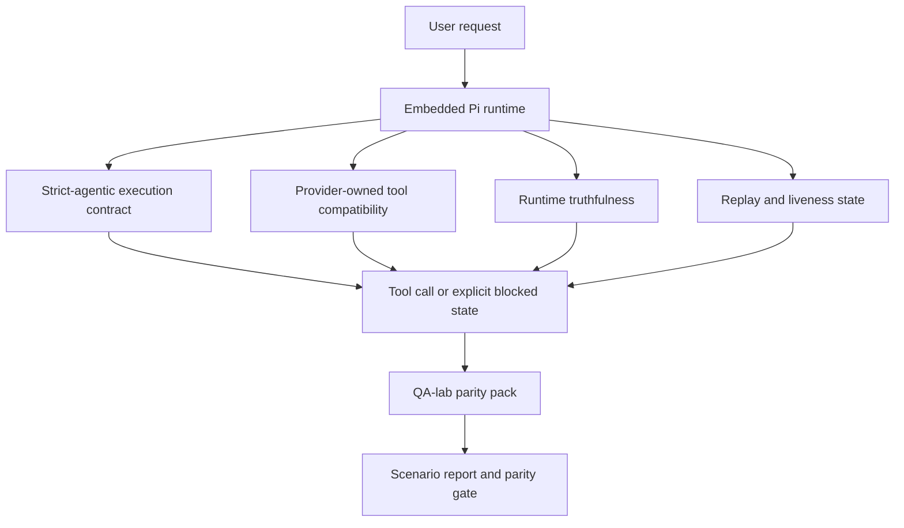
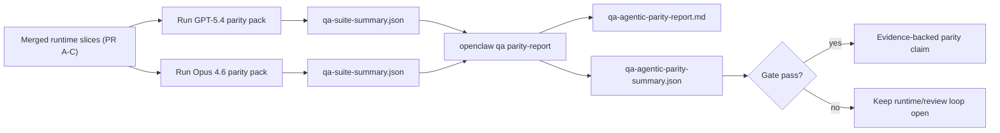

# OpenClaw 中的 GPT-5.4 / Codex Agentic Parity

OpenClaw 在與使用工具的前沿模型搭配運作時表現良好，但 GPT-5.4 和 Codex 風格的模型在幾個實際應用方面仍表現不佳：

- 它們可能會在規劃後停止，而不是執行工作
- 它們可能會錯誤地使用嚴格的 OpenAI/Codex 工具架構
- 即使在無法完全存取的情況下，它們可能仍會請求 `/elevated full`
- 它們可能在重播或壓縮期間遺失長時間執行的任務狀態
- 針對 Claude Opus 4.6 的 Parity 宣稱是基於軼事，而非可重現的場景

此 Parity 計畫透過四個可審查的部分修正了這些差距。

## 什麼改變了

### PR A：嚴格代理執行

此部分為嵌入式 Pi GPT-5 執行新增了可選用的 `strict-agentic` 執行合約。

啟用後，OpenClaw 將停止接受僅包含計劃的輪次作為「足夠好」的完成。如果模型僅說明其意圖做什麼，而實際上未使用工具或取得進展，OpenClaw 將使用立即行動引導重試，然後以明確的封鎖狀態失敗關閉，而不是靜默結束任務。

這最能改善 GPT-5.4 在以下方面的體驗：

- 簡短的「好的，去做」後續追蹤
- 第一步很明顯的程式碼任務
- `update_plan` 應為進度追蹤而非填充文字的流程

### PR B：執行時期真實性

此部分讓 OpenClaw 在兩件事上說實話：

- 為什麼提供者/執行時期呼叫失敗
- `/elevated full` 是否實際可用

這意味著 GPT-5.4 針對缺少範圍、授權重新整理失敗、HTML 403 授權失敗、 Proxy 問題、DNS 或逾時失敗以及被封鎖的完全存取模式能獲得更好的執行時期訊號。模型不太可能產生錯誤修復方法的幻覺，或持續要求執行時期無法提供的權限模式。

### PR C：執行正確性

此部分改善了兩種正確性：

- 提供者擁有的 OpenAI/Codex 工具架構相容性
- 重播和長時間任務活絡性顯示

工具相容性工作減少了嚴格 OpenAI/Codex 工具註冊的架構摩擦，特別是在無參數工具和嚴格物件根目錄預期方面。重播/活絡性工作使長時間任務更具可觀察性，因此暫停、封鎖和放棄的狀態可見，而不會消失在一般性失敗文字中。

### PR D：一致性測試架構

此部分增加了首批 QA-lab 一致性套件，以便 GPT-5.4 和 Opus 4.6 可以通過相同的場景進行測試，並使用共享的證據進行比較。

一致性套件是驗證層。它本身不會改變運行時行為。

在您擁有兩個 `qa-suite-summary.json` 構件後，使用以下命令生成發布閘門比較：

```bash
pnpm openclaw qa parity-report \
  --repo-root . \
  --candidate-summary .artifacts/qa-e2e/gpt54/qa-suite-summary.json \
  --baseline-summary .artifacts/qa-e2e/opus46/qa-suite-summary.json \
  --output-dir .artifacts/qa-e2e/parity
```

該命令會寫入：

- 人類可讀的 Markdown 報告
- 機器可讀的 JSON 裁決
- 明確的 `pass` / `fail` 閘門結果

## 為什麼這在實務上改善了 GPT-5.4

在此工作之前，OpenClaw 上的 GPT-5.4 在實際編碼會議中可能感覺不如 Opus 具有代理能力，因為運行時容忍了對 GPT-5 風格模型尤其有害的行為：

- 僅評論的輪次
- 圍繞工具的 Schema 摩擦
- 模糊的權限反饋
- 靜默重放或壓縮損壞

目標不是讓 GPT-5.4 模仿 Opus。目標是為 GPT-5.4 提供一個運行時契約，該契約獎勵實際進度，提供更乾淨的工具和權限語義，並將失敗模式轉換為明確的機器和人類可讀狀態。

這將用戶體驗從：

- “模型有一個很好的計劃但停止了”

變為：

- “模型採取了行動，或者 OpenClaw 呈現了其無法這樣做的確切原因”

## GPT-5.4 使用者的變更前後對比

| 此計畫之前                                                                   | PR A-D 之後                                                      |
| ---------------------------------------------------------------------------- | ---------------------------------------------------------------- |
| GPT-5.4 可能在制定合理的計劃後停止，而不採取下一步工具步驟                   | PR A 將“僅計劃”變為“立即採取行動或呈現受阻狀態”                  |
| 嚴格的工具 Schema 可能會以令人困惑的方式拒絕無參數或 OpenAI/Codex 形狀的工具 | PR C 使提供者擁有的工具註冊和調用更具可預測性                    |
| `/elevated full` 指導在受阻的運行時中可能模糊或錯誤                          | PR B 為 GPT-5.4 和用戶提供真實的運行時和權限提示                 |
| 重放或壓縮失敗可能感覺像是任務靜默消失了                                     | PR C 明確呈現暫停、受阻、放棄和重放無效的結果                    |
| “GPT-5.4 感覺比 Opus 差”主要是軼事                                           | PR D 將其轉變為相同的場景套件、相同的指標以及嚴格的通過/失敗閘門 |

## 架構



## 發布流程



## 場景套件

首批一致性套件目前涵蓋五個場景：

### `approval-turn-tool-followthrough`

檢查模型在簡短的批准後不會停在「我會這麼做」。它應該在同一輪中採取第一個具體行動。

### `model-switch-tool-continuity`

檢查使用工具的工作在模型/執行時切換邊界上保持連貫，而不是重置為評論或失去執行上下文。

### `source-docs-discovery-report`

檢查模型是否能閱讀原始碼和文件，綜合發現，並以代理方式繼續執行任務，而不是產生薄弱的摘要並提前停止。

### `image-understanding-attachment`

檢查涉及附件的混合模式任務保持可執行，並不會崩塌為模糊的敘述。

### `compaction-retry-mutating-tool`

檢查具有實際變異寫入的任務是否保持重播不安全的明確性，而不是在執行壓縮、重試或丟失回覆狀態時靜默地看起來重播安全。

## 場景矩陣

| 場景                               | 測試內容                    | 良好的 GPT-5.4 行為                                  | 失敗訊號                                                     |
| ---------------------------------- | --------------------------- | ---------------------------------------------------- | ------------------------------------------------------------ |
| `approval-turn-tool-followthrough` | 計畫後的簡短批准回合        | 立即開始第一個具體工具操作，而不是重述意圖           | 僅限計畫的後續操作、無工具活動，或沒有實際阻擋因素的受阻回合 |
| `model-switch-tool-continuity`     | 工具使用下的執行時/模型切換 | 保留任務上下文並繼續連貫地執行操作                   | 重置為評論、失去工具上下文，或在切換後停止                   |
| `source-docs-discovery-report`     | 來源閱讀 + 綜合 + 操作      | 尋找來源、使用工具，並在不停滯的情況下產生有用的報告 | 薄弱的摘要、缺少工具工作，或不完整回合的停止                 |
| `image-understanding-attachment`   | 附件驅動的代理工作          | 解讀附件、將其連接到工具，並繼續執行任務             | 模糊的敘述、忽略附件，或沒有具體的下一步操作                 |
| `compaction-retry-mutating-tool`   | 壓縮壓力下的變異工作        | 執行實際寫入，並在副作用發生後保持重播不安全的明確性 | 發生變異寫入，但重播安全性被暗示、遺漏或矛盾                 |

## 發布閘門

只有當合併後的執行時同時通過同等套件和執行時真實性回歸測試時，GPT-5.4 才能被視為達到同等或更好的水平。

必要結果：

- 當下一個工具操作明確時，沒有僅限計畫的停滯
- 沒有真實執行就沒有虛假完成
- 沒有錯誤的 `/elevated full` 指引
- 沒有靜默重播或壓縮放棄
- 同位套件指標至少須達到約定的 Opus 4.6 基線

對於首波測試套件，該閘門會比較：

- 完成率
- 意外停止率
- 有效工具呼叫率
- 虛假成功計數

同位證據刻意分為兩個層級：

- PR D 證明在 QA 實驗室中 GPT-5.4 與 Opus 4.6 在相同場景下的行為一致
- PR B 確定性測試套件證明了套件之外的 auth、proxy、DNS 和 `/elevated full` 真實性

## 目標與證據對應表

| 完成閘門項目                                 | 負責 PR     | 證據來源                                                          | 通過信號                                                   |
| -------------------------------------------- | ----------- | ----------------------------------------------------------------- | ---------------------------------------------------------- |
| GPT-5.4 不再在規劃後停頓                     | PR A        | `approval-turn-tool-followthrough` 加上 PR A 執行時期測試套件     | 批准回合會觸發實際工作或明確的封鎖狀態                     |
| GPT-5.4 不再偽造進度或虛假工具完成           | PR A + PR D | 同位報告場景結果與虛假成功計數                                    | 無可疑的通過結果且無僅註解完成                             |
| GPT-5.4 不再提供錯誤的 `/elevated full` 指引 | PR B        | 確定性真實性測試套件                                              | 封鎖原因與完全存取提示保持執行時期準確                     |
| 重播/存活失敗保持明確                        | PR C + PR D | PR C 生命週期/重播測試套件加上 `compaction-retry-mutating-tool`   | 變異工作會明確顯示重播不安全性，而非靜默消失               |
| GPT-5.4 在約定的指標上比得上或超越 Opus 4.6  | PR D        | `qa-agentic-parity-report.md` 和 `qa-agentic-parity-summary.json` | 相同的場景覆蓋率，且在完成、停止行為或有效工具使用上無回歸 |

## 如何閱讀同位判定結果

使用 `qa-agentic-parity-summary.json` 中的判定結果作為首波同位套件的最終機器可讀決策。

- `pass` 表示 GPT-5.4 涵蓋了與 Opus 4.6 相同的場景，且在約定的綜合指標上未出現回歸。
- `fail` 表示至少觸發了一項硬性閘門：完成度較低、意外停止惡化、有效工具使用較弱、任何虛假成功案例，或場景覆蓋率不符。
- 「shared/base CI issue」本身並非同等性結果。如果 PR D 之外的 CI 雜訊阻擋了執行，則裁定應等待乾淨的合併執行期執行，而非從分支時期日誌進行推斷。
- Auth、proxy、DNS 與 `/elevated full` 的真實性仍來自 PR B 的確定性測試套件，因此最終發布宣告需要兩者皆備：通過的 PR D 同等性裁定以及綠燈的 PR B 真實性覆蓋率。

## 誰應啟用 `strict-agentic`

當符合以下情況時，請使用 `strict-agentic`：

- 當下一步驟顯而易見時，預期代理會立即採取行動
- 主要執行期是 GPT-5.4 或 Codex 系列模型
- 比起僅提供「有幫助」的總結回覆，您偏好明確的阻擋狀態

當符合以下情況時，請保留預設合約：

- 您希望保留現有的寬鬆行為
- 您未使用 GPT-5 系列模型
- 您正在測試提示詞，而非執行期強制執行
