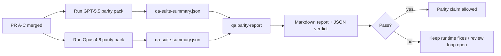

本說明解釋了如何將 GPT-5.5 / Codex 對等程式作為四個合併單元進行審查，同時不會失去原本的六項契約架構。

## 合併單元

### PR A：嚴格代理執行

擁有：

- `executionContract`
- GPT-5 優先的同輪次後續執行
- `update_plan` 作為非終端進度追蹤
- 明確的封鎖狀態，而非僅有計畫的靜默停止

不擁有：

- auth/runtime 失敗分類
- 權限真實性
- 重作/續行重新設計
- 對等基準測試

### PR B：執行時期真實性

擁有：

- Codex OAuth 範圍正確性
- 具類型的提供者/執行時期失敗分類
- 真實的 `/elevated full` 可用性及封鎖原因

不擁有：

- 工具架構正規化
- 重作/存活狀態
- 基準測試閘控

### PR C：執行正確性

擁有：

- 提供者擁有的 OpenAI/Codex 工具相容性
- 無參數的嚴格架構處理
- 重作無效顯示
- 已暫停、已封鎖和已放棄的長任務狀態可見性

不擁有：

- 自主選擇的續行
- 提供者掛勾之外的通用 Codex 方言行為
- 基準測試閘控

### PR D：對等工具

擁有：

- 首批 GPT-5.5 對比 Opus 4.6 情境套件
- 對等文件
- 對等報告與發行閘控機制

不擁有：

- QA 實驗室外部的執行時期行為變更
- 工具內部的 auth/proxy/DNS 模擬

## 對應回原本的六項契約

| 原始契約               | 合併單元 |
| ---------------------- | -------- |
| 提供者傳輸/auth 正確性 | PR B     |
| 工具契約/架構相容性    | PR C     |
| 同輪次執行             | PR A     |
| 權限真實性             | PR B     |
| 重作/續行/存活正確性   | PR C     |
| 基準測試/發行閘控      | PR D     |

## 審查順序

1. PR A
2. PR B
3. PR C
4. PR D

PR D 是驗證層。它不應成為延遲執行正確性 PR 的原因。

## 注意事項

### PR A

- GPT-5 執行採取行動或失敗封閉，而非停止於評論
- `update_plan` 本身不再像是有進度
- 行為保持 GPT-5 優先且僅限內嵌 Pi 範圍

### PR B

- auth/proxy/runtime 錯誤停止歸併到通用的「模型失敗」處理中
- `/elevated full` 僅在實際可用時才被描述為可用
- 封鎖原因對模型和使用者面向的執行時均可見

### PR C

- 嚴格的 OpenAI/Codex 工具註冊行為符合預期
- 無參數工具不會導致嚴格架構檢查失敗
- 重放和壓縮結果保持真實的活躍狀態

### PR D

- 場景套件易懂且可重現
- 該套件包含變異重放安全通道，而不僅是唯讀流程
- 報告可供人工和自動化系統閱讀
- 同等性聲明有據可查，而非軼事

PR D 的預期產出成品：

- 每次模型運行的 `qa-suite-report.md` / `qa-suite-summary.json`
- 包含聚合和場景級別比較的 `qa-agentic-parity-report.md`
- 帶有機器可讀判決結果的 `qa-agentic-parity-summary.json`

## 發布門檻

在以下情況之前，不得聲稱 GPT-5.5 與 Opus 4.6 同等或優於 Opus 4.6：

- PR A、PR B 和 PR C 已合併
- PR D 乾淨地執行了首批同等性套件
- 執行時真實性迴歸測試套件保持通過
- 同等性報告未顯示虛假成功案例，且停止行為無迴歸

同等性工具不是唯一的證據來源。在審查中明確區分這種分工：

- PR D 負責基於場景的 GPT-5.5 與 Opus 4.6 比較
- PR B 確定性測試套件仍負責 auth/proxy/DNS 和完全存取真實性證據

## 快速維護者合併工作流程

當您準備好合併同等性 PR 並希望擁有可重複、低風險的序列時，請使用此方法。

1. 合併前確認證據門檻已達成：
   - 可重現的症狀或失敗的測試
   - 已驗證受觸及代碼中的根本原因
   - 在相關路徑中進行修復
   - 迴歸測試或明確的手動驗證說明
2. 合併前進行分類/標記：
   - 當 PR 不應合併時，應用任何 `r:*` 自動關閉標籤
   - 確保合併候選項不包含未解決的封鎖討論串
3. 在受觸及的表層進行本地驗證：
   - `pnpm check:changed`
   - 當測試發生變更或錯誤修復的信心取決於測試覆蓋率時，執行 `pnpm test:changed`
4. 使用標準維護者流程（`/landpr` 程序）落地，然後驗證：
   - 連結問題的自動關閉行為
   - 在 `main` 上的 CI 和合併後狀態
5. 合併後，針對相關的開放 PR/issue 執行重複搜尋，並僅使用正式參考予以關閉。

如果缺少任何一項證據列項目，請要求變更而不是合併。

## 目標到證據的對應

| 完成閘道項目                 | 主要負責人  | 審閱產出                                                          |
| ---------------------------- | ----------- | ----------------------------------------------------------------- |
| 無僅限計畫的停頓             | PR A        | 嚴格代理運行時測試和 `approval-turn-tool-followthrough`           |
| 無假進度或假工具完成         | PR A + PR D | 對等假成功計數加上情境層級報告詳情                                |
| 無錯誤 `/elevated full` 指引 | PR B        | 確定性運行時真實性測試套件                                        |
| 重播/存活失敗保持明確        | PR C + PR D | 生命週期/重播測試套件加上 `compaction-retry-mutating-tool`        |
| GPT-5.5 匹配或勝過 Opus 4.6  | PR D        | `qa-agentic-parity-report.md` 和 `qa-agentic-parity-summary.json` |

## 審閱者簡稱：變更前 vs 變更後

| 使用者可見的先前問題                                 | 變更後的審閱信號                                        |
| ---------------------------------------------------- | ------------------------------------------------------- |
| GPT-5.5 在計畫後停止                                 | PR A 顯示執行或封鎖行為，而非僅限評論的完成             |
| 使用嚴格的 OpenAI/Codex 結構描述時，工具使用感覺脆弱 | PR C 保持工具註冊和無參數呼叫的可預測性                 |
| `/elevated full` 提示有時會產生誤導                  | PR B 將指引與實際運行時能力及封鎖原因聯繫起來           |
| 長時間任務可能消失在重播/壓縮的歧義中                | PR C 發出明確的暫停、封鎖、放棄和重播無效狀態           |
| 對等聲明是依據軼事                                   | PR D 產生報告和 JSON 判決，兩個模型具有相同的情境覆蓋率 |

## 相關

- [GPT-5.5 / Codex agentic parity](/zh-Hant/help/gpt55-codex-agentic-parity)
