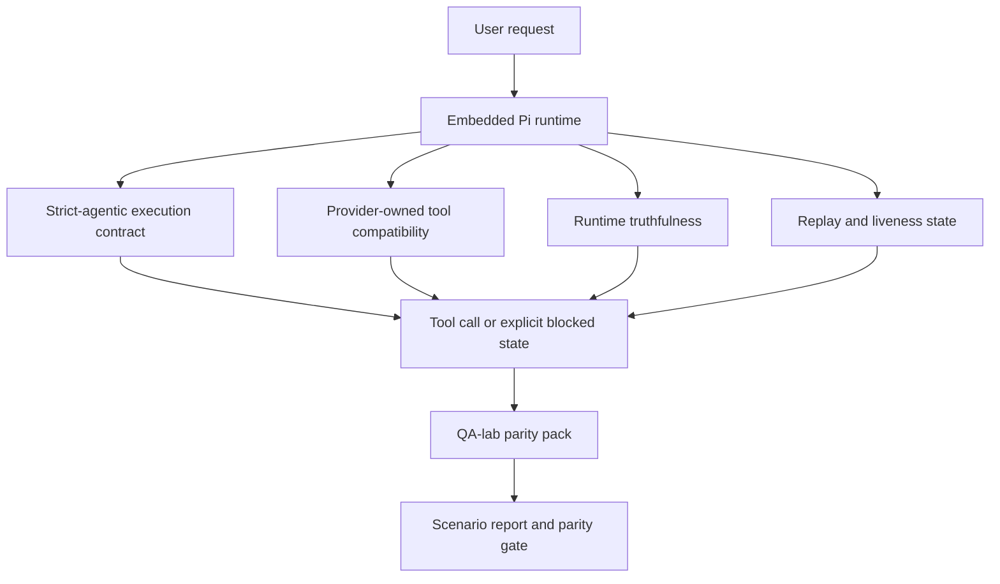
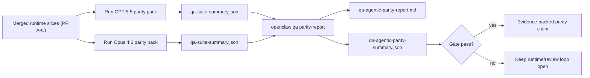

# OpenClaw 中的 GPT-5.5 / Codex Agentic Parity

OpenClaw 已經與使用工具的前沿模型運作良好，但 GPT-5.5 和 Codex 類模型在一些實際應用中仍然表現不佳：

- 它們可能會在規劃後停止，而不是去執行工作
- 它們可能會錯誤地使用嚴格的 OpenAI/Codex 工具架構
- 即使無法完全存取，它們可能仍會請求 `/elevated full`
- 它們可能在重播或壓縮期間遺失長時間執行的任務狀態
- 針對 Claude Opus 4.6 的對等聲明是基於軼事，而非可重現的場景

此對等計畫透過四個可審查的部分修補了這些差距。

## 變更內容

### PR A：strict-agentic execution

此部分為嵌入式 Pi GPT-5 執行新增了選用的 `strict-agentic` 執行合約。

啟用後，OpenClaw 將不再接受僅規劃的回合作為「足夠好」的完成。如果模型僅說明其意圖做什麼，但未實際使用工具或取得進展，OpenClaw 將使用立即行動引導重試，然後以明確的封鎖狀態失敗封閉，而不是無聲地結束任務。

這最能改善 GPT-5.5 的體驗於：

- 簡短的「好的，去做吧」後續追蹤
- 第一步顯而易見的程式碼任務
- `update_plan` 應為進度追蹤而非填充文字的流程

### PR B：runtime truthfulness

此部分讓 OpenClaw 對以下兩件事誠實說明：

- 提供者/執行階段呼叫失敗的原因
- `/elevated full` 是否真的可用

這意味著 GPT-5.5 針對遺漏範圍、認證更新失敗、HTML 403 認證失敗、代理問題、DNS 或逾時失敗以及封鎖的完全存取模式，能獲得更好的執行階段訊號。模型不太可能幻想錯誤的補救措施，或持續要求執行階段無法提供的權限模式。

### PR C：execution correctness

此部分改善了兩種正確性：

- 提供者擁有的 OpenAI/Codex 工具架構相容性
- 重播和長時間任務活躍度顯示

tool-compat 工作減少了嚴格 OpenAI/Codex 工具註冊的 schema 摩擦，特別是圍繞無參數工具和嚴格物件根期望。replay/liveness 工作使長時間執行的任務更具可觀測性，因此暫停、阻塞和放棄狀態是可見的，而不是消失在通用失敗文本中。

### PR D：parity harness

此部分增加了第一波 QA-lab parity 包，以便 GPT-5.5 和 Opus 4.6 可以通過相同的場景進行練習，並使用共享證據進行比較。

Parity 包是驗證層。它本身不改變運行時行為。

在您擁有兩個 `qa-suite-summary.json` 構件後，使用以下內容生成 release-gate 比較：

```bash
pnpm openclaw qa parity-report \
  --repo-root . \
  --candidate-summary .artifacts/qa-e2e/gpt55/qa-suite-summary.json \
  --baseline-summary .artifacts/qa-e2e/opus46/qa-suite-summary.json \
  --output-dir .artifacts/qa-e2e/parity
```

該指令寫入：

- 人類可讀的 Markdown 報告
- 機器可讀的 JSON 判決
- 一個明確的 `pass` / `fail` 閘道結果

## 為何這在實務上改善了 GPT-5.5

在此工作之前，OpenClaw 上的 GPT-5.5 在實際編碼會話中可能感覺不如 Opus 有代理感，因為運行時容忍了對 GPT-5 樣式模型特別有害的行為：

- 僅註解的回合
- 圍繞工具的 schema 摩擦
- 模糊的權限反饋
- 無聲重放或壓縮損壞

目標不是讓 GPT-5.5 模仿 Opus。目標是給予 GPT-5.5 一個運行時契約，獎勵實際進度，提供更清晰的工具和權限語義，並將失敗模式轉化為明確的機器和人類可讀狀態。

這將用戶體驗從：

- “模型有一個很好的計劃但停止了”

改為：

- “模型要麼採取了行動，要麼 OpenClaw 浮現了它無法這樣做的確切原因”

## GPT-5.5 用戶的變化前後對比

| 此計劃之前                                                                   | PR A-D 之後                                                      |
| ---------------------------------------------------------------------------- | ---------------------------------------------------------------- |
| GPT-5.5 可能會在合理的計劃後停止，而不採取下一步工具操作                     | PR A 將“僅計劃”變為“立即行動或浮現阻塞狀態”                      |
| 嚴格的工具 schema 可能會以令人困惑的方式拒絕無參數或 OpenAI/Codex 形狀的工具 | PR C 使提供者擁有的工具註冊和調用更具可預測性                    |
| `/elevated full` 指引在阻塞的運行時中可能模糊或錯誤                          | PR B 為 GPT-5.5 和用戶提供真實的運行時和權限提示                 |
| 重放或壓縮失敗可能感覺像任務無聲消失                                         | PR C 會明確顯示暫停、阻塞、放棄和重播無效的結果                  |
| 「GPT-5.5 感覺比 Opus 差」這種說法大多是軼事性質的                           | PR D 將其轉化為相同的場景套件、相同的指標以及嚴格的通過/失敗門檻 |

## 架構



## 發布流程



## 場景套件

首批對等套件目前涵蓋五種場景：

### `approval-turn-tool-followthrough`

檢查模型在簡短批准後不會停在「我會那樣做」。它應在同一輪中採取第一個具體行動。

### `model-switch-tool-continuity`

檢查工具使用工作在模型/運行時切換邊界中是否保持連貫，而不是重置為評論或丟失執行上下文。

### `source-docs-discovery-report`

檢查模型是否能閱讀來源和文檔，綜合發現，並以代理方式繼續任務，而不是生成簡單的摘要並提前停止。

### `image-understanding-attachment`

檢查涉及附件的混合模式任務是否保持可執行性，而不會崩潰為模糊的敘述。

### `compaction-retry-mutating-tool`

檢查具有真實變動寫入的任務是否明確保持重播不安全，而不是在運行壓縮、重試或因壓力丟失回覆狀態時悄悄看起來重播安全。

## 場景矩陣

| 場景                               | 測試內容                    | 良好的 GPT-5.5 行為                              | 失敗信號                                         |
| ---------------------------------- | --------------------------- | ------------------------------------------------ | ------------------------------------------------ |
| `approval-turn-tool-followthrough` | 計劃後的簡短批准輪次        | 立即開始第一個具體工具操作，而不是重述意圖       | 僅計劃的後續、無工具活動或沒有真正阻礙的阻塞輪次 |
| `model-switch-tool-continuity`     | 工具使用下的運行時/模型切換 | 保留任務上下文並繼續連貫地執行                   | 重置為評論、丟失工具上下文或在切換後停止         |
| `source-docs-discovery-report`     | 來源閱讀 + 綜合 + 行動      | 查找來源、使用工具並產生有用的報告而不會停滯     | 簡單的摘要、缺少工具工作或不完整輪次的停止       |
| `image-understanding-attachment`   | 附件驅動的代理工作          | 解讀附件、將其連接到工具並繼續任務               | 模糊的敘述、忽略附件或沒有具體的下一步行動       |
| `compaction-retry-mutating-tool`   | 壓縮壓力下的變動工作        | 執行實際寫入，並在副作用後保持重播不安全的明確性 | 變異寫入會發生，但重播安全性被隱含、遺漏或矛盾   |

## 發布閘門

只有在合併後的執行環境同時通過同等性套件和執行時真實性回歸測試時，才能認為 GPT-5.5 達到或優於同等性標準。

必需成果：

- 當下一個工具動作明確時，不會發生僅規劃的停滯
- 沒有虛假完成且沒有實際執行
- 沒有錯誤的 `/elevated full` 指引
- 沒有靜默重播或壓縮放棄
- 同等性套件指標至少與協議的 Opus 4.6 基線一樣強健

對於第一波測試工具，閘門會比較：

- 完成率
- 意外停止率
- 有效工具呼叫率
- 虛假成功計數

同等性證據被有意分為兩個層級：

- PR D 透過 QA-lab 證明相同場景下 GPT-5.5 與 Opus 4.6 的行為一致
- PR B 確定性套件證明了測試工具之外的 auth、proxy、DNS 和 `/elevated full` 真實性

## 目標-證據矩陣

| 完成閘門項目                                 | 負責 PR     | 證據來源                                                          | 通過信號                                                     |
| -------------------------------------------- | ----------- | ----------------------------------------------------------------- | ------------------------------------------------------------ |
| GPT-5.5 不再在規劃後停滯                     | PR A        | `approval-turn-tool-followthrough` 加上 PR A 執行環境套件         | 批准回合會觸發實際工作或明確的封鎖狀態                       |
| GPT-5.5 不再偽造進度或虛假工具完成           | PR A + PR D | 同等性報告場景結果和虛假成功計數                                  | 沒有可疑的通過結果，也沒有僅有評論的完成                     |
| GPT-5.5 不再提供錯誤的 `/elevated full` 指引 | PR B        | 確定性真實性套件                                                  | 封鎖原因和完整存取提示保持執行時準確                         |
| 重播/活躍度失敗保持明確                      | PR C + PR D | PR C 生命週期/重播套件加上 `compaction-retry-mutating-tool`       | 變異工作保持重播不安全性的明確性，而不是靜默消失             |
| GPT-5.5 在協議的指標上趕上或超越 Opus 4.6    | PR D        | `qa-agentic-parity-report.md` 和 `qa-agentic-parity-summary.json` | 相同的場景覆蓋率，且在完成、停止行為或有效工具使用上沒有回歸 |

## 如何閱讀同等性判決

使用 `qa-agentic-parity-summary.json` 中的判決作為第一波同等性套件的最终機器可讀決策。

- `pass` 表示 GPT-5.5 涵蓋了與 Opus 4.6 相同的場景，且在約定的匯總指標上未出現倒退。
- `fail` 表示至少觸發了一個硬性閘門：完成度較弱、非預期停止更嚴重、有效工具使用較弱、任何偽成功情況，或場景覆蓋不匹配。
- 「shared/base CI issue」本身並非同位性結果。如果 PR D 以外的 CI 雜訊阻礙了執行，判決應等待乾淨的合併後運行時執行，而不是從分支時期的日誌中推斷。
- Auth、proxy、DNS 和 `/elevated full` 真實性仍然來自 PR B 的確定性測試套件，因此最終的發行聲明需要同時具備：通過 PR D 的同位性判決以及 PR B 綠燈的真實性覆蓋。

## 誰應該啟用 `strict-agentic`

當符合以下情況時使用 `strict-agentic`：

- 當下一步顯而易見時，預期代理會立即採取行動
- GPT-5.5 或 Codex 系列模型是主要的運行時
- 您更偏好明確的封鎖狀態，而非僅提供「有幫助」總結的回覆

當符合以下情況時保留預設契約：

- 您想要現有的較寬鬆行為
- 您未使用 GPT-5 系列模型
- 您正在測試提示詞而非運行時強制執行

## 相關

- [GPT-5.5 / Codex 同位性維護者說明](/zh-Hant/help/gpt55-codex-agentic-parity-maintainers)
