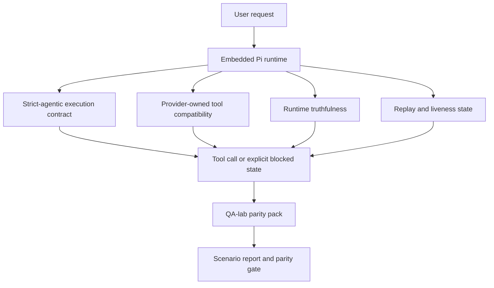

OpenClaw 已經能與使用工具的前沿模型良好協作，但在某些實際情況下，GPT-5.5 和 Codex 風格的模型表現仍然欠佳：

- 它們可能在規劃後就停止運作，而不是實際執行工作
- 它們可能會錯誤地使用嚴格的 OpenAI/Codex 工具架構
- 即使在無法完全存取的情況下，它們可能仍會請求 `/elevated full`
- 它們可能會在重播或壓縮期間遺失長時間執行任務的狀態
- 對 Claude Opus 4.7 的對等宣稱是基於軼事而非可重複的場景

此同等性計畫透過四個可審查的部分修補了這些缺口。

## 什麼改變了

### PR A：嚴格代理執行

此部分為嵌入式 Pi GPT-5 執行新增了一個選用的 `strict-agentic` 執行契約。

啟用後，OpenClaw 將不再接受僅計劃的輪次作為「足夠好」的完成。如果模型只說出它打算做什麼，而未實際使用工具或取得進展，OpenClaw 將使用「立即行動」引導重試，然後以明確的阻擋狀態封閉失敗，而不是無聲地結束任務。

這最能改善 GPT-5.5 在以下方面的體驗：

- 簡短的「好的，去做吧」後續動作
- 第一步就很明顯的程式碼任務
- 在 `update_plan` 應該是進度追蹤而非填充文字的流程中

### PR B：執行時期真實性

此部分讓 OpenClaw 對以下兩件事據實以告：

- 提供者/執行時期呼叫失敗的原因
- `/elevated full` 是否實際可用

這意味著 GPT-5.5 可以針對缺失範圍、驗證重新整理失敗、HTML 403 驗證失敗、代理問題、DNS 或逾時失敗，以及被封鎖的完全存取模式，獲得更好的執行時期訊號。模型比較不會產生錯誤修復方法的幻覺，或持續請求執行時期無法提供的權限模式。

### PR C：執行正確性

此部分改善了兩種正確性：

- 提供者擁有的 OpenAI/Codex 工具架構相容性
- 重播和長期任務活絡性顯示

工具相容性工作減少了嚴格 OpenAI/Codex 工具註冊的架構摩擦，特別是在無參數工具和嚴格物件根目錄預期方面。重播/活絡性工作使長時間執行的任務更具可觀察性，因此暫停、阻擋和放棄的狀態變為可見，而不是消失在通用的失敗文字中。

### PR D：同等性測試框架

此版本新增了第一波 QA 實驗室對等套件，以便透過相同的場景來測試 GPT-5.5 和 Opus 4.7，並使用共用的證據進行比較。

對等套件是驗證層。它本身不會改變執行時行為。

在您擁有兩個 `qa-suite-summary.json` 構件後，使用以下命令生成發布門檻比較：

```bash
pnpm openclaw qa parity-report \
  --repo-root . \
  --candidate-summary .artifacts/qa-e2e/openai-candidate/qa-suite-summary.json \
  --baseline-summary .artifacts/qa-e2e/anthropic-baseline/qa-suite-summary.json \
  --output-dir .artifacts/qa-e2e/parity
```

該命令會寫入：

- 一份人類可讀的 Markdown 報告
- 一份機器可讀的 JSON 判決
- 一個明確的 `pass` / `fail` 門檻結果

## 為什麼這能在實際上改進 GPT-5.5

在此工作之前，在實際編碼會話中，OpenClaw 上的 GPT-5.5 可能會感覺不如 Opus 具有代理性，因為執行時容忍了對 GPT-5 風格模型特別有害的行為：

- 僅評論的回合
- 圍繞工具的架構摩擦
- 模糊的許可權反饋
- 靜默重放或壓縮中斷

目標不是讓 GPT-5.5 模仿 Opus。目標是給予 GPT-5.5 一個執行時合約，該合約獎勵真正的進展，提供更乾淨的工具和權限語義，並將失敗模式轉化為明確的機器可讀和人類可讀狀態。

這將用戶體驗從：

- 「模型有一個不錯的計劃但停止了」

變為：

- 「模型要麼採取了行動，要麼 OpenClaw 浮現了它無法這樣做的確切原因」

## GPT-5.5 用戶的變化前後對比

| 在此計劃之前                                                             | 在 PR A-D 之後                                                     |
| ------------------------------------------------------------------------ | ------------------------------------------------------------------ |
| GPT-5.5 可能會在制定合理的計劃後停止，而不採取下一步工具操作             | PR A 將「僅計劃」變為「立即行動或浮現受阻狀態」                    |
| 嚴格的工具架構可能會以令人困惑的方式拒絕無參數或 OpenAI/Codex 形狀的工具 | PR C 使提供者擁有的工具註冊和調用更具可預測性                      |
| `/elevated full` 指引在被阻擋的執行時中可能模糊或不正確                  | PR B 為 GPT-5.5 和使用者提供了真實的執行時和權限提示               |
| 重播或壓縮失敗可能會讓任務感覺像是靜靜地消失了                           | PR C 會明確顯示已暫停、已封鎖、已放棄和重播無效的結果              |
| 「GPT-5.5 感覺比 Opus 差」主要只是軼事傳聞                               | PR D 將其轉化為相同的情境套件、相同的指標，以及嚴格的通過/失敗閘門 |

## 架構



## 發布流程


## 情境套件

第一批對等套件目前涵蓋五種情境：

### `approval-turn-tool-followthrough`

檢查模型在簡短批准後不會停在「我會做那件事」。它應該在同一輪中採取第一個具體行動。

### `model-switch-tool-continuity`

檢查使用工具的工作在模型/執行時切換邊界是否保持連貫，而不是重置為評論或失去執行上下文。

### `source-docs-discovery-report`

檢查模型是否能閱讀原始碼和文檔、綜合發現，並以代理方式繼續執行任務，而不是產生淺層摘要並提前停止。

### `image-understanding-attachment`

檢查涉及附件的混合模式任務是否保持可執行，而不是崩塌為模糊的敘述。

### `compaction-retry-mutating-tool`

檢查包含實際變異寫入的任務是否能保持重放不安全性為顯式狀態，而不是在執行壓縮、重試或回覆狀態遺失時，安靜地顯得重放安全。

## 場景矩陣

| 場景                               | 測試內容                      | 良好的 GPT-5.5 行為                                      | 失敗信號                                           |
| ---------------------------------- | ----------------------------- | -------------------------------------------------------- | -------------------------------------------------- |
| `approval-turn-tool-followthrough` | 計畫後的簡短批准回合          | 立即開始第一個具體的工具操作，而不是重述意圖             | 僅計畫的後續、無工具活動、或非真正阻斷的受阻回合   |
| `model-switch-tool-continuity`     | 工具使用期間的執行時/模型切換 | 保留任務上下文並繼續連貫地行動                           | 重置為評論、遺失工具上下文，或在切換後停止         |
| `source-docs-discovery-report`     | 來源閱讀 + 綜合 + 行動        | 尋找來源、使用工具，並在不停滯的情況下產出有用的報告     | 摘要過於簡略、遺漏工具工作，或在輪次未完成時停止   |
| `image-understanding-attachment`   | 由附件驅動的代理工作          | 解讀附件、將其連結至工具，並繼續執行任務                 | 敘述模糊、忽略附件，或沒有具體的下一步行動         |
| `compaction-retry-mutating-tool`   | 在壓縮壓力下進行變異工作      | 執行實際寫入，並在副作用發生後保持重播不安全性的明確狀態 | 發生了變異寫入，但重播安全性被隱含、遺漏或相互矛盾 |

## 發布閘門

只有在合併後的執行時同時通過對比套件和執行時真實性回歸測試時，GPT-5.5 才能被視為達到或超過對等水準。

必要結果：

- 當下一個工具動作明確時，不會出現僅有計畫的停滯
- 沒有未經實際執行的假裝完成
- 沒有錯誤的 `/elevated full` 指引
- 沒有無聲的重放或壓縮放棄
- 對等套件指標至少須與約定的 Opus 4.7 基準一樣強

對於首批測試工具，閘門會比較：

- 完成率
- 非預期停止率
- 有效工具呼叫率
- 假成功計數

對等證據被有意分為兩個層級：

- PR D 透過 QA 實驗室證明了相同場景下 GPT-5.5 與 Opus 4.7 的行為表現
- PR B 確定性套件證明了工具外部的 auth、proxy、DNS 和 `/elevated full` 真實性

## 目標與證據對應矩陣

| 完成閘門項目                                 | 負責 PR     | 證據來源                                                          | 通過信號                                                           |
| -------------------------------------------- | ----------- | ----------------------------------------------------------------- | ------------------------------------------------------------------ |
| GPT-5.5 不再在規劃後停滯                     | PR A        | `approval-turn-tool-followthrough` 加上 PR A 運行時套件           | 批准回合會觸發實際工作或明確的封鎖狀態                             |
| GPT-5.5 不再偽造進度或偽造工具完成           | PR A + PR D | 同等性報告場景結果和偽成功計數                                    | 沒有可疑的通過結果，也沒有僅包含評論的完成                         |
| GPT-5.5 不再提供錯誤的 `/elevated full` 指引 | PR B        | 確定性真實性套件                                                  | 封鎖原因和完全存取提示保持運行時準確                               |
| 重播/活躍性失敗保持明確                      | PR C + PR D | PR C 生命週期/重播套件加上 `compaction-retry-mutating-tool`       | 變異工作會保持重播不安全性明確，而不是靜默消失                     |
| GPT-5.5 在約定的指標上達到或超越 Opus 4.7    | PR D        | `qa-agentic-parity-report.md` 和 `qa-agentic-parity-summary.json` | 具備相同的場景覆蓋率，且在完成度、停止行為或有效工具使用方面無回退 |

## 如何解讀對等性判定

將 `qa-agentic-parity-summary.json` 中的判定作為第一波對等性套件的最终機器可讀決策。

- `pass` 表示 GPT-5.5 涵蓋了與 Opus 4.7 相同的場景，且在約定的綜合指標上沒有回退。
- `fail` 表示至少觸發了一個硬性門檻：完成度較弱、非預期停止更嚴重、有效工具使用較弱、任何偽成功情況，或場景覆蓋率不匹配。
- 「shared/base CI issue」本身並非一致性結果。如果 PR D 之外的 CI 雜訊阻擋了一次執行，則裁決應等待一次乾淨的合併後執行，而不是從分支時期的日誌中推斷。
- Auth、proxy、DNS 與 `/elevated full` 的真實性仍來自 PR B 的確定性套件，因此最終的發布聲明需要同時具備：通過的 PR D 一致性裁決以及 PR B 綠燈的真實性覆蓋率。

## 誰應該啟用 `strict-agentic`

當符合以下情況時使用 `strict-agentic`：

- 當下一步明顯時，預期代理會立即採取行動
- GPT-5.5 或 Codex 系列模型是主要的執行環境
- 您偏好明確的受阻狀態，而非「有幫助的」僅作總結的回覆

當符合以下情況時保持預設合約：

- 您想要現有的較鬆散行為
- 您未使用 GPT-5 系列模型
- 您正在測試提示詞，而非執行時期強制執行

## 相關內容

- [GPT-5.5 / Codex parity maintainer notes](/zh-Hant/help/gpt55-codex-agentic-parity-maintainers)
