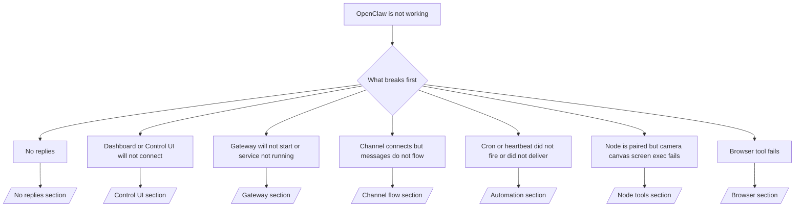

# 故障排除

如果您只有 2 分鐘，請將此頁面用作分流的前門。

## 前 60 秒

按順序執行此確切步驟：

```exec
openclaw status
openclaw status --all
openclaw gateway probe
openclaw gateway status
openclaw doctor
openclaw channels status --probe
openclaw logs --follow
```

一行良好輸出：

- `openclaw status` → 顯示已配置的通道且無明顯的授權錯誤。
- `openclaw status --all` → 存在完整報告且可分享。
- `openclaw gateway probe` → 可達到預期的閘道目標 (`Reachable: yes`)。`RPC: limited - missing scope: operator.read` 是降級診斷，而非連線失敗。
- `openclaw gateway status` → `Runtime: running` 和 `RPC probe: ok`。
- `openclaw doctor` → 無阻塞性配置/服務錯誤。
- `openclaw channels status --probe` → 頻道報告 `connected` 或 `ready`。
- `openclaw logs --follow` → 穩定運行，無重複的致命錯誤。

## Anthropic 長內容 429

如果您看到：
`HTTP 429: rate_limit_error: Extra usage is required for long context requests`，
請前往 [/gateway/troubleshooting#anthropic-429-extra-usage-required-for-long-context](/zh-Hant/gateway/troubleshooting#anthropic-429-extra-usage-required-for-long-context)。

## 外掛程式安裝失敗並顯示缺少 openclaw 延伸模組

如果安裝失敗並出現 `package.json missing openclaw.extensions`，則外掛程式套件
正在使用 OpenClaw 不再接受的舊格式。

在外掛程式套件中修正：

1. 將 `openclaw.extensions` 加入 `package.json`。
2. 將項目指向建置後的執行時期檔案（通常是 `./dist/index.js`）。
3. 重新發佈外掛程式並再次執行 `openclaw plugins install <npm-spec>`。

範例：

```json
{
  "name": "@openclaw/my-plugin",
  "version": "1.2.3",
  "openclaw": {
    "extensions": ["./dist/index.js"]
  }
}
```

參考：[外掛架構](/zh-Hant/plugins/architecture)

## 決策樹



<AccordionGroup>
  <Accordion title="No replies">
    ```exec
    openclaw status
    openclaw gateway status
    openclaw channels status --probe
    openclaw pairing list --channel <channel> [--account <id>]
    openclaw logs --follow
    ```

    正常的輸出如下所示：

    - `Runtime: running`
    - `RPC probe: ok`
    - 您的頻道在 `channels status --probe` 中顯示為已連線/就緒
    - 發送者顯示為已核准（或 DM 政策為開放/許可清單）

    常見日誌特徵：

    - `drop guild message (mention required` → 提及閘門在 Discord 中阻擋了訊息。
    - `pairing request` → 發送者未核准，正在等待 DM 配對核准。
    - 頻道日誌中的 `blocked` / `allowlist` → 發送者、房間或群組已被篩選。

    深入頁面：

    - [/gateway/troubleshooting#no-replies](/zh-Hant/gateway/troubleshooting#no-replies)
    - [/channels/troubleshooting](/zh-Hant/channels/troubleshooting)
    - [/channels/pairing](/zh-Hant/channels/pairing)

  </Accordion>

  <Accordion title="Dashboard or Control UI will not connect">
    ```exec
    openclaw status
    openclaw gateway status
    openclaw logs --follow
    openclaw doctor
    openclaw channels status --probe
    ```

    良好的輸出看起來像：

    - `Dashboard: http://...` 顯示於 `openclaw gateway status`
    - `RPC probe: ok`
    - 記錄檔中沒有驗證迴圈

    常見的記錄簽章：

    - `device identity required` → HTTP/非安全上下文無法完成裝置驗證。
    - `AUTH_TOKEN_MISMATCH` 伴隨重試提示 (`canRetryWithDeviceToken=true`) → 可能會自動進行一次受信任的裝置權杖重試。
    - 該次重試後重複出現 `unauthorized` → 權杖/密碼錯誤、驗證模式不符，或陳舊的配對裝置權杖。
    - `gateway connect failed:` → UI 指向了錯誤的 URL/連接埠或無法連線的閘道。

    深入頁面：

    - [/gateway/troubleshooting#dashboard-control-ui-connectivity](/zh-Hant/gateway/troubleshooting#dashboard-control-ui-connectivity)
    - [/web/control-ui](/zh-Hant/web/control-ui)
    - [/gateway/authentication](/zh-Hant/gateway/authentication)

  </Accordion>

  <Accordion title="Gateway will not start or service installed but not running">
    ```exec
    openclaw status
    openclaw gateway status
    openclaw logs --follow
    openclaw doctor
    openclaw channels status --probe
    ```

    正常的輸出看起來如下：

    - `Service: ... (loaded)`
    - `Runtime: running`
    - `RPC probe: ok`

    常見的日誌特徵：

    - `Gateway start blocked: set gateway.mode=local` → Gateway 模式未設定/為遠端。
    - `refusing to bind gateway ... without auth` → 在沒有 token/密碼的情況下綁定非 loopback 位址。
    - `another gateway instance is already listening` 或 `EADDRINUSE` → 連接埠已被佔用。

    深入頁面：

    - [/gateway/troubleshooting#gateway-service-not-running](/zh-Hant/gateway/troubleshooting#gateway-service-not-running)
    - [/gateway/background-process](/zh-Hant/gateway/background-process)
    - [/gateway/configuration](/zh-Hant/gateway/configuration)

  </Accordion>

  <Accordion title="頻道已連線但訊息無法流動">
    ```exec
    openclaw status
    openclaw gateway status
    openclaw logs --follow
    openclaw doctor
    openclaw channels status --probe
    ```

    正常的輸出看起來像這樣：

    - 頻道傳輸已連線。
    - 配對/白名單檢查通過。
    - 在需要的地方檢測到提及。

    常見的日誌特徵：

    - `mention required` → 群組提及閘門阻擋了處理程序。
    - `pairing` / `pending` → DM 發送者尚未獲得核准。
    - `not_in_channel`、`missing_scope`、`Forbidden`、`401/403` → 頻道權限 token 問題。

    深入頁面：

    - [/gateway/troubleshooting#channel-connected-messages-not-flowing](/zh-Hant/gateway/troubleshooting#channel-connected-messages-not-flowing)
    - [/channels/troubleshooting](/zh-Hant/channels/troubleshooting)

  </Accordion>

  <Accordion title="Cron 或心跳未觸發或未傳遞">
    ```exec
    openclaw status
    openclaw gateway status
    openclaw cron status
    openclaw cron list
    openclaw cron runs --id <jobId> --limit 20
    openclaw logs --follow
    ```

    良好的輸出如下所示：

    - `cron.status` 顯示已啟用且有下一次喚醒時間。
    - `cron runs` 顯示最近的 `ok` 項目。
    - 心跳已啟用且不在活躍時間之外。

    常見日誌特徵：

    - `cron: scheduler disabled; jobs will not run automatically` → cron 已停用。
    - `heartbeat skipped` 搭配 `reason=quiet-hours` → 超出設定的活躍時間。
    - `requests-in-flight` → 主要通道忙碌；心跳喚醒已延後。
    - `unknown accountId` → 心跳傳遞目標帳戶不存在。

    深入頁面：

    - [/gateway/troubleshooting#cron-and-heartbeat-delivery](/zh-Hant/gateway/troubleshooting#cron-and-heartbeat-delivery)
    - [/automation/troubleshooting](/zh-Hant/automation/troubleshooting)
    - [/gateway/heartbeat](/zh-Hant/gateway/heartbeat)

  </Accordion>

  <Accordion title="Node is paired but tool fails camera canvas screen exec">
    ```exec
    openclaw status
    openclaw gateway status
    openclaw nodes status
    openclaw nodes describe --node <idOrNameOrIp>
    openclaw logs --follow
    ```

    Good output looks like:

    - Node is listed as connected and paired for role `node`.
    - Capability exists for the command you are invoking.
    - Permission state is granted for the tool.

    Common log signatures:

    - `NODE_BACKGROUND_UNAVAILABLE` → bring node app to foreground.
    - `*_PERMISSION_REQUIRED` → OS permission was denied/missing.
    - `SYSTEM_RUN_DENIED: approval required` → exec approval is pending.
    - `SYSTEM_RUN_DENIED: allowlist miss` → command not on exec allowlist.

    Deep pages:

    - [/gateway/troubleshooting#node-paired-tool-fails](/zh-Hant/gateway/troubleshooting#node-paired-tool-fails)
    - [/nodes/troubleshooting](/zh-Hant/nodes/troubleshooting)
    - [/tools/exec-approvals](/zh-Hant/tools/exec-approvals)

  </Accordion>

  <Accordion title="瀏覽器工具失敗">
    ```exec
    openclaw status
    openclaw gateway status
    openclaw browser status
    openclaw logs --follow
    openclaw doctor
    ```

    正常的輸出看起來像這樣：

    - 瀏覽器狀態顯示 `running: true` 和一個選定的瀏覽器/設定檔。
    - `openclaw` 啟動，或者 `user` 可以看到本機 Chrome 分頁。

    常見的日誌特徵：

    - `Failed to start Chrome CDP on port` → 本機瀏覽器啟動失敗。
    - `browser.executablePath not found` → 設定的二進位路徑錯誤。
    - `No Chrome tabs found for profile="user"` → Chrome MCP 附加設定檔沒有開啟的本機 Chrome 分頁。
    - `Browser attachOnly is enabled ... not reachable` → 僅附加設定檔沒有即時的 CDP 目標。

    深入頁面：

    - [/gateway/troubleshooting#browser-tool-fails](/zh-Hant/gateway/troubleshooting#browser-tool-fails)
    - [/tools/browser-linux-troubleshooting](/zh-Hant/tools/browser-linux-troubleshooting)
    - [/tools/browser-wsl2-windows-remote-cdp-troubleshooting](/zh-Hant/tools/browser-wsl2-windows-remote-cdp-troubleshooting)

  </Accordion>
</AccordionGroup>
