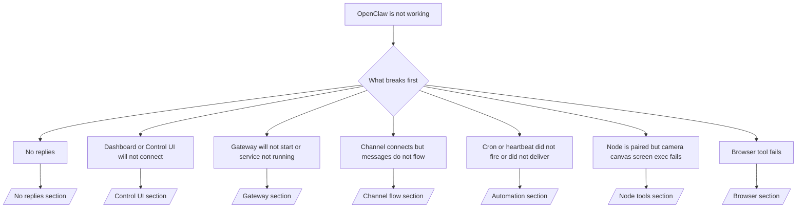

# 故障排除

如果您只有 2 分鐘，請將此頁面作為檢傷分類的前門。

## 前 60 秒

按順序執行以下確切的步驟：

```bash
openclaw status
openclaw status --all
openclaw gateway probe
openclaw gateway status
openclaw doctor
openclaw channels status --probe
openclaw logs --follow
```

在一行中的良好輸出：

- `openclaw status` → 顯示已配置的通道，且無明顯的驗證錯誤。
- `openclaw status --all` → 完整報告已存在且可分享。
- `openclaw gateway probe` → 預期的閘道目標可連線 (`Reachable: yes`)。 `RPC: limited - missing scope: operator.read` 是降級診斷，並非連線失敗。
- `openclaw gateway status` → `Runtime: running` 和 `RPC probe: ok`。
- `openclaw doctor` → 無阻塞性配置/服務錯誤。
- `openclaw channels status --probe` → 可連線的閘道會傳回即時的帳戶傳輸狀態，加上探查/稽核結果，例如 `works` 或 `audit ok`；如果
  閘道無法連線，該指令會改為回退到僅設定的摘要。
- `openclaw logs --follow` → 活動穩定，無重複的嚴重錯誤。

## Anthropic 長上下文 429

如果您看到：
`HTTP 429: rate_limit_error: Extra usage is required for long context requests`，
請前往 [/gateway/troubleshooting#anthropic-429-extra-usage-required-for-long-context](/en/gateway/troubleshooting#anthropic-429-extra-usage-required-for-long-context)。

## 外掛程式安裝因缺少 openclaw 擴充功能而失敗

如果安裝失敗並出現 `package.json missing openclaw.extensions`，則外掛程式套件
正在使用 OpenClaw 不再接受的舊格式。

在外掛程式套件中修復：

1. 將 `openclaw.extensions` 加入到 `package.json`。
2. 將項目指向已建置的執行時期檔案 (通常是 `./dist/index.js`)。
3. 重新發佈外掛程式並再次執行 `openclaw plugins install <package>`。

範例：

```json
{
  "name": "@openclaw/my-plugin",
  "version": "1.2.3",
  "openclaw": {
    "extensions": ["./dist/index.js"]
  }
}
```

參考：[Plugin architecture](/en/plugins/architecture)

## 決策樹



<AccordionGroup>
  <Accordion title="No replies">
    ```bash
    openclaw status
    openclaw gateway status
    openclaw channels status --probe
    openclaw pairing list --channel <channel> [--account <id>]
    openclaw logs --follow
    ```

    正常的輸出應類似：

    - `Runtime: running`
    - `RPC probe: ok`
    - 您的頻道顯示傳輸已連線，且在支援的情況下，`works` 或 `audit ok` 於 `channels status --probe` 中
    - 寄件者顯示為已核准（或 DM 政策為開放/白名單）

    常見的日誌特徵：

    - `drop guild message (mention required` → 提及閘門（mention gating）在 Discord 中阻擋了訊息。
    - `pairing request` → 寄件者未獲核准，正在等待 DM 配對核准。
    - `blocked` / `allowlist` 於頻道日誌中 → 寄件者、房間或群組已被過濾。

    深入頁面：

    - [/gateway/troubleshooting#no-replies](/en/gateway/troubleshooting#no-replies)
    - [/channels/troubleshooting](/en/channels/troubleshooting)
    - [/channels/pairing](/en/channels/pairing)

  </Accordion>

  <Accordion title="儀表板或控制 UI 無法連線">
    ```bash
    openclaw status
    openclaw gateway status
    openclaw logs --follow
    openclaw doctor
    openclaw channels status --probe
    ```

    正常的輸出如下所示：

    - `Dashboard: http://...` 顯示於 `openclaw gateway status` 中
    - `RPC probe: ok`
    - 日誌中沒有認證迴圈

    常見的日誌特徵：

    - `device identity required` → HTTP/非安全環境無法完成裝置認證。
    - `origin not allowed` → 不允許瀏覽器 `Origin` 用於控制 UI
      閘道目標。
    - `AUTH_TOKEN_MISMATCH` 伴隨重試提示 (`canRetryWithDeviceToken=true`) → 可能會自動進行一次受信任的裝置權杖重試。
    - 該快取權杖重試會重複使用與配對裝置權杖一起儲存的快取範圍集合。明確的 `deviceToken` / 明確的 `scopes` 呼叫端則會改為保留其請求的範圍集合。
    - 在非同步 Tailscale Serve 控制 UI 路徑上，相同 `{scope, ip}` 的失敗嘗試會在限制器記錄失敗之前進行序列化，因此第二次並發的錯誤重試可能已顯示 `retry later`。
    - 來自本機瀏覽器
      來源的 `too many failed authentication attempts (retry later)` → 來自相同 `Origin` 的重複失敗會被暫時鎖定；另一個本機來源則會使用獨立的儲存桶。
    - 重試後重複出現 `unauthorized` → 權杖/密碼錯誤、認證模式不符或過期的配對裝置權杖。
    - `gateway connect failed:` → UI 的目標 URL/連接埠錯誤或無法連線的閘道。

    深入頁面：

    - [/gateway/troubleshooting#dashboard-control-ui-connectivity](/en/gateway/troubleshooting#dashboard-control-ui-connectivity)
    - [/web/control-ui](/en/web/control-ui)
    - [/gateway/authentication](/en/gateway/authentication)

  </Accordion>

  <Accordion title="Gateway 無法啟動或服務已安裝但未執行">
    ```bash
    openclaw status
    openclaw gateway status
    openclaw logs --follow
    openclaw doctor
    openclaw channels status --probe
    ```

    正常的輸出看起來像這樣：

    - `Service: ... (loaded)`
    - `Runtime: running`
    - `RPC probe: ok`

    常見的日誌特徵：

    - `Gateway start blocked: set gateway.mode=local` 或 `existing config is missing gateway.mode` → gateway 模式為遠端，或是設定檔缺少 local-mode 標記，應進行修復。
    - `refusing to bind gateway ... without auth` → 在沒有有效的 gateway auth 路徑（token/密碼，或設定的 trusted-proxy）下進行非 loopback 綁定。
    - `another gateway instance is already listening` 或 `EADDRINUSE` → 連接埠已被佔用。

    深入頁面：

    - [/gateway/troubleshooting#gateway-service-not-running](/en/gateway/troubleshooting#gateway-service-not-running)
    - [/gateway/background-process](/en/gateway/background-process)
    - [/gateway/configuration](/en/gateway/configuration)

  </Accordion>

  <Accordion title="通道已連線但訊息無法傳遞">
    ```bash
    openclaw status
    openclaw gateway status
    openclaw logs --follow
    openclaw doctor
    openclaw channels status --probe
    ```

    正常的輸出看起來像這樣：

    - 通道傳輸已連線。
    - 配對/允許清單檢查通過。
    - 必要時已偵測到提及。

    常見的日誌特徵：

    - `mention required` → 群組提及閘門阻擋了處理程序。
    - `pairing` / `pending` → DM 發送者尚未獲得核准。
    - `not_in_channel`、 `missing_scope`、 `Forbidden`、 `401/403` → 通道權限 token 問題。

    深入頁面：

    - [/gateway/troubleshooting#channel-connected-messages-not-flowing](/en/gateway/troubleshooting#channel-connected-messages-not-flowing)
    - [/channels/troubleshooting](/en/channels/troubleshooting)

  </Accordion>

  <Accordion title="Cron 或心跳未觸發或未傳送">
    ```bash
    openclaw status
    openclaw gateway status
    openclaw cron status
    openclaw cron list
    openclaw cron runs --id <jobId> --limit 20
    openclaw logs --follow
    ```

    正常的輸出看起來像這樣：

    - `cron.status` 顯示已啟用且有下一次喚醒。
    - `cron runs` 顯示最近的 `ok` 項目。
    - 心跳已啟用且不在活動時間之外。

    常見的日誌特徵：

- `cron: scheduler disabled; jobs will not run automatically` → cron 已停用。
- `heartbeat skipped` 伴隨 `reason=quiet-hours` → 在設定的活動時間之外。
- `heartbeat skipped` 伴隨 `reason=empty-heartbeat-file` → `HEARTBEAT.md` 存在但僅包含空白/僅標頭的腳手架。
- `heartbeat skipped` 伴隨 `reason=no-tasks-due` → `HEARTBEAT.md` 任務模式處於啟用狀態，但尚未有任何任務間隔到期。
- `heartbeat skipped` 伴隨 `reason=alerts-disabled` → 所有心跳可見性均已停用（`showOk`、`showAlerts` 和 `useIndicator` 均已關閉）。
- `requests-in-flight` → 主通道忙碌；心跳喚醒已延遲。 - `unknown accountId` → 心跳傳送目標帳戶不存在。

      深入頁面：

      - [/gateway/troubleshooting#cron-and-heartbeat-delivery](/en/gateway/troubleshooting#cron-and-heartbeat-delivery)
      - [/automation/cron-jobs#troubleshooting](/en/automation/cron-jobs#troubleshooting)
      - [/gateway/heartbeat](/en/gateway/heartbeat)

    </Accordion>

    <Accordion title="Node is paired but tool fails camera canvas screen exec">
    ```bash
    openclaw status
    openclaw gateway status
    openclaw nodes status
    openclaw nodes describe --node <idOrNameOrIp>
    openclaw logs --follow
    ```

      正常的輸出看起來像這樣：

      - Node 已列出為已連線並針對角色 `node` 進行配對。
      - 您正在叫用的指令存在 Capability。
      - 工具的 Permission state 已授予。

      常見的日誌特徵：

      - `NODE_BACKGROUND_UNAVAILABLE` → 將 node 應用程式帶到前景。
      - `*_PERMISSION_REQUIRED` → OS 權限被拒絕/遺失。
      - `SYSTEM_RUN_DENIED: approval required` → exec 審核正在待處理。
      - `SYSTEM_RUN_DENIED: allowlist miss` → 指令未在 exec 允許清單上。

      深入頁面：

      - [/gateway/troubleshooting#node-paired-tool-fails](/en/gateway/troubleshooting#node-paired-tool-fails)
      - [/nodes/troubleshooting](/en/nodes/troubleshooting)
      - [/tools/exec-approvals](/en/tools/exec-approvals)

    </Accordion>

    <Accordion title="Exec suddenly asks for approval">
    ```bash
    openclaw config get tools.exec.host
    openclaw config get tools.exec.security
    openclaw config get tools.exec.ask
    openclaw gateway restart
    ```

      變更內容：

      - 如果未設定 `tools.exec.host`，預設值為 `auto`。
      - 當沙箱執行環境處於啟用狀態時，`host=auto` 會解析為 `sandbox`，否則為 `gateway`。
      - `host=auto` 僅用於路由；無提示「YOLO」行為來自於 `security=full` 加上 gateway/node 上的 `ask=off`。
      - 在 `gateway` 和 `node` 上，未設定的 `tools.exec.security` 預設為 `full`。
      - 未設定的 `tools.exec.ask` 預設為 `off`。
      - 結果：如果您看到審核請求，表示某些主機本地或個別工作階段的策略將執行設定從目前的預設值收緊了。

      恢復目前的預設無需審核行為：

      ```bash
      openclaw config set tools.exec.host gateway
      openclaw config set tools.exec.security full
      openclaw config set tools.exec.ask off
      openclaw gateway restart
      ```

      更安全的替代方案：

      - 如果您只想要穩定的主機路由，請僅設定 `tools.exec.host=gateway`。
      - 如果您想要主機執行但仍希望在允許清單遺漏時進行審查，請使用 `security=allowlist` 搭配 `ask=on-miss`。
      - 如果您希望 `host=auto` 解析回 `sandbox`，請啟用沙箱模式。

      常見日誌特徵：

      - `Approval required.` → 指令正在等待 `/approve ...`。
      - `SYSTEM_RUN_DENIED: approval required` → node-host 執行審核待處理。
      - `exec host=sandbox requires a sandbox runtime for this session` → 隱含/明確的沙箱選擇，但沙箱模式已關閉。

      深度頁面：

      - [/tools/exec](/en/tools/exec)
      - [/tools/exec-approvals](/en/tools/exec-approvals)
      - [/gateway/security#runtime-expectation-drift](/en/gateway/security#runtime-expectation-drift)

    </Accordion>

    <Accordion title="Browser tool fails">
    ```bash
    openclaw status
    openclaw gateway status
    openclaw browser status
    openclaw logs --follow
    openclaw doctor
    ```

      正常的輸出如下所示：

      - 瀏覽器狀態顯示 `running: true` 以及已選擇的瀏覽器/設定檔。
      - `openclaw` 已啟動，或者 `user` 可以看到本機 Chrome 分頁。

      常見的日誌特徵：

      - `unknown command "browser"` 或 `unknown command 'browser'` → `plugins.allow` 已設定且不包含 `browser`。
      - `Failed to start Chrome CDP on port` → 本機瀏覽器啟動失敗。
      - `browser.executablePath not found` → 設定的二進位路徑錯誤。
      - `browser.cdpUrl must be http(s) or ws(s)` → 設定的 CDP URL 使用了不支援的協定。
      - `browser.cdpUrl has invalid port` → 設定的 CDP URL 具有錯誤或超出範圍的連接埠。
      - `No Chrome tabs found for profile="user"` → Chrome MCP 連接設定檔沒有開啟的本機 Chrome 分頁。
      - `Remote CDP for profile "<name>" is not reachable` → 無法從此主機連線至設定的遠端 CDP 端點。
      - `Browser attachOnly is enabled ... not reachable` 或 `Browser attachOnly is enabled and CDP websocket ... is not reachable` → 僅連接設定檔沒有即時的 CDP 目標。
      - 僅連接或遠端 CDP 設定檔上的過時視口 / 暗色模式 / 地區設定 / 離線覆寫 → 執行 `openclaw browser stop --browser-profile <name>` 以關閉作用中的控制工作階段並釋放模擬狀態，而無需重新啟動閘道。

      深入頁面：

      - [/gateway/troubleshooting#browser-tool-fails](/en/gateway/troubleshooting#browser-tool-fails)
      - [/tools/browser#missing-browser-command-or-tool](/en/tools/browser#missing-browser-command-or-tool)
      - [/tools/browser-linux-troubleshooting](/en/tools/browser-linux-troubleshooting)
      - [/tools/browser-wsl2-windows-remote-cdp-troubleshooting](/en/tools/browser-wsl2-windows-remote-cdp-troubleshooting)

    </Accordion>
</AccordionGroup>

## 相關

- [FAQ](/en/help/faq) — 常見問題
- [Gateway Troubleshooting](/en/gateway/troubleshooting) — 閘道相關問題
- [Doctor](/en/gateway/doctor) — 自動化健康檢查與修復
- [Channel Troubleshooting](/en/channels/troubleshooting) — 通道連線問題
- [Automation Troubleshooting](/en/automation/cron-jobs#troubleshooting) — cron 與 heartbeat 問題
