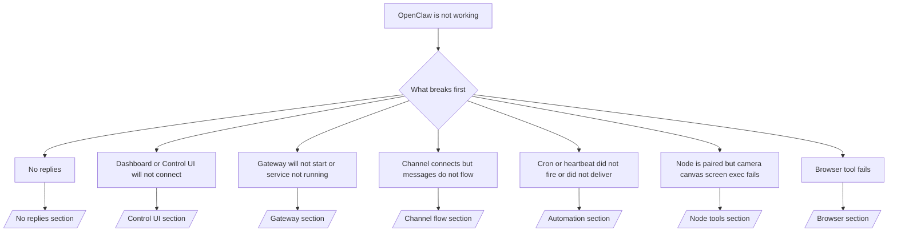

# 故障排除

如果您只有 2 分鐘，請將此頁面作為檢傷分類的前門。

## 前 60 秒

按順序執行以下確切的步驟：

```bash
openclaw status
openclaw status --all
openclaw gateway probe
openclaw gateway status
openclaw doctor
openclaw channels status --probe
openclaw logs --follow
```

在一行中的良好輸出：

- `openclaw status` → 顯示已配置的通道，且無明顯的驗證錯誤。
- `openclaw status --all` → 完整報告已存在且可分享。
- `openclaw gateway probe` → 預期的閘道目標可連線 (`Reachable: yes`)。 `RPC: limited - missing scope: operator.read` 是降級診斷，並非連線失敗。
- `openclaw gateway status` → `Runtime: running` 和 `RPC probe: ok`。
- `openclaw doctor` → 無阻塞性配置/服務錯誤。
- `openclaw channels status --probe` → 可連線的閘道會傳回即時的帳戶傳輸狀態，加上探查/稽核結果，例如 `works` 或 `audit ok`；如果
  閘道無法連線，該指令會改為回退到僅設定的摘要。
- `openclaw logs --follow` → 活動穩定，無重複的嚴重錯誤。

## Anthropic 長上下文 429

如果您看到：
`HTTP 429: rate_limit_error: Extra usage is required for long context requests`，
請前往 [/gateway/troubleshooting#anthropic-429-extra-usage-required-for-long-context](/zh-Hant/gateway/troubleshooting#anthropic-429-extra-usage-required-for-long-context)。

## 本機 OpenAI 相容後端直接運作但在 OpenClaw 中失敗

如果您的本機或自託管 `/v1` 後端能回應小型直接
`/v1/chat/completions` 探測，但在 `openclaw infer model run` 或一般
代理輪次時失敗：

1. 如果錯誤訊息提及 `messages[].content` 期望字串，請設定
   `models.providers.<provider>.models[].compat.requiresStringContent: true`。
2. 如果後端僅在 OpenClaw 代理輪次時仍然失敗，請設定
   `models.providers.<provider>.models[].compat.supportsTools: false` 並重試。
3. 如果小型直接呼叫仍可運作，但較大的 OpenClaw 提示詞會導致
   後端當機，請將剩餘問題視為上游模型/伺服器限制，並
   繼續依照深層手冊操作：
   [/gateway/troubleshooting#local-openai-compatible-backend-passes-direct-probes-but-agent-runs-fail](/zh-Hant/gateway/troubleshooting#local-openai-compatible-backend-passes-direct-probes-but-agent-runs-fail)

## 外掛程式安裝因缺少 openclaw 擴充功能而失敗

如果安裝失敗並出現 `package.json missing openclaw.extensions`，表示外掛程式套件
使用的是 OpenClaw 不再接受的舊格式。

請在外掛程式套件中修正：

1. 將 `openclaw.extensions` 新增至 `package.json`。
2. 將項目指向建置後的執行時期檔案（通常是 `./dist/index.js`）。
3. 重新發布外掛程式並再次執行 `openclaw plugins install <package>`。

範例：

```json
{
  "name": "@openclaw/my-plugin",
  "version": "1.2.3",
  "openclaw": {
    "extensions": ["./dist/index.js"]
  }
}
```

參考資料：[Plugin architecture](/zh-Hant/plugins/architecture)

## 決策樹



<AccordionGroup>
  <Accordion title="No replies">
    ```bash
    openclaw status
    openclaw gateway status
    openclaw channels status --probe
    openclaw pairing list --channel <channel> [--account <id>]
    openclaw logs --follow
    ```

    正常的輸出看起來像這樣：

    - `Runtime: running`
    - `RPC probe: ok`
    - 您的頻道顯示傳輸已連接，並且在支援的情況下，在 `channels status --probe` 中顯示 `works` 或 `audit ok`
    - 發送者顯示已核准（或 DM 政策為開放/許可清單）

    常見的日誌特徵：

    - `drop guild message (mention required` → 提及門檻阻擋了 Discord 中的訊息。
    - `pairing request` → 發送者未核准，正在等待 DM 配對核准。
    - 頻道日誌中的 `blocked` / `allowlist` → 發送者、房間或群組已被過濾。

    深入頁面：

    - [/gateway/troubleshooting#no-replies](/zh-Hant/gateway/troubleshooting#no-replies)
    - [/channels/troubleshooting](/zh-Hant/channels/troubleshooting)
    - [/channels/pairing](/zh-Hant/channels/pairing)

  </Accordion>

  <Accordion title="儀表板或控制 UI 無法連線">
    ```bash
    openclaw status
    openclaw gateway status
    openclaw logs --follow
    openclaw doctor
    openclaw channels status --probe
    ```

    良好的輸出看起來像這樣：

    - `Dashboard: http://...` 顯示在 `openclaw gateway status` 中
    - `RPC probe: ok`
    - 日誌中沒有驗證迴圈

    常見的日誌特徵：

    - `device identity required` → HTTP/非安全內容無法完成裝置驗證。
    - `origin not allowed` → 瀏覽器 `Origin` 不允許用於控制 UI
      閘道目標。
    - `AUTH_TOKEN_MISMATCH` 並帶有重試提示 (`canRetryWithDeviceToken=true`) → 一個受信任的裝置權杖重試可能會自動發生。
    - 該快取權杖重試會重用與配對裝置權杖一起儲存的快取範圍集。明確的 `deviceToken` / 明確的 `scopes` 呼叫者則會保留其請求的範圍集。
    - 在非同步 Tailscale Serve 控制 UI 路徑上，相同 `{scope, ip}` 的失敗嘗試會在限制器記錄失敗之前進行序列化，因此第二次並發的錯誤重試可能已經顯示 `retry later`。
    - 來自 localhost
      瀏覽器來源的 `too many failed authentication attempts (retry later)` → 來自該相同 `Origin` 的重複失敗會被暫時鎖定；另一個 localhost 來源則使用個別的值區。
    - 該重試後的重複 `unauthorized` → 錯誤的權杖/密碼、驗證模式不符，或過期的配對裝置權杖。
    - `gateway connect failed:` → UI 的目標是錯誤的 URL/連接埠或無法連線的閘道。

    深入頁面：

    - [/gateway/troubleshooting#dashboard-control-ui-connectivity](/zh-Hant/gateway/troubleshooting#dashboard-control-ui-connectivity)
    - [/web/control-ui](/zh-Hant/web/control-ui)
    - [/gateway/authentication](/zh-Hant/gateway/authentication)

  </Accordion>

  <Accordion title="閘道無法啟動或服務已安裝但未執行">
    ```bash
    openclaw status
    openclaw gateway status
    openclaw logs --follow
    openclaw doctor
    openclaw channels status --probe
    ```

    正常的輸出看起來如下：

    - `Service: ... (loaded)`
    - `Runtime: running`
    - `RPC probe: ok`

    常見的日誌特徵：

    - `Gateway start blocked: set gateway.mode=local` 或 `existing config is missing gateway.mode` → 閘道模式為遠端，或設定檔缺少本地模式標記且應修復。
    - `refusing to bind gateway ... without auth` → 在沒有有效閘道驗證路徑（令牌/密碼，或設定時的可信任代理）的情況下進行非迴路綁定。
    - `another gateway instance is already listening` 或 `EADDRINUSE` → 連接埠已被佔用。

    深入頁面：

    - [/gateway/troubleshooting#gateway-service-not-running](/zh-Hant/gateway/troubleshooting#gateway-service-not-running)
    - [/gateway/background-process](/zh-Hant/gateway/background-process)
    - [/gateway/configuration](/zh-Hant/gateway/configuration)

  </Accordion>

  <Accordion title="通道已連線但訊息無法流動">
    ```bash
    openclaw status
    openclaw gateway status
    openclaw logs --follow
    openclaw doctor
    openclaw channels status --probe
    ```

    正常的輸出看起來如下：

    - 通道傳輸已連線。
    - 配對/白名單檢查通過。
    - 必要時檢測到提及。

    常見的日誌特徵：

    - `mention required` → 群組提及閘門阻擋了處理。
    - `pairing` / `pending` → DM 發送者尚未被核准。
    - `not_in_channel`、`missing_scope`、`Forbidden`、`401/403` → 通道權限令牌問題。

    深入頁面：

    - [/gateway/troubleshooting#channel-connected-messages-not-flowing](/zh-Hant/gateway/troubleshooting#channel-connected-messages-not-flowing)
    - [/channels/troubleshooting](/zh-Hant/channels/troubleshooting)

  </Accordion>

  <Accordion title="Cron or heartbeat did not fire or did not deliver">
    ```bash
    openclaw status
    openclaw gateway status
    openclaw cron status
    openclaw cron list
    openclaw cron runs --id <jobId> --limit 20
    openclaw logs --follow
    ```

    正常的輸出如下所示：

    - `cron.status` 顯示已啟用，並有下一次喚醒時間。
    - `cron runs` 顯示最近的 `ok` 條目。
    - Heartbeat 已啟用，且不處於活動時間之外。

    常見日誌特徵：

    - `cron: scheduler disabled; jobs will not run automatically` → cron 已停用。
    - `heartbeat skipped` 且包含 `reason=quiet-hours` → 在設定的活動時間之外。
    - `heartbeat skipped` 且包含 `reason=empty-heartbeat-file` → `HEARTBEAT.md` 存在，但僅包含空白/僅標頭的腳手架。
    - `heartbeat skipped` 且包含 `reason=no-tasks-due` → `HEARTBEAT.md` 任務模式處於活動狀態，但尚未到達任何任務間隔。
    - `heartbeat skipped` 且包含 `reason=alerts-disabled` → 所有 heartbeat 可見性均已停用（`showOk`、`showAlerts` 和 `useIndicator` 均為關閉狀態）。
    - `requests-in-flight` → 主通道忙碌；heartbeat 喚醒已延遲。
    - `unknown accountId` → heartbeat 傳送目標帳戶不存在。

    深入頁面：

    - [/gateway/troubleshooting#cron-and-heartbeat-delivery](/zh-Hant/gateway/troubleshooting#cron-and-heartbeat-delivery)
    - [/automation/cron-jobs#troubleshooting](/zh-Hant/automation/cron-jobs#troubleshooting)
    - [/gateway/heartbeat](/zh-Hant/gateway/heartbeat)

    </Accordion>

    <Accordion title="節點已配對但工具（相機、畫布、螢幕、執行）失敗">
      ```bash
      openclaw status
      openclaw gateway status
      openclaw nodes status
      openclaw nodes describe --node <idOrNameOrIp>
      openclaw logs --follow
      ```

      正常的輸出如下所示：

      - 節點被列為已連線並已針對角色 `node` 完成配對。
      - 您正在叫用的指令具備對應功能。
      - 工具的權限狀態已獲授權。

      常見日誌特徵：

      - `NODE_BACKGROUND_UNAVAILABLE` → 將節點應用程式帶到前景。
      - `*_PERMISSION_REQUIRED` → OS 權限被拒絕或遺失。
      - `SYSTEM_RUN_DENIED: approval required` → 執行核准待處理。
      - `SYSTEM_RUN_DENIED: allowlist miss` → 指令未在執行許可清單中。

      深入頁面：

      - [/gateway/troubleshooting#node-paired-tool-fails](/zh-Hant/gateway/troubleshooting#node-paired-tool-fails)
      - [/nodes/troubleshooting](/zh-Hant/nodes/troubleshooting)
      - [/tools/exec-approvals](/zh-Hant/tools/exec-approvals)

    </Accordion>

    <Accordion title="Exec 突然要求批准">
      ```bash
      openclaw config get tools.exec.host
      openclaw config get tools.exec.security
      openclaw config get tools.exec.ask
      openclaw gateway restart
      ```

      什麼變了：

      - 如果未設定 `tools.exec.host`，預設值為 `auto`。
      - 當沙箱運行時處於活動狀態時，`host=auto` 解析為 `sandbox`，否則為 `gateway`。
      - `host=auto` 僅用於路由；無提示的「YOLO」行為來自於 `security=full` 加上 gateway/node 上的 `ask=off`。
      - 在 `gateway` 和 `node` 上，未設定 `tools.exec.security` 預設為 `full`。
      - 未設定 `tools.exec.ask` 預設為 `off`。
      - 結果：如果您看到批准請求，則是某些主機本地或每個會話的策略將 exec 收緊，偏離了當前的預設值。

      恢復當前的預設無批准行為：

      ```bash
      openclaw config set tools.exec.host gateway
      openclaw config set tools.exec.security full
      openclaw config set tools.exec.ask off
      openclaw gateway restart
      ```

      更安全的替代方案：

      - 如果您只想要穩定的主機路由，請僅設定 `tools.exec.host=gateway`。
      - 如果您想要主機 exec 但仍希望在允許清單遺漏時進行審查，請將 `security=allowlist` 與 `ask=on-miss` 一起使用。
      - 如果您希望 `host=auto` 解析回 `sandbox`，請啟用沙箱模式。

      常見日誌特徵：

      - `Approval required.` → 指令正在等待 `/approve ...`。
      - `SYSTEM_RUN_DENIED: approval required` → node-host exec 批准待定。
      - `exec host=sandbox requires a sandbox runtime for this session` → 隱式/顯式沙箱選擇，但沙箱模式已關閉。

      深入頁面：

      - [/tools/exec](/zh-Hant/tools/exec)
      - [/tools/exec-approvals](/zh-Hant/tools/exec-approvals)
      - [/gateway/security#what-the-audit-checks-high-level](/zh-Hant/gateway/security#what-the-audit-checks-high-level)

    </Accordion>

    <Accordion title="Browser tool fails">
      ```bash
      openclaw status
      openclaw gateway status
      openclaw browser status
      openclaw logs --follow
      openclaw doctor
      ```

      良好的輸出結果看起來像這樣：

      - 瀏覽器狀態顯示 `running: true` 以及所選的瀏覽器/設定檔。
      - `openclaw` 啟動，或 `user` 能看見本機 Chrome 分頁。

      常見的日誌特徵：

      - `unknown command "browser"` 或 `unknown command 'browser'` → `plugins.allow` 已設定且不包含 `browser`。
      - `Failed to start Chrome CDP on port` → 本機瀏覽器啟動失敗。
      - `browser.executablePath not found` → 設定的二進位檔路徑錯誤。
      - `browser.cdpUrl must be http(s) or ws(s)` → 設定的 CDP URL 使用了不支援的協定。
      - `browser.cdpUrl has invalid port` → 設定的 CDP URL 連接埠錯誤或超出範圍。
      - `No Chrome tabs found for profile="user"` → Chrome MCP 附加設定檔沒有開啟的本機 Chrome 分頁。
      - `Remote CDP for profile "<name>" is not reachable` → 無法從此主機連線至設定的遠端 CDP 端點。
      - `Browser attachOnly is enabled ... not reachable` 或 `Browser attachOnly is enabled and CDP websocket ... is not reachable` → 僅附加設定檔沒有作用中的 CDP 目標。
      - 僅附加或遠端 CDP 設定檔上有過時的視口 / 暗色模式 / 地區設定 / 離線覆寫 → 請執行 `openclaw browser stop --browser-profile <name>` 以關閉作用中的控制工作階段並釋放模擬狀態，而不需重新啟動閘道。

      深入頁面：

      - [/gateway/troubleshooting#browser-tool-fails](/zh-Hant/gateway/troubleshooting#browser-tool-fails)
      - [/tools/browser#missing-browser-command-or-tool](/zh-Hant/tools/browser#missing-browser-command-or-tool)
      - [/tools/browser-linux-troubleshooting](/zh-Hant/tools/browser-linux-troubleshooting)
      - [/tools/browser-wsl2-windows-remote-cdp-troubleshooting](/zh-Hant/tools/browser-wsl2-windows-remote-cdp-troubleshooting)

    </Accordion>

  </AccordionGroup>

## 相關

- [FAQ](/zh-Hant/help/faq) — 常見問題
- [Gateway Troubleshooting](/zh-Hant/gateway/troubleshooting) — 閘道特定問題
- [Doctor](/zh-Hant/gateway/doctor) — 自動健康檢查與修復
- [Channel Troubleshooting](/zh-Hant/channels/troubleshooting) — 頻道連線問題
- [Automation Troubleshooting](/zh-Hant/automation/cron-jobs#troubleshooting) — cron 與 heartbeat 問題
