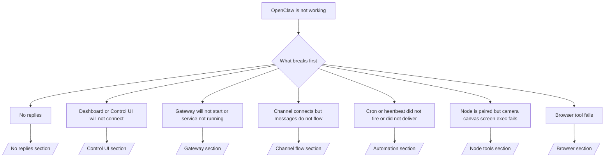

如果您只有 2 分鐘，請將此頁面作為分診的前門。

## 前 60 秒

按順序執行以下確切的檢查步驟：

```bash
openclaw status
openclaw status --all
openclaw gateway probe
openclaw gateway status
openclaw doctor
openclaw channels status --probe
openclaw logs --follow
```

一行良好輸出：

- `openclaw status` → 顯示已配置的通道且沒有明顯的驗證錯誤。
- `openclaw status --all` → 完整報告存在且可分享。
- `openclaw gateway probe` → 預期的閘道目標可達 (`Reachable: yes`)。`Capability: ...` 告訴您探測器能證明的驗證級別，而 `Read probe: limited - missing scope: operator.read` 是降級的診斷，而非連線失敗。
- `openclaw gateway status` → `Runtime: running`、`Connectivity probe: ok`，以及一條合理的 `Capability: ...` 行。如果您也需要讀取範圍的 RPC 證明，請使用 `--require-rpc`。
- `openclaw doctor` → 沒有阻擋性的配置/服務錯誤。
- `openclaw channels status --probe` → 可達的閘道會返回實時的帳戶傳輸狀態以及探測/稽核結果，例如 `works` 或 `audit ok`；如果閘道不可達，該指令會退回到僅配置的摘要。
- `openclaw logs --follow` → 活動穩定，沒有重複的致命錯誤。

## Anthropic 長語境 429

如果您看到：
`HTTP 429: rate_limit_error: Extra usage is required for long context requests`，
請前往 [/gateway/troubleshooting#anthropic-429-extra-usage-required-for-long-context](/zh-Hant/gateway/troubleshooting#anthropic-429-extra-usage-required-for-long-context)。

## 本機 OpenAI 相容後端直接運作正常但在 OpenClaw 中失敗

如果您本機或自託管的 `/v1` 後端能回應小型直接
`/v1/chat/completions` 探測，但在 `openclaw infer model run` 或正常
代理輪次中失敗：

1. 如果錯誤提到 `messages[].content` 期望字串，請設定
   `models.providers.<provider>.models[].compat.requiresStringContent: true`。
2. 如果後端仍僅在 OpenClaw 代理輪次中失敗，請設定
   `models.providers.<provider>.models[].compat.supportsTools: false` 並重試。
3. 如果微小的直接呼叫仍然有效，但較大的 OpenClaw 提示導致
   後端崩潰，請將其餘問題視為上游模型/伺服器限制，並
   繼續深入執行手冊：
   [/gateway/troubleshooting#local-openai-compatible-backend-passes-direct-probes-but-agent-runs-fail](/zh-Hant/gateway/troubleshooting#local-openai-compatible-backend-passes-direct-probes-but-agent-runs-fail)

## Plugin install fails with missing openclaw extensions

如果安裝失敗並出現 `package.json missing openclaw.extensions`，表示外掛程式套件
使用的是 OpenClaw 不再接受的舊格式。

Fix in the plugin package:

1. 將 `openclaw.extensions` 新增至 `package.json`。
2. 將項目指向建置好的執行時期檔案（通常是 `./dist/index.js`）。
3. 重新發布外掛程式並再次執行 `openclaw plugins install <package>`。

Example:

```json
{
  "name": "@openclaw/my-plugin",
  "version": "1.2.3",
  "openclaw": {
    "extensions": ["./dist/index.js"]
  }
}
```

參考資料：[外掛程式架構](/zh-Hant/plugins/architecture)

## 外掛程式已存在但因可疑的所有權而遭封鎖

如果 `openclaw doctor`、設定或啟動警告顯示：

```text
blocked plugin candidate: suspicious ownership (... uid=1000, expected uid=0 or root)
plugin present but blocked
```

表示外掛程式檔案的所有權屬於與載入它們的程序不同的 Unix 使用者。請勿移除外掛程式設定。請修正檔案所有權，或是以擁有狀態目錄的相同使用者身分執行 OpenClaw。

Docker 安裝通常以 `node` (uid `1000`) 身分執行。對於預設的 Docker 設定，請修復主機繫結掛載：

```bash
sudo chown -R 1000:1000 /path/to/openclaw-config /path/to/openclaw-workspace
openclaw doctor --fix
```

如果您刻意以 root 身分執行 OpenClaw，請改將受管理的外掛程式根目錄修復為 root 所有權：

```bash
sudo chown -R root:root /path/to/openclaw-config/npm
openclaw doctor --fix
```

深入文件：

- [外掛程式路徑所有權](/zh-Hant/tools/plugin#blocked-plugin-path-ownership)
- [Docker 權限](/zh-Hant/install/docker#permissions-and-eacces)

## 決策樹



<AccordionGroup>
  <Accordion title="No replies">
    ```bash
    openclaw status
    openclaw gateway status
    openclaw channels status --probe
    openclaw pairing list --channel <channel> [--account <id>]
    openclaw logs --follow
    ```

    良好的輸出看起來像這樣：

    - `Runtime: running`
    - `Connectivity probe: ok`
    - `Capability: read-only`、`write-capable` 或 `admin-capable`
    - 您的頻道顯示傳輸已連線，且在支援的情況下，`channels status --probe` 中會顯示 `works` 或 `audit ok`
    - 發送者顯示已核准（或 DM 政策為開放/允許清單）

    常見的日誌特徵：

    - `drop guild message (mention required` → 提及閘門在 Discord 中封鎖了訊息。
    - `pairing request` → 發送者未核准，正在等待 DM 配對核准。
    - 頻道日誌中的 `blocked` / `allowlist` → 發送者、房間或群組已被篩選。

    深入頁面：

    - [/gateway/troubleshooting#no-replies](/zh-Hant/gateway/troubleshooting#no-replies)
    - [/channels/troubleshooting](/zh-Hant/channels/troubleshooting)
    - [/channels/pairing](/zh-Hant/channels/pairing)

  </Accordion>

  <Accordion title="儀表板或控制介面無法連線">
    ```bash
    openclaw status
    openclaw gateway status
    openclaw logs --follow
    openclaw doctor
    openclaw channels status --probe
    ```

    正常的輸出如下所示：

    - `Dashboard: http://...` 顯示於 `openclaw gateway status` 中
    - `Connectivity probe: ok`
    - `Capability: read-only`、`write-capable` 或 `admin-capable`
    - 記錄中沒有認證迴圈

    常見的記錄特徵：

    - `device identity required` → HTTP/非安全內容無法完成裝置認證。
    - `origin not allowed` → 瀏覽器 `Origin` 不被允許用於控制介面
      閘道目標。
    - `AUTH_TOKEN_MISMATCH` 並帶有重試提示 (`canRetryWithDeviceToken=true`) → 可能會自動進行一次信任的裝置權杖重試。
    - 該快取權杖重試會重複使用與配對裝置權杖一起儲存的快取範圍集合。明確的 `deviceToken` / 明確的 `scopes` 呼叫端則會
      改為保留其請求的範圍集合。
    - 在非同步 Tailscale Serve 控制介面路徑上，針對同一個 `{scope, ip}` 的失敗嘗試會在限制器記錄失敗之前進行序列化，因此
      第二個併發的錯誤重試可能會顯示 `retry later`。
    - 來自 localhost
      瀏覽器來源的 `too many failed authentication attempts (retry later)` → 來自同一個 `Origin` 的重複失敗會被暫時
      鎖定；另一個 localhost 來源則使用個別的桶。
    - 該次重試後出現重複的 `unauthorized` → 錯誤的權杖/密碼、認證模式不符，或過期的配對裝置權杖。
    - `gateway connect failed:` → 介面目標錯誤的 URL/連接埠或無法到達的閘道。

    深入頁面：

    - [/gateway/troubleshooting#dashboard-control-ui-connectivity](/zh-Hant/gateway/troubleshooting#dashboard-control-ui-connectivity)
    - [/web/control-ui](/zh-Hant/web/control-ui)
    - [/gateway/authentication](/zh-Hant/gateway/authentication)

  </Accordion>

  <Accordion title="Gateway 無法啟動或服務已安裝但未執行">
    ```bash
    openclaw status
    openclaw gateway status
    openclaw logs --follow
    openclaw doctor
    openclaw channels status --probe
    ```

    正常輸出如下所示：

    - `Service: ... (loaded)`
    - `Runtime: running`
    - `Connectivity probe: ok`
    - `Capability: read-only`、`write-capable` 或 `admin-capable`

    常見日誌特徵：

    - `Gateway start blocked: set gateway.mode=local` 或 `existing config is missing gateway.mode` → gateway 模式為遠端，或者設定檔缺少 local-mode 標記，應予修復。
    - `refusing to bind gateway ... without auth` → 在沒有有效 gateway auth 路徑（token/密碼，或設定的 trusted-proxy）的情況下進行非 loopback 繫結。
    - `another gateway instance is already listening` 或 `EADDRINUSE` → 連接埠已被佔用。

    深入頁面：

    - [/gateway/troubleshooting#gateway-service-not-running](/zh-Hant/gateway/troubleshooting#gateway-service-not-running)
    - [/gateway/background-process](/zh-Hant/gateway/background-process)
    - [/gateway/configuration](/zh-Hant/gateway/configuration)

  </Accordion>

  <Accordion title="通道已連線但訊息無法流動">
    ```bash
    openclaw status
    openclaw gateway status
    openclaw logs --follow
    openclaw doctor
    openclaw channels status --probe
    ```

    正常輸出如下所示：

    - 通道傳輸已連線。
    - 配對/許可清單檢查通過。
    - 在需要的地方偵測到提及。

    常見日誌特徵：

    - `mention required` → 群組提及閘門阻擋了處理。
    - `pairing` / `pending` → DM 傳送者尚未被核准。
    - `not_in_channel`、`missing_scope`、`Forbidden`、`401/403` → 通道權限 token 問題。

    深入頁面：

    - [/gateway/troubleshooting#channel-connected-messages-not-flowing](/zh-Hant/gateway/troubleshooting#channel-connected-messages-not-flowing)
    - [/channels/troubleshooting](/zh-Hant/channels/troubleshooting)

  </Accordion>

  <Accordion title="Cron 或心跳未觸發或未傳遞">
    ```bash
    openclaw status
    openclaw gateway status
    openclaw cron status
    openclaw cron list
    openclaw cron runs --id <jobId> --limit 20
    openclaw logs --follow
    ```

    良好的輸出看起來像這樣：

    - `cron.status` 顯示已啟用並且有一個下次喚醒時間。
    - `cron runs` 顯示最近的 `ok` 條目。
    - 心跳已啟用且未處於非活躍時段。

    常見日誌特徵：

    - `cron: scheduler disabled; jobs will not run automatically` → cron 已停用。
    - `heartbeat skipped` 且 `reason=quiet-hours` → 超出設定的活躍時段。
    - `heartbeat skipped` 且 `reason=empty-heartbeat-file` → `HEARTBEAT.md` 存在但僅包含空白/僅標頭的腳手架。
    - `heartbeat skipped` 且 `reason=no-tasks-due` → `HEARTBEAT.md` 任務模式處於活躍狀態，但尚未有任何任務間隔到期。
    - `heartbeat skipped` 且 `reason=alerts-disabled` → 所有心跳可見性均已停用（`showOk`、`showAlerts` 和 `useIndicator` 均已關閉）。
    - `requests-in-flight` → 主通道忙碌；心跳喚醒已延遲。
    - `unknown accountId` → 心跳傳遞目標帳戶不存在。

    深入頁面：

    - [/gateway/troubleshooting#cron-and-heartbeat-delivery](/zh-Hant/gateway/troubleshooting#cron-and-heartbeat-delivery)
    - [/automation/cron-jobs#troubleshooting](/zh-Hant/automation/cron-jobs#troubleshooting)
    - [/gateway/heartbeat](/zh-Hant/gateway/heartbeat)

  </Accordion>

  <Accordion title="節點已配對，但工具在 camera、canvas、screen、exec 上失敗">
    ```bash
    openclaw status
    openclaw gateway status
    openclaw nodes status
    openclaw nodes describe --node <idOrNameOrIp>
    openclaw logs --follow
    ```

    正常的輸出如下：

    - 節點顯示為已連線並已針對角色 `node` 進行配對。
    - 您正在叫用的指令具備對應的功能。
    - 工具的權限狀態已獲授權。

    常見的日誌特徵：

    - `NODE_BACKGROUND_UNAVAILABLE` → 將節點應用程式帶到前景。
    - `*_PERMISSION_REQUIRED` → OS 權限遭拒或缺失。
    - `SYSTEM_RUN_DENIED: approval required` → exec 審核擱置中。
    - `SYSTEM_RUN_DENIED: allowlist miss` → 指令未在 exec 允許清單上。

    深入頁面：

    - [/gateway/troubleshooting#node-paired-tool-fails](/zh-Hant/gateway/troubleshooting#node-paired-tool-fails)
    - [/nodes/troubleshooting](/zh-Hant/nodes/troubleshooting)
    - [/tools/exec-approvals](/zh-Hant/tools/exec-approvals)

  </Accordion>

  <Accordion title="Exec 突然要求審批">
    ```bash
    openclaw config get tools.exec.host
    openclaw config get tools.exec.security
    openclaw config get tools.exec.ask
    openclaw gateway restart
    ```

    變更內容：

    - 如果 `tools.exec.host` 未設定，預設值為 `auto`。
    - 當沙盒執行環境處於活躍狀態時，`host=auto` 解析為 `sandbox`，否則為 `gateway`。
    - `host=auto` 僅涉及路由；無提示「YOLO」行為來自於 `security=full` 加上閘道/節點上的 `ask=off`。
    - 在 `gateway` 和 `node` 上，未設定的 `tools.exec.security` 預設值為 `full`。
    - 未設定的 `tools.exec.ask` 預設值為 `off`。
    - 結果：如果您看到審批要求，表示某些主機本機或每個會話的策略將執行嚴格化，偏離了目前的預設值。

    恢復目前的預設無審批行為：

    ```bash
    openclaw config set tools.exec.host gateway
    openclaw config set tools.exec.security full
    openclaw config set tools.exec.ask off
    openclaw gateway restart
    ```

    更安全的替代方案：

    - 如果您只想要穩定的主機路由，請僅設定 `tools.exec.host=gateway`。
    - 如果您想要主機執行但仍希望對允許清單遺漏項目進行審查，請搭配使用 `security=allowlist` 與 `ask=on-miss`。
    - 如果您希望 `host=auto` 解析回 `sandbox`，請啟用沙盒模式。

    常見日誌特徵：

    - `Approval required.` → 指令正在等待 `/approve ...`。
    - `SYSTEM_RUN_DENIED: approval required` → 節點主機執行審批待處理。
    - `exec host=sandbox requires a sandbox runtime for this session` → 隱含/明確沙盒選擇，但沙盒模式已關閉。

    深入頁面：

    - [/tools/exec](/zh-Hant/tools/exec)
    - [/tools/exec-approvals](/zh-Hant/tools/exec-approvals)
    - [/gateway/security#what-the-audit-checks-high-level](/zh-Hant/gateway/security#what-the-audit-checks-high-level)

  </Accordion>

  <Accordion title="Browser tool fails">
    ```bash
    openclaw status
    openclaw gateway status
    openclaw browser status
    openclaw logs --follow
    openclaw doctor
    ```

    正常的輸出看起來像這樣：

    - 瀏覽器狀態顯示 `running: true` 以及選擇的瀏覽器/設定檔。
    - `openclaw` 啟動，或是 `user` 可以看到本機 Chrome 分頁。

    常見的日誌特徵：

    - `unknown command "browser"` 或 `unknown command 'browser'` → `plugins.allow` 已設定且不包含 `browser`。
    - `Failed to start Chrome CDP on port` → 本機瀏覽器啟動失敗。
    - `browser.executablePath not found` → 設定的二進位路徑錯誤。
    - `browser.cdpUrl must be http(s) or ws(s)` → 設定的 CDP URL 使用了不支援的協定。
    - `browser.cdpUrl has invalid port` → 設定的 CDP URL 具有無效或超出範圍的連接埠。
    - `No Chrome tabs found for profile="user"` → Chrome MCP 附加設定檔沒有開啟的本機 Chrome 分頁。
    - `Remote CDP for profile "<name>" is not reachable` → 無法從此主機連線到設定的遠端 CDP 端點。
    - `Browser attachOnly is enabled ... not reachable` 或 `Browser attachOnly is enabled and CDP websocket ... is not reachable` → 僅附加設定檔沒有即時的 CDP 目標。
    - 僅附加或遠端 CDP 設定檔上的檢視區 / 暗色模式 / 地區設定 / 離線覆寫過時 → 執行 `openclaw browser stop --browser-profile <name>` 以關閉作用中的控制工作階段並釋放模擬狀態，無需重新啟動閘道。

    深入頁面：

    - [/gateway/troubleshooting#browser-tool-fails](/zh-Hant/gateway/troubleshooting#browser-tool-fails)
    - [/tools/browser#missing-browser-command-or-tool](/zh-Hant/tools/browser#missing-browser-command-or-tool)
    - [/tools/browser-linux-troubleshooting](/zh-Hant/tools/browser-linux-troubleshooting)
    - [/tools/browser-wsl2-windows-remote-cdp-troubleshooting](/zh-Hant/tools/browser-wsl2-windows-remote-cdp-troubleshooting)

  </Accordion>

</AccordionGroup>

## 相關

- [FAQ](/zh-Hant/help/faq) — 常見問題
- [Gateway Troubleshooting](/zh-Hant/gateway/troubleshooting) — 閘道特定問題
- [Doctor](/zh-Hant/gateway/doctor) — 自動化健康檢查與修復
- [Channel Troubleshooting](/zh-Hant/channels/troubleshooting) — 頻道連線問題
- [Automation Troubleshooting](/zh-Hant/automation/cron-jobs#troubleshooting) — cron 與心跳問題
