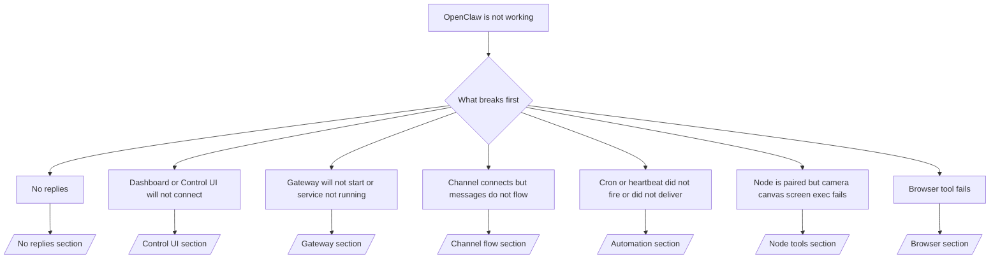

如果您只有 2 分鐘，請將此頁面作為分診的前門。

## 前 60 秒

按順序執行以下確切的檢查步驟：

```bash
openclaw status
openclaw status --all
openclaw gateway probe
openclaw gateway status
openclaw doctor
openclaw channels status --probe
openclaw logs --follow
```

一行良好輸出：

- `openclaw status` → 顯示已配置的通道，且沒有明顯的鑑權錯誤。
- `openclaw status --all` → 存在完整報告且可分享。
- `openclaw gateway probe` → 預期的閘道目標可連線 (`Reachable: yes`)。 `Capability: ...` 會告訴您探測器能證明的鑑權等級，而 `Read probe: limited - missing scope: operator.read` 是診斷降級，並非連線失敗。
- `openclaw gateway status` → `Runtime: running`、`Connectivity probe: ok` 以及合理的 `Capability: ...` 行。如果您也需要讀取權限的 RPC 證明，請使用 `--require-rpc`。
- `openclaw doctor` → 無阻擋性的配置/服務錯誤。
- `openclaw channels status --probe` → 可連線的閘道會回傳即時的每個帳戶傳輸狀態，以及探測/稽核結果，例如 `works` 或 `audit ok`；如果閘道無法連線，該指令會退回到僅配置摘要。
- `openclaw logs --follow` → 活動穩定，無重複的致命錯誤。

## 助理感覺受限或缺少工具

如果助理無法檢查檔案、執行指令、使用瀏覽器自動化或看到預期的工具，請先檢查有效工具設定檔：

```bash
openclaw status
openclaw status --all
openclaw doctor
```

常見原因：

- `tools.profile: "messaging"` 對於僅限聊天的代理人來說是刻意設定的窄範圍。
- `tools.profile: "coding"` 是用於存放庫、檔案、Shell 和執行時工作流程的常用設定檔。
- `tools.profile: "full"` 提供最廣泛的工具集，應僅限於受信任的操作員控制的代理人使用。
- 每個代理人的 `agents.list[].tools` 覆寫可以縮小或擴大單一代理人的根設定檔。

變更根或每個代理人的工具設定檔，然後重新啟動或重新載入閘道，並再次執行 `openclaw status --all`。請參閱 [工具](/zh-Hant/tools) 以了解設定檔模型和允許/拒絕覆寫。

## Anthropic 長內容 429

如果您看到：
`HTTP 429: rate_limit_error: Extra usage is required for long context requests`，
請前往 [/gateway/troubleshooting#anthropic-429-extra-usage-required-for-long-context](/zh-Hant/gateway/troubleshooting#anthropic-429-extra-usage-required-for-long-context)。

## 本機 OpenAI 相容後端直接運作正常但在 OpenClaw 中失敗

如果您的本機或自託管 `/v1` 後端能回應小型直接
`/v1/chat/completions` 探測，但在 `openclaw infer model run` 或一般
agent 輪次時失敗：

1. 如果錯誤提及 `messages[].content` 預期字串，請設定
   `models.providers.<provider>.models[].compat.requiresStringContent: true`。
2. 如果後端僅在 OpenClaw agent 輪次時仍然失敗，請設定
   `models.providers.<provider>.models[].compat.supportsTools: false` 並重試。
3. 如果微小的直接呼叫仍然可行，但較大的 OpenClaw 提示會導致後端
   當機，請將其餘問題視為上游模型/伺服器限制，並參閱深度操作手冊繼續排查：
   [/gateway/troubleshooting#local-openai-compatible-backend-passes-direct-probes-but-agent-runs-fail](/zh-Hant/gateway/troubleshooting#local-openai-compatible-backend-passes-direct-probes-but-agent-runs-fail)

## 外掛程式安裝失敗，並顯示缺少 openclaw 延伸模組

如果安裝失敗並顯示 `package.json missing openclaw.extensions`，表示外掛程式套件
使用的是 OpenClaw 不再接受的舊格式。

在外掛程式套件中修復：

1. 將 `openclaw.extensions` 加入 `package.json`。
2. 將項目指向建置後的執行時期檔案 (通常是 `./dist/index.js`)。
3. 重新發布外掛程式並再次執行 `openclaw plugins install <package>`。

範例：

```json
{
  "name": "@openclaw/my-plugin",
  "version": "1.2.3",
  "openclaw": {
    "extensions": ["./dist/index.js"]
  }
}
```

參考資料：[外掛程式架構](/zh-Hant/plugins/architecture)

## 外掛程式存在但因可疑擁有權而被封鎖

如果 `openclaw doctor`、設定或啟動警告顯示：

```text
blocked plugin candidate: suspicious ownership (... uid=1000, expected uid=0 or root)
plugin present but blocked
```

表示外掛程式檔案是由與載入它們的程序不同的 Unix 使用者所擁有。請勿移除外掛程式設定。請修正檔案擁有權，或以擁有狀態目錄的同一個使用者身分執行 OpenClaw。

Docker 安裝通常以 `node` (uid `1000`) 執行。針對預設的 Docker
設定，請修復主機繫接掛載：

```bash
sudo chown -R 1000:1000 /path/to/openclaw-config /path/to/openclaw-workspace
openclaw doctor --fix
```

如果您刻意以 root 身分執行 OpenClaw，請改為將受管理的外掛程式根目錄修復為 root 擁有權：

```bash
sudo chown -R root:root /path/to/openclaw-config/npm
openclaw doctor --fix
```

更深入的文件：

- [外掛程式路徑擁有權](/zh-Hant/tools/plugin#blocked-plugin-path-ownership)
- [Docker 權限](/zh-Hant/install/docker#permissions-and-eacces)

## 決策樹



<AccordionGroup>
  <Accordion title="No replies">
    ```bash
    openclaw status
    openclaw gateway status
    openclaw channels status --probe
    openclaw pairing list --channel <channel> [--account <id>]
    openclaw logs --follow
    ```

    良好的輸出看起來像：

    - `Runtime: running`
    - `Connectivity probe: ok`
    - `Capability: read-only`、 `write-capable` 或 `admin-capable`
    - 您的頻道顯示傳輸已連接，並且在支援的情況下， `channels status --probe` 中顯示 `works` 或 `audit ok`
    - 發送者顯示為已批准（或 DM 政策為開放/許可清單）

    常見日誌特徵：

    - `drop guild message (mention required` → 提及閘門阻擋了 Discord 中的訊息。
    - `pairing request` → 發送者未獲批准，正在等待 DM 配對批准。
    - 頻道日誌中的 `blocked` / `allowlist` → 發送者、房間或群組已被過濾。

    深入頁面：

    - [/gateway/troubleshooting#no-replies](/zh-Hant/gateway/troubleshooting#no-replies)
    - [/channels/troubleshooting](/zh-Hant/channels/troubleshooting)
    - [/channels/pairing](/zh-Hant/channels/pairing)

  </Accordion>

  <Accordion title="Dashboard 或 Control UI 無法連線">
    ```bash
    openclaw status
    openclaw gateway status
    openclaw logs --follow
    openclaw doctor
    openclaw channels status --probe
    ```

    良好的輸出看起來像：

    - `Dashboard: http://...` 顯示於 `openclaw gateway status` 中
    - `Connectivity probe: ok`
    - `Capability: read-only`、`write-capable` 或 `admin-capable`
    - 日誌中沒有授權迴圈

    常見的日誌特徵：

    - `device identity required` → HTTP/非安全內容無法完成裝置授權。
    - `origin not allowed` → 瀏覽器 `Origin` 不被允許用於 Control UI
      閘道目標。
    - `AUTH_TOKEN_MISMATCH` 並帶有重試提示 (`canRetryWithDeviceToken=true`) → 可能會自動進行一次受信任的裝置權杖重試。
    - 該快取權杖重試會重複使用與配對裝置權杖一起儲存的快取範圍集。明確的 `deviceToken` / 明確的 `scopes` 呼叫者則會
      改為保留其請求的範圍集。
    - 在非同步 Tailscale Serve Control UI 路徑上，針對相同 `{scope, ip}` 的失敗嘗試會在限制器記錄失敗之前進行序列化，因此第二個併發的錯誤重試可能已經顯示 `retry later`。
    - 來自 localhost
      瀏覽器來源的 `too many failed authentication attempts (retry later)` → 來自該相同 `Origin` 的重複失敗會被暫時
      鎖定；另一個 localhost 來源則使用獨立的 bucket。
    - 該次重試後重複出現 `unauthorized` → 權杖/密碼錯誤、授權模式不符，或過期的配對裝置權杖。
    - `gateway connect failed:` → UI 鎖定了錯誤的 URL/連接埠或無法連線的閘道。

    深入頁面：

    - [/gateway/troubleshooting#dashboard-control-ui-connectivity](/zh-Hant/gateway/troubleshooting#dashboard-control-ui-connectivity)
    - [/web/control-ui](/zh-Hant/web/control-ui)
    - [/gateway/authentication](/zh-Hant/gateway/authentication)

  </Accordion>

  <Accordion title="Gateway 無法啟動或服務已安裝但未執行">
    ```bash
    openclaw status
    openclaw gateway status
    openclaw logs --follow
    openclaw doctor
    openclaw channels status --probe
    ```

    良好的輸出看起來像：

    - `Service: ... (loaded)`
    - `Runtime: running`
    - `Connectivity probe: ok`
    - `Capability: read-only`、 `write-capable` 或 `admin-capable`

    常見的日誌特徵：

    - `Gateway start blocked: set gateway.mode=local` 或 `existing config is missing gateway.mode` → gateway 模式為遠端，或設定檔缺少 local-mode 標記且應進行修復。
    - `refusing to bind gateway ... without auth` → 非迴路綁定且沒有有效的 gateway auth path (token/password，或設定的 trusted-proxy)。
    - `another gateway instance is already listening` 或 `EADDRINUSE` → 連接埠已被佔用。

    深入頁面：

    - [/gateway/troubleshooting#gateway-service-not-running](/zh-Hant/gateway/troubleshooting#gateway-service-not-running)
    - [/gateway/background-process](/zh-Hant/gateway/background-process)
    - [/gateway/configuration](/zh-Hant/gateway/configuration)

  </Accordion>

  <Accordion title="通道已連線但訊息未流動">
    ```bash
    openclaw status
    openclaw gateway status
    openclaw logs --follow
    openclaw doctor
    openclaw channels status --probe
    ```

    良好的輸出看起來像：

    - 通道傳輸已連線。
    - 配對/許可清單檢查通過。
    - 在需要的地方偵測到提及。

    常見的日誌特徵：

    - `mention required` → 群組提及閘門阻擋了處理程序。
    - `pairing` / `pending` → DM 發送者尚未通過核准。
    - `not_in_channel`、 `missing_scope`、 `Forbidden`、 `401/403` → 通道權限 token 問題。

    深入頁面：

    - [/gateway/troubleshooting#channel-connected-messages-not-flowing](/zh-Hant/gateway/troubleshooting#channel-connected-messages-not-flowing)
    - [/channels/troubleshooting](/zh-Hant/channels/troubleshooting)

  </Accordion>

  <Accordion title="Cron 或心跳未觸發或未傳送">
    ```bash
    openclaw status
    openclaw gateway status
    openclaw cron status
    openclaw cron list
    openclaw cron runs --id <jobId> --limit 20
    openclaw logs --follow
    ```

    良好的輸出看起來像這樣：

    - `cron.status` 顯示已啟用並有下一次喚醒時間。
    - `cron runs` 顯示最近的 `ok` 項目。
    - 心跳已啟用且不在活躍時間之外。

    常見日誌特徵：

    - `cron: scheduler disabled; jobs will not run automatically` → cron 已停用。
    - `heartbeat skipped` 搭配 `reason=quiet-hours` → 在設定的活躍時間之外。
    - `heartbeat skipped` 搭配 `reason=empty-heartbeat-file` → `HEARTBEAT.md` 存在，但僅包含空白/僅標題的結構。
    - `heartbeat skipped` 搭配 `reason=no-tasks-due` → `HEARTBEAT.md` 任務模式已啟用，但尚未到任何任務間隔。
    - `heartbeat skipped` 搭配 `reason=alerts-disabled` → 所有心跳可見性均已停用（`showOk`、`showAlerts` 和 `useIndicator` 均已關閉）。
    - `requests-in-flight` → 主通道忙碌；心跳喚醒已延遲。
    - `unknown accountId` → 心跳傳送目標帳戶不存在。

    深入頁面：

    - [/gateway/troubleshooting#cron-and-heartbeat-delivery](/zh-Hant/gateway/troubleshooting#cron-and-heartbeat-delivery)
    - [/automation/cron-jobs#troubleshooting](/zh-Hant/automation/cron-jobs#troubleshooting)
    - [/gateway/heartbeat](/zh-Hant/gateway/heartbeat)

  </Accordion>

  <Accordion title="節點已配對，但工具在相機、畫布、螢幕或執行時失敗">
    ```bash
    openclaw status
    openclaw gateway status
    openclaw nodes status
    openclaw nodes describe --node <idOrNameOrIp>
    openclaw logs --follow
    ```

    正常的輸出看起來像這樣：

    - 節點被列為已連線，且角色為 `node`。
    - 您正在呼叫的指令具備相應能力。
    - 工具的權限狀態為已授予。

    常見的日誌特徵：

    - `NODE_BACKGROUND_UNAVAILABLE` → 將節點應用程式帶到前景。
    - `*_PERMISSION_REQUIRED` → OS 權限被拒絕或遺失。
    - `SYSTEM_RUN_DENIED: approval required` → 執行審核正在等待中。
    - `SYSTEM_RUN_DENIED: allowlist miss` → 指令不在執行允許清單中。

    深入頁面：

    - [/gateway/troubleshooting#node-paired-tool-fails](/zh-Hant/gateway/troubleshooting#node-paired-tool-fails)
    - [/nodes/troubleshooting](/zh-Hant/nodes/troubleshooting)
    - [/tools/exec-approvals](/zh-Hant/tools/exec-approvals)

  </Accordion>

  <Accordion title="Exec suddenly asks for approval">
    ```bash
    openclaw config get tools.exec.host
    openclaw config get tools.exec.security
    openclaw config get tools.exec.ask
    openclaw gateway restart
    ```

    發生了什麼變化：

    - 如果 `tools.exec.host` 未設定，預設值為 `auto`。
    - 當沙箱執行環境處於活動狀態時，`host=auto` 會解析為 `sandbox`，否則為 `gateway`。
    - `host=auto` 僅負責路由；無提示「YOLO」行為來自 `security=full` 加上閘道/節點上的 `ask=off`。
    - 在 `gateway` 和 `node` 上，未設定的 `tools.exec.security` 預設值為 `full`。
    - 未設定的 `tools.exec.ask` 預設值為 `off`。
    - 結果：如果您看到核准請求，表示某些主機本機或每個工作階段的策略將執行限制得比目前預設值更嚴格。

    恢復目前預設的無核准行為：

    ```bash
    openclaw config set tools.exec.host gateway
    openclaw config set tools.exec.security full
    openclaw config set tools.exec.ask off
    openclaw gateway restart
    ```

    更安全的替代方案：

    - 如果您只想要穩定的主機路由，請僅設定 `tools.exec.host=gateway`。
    - 如果您想要主機執行但仍希望在允許清單遺漏時進行審查，請將 `security=allowlist` 與 `ask=on-miss` 搭配使用。
    - 如果您希望 `host=auto` 解析回 `sandbox`，請啟用沙箱模式。

    常見日籤特徵：

    - `Approval required.` → 指令正在等待 `/approve ...`。
    - `SYSTEM_RUN_DENIED: approval required` → 節點主機執行核准待決。
    - `exec host=sandbox requires a sandbox runtime for this session` → 隱含/明確的沙箱選擇，但沙箱模式已關閉。

    深入頁面：

    - [/tools/exec](/zh-Hant/tools/exec)
    - [/tools/exec-approvals](/zh-Hant/tools/exec-approvals)
    - [/gateway/security#what-the-audit-checks-high-level](/zh-Hant/gateway/security#what-the-audit-checks-high-level)

  </Accordion>

  <Accordion title="Browser tool fails">
    ```bash
    openclaw status
    openclaw gateway status
    openclaw browser status
    openclaw logs --follow
    openclaw doctor
    ```

    正常的輸出如下所示：

    - 瀏覽器狀態顯示 `running: true` 和選定的瀏覽器/設定檔。
    - `openclaw` 啟動，或者 `user` 可以看到本機 Chrome 分頁。

    常見日誌特徵：

    - `unknown command "browser"` 或 `unknown command 'browser'` → `plugins.allow` 已設定且未包含 `browser`。
    - `Failed to start Chrome CDP on port` → 本機瀏覽器啟動失敗。
    - `browser.executablePath not found` → 設定的二進位路徑錯誤。
    - `browser.cdpUrl must be http(s) or ws(s)` → 設定的 CDP URL 使用了不支援的協定。
    - `browser.cdpUrl has invalid port` → 設定的 CDP URL 具有錯誤或超出範圍的連接埠。
    - `No Chrome tabs found for profile="user"` → Chrome MCP 附加設定檔沒有開啟的本機 Chrome 分頁。
    - `Remote CDP for profile "<name>" is not reachable` → 設定的遠端 CDP 端點無法從此主機連線。
    - `Browser attachOnly is enabled ... not reachable` 或 `Browser attachOnly is enabled and CDP websocket ... is not reachable` → 僅附加設定檔沒有即時的 CDP 目標。
    - 僅附加或遠端 CDP 設定檔上的過時視口/深色模式/地區設定/離線覆蓋 → 執行 `openclaw browser stop --browser-profile <name>` 以關閉作用中的控制會話並釋放模擬狀態，無需重新啟動閘道。

    深入頁面：

    - [/gateway/troubleshooting#browser-tool-fails](/zh-Hant/gateway/troubleshooting#browser-tool-fails)
    - [/tools/browser#missing-browser-command-or-tool](/zh-Hant/tools/browser#missing-browser-command-or-tool)
    - [/tools/browser-linux-troubleshooting](/zh-Hant/tools/browser-linux-troubleshooting)
    - [/tools/browser-wsl2-windows-remote-cdp-troubleshooting](/zh-Hant/tools/browser-wsl2-windows-remote-cdp-troubleshooting)

  </Accordion>

</AccordionGroup>

## 相關

- [FAQ](/zh-Hant/help/faq) — 常見問題
- [Gateway Troubleshooting](/zh-Hant/gateway/troubleshooting) — 閘道特定問題
- [Doctor](/zh-Hant/gateway/doctor) — 自動健康檢查與修復
- [Channel Troubleshooting](/zh-Hant/channels/troubleshooting) — 通道連線問題
- [Automation Troubleshooting](/zh-Hant/automation/cron-jobs#troubleshooting) — cron 和 heartbeat 問題
