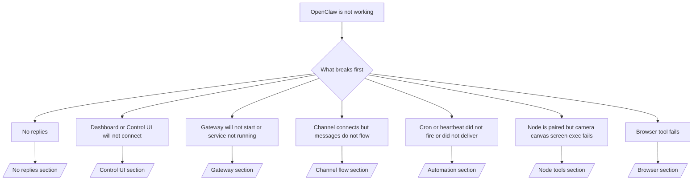

如果您只有 2 分鐘，請將此頁面作為分診的前門。

## 前 60 秒

按順序執行以下確切的檢查步驟：

```bash
openclaw status
openclaw status --all
openclaw gateway probe
openclaw gateway status
openclaw doctor
openclaw channels status --probe
openclaw logs --follow
```

一行良好輸出：

- `openclaw status` → 顯示已設定的頻道且沒有明顯的授權錯誤。
- `openclaw status --all` → 完整報告存在且可分享。
- `openclaw gateway probe` → 預期的閘道目標可連接 (`Reachable: yes`)。`Capability: ...` 告訴您探測器可證明的授權等級，而 `Read probe: limited - missing scope: operator.read` 是降級的診斷，而非連線失敗。
- `openclaw gateway status` → `Runtime: running`、`Connectivity probe: ok` 和合理的 `Capability: ...` 行。如果您也需要讀取範圍的 RPC 證明，請使用 `--require-rpc`。
- `openclaw doctor` → 沒有阻塞性的設定/服務錯誤。
- `openclaw channels status --probe` → 可連接的閘道會傳回即時的每個帳戶傳輸狀態，加上探測/稽核結果，例如 `works` 或 `audit ok`；如果閘道無法連接，該指令會退回僅包含設定的摘要。
- `openclaw logs --follow` → 穩定活動，無重複的致命錯誤。

## Anthropic 長語境 429

如果您看到：
`HTTP 429: rate_limit_error: Extra usage is required for long context requests`，
請前往 [/gateway/troubleshooting#anthropic-429-extra-usage-required-for-long-context](/zh-Hant/gateway/troubleshooting#anthropic-429-extra-usage-required-for-long-context)。

## 本機 OpenAI 相容後端直接運作正常但在 OpenClaw 中失敗

如果您本機或自託管的 `/v1` 後端能回應小型直接
`/v1/chat/completions` 探測，但在 `openclaw infer model run` 或一般
代理回合中失敗：

1. 如果錯誤提到 `messages[].content` 預期為字串，請設定
   `models.providers.<provider>.models[].compat.requiresStringContent: true`。
2. 如果後端仍然僅在 OpenClaw 代理回合中失敗，請設定
   `models.providers.<provider>.models[].compat.supportsTools: false` 並重試。
3. If tiny direct calls still work but larger OpenClaw prompts crash the
   backend, treat the remaining issue as an upstream model/server limitation and
   continue in the deep runbook:
   [/gateway/troubleshooting#local-openai-compatible-backend-passes-direct-probes-but-agent-runs-fail](/zh-Hant/gateway/troubleshooting#local-openai-compatible-backend-passes-direct-probes-but-agent-runs-fail)

## Plugin install fails with missing openclaw extensions

If install fails with `package.json missing openclaw.extensions`, the plugin package
is using an old shape that OpenClaw no longer accepts.

Fix in the plugin package:

1. Add `openclaw.extensions` to `package.json`.
2. Point entries at built runtime files (usually `./dist/index.js`).
3. Republish the plugin and run `openclaw plugins install <package>` again.

Example:

```json
{
  "name": "@openclaw/my-plugin",
  "version": "1.2.3",
  "openclaw": {
    "extensions": ["./dist/index.js"]
  }
}
```

Reference: [Plugin architecture](/zh-Hant/plugins/architecture)

## Decision tree



<AccordionGroup>
  <Accordion title="No replies">
    ```bash
    openclaw status
    openclaw gateway status
    openclaw channels status --probe
    openclaw pairing list --channel <channel> [--account <id>]
    openclaw logs --follow
    ```

    Good output looks like:

    - `Runtime: running`
    - `Connectivity probe: ok`
    - `Capability: read-only`, `write-capable`, or `admin-capable`
    - Your channel shows transport connected and, where supported, `works` or `audit ok` in `channels status --probe`
    - Sender appears approved (or DM policy is open/allowlist)

    Common log signatures:

    - `drop guild message (mention required` → mention gating blocked the message in Discord.
    - `pairing request` → sender is unapproved and waiting for DM pairing approval.
    - `blocked` / `allowlist` in channel logs → sender, room, or group is filtered.

    Deep pages:

    - [/gateway/troubleshooting#no-replies](/zh-Hant/gateway/troubleshooting#no-replies)
    - [/channels/troubleshooting](/zh-Hant/channels/troubleshooting)
    - [/channels/pairing](/zh-Hant/channels/pairing)

  </Accordion>

  <Accordion title="儀表板或控制 UI 無法連線">
    ```bash
    openclaw status
    openclaw gateway status
    openclaw logs --follow
    openclaw doctor
    openclaw channels status --probe
    ```

    良好的輸出如下所示：

    - `Dashboard: http://...` 顯示在 `openclaw gateway status` 中
    - `Connectivity probe: ok`
    - `Capability: read-only`、`write-capable` 或 `admin-capable`
    - 記錄中沒有驗證迴圈

    常見的記錄特徵：

    - `device identity required` → HTTP/非安全上下文無法完成裝置驗證。
    - `origin not allowed` → 瀏覽器 `Origin` 不允許用於控制 UI
      閘道目標。
    - `AUTH_TOKEN_MISMATCH` 附帶重試提示 (`canRetryWithDeviceToken=true`) → 可能會自動進行一次受信任的裝置權杖重試。
    - 該快取權杖重試會重複使用與配對裝置權杖一起儲存的快取範圍集。明確的 `deviceToken` / 明確的 `scopes` 呼叫者則會
      改為保留其要求的範圍集。
    - 在非同步 Tailscale Serve 控制 UI 路徑上，相同 `{scope, ip}` 的失敗嘗試會在限制器記錄失敗之前序列化，因此
      第二個併發的錯誤重試可能已經顯示 `retry later`。
    - 來自 localhost
      瀏覽器來源的 `too many failed authentication attempts (retry later)` → 來自同一個 `Origin` 的重複失敗會暫時被
      鎖定；另一個 localhost 來源則使用個別的儲存桶。
    - 該重試後重複出現 `unauthorized` → 錯誤的權杖/密碼、驗證模式不符，或過期的配對裝置權杖。
    - `gateway connect failed:` → UI 的目標是錯誤的 URL/連接埠或無法連線的閘道。

    深入頁面：

    - [/gateway/troubleshooting#dashboard-control-ui-connectivity](/zh-Hant/gateway/troubleshooting#dashboard-control-ui-connectivity)
    - [/web/control-ui](/zh-Hant/web/control-ui)
    - [/gateway/authentication](/zh-Hant/gateway/authentication)

  </Accordion>

  <Accordion title="Gateway 無法啟動或服務已安裝但未運行">
    ```bash
    openclaw status
    openclaw gateway status
    openclaw logs --follow
    openclaw doctor
    openclaw channels status --probe
    ```

    正常的輸出看起來像：

    - `Service: ... (loaded)`
    - `Runtime: running`
    - `Connectivity probe: ok`
    - `Capability: read-only`、`write-capable` 或 `admin-capable`

    常見日誌特徵：

    - `Gateway start blocked: set gateway.mode=local` 或 `existing config is missing gateway.mode` → 閘道模式為遠端，或設定檔缺少本地模式標記且應予以修復。
    - `refusing to bind gateway ... without auth` → 非回送連線綁定，且沒有有效的閘道驗證路徑（令牌/密碼，或已設定的受信任 Proxy）。
    - `another gateway instance is already listening` 或 `EADDRINUSE` → 連接埠已被佔用。

    深入頁面：

    - [/gateway/troubleshooting#gateway-service-not-running](/zh-Hant/gateway/troubleshooting#gateway-service-not-running)
    - [/gateway/background-process](/zh-Hant/gateway/background-process)
    - [/gateway/configuration](/zh-Hant/gateway/configuration)

  </Accordion>

  <Accordion title="頻道已連接但訊息無法流動">
    ```bash
    openclaw status
    openclaw gateway status
    openclaw logs --follow
    openclaw doctor
    openclaw channels status --probe
    ```

    正常的輸出看起來像：

    - 頻道傳輸已連接。
    - 配對/白名單檢查通過。
    - 在需要的地方檢測到提及。

    常見日誌特徵：

    - `mention required` → 群組提及閘門阻擋了處理。
    - `pairing` / `pending` → DM 發送者尚未核准。
    - `not_in_channel`、`missing_scope`、`Forbidden`、`401/403` → 頻道權限令牌問題。

    深入頁面：

    - [/gateway/troubleshooting#channel-connected-messages-not-flowing](/zh-Hant/gateway/troubleshooting#channel-connected-messages-not-flowing)
    - [/channels/troubleshooting](/zh-Hant/channels/troubleshooting)

  </Accordion>

  <Accordion title="Cron 或心跳未觸發或未傳遞">
    ```bash
    openclaw status
    openclaw gateway status
    openclaw cron status
    openclaw cron list
    openclaw cron runs --id <jobId> --limit 20
    openclaw logs --follow
    ```

    良好的輸出如下所示：

    - `cron.status` 顯示已啟用並有下一次喚醒時間。
    - `cron runs` 顯示最近的 `ok` 項目。
    - 心跳已啟用且不在非活動時間內。

    常見日誌特徵：

    - `cron: scheduler disabled; jobs will not run automatically` → cron 已停用。
    - `heartbeat skipped` 伴隨 `reason=quiet-hours` → 超出設定的活動時間。
    - `heartbeat skipped` 伴隨 `reason=empty-heartbeat-file` → `HEARTBEAT.md` 存在，但僅包含空白/僅標題的腳手架。
    - `heartbeat skipped` 伴隨 `reason=no-tasks-due` → `HEARTBEAT.md` 任務模式已啟用，但尚無任何任務間隔到期。
    - `heartbeat skipped` 伴隨 `reason=alerts-disabled` → 所有心跳可見性均已停用（`showOk`、`showAlerts` 和 `useIndicator` 均關閉）。
    - `requests-in-flight` → 主通道忙碌；心跳喚醒已延後。
    - `unknown accountId` → 心跳傳遞目標帳戶不存在。

    深入頁面：

    - [/gateway/troubleshooting#cron-and-heartbeat-delivery](/zh-Hant/gateway/troubleshooting#cron-and-heartbeat-delivery)
    - [/automation/cron-jobs#troubleshooting](/zh-Hant/automation/cron-jobs#troubleshooting)
    - [/gateway/heartbeat](/zh-Hant/gateway/heartbeat)

  </Accordion>

  <Accordion title="節點已配對但工具相機畫布螢幕執行失敗">
    ```bash
    openclaw status
    openclaw gateway status
    openclaw nodes status
    openclaw nodes describe --node <idOrNameOrIp>
    openclaw logs --follow
    ```

    正常的輸出看起來像：

    - 節點列為已連線且已針對角色 `node` 進行配對。
    - 您正在叫用的指令具備 Capability。
    - 工具的權限狀態已授權。

    常見的日誌特徵：

    - `NODE_BACKGROUND_UNAVAILABLE` → 將節點應用程式帶到前景。
    - `*_PERMISSION_REQUIRED` → OS 權限被拒絕或遺失。
    - `SYSTEM_RUN_DENIED: approval required` → 執行核准待處理。
    - `SYSTEM_RUN_DENIED: allowlist miss` → 指令未在執行允許清單中。

    深入頁面：

    - [/gateway/troubleshooting#node-paired-tool-fails](/zh-Hant/gateway/troubleshooting#node-paired-tool-fails)
    - [/nodes/troubleshooting](/zh-Hant/nodes/troubleshooting)
    - [/tools/exec-approvals](/zh-Hant/tools/exec-approvals)

  </Accordion>

  <Accordion title="Exec 突然請求批准">
    ```bash
    openclaw config get tools.exec.host
    openclaw config get tools.exec.security
    openclaw config get tools.exec.ask
    openclaw gateway restart
    ```

    變更內容：

    - 如果 `tools.exec.host` 未設定，預設值為 `auto`。
    - `host=auto` 在沙箱運行時期啟用時解析為 `sandbox`，否則為 `gateway`。
    - `host=auto` 僅用於路由；無提示的「YOLO」行為來自於 Gateway/Node 上的 `security=full` 加上 `ask=off`。
    - 在 `gateway` 和 `node` 上，未設定的 `tools.exec.security` 預設為 `full`。
    - 未設定的 `tools.exec.ask` 預設為 `off`。
    - 結果：如果您看到批准請求，表示某些主機本機或每個會話的政策將執行嚴格限制，偏離了目前的預設值。

    恢復目前的預設無需批准行為：

    ```bash
    openclaw config set tools.exec.host gateway
    openclaw config set tools.exec.security full
    openclaw config set tools.exec.ask off
    openclaw gateway restart
    ```

    更安全的替代方案：

    - 如果您只想要穩定的主機路由，請僅設定 `tools.exec.host=gateway`。
    - 如果您想要主機執行但仍希望在允許清單遺漏時進行審查，請使用 `security=allowlist` 搭配 `ask=on-miss`。
    - 如果您希望 `host=auto` 解析回 `sandbox`，請啟用沙箱模式。

    常見日誌特徵：

    - `Approval required.` → 指令正在等待 `/approve ...`。
    - `SYSTEM_RUN_DENIED: approval required` → node-host 執行批准待處理。
    - `exec host=sandbox requires a sandbox runtime for this session` → 隱含/明確的沙箱選取，但沙箱模式已關閉。

    深度頁面：

    - [/tools/exec](/zh-Hant/tools/exec)
    - [/tools/exec-approvals](/zh-Hant/tools/exec-approvals)
    - [/gateway/security#what-the-audit-checks-high-level](/zh-Hant/gateway/security#what-the-audit-checks-high-level)

  </Accordion>

  <Accordion title="Browser tool fails">
    ```bash
    openclaw status
    openclaw gateway status
    openclaw browser status
    openclaw logs --follow
    openclaw doctor
    ```

    正常的輸出如下所示：

    - Browser status 顯示 `running: true` 以及一個選定的瀏覽器/設定檔。
    - `openclaw` 已啟動，或是 `user` 可以看見本機 Chrome 分頁。

    常見日誌特徵：

    - `unknown command "browser"` 或 `unknown command 'browser'` → `plugins.allow` 已設定且未包含 `browser`。
    - `Failed to start Chrome CDP on port` → 本機瀏覽器啟動失敗。
    - `browser.executablePath not found` → 設定的二進位路徑錯誤。
    - `browser.cdpUrl must be http(s) or ws(s)` → 設定的 CDP URL 使用了不支援的配置 (scheme)。
    - `browser.cdpUrl has invalid port` → 設定的 CDP URL 具有錯誤或超出範圍的連接埠。
    - `No Chrome tabs found for profile="user"` → Chrome MCP 連線設定檔沒有開啟的本機 Chrome 分頁。
    - `Remote CDP for profile "<name>" is not reachable` → 此主機無法連線至設定的遠端 CDP 端點。
    - `Browser attachOnly is enabled ... not reachable` 或 `Browser attachOnly is enabled and CDP websocket ... is not reachable` → 僅連線 (attach-only) 設定檔沒有作用中的 CDP 目標。
    - 僅連線或遠端 CDP 設定檔上的過時檢視區 / 暗色模式 / 地區設定 / 離線覆寫 → 執行 `openclaw browser stop --browser-profile <name>` 以關閉作用中的控制工作階段並釋放模擬狀態，而不需重新啟動閘道。

    深入頁面：

    - [/gateway/troubleshooting#browser-tool-fails](/zh-Hant/gateway/troubleshooting#browser-tool-fails)
    - [/tools/browser#missing-browser-command-or-tool](/zh-Hant/tools/browser#missing-browser-command-or-tool)
    - [/tools/browser-linux-troubleshooting](/zh-Hant/tools/browser-linux-troubleshooting)
    - [/tools/browser-wsl2-windows-remote-cdp-troubleshooting](/zh-Hant/tools/browser-wsl2-windows-remote-cdp-troubleshooting)

  </Accordion>

</AccordionGroup>

## 相關

- [FAQ](/zh-Hant/help/faq) — 常見問題
- [Gateway Troubleshooting](/zh-Hant/gateway/troubleshooting) — 閘道特定問題
- [Doctor](/zh-Hant/gateway/doctor) — 自動健康檢查與修復
- [Channel Troubleshooting](/zh-Hant/channels/troubleshooting) — 頻道連線問題
- [Automation Troubleshooting](/zh-Hant/automation/cron-jobs#troubleshooting) — cron 與 heartbeat 問題
