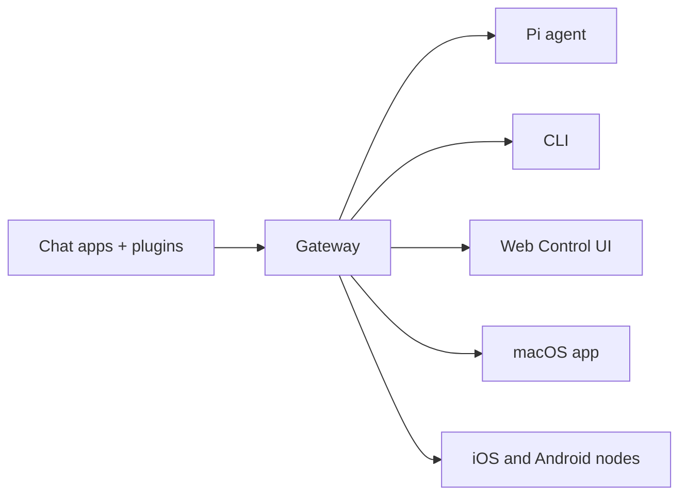

# OpenClaw 🦞

<p align="center">
  
  
</p>

> _「去角質！去角質！」_ — 一隻太空龍蝦，大概是吧

<p align="center">
  <strong>適用於各種作業系統的 AI Agent 閘道，支援 WhatsApp、Telegram、Discord、iMessage 等平台。</strong>
  <br />
  發送訊息，從口袋中獲得 Agent 的回應。外掛程式新增了 Mattermost 等更多支援。
</p>

<Columns>
  <Card title="開始使用" href="/en/start/getting-started" icon="rocket">
    安裝 OpenClaw 並在幾分鐘內啟動 Gateway。
  </Card>
  <Card title="Run Onboarding" href="/en/start/wizard" icon="sparkles">
    使用 `openclaw onboard` 進行引導式設定以及配對流程。
  </Card>
  <Card title="Open the Control UI" href="/en/web/control-ui" icon="layout-dashboard">
    啟動瀏覽器儀表板以進行聊天、設定和會話管理。
  </Card>
</Columns>

## 什麼是 OpenClaw？

OpenClaw 是一款 **自託管閘道**，能將您最喜愛的聊天應用程式（如 WhatsApp、Telegram、Discord、iMessage 等）連接至像 Pi 這樣的 AI 程式碼代理。您只需在自己的機器（或伺服器）上執行單一閘道程序，它便能充當您的訊息應用程式與隨時待命的 AI 助理之間的橋樑。

**適合對象？** 希望擁有個人 AI 助理，並能從任何地方傳送訊息給它的開發者與進階使用者 — 而且無需放棄資料控制權或依賴代管服務。

**獨特之處？**

- **自託管**：在您的硬體上執行，遵循您的規則
- **多通道**：單一閘道可同時服務 WhatsApp、Telegram、Discord 等多種平台
- **Agent-native**: 為程式編寫代理構建，支援工具使用、工作階段、記憶體和多代理路由
- **開放原始碼**: MIT 授權，社群驅動

**你需要什麼？** Node 24（推薦）或 Node 22 LTS（`22.14+`）以確保相容性、來自您選擇的提供商的 API 金鑰，以及 5 分鐘時間。為了獲得最佳品質和安全性，請使用可用的最強大最新世代模型。

## 運作原理



Gateway 是工作階段、路由和通道連線的唯一真實來源。

## 主要功能

<Columns>
  <Card title="多通道閘道" icon="network">
    透過單一 Gateway 處理程序使用 WhatsApp、Telegram、Discord 和 iMessage。
  </Card>
  <Card title="外掛通道" icon="plug">
    使用擴充套件新增 Mattermost 及更多功能。
  </Card>
  <Card title="多重代理路由" icon="route">
    針對每個代理、工作區或發送者的獨立工作階段。
  </Card>
  <Card title="媒體支援" icon="image">
    傳送和接收圖片、音訊和文件。
  </Card>
  <Card title="Web Control UI" icon="monitor">
    用於聊天、設定、會話和節點的瀏覽器儀表板。
  </Card>
  <Card title="Mobile nodes" icon="smartphone">
    配對 iOS 和 Android 節點，用於 Canvas、相機和啟用語音的工作流程。
  </Card>
</Columns>

## 快速開始

<Steps>
  <Step title="Install OpenClaw">
    ```bash
    npm install -g openclaw@latest
    ```
  </Step>
  <Step title="Onboard and install the service">
    ```bash
    openclaw onboard --install-daemon
    ```
  </Step>
  <Step title="Chat">
    在瀏覽器中開啟 Control UI 並傳送訊息：

    ```bash
    openclaw dashboard
    ```

    或連接一個通道（[Telegram](/en/channels/telegram) 最快）並從您的手機聊天。

  </Step>
</Steps>

需要完整的安裝和開發設定？請參閱 [Getting Started](/en/start/getting-started)。

## 儀表板

在 Gateway 啟動後開啟瀏覽器控制介面。

- 本機預設值：[http://127.0.0.1:18789/](http://127.0.0.1:18789/)
- 遠端存取：[Web surfaces](/en/web) 和 [Tailscale](/en/gateway/tailscale)

<p align="center">
  
</p>

## 配置（選用）

設定檔位於 `~/.openclaw/openclaw.json`。

- 如果您**不進行任何操作**，OpenClaw 將使用捆綁的 Pi 二進制檔案在 RPC 模式下運行，並採用每個發送者各自的會話。
- 如果您想要鎖定存取，請從 `channels.whatsapp.allowFrom` 開始並（針對群組）設定提及規則。

範例：

```json5
{
  channels: {
    whatsapp: {
      allowFrom: ["+15555550123"],
      groups: { "*": { requireMention: true } },
    },
  },
  messages: { groupChat: { mentionPatterns: ["@openclaw"] } },
}
```

## 從這裡開始

<Columns>
  <Card title="Docs hubs" href="/en/start/hubs" icon="book-open">
    所有文件和指南，依使用案例整理。
  </Card>
  <Card title="設定" href="/en/gateway/configuration" icon="settings">
    核心閘道設定、權杖和提供者設定。
  </Card>
  <Card title="遠端存取" href="/en/gateway/remote" icon="globe">
    SSH 和 tailnet 存取模式。
  </Card>
  <Card title="頻道" href="/en/channels/telegram" icon="message-square">
    針對 WhatsApp、Telegram、Discord 等的特定頻道設定。
  </Card>
  <Card title="Nodes" href="/en/nodes" icon="smartphone">
    具備配對、Canvas、相機及裝置操作的 iOS 與 Android 節點。
  </Card>
  <Card title="Help" href="/en/help" icon="life-buoy">
    常見修復方法與疑難排解入口。
  </Card>
</Columns>

## 深入瞭解

<Columns>
  <Card title="Full feature list" href="/en/concepts/features" icon="list">
    完整的通道、路由與媒體功能。
  </Card>
  <Card title="Multi-agent routing" href="/en/concepts/multi-agent" icon="route">
    工作區隔離與個別代理階段作業。
  </Card>
  <Card title="Security" href="/en/gateway/security" icon="shield">
    權杖、允許清單與安全控制。
  </Card>
  <Card title="Troubleshooting" href="/en/gateway/troubleshooting" icon="wrench">
    閘道診斷與常見錯誤。
  </Card>
  <Card title="關於與鳴謝" href="/en/reference/credits" icon="info">
    專案起源、貢獻者與授權。
  </Card>
</Columns>
