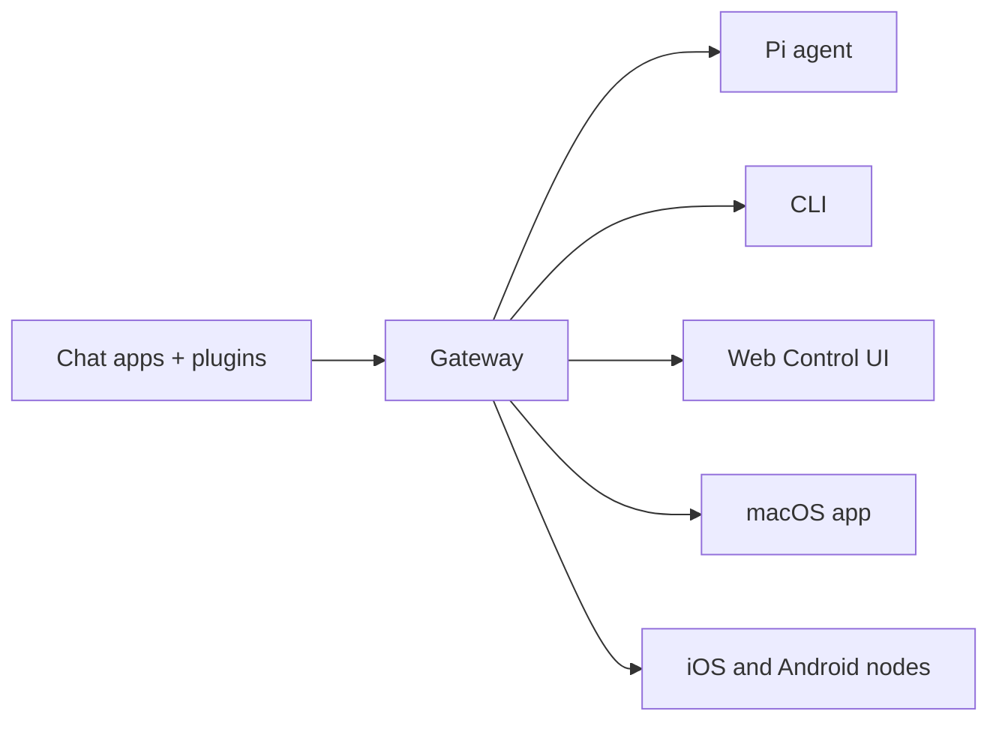

# OpenClaw 🦞

<p align="center">
  
  
</p>

> _「去角質！去角質！」_ — 也許是一隻太空龍蝦

<p align="center">
  <strong>適用於任何作業系統的 AI 智能體閘道，支援 WhatsApp、Telegram、Discord、iMessage 等平台。</strong>
  <br />
  發送訊息，即可從您的口袋中獲得智能體回應。插件可新增 Mattermost 等支援。
</p>

<Columns>
  <Card title="開始使用" href="/zh-Hant/start/getting-started" icon="rocket">
    安裝 OpenClaw 並在數分鐘內啟動 Gateway。
  </Card>
  <Card title="執行 Onboarding" href="/zh-Hant/start/wizard" icon="sparkles">
    使用 `openclaw onboard` 和配對流程進行引導式設定。
  </Card>
  <Card title="開啟控制介面" href="/zh-Hant/web/control-ui" icon="layout-dashboard">
    啟動瀏覽器儀表板以進行聊天、設定和會話管理。
  </Card>
</Columns>

## 什麼是 OpenClaw？

OpenClaw 是一個**自託管網關**，能將您最喜愛的聊天應用程式（如 WhatsApp、Telegram、Discord、iMessage 等）連接到像 Pi 這樣的 AI 編碼代理。您只需在自己的機器（或伺服器）上運行單一網關進程，它就能成為您的訊息應用程式與隨時待命的 AI 助手之間的橋樑。

**適合誰？** 開發人員和高級使用者，他們想要一個可以從任何地方發送訊息的個人 AI 助手——既不需要放棄對數據的控制，也不依賴託管服務。

**它的獨特之處在於？**

- **自託管**：在您的硬體上運行，由您制定規則
- **多通道**：一個網關同時服務於 WhatsApp、Telegram、Discord 等
- **代理原生**：專為具有工具使用、會話、記憶和多代理路由功能的編碼代理而構建
- **開源**：MIT 許可，社群驅動

**您需要什麼？** Node 24（推薦），或 Node 22 LTS (`22.16+`) 以確保相容性、您選擇的供應商提供的 API 金鑰，以及 5 分鐘時間。為了獲得最佳品質和安全性，請使用可用的最強大最新世代模型。

## 運作原理



Gateway 是連線階段、路由和通道連線的唯一事實來源（Single Source of Truth）。

## 主要功能

<Columns>
  <Card title="多通道閘道" icon="network">
    透過單一 Gateway 處理程序支援 WhatsApp、Telegram、Discord 和 iMessage。
  </Card>
  <Card title="外掛程式通道" icon="plug">
    使用擴充套件加入 Mattermost 等更多服務。
  </Card>
  <Card title="多代理路由" icon="route">
    每個代理、工作區或發送者的獨立會話。
  </Card>
  <Card title="媒體支援" icon="image">
    傳送和接收圖片、音訊和文件。
  </Card>
  <Card title="Web 控制介面" icon="monitor">
    用於聊天、設定、會話和節點的瀏覽器儀表板。
  </Card>
  <Card title="行動節點" icon="smartphone">
    配對 iOS 和 Android 節點以用於 Canvas、相機和啟用語音的工作流程。
  </Card>
</Columns>

## 快速開始

<Steps>
  <Step title="Install OpenClaw">
    ```exec
    npm install -g openclaw@latest
    ```
  </Step>
  <Step title="Onboard and install the service">
    ```exec
    openclaw onboard --install-daemon
    ```
  </Step>
  <Step title="Chat">
    在瀏覽器中開啟控制 UI 並傳送一則訊息：

    ```exec
    openclaw dashboard
    ```

    或者連結一個頻道（[Telegram](/zh-Hant/channels/telegram) 最快）並從您的手機聊天。

  </Step>
</Steps>

需要完整的安裝和開發設定？請參閱 [Getting Started](/zh-Hant/start/getting-started)。

## 儀表板

在 Gateway 啟動後開啟瀏覽器控制 UI。

- 本地預設：[http://127.0.0.1:18789/](http://127.0.0.1:18789/)
- 遠端存取：[Web surfaces](/zh-Hant/web) 和 [Tailscale](/zh-Hant/gateway/tailscale)

<p align="center">
  
</p>

## 設定（選用）

設定檔位於 `~/.openclaw/openclaw.json`。

- 如果您**不進行任何操作**，OpenClaw 將在 RPC 模式下使用隨附的 Pi 二進制文件，並採用每個發送者會話。
- 如果您想要鎖定它，請從 `channels.whatsapp.allowFrom` 開始，並（針對群組）提及規則。

範例：

```json5
{
  channels: {
    whatsapp: {
      allowFrom: ["+15555550123"],
      groups: { "*": { requireMention: true } },
    },
  },
  messages: { groupChat: { mentionPatterns: ["@openclaw"] } },
}
```

## 從這裡開始

<Columns>
  <Card title="Docs hubs" href="/zh-Hant/start/hubs" icon="book-open">
    所有文件與指南，依使用案例整理。
  </Card>
  <Card title="Configuration" href="/zh-Hant/gateway/configuration" icon="settings">
    核心閘道設定、權杖與提供者配置。
  </Card>
  <Card title="Remote access" href="/zh-Hant/gateway/remote" icon="globe">
    SSH 與 tailnet 存取模式。
  </Card>
  <Card title="頻道" href="/zh-Hant/channels/telegram" icon="message-square">
    針對 WhatsApp、Telegram、Discord 等平台的特定頻道設定。
  </Card>
  <Card title="節點" href="/zh-Hant/nodes" icon="smartphone">
    具備配對、Canvas、相機和裝置操作的 iOS 與 Android 節點。
  </Card>
  <Card title="協助" href="/zh-Hant/help" icon="life-buoy">
    常見解決方案與疑難排解的入口。
  </Card>
</Columns>

## 深入了解

<Columns>
  <Card title="完整功能列表" href="/zh-Hant/concepts/features" icon="list">
    完整的頻道、路由與媒體功能。
  </Card>
  <Card title="Multi-agent routing" href="/zh-Hant/concepts/multi-agent" icon="route">
    工作區隔離與每個代理程式的作業階段。
  </Card>
  <Card title="Security" href="/zh-Hant/gateway/security" icon="shield">
    權杖、允許清單與安全控制措施。
  </Card>
  <Card title="Troubleshooting" href="/zh-Hant/gateway/troubleshooting" icon="wrench">
    閘道診斷與常見錯誤。
  </Card>
  <Card title="About and credits" href="/zh-Hant/reference/credits" icon="info">
    專案起源、貢獻者與授權。
  </Card>
</Columns>
