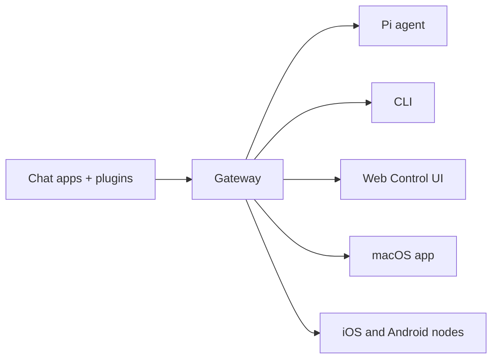

# OpenClaw 🦞

<p align="center">
  
  
</p>

> _「去角質！去角質！」_ — 一隻太空龍蝦，大概是吧

<p align="center">
  <strong>適用於 AI 代理的跨作業系統閘道，支援 Discord、Google Chat、iMessage、Matrix、Microsoft Teams、Signal、Slack、Telegram、WhatsApp、Zalo 等平台。</strong>
  <br />
  發送訊息，即可從您的口袋中獲得代理的回應。透過內建頻道、隨附的頻道外掛程式、WebChat 和行動節點，運行單一 Gateway。
</p>

<Columns>
  <Card title="開始使用" href="/zh-Hant/start/getting-started" icon="rocket">
    安裝 OpenClaw 並在幾分鐘內啟動 Gateway。
  </Card>
  <Card title="執行入門引導" href="/zh-Hant/start/wizard" icon="sparkles">
    使用 `openclaw onboard` 和配對流程進行引導式設定。
  </Card>
  <Card title="Open the Control UI" href="/zh-Hant/web/control-ui" icon="layout-dashboard">
    啟動瀏覽器儀表板以進行聊天、設定和會話管理。
  </Card>
</Columns>

## 什麼是 OpenClaw？

OpenClaw 是一個 **自託管的閘道**，可將您喜愛的聊天應用程式和頻道介面——包括內建頻道以及隨附或外部的頻道外掛程式，例如 Discord、Google Chat、iMessage、Matrix、Microsoft Teams、Signal、Slack、Telegram、WhatsApp、Zalo 等等——連接到像 Pi 這樣的 AI 編碼代理。您在自己的機器（或伺服器）上運行單一 Gateway 處理程序，它就會成為您的訊息應用程式與始終可用的 AI 助手之間的橋樑。

**適合對象？** 希望擁有個人 AI 助理，並能從任何地方傳送訊息給它的開發者與進階使用者 — 而且無需放棄資料控制權或依賴代管服務。

**獨特之處？**

- **自託管**：在您的硬體上執行，遵循您的規則
- **多頻道**：單一 Gateway 同時服務內建頻道以及隨附或外部的頻道外掛程式
- **Agent-native**: 為程式編寫代理構建，支援工具使用、工作階段、記憶體和多代理路由
- **開放原始碼**: MIT 授權，社群驅動

**您需要什麼？** Node 24 (推薦) 或 Node 22 LTS (`22.14+`) 以確保相容性、來自您選擇的供應商的 API 金鑰，以及 5 分鐘時間。為了獲得最佳品質和安全性，請使用可用的最強大的最新一代模型。

## 運作原理



Gateway 是工作階段、路由和通道連線的唯一真實來源。

## 主要功能

<Columns>
  <Card title="多通道閘道" icon="network" href="/zh-Hant/channels">
    使用單一 Gateway 程序支援 Discord、iMessage、Signal、Slack、Telegram、WhatsApp、WebChat 等更多服務。
  </Card>
  <Card title="外掛通道" icon="plug" href="/zh-Hant/tools/plugin">
    內建外掛在一般版本中新增了 Matrix、Nostr、Twitch、Zalo 等更多支援。
  </Card>
  <Card title="多代理路由" icon="route" href="/zh-Hant/concepts/multi-agent">
    每個代理、工作區或發送者的獨立工作階段。
  </Card>
  <Card title="媒體支援" icon="image" href="/zh-Hant/nodes/images">
    傳送和接收圖片、音訊和文件。
  </Card>
  <Card title="Web 控制介面" icon="monitor" href="/zh-Hant/web/control-ui">
    用於聊天、設定、工作階段和節點的瀏覽器儀表板。
  </Card>
  <Card title="行動節點" icon="smartphone" href="/zh-Hant/nodes">
    配對 iOS 和 Android 節點，用於 Canvas、相機和啟用語音的工作流程。
  </Card>
</Columns>

## 快速開始

<Steps>
  <Step title="安裝 OpenClaw">
    ```bash
    npm install -g openclaw@latest
    ```
  </Step>
  <Step title="上架並安裝服務">
    ```bash
    openclaw onboard --install-daemon
    ```
  </Step>
  <Step title="聊天">
    在瀏覽器中開啟控制 UI 並傳送訊息：

    ```bash
    openclaw dashboard
    ```

    或連接一個頻道（[Telegram](/zh-Hant/channels/telegram) 最快）並從您的手機聊天。

  </Step>
</Steps>

需要完整的安裝和開發設定？請參閱[快速入門](/zh-Hant/start/getting-started)。

## 儀表板

在 Gateway 啟動後開啟瀏覽器控制 UI。

- 本機預設：[http://127.0.0.1:18789/](http://127.0.0.1:18789/)
- 遠端存取：[網頁介面](/zh-Hant/web) 和 [Tailscale](/zh-Hant/gateway/tailscale)

<p align="center">
  
</p>

## 設定 (選用)

設定檔位於 `~/.openclaw/openclaw.json`。

- 如果您**不做任何操作**，OpenClaw 將使用捆綁的 Pi 二進位檔案，以 RPC 模式搭配每位發送者的獨立連線階段運作。
- 如果您想要鎖定權限，請從 `channels.whatsapp.allowFrom` 開始並（針對群組）設定提及規則。

範例：

```json5
{
  channels: {
    whatsapp: {
      allowFrom: ["+15555550123"],
      groups: { "*": { requireMention: true } },
    },
  },
  messages: { groupChat: { mentionPatterns: ["@openclaw"] } },
}
```

## 從這裡開始

<Columns>
  <Card title="文件中心" href="/zh-Hant/start/hubs" icon="book-open">
    所有文件和指南，依使用情況分類。
  </Card>
  <Card title="設定" href="/zh-Hant/gateway/configuration" icon="settings">
    核心閘道設定、權杖和供應商設定。
  </Card>
  <Card title="遠端存取" href="/zh-Hant/gateway/remote" icon="globe">
    SSH 和 tailnet 存取模式。
  </Card>
  <Card title="頻道" href="/zh-Hant/channels/telegram" icon="message-square">
    飛書、Microsoft Teams、WhatsApp、Telegram、Discord 等特定頻道的設定。
  </Card>
  <Card title="Nodes" href="/zh-Hant/nodes" icon="smartphone">
    具備配對、Canvas、相機和裝置操作的 iOS 與 Android 節點。
  </Card>
  <Card title="Help" href="/zh-Hant/help" icon="life-buoy">
    常見修復與疑難排解的入口。
  </Card>
</Columns>

## 了解更多

<Columns>
  <Card title="Full feature list" href="/zh-Hant/concepts/features" icon="list">
    完整的通道、路由與媒體功能。
  </Card>
  <Card title="Multi-agent routing" href="/zh-Hant/concepts/multi-agent" icon="route">
    工作區隔離與每個代理的會話。
  </Card>
  <Card title="Security" href="/zh-Hant/gateway/security" icon="shield">
    權杖、允許清單與安全控制。
  </Card>
  <Card title="Troubleshooting" href="/zh-Hant/gateway/troubleshooting" icon="wrench">
    閘道診斷與常見錯誤。
  </Card>
  <Card title="About and credits" href="/zh-Hant/reference/credits" icon="info">
    專案起源、貢獻者與授權。
  </Card>
</Columns>
