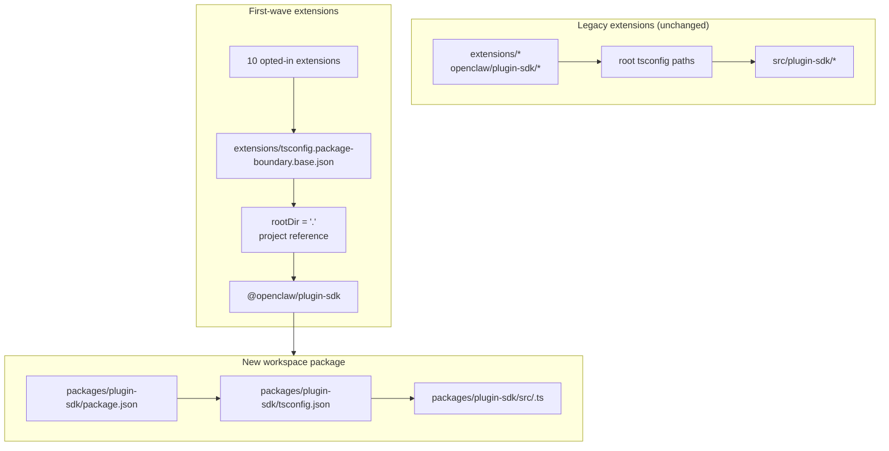

# refactor: 漸進式地將 plugin-sdk 轉變為真正的 workspace 套件

## 概述

此計畫在 `packages/plugin-sdk` 處為 plugin SDK 引入一個真正的 workspace 套件，並使用它來讓一小部分首批擴充功能選擇加入編譯器強制的套件邊界。目標是讓非法的相對匯入在正常的 `tsc` 中對一組選定的捆綁提供者擴充功能失效，而無需強制進行整個 repository 的遷移或造成巨大的合併衝突表面。

關鍵的漸進步驟是暫時並行運行兩種模式：

| 模式         | 匯入形狀                 | 誰使用它                     | 強制執行                        |
| ------------ | ------------------------ | ---------------------------- | ------------------------------- |
| 舊版模式     | `openclaw/plugin-sdk/*`  | 所有現有未選擇加入的擴充功能 | 目前的寬鬆行為保持不變          |
| 選擇加入模式 | `@openclaw/plugin-sdk/*` | 僅限首批擴充功能             | 套件本地的 `rootDir` + 專案參考 |

## 問題框架

目前的 repository 匯出了龐大的公開 plugin SDK 表面，但它並非一個真正的
workspace 套件。取而代之的是：

- 根目錄的 `tsconfig.json` 將 `openclaw/plugin-sdk/*` 直接映射到
  `src/plugin-sdk/*.ts`
- 未選擇加入先前實驗的擴充功能仍然共享該
  全域 source-alias 行為
- 僅當允許的 SDK 匯入停止解析為原始
  repository 原始碼時，新增 `rootDir` 才能運作

這意味著 repository 可以描述所需的邊界策略，但 TypeScript
並未針對大多數擴充功能乾淨地強制執行它。

您需要一條能夠滿足以下條件的漸進路徑：

- 讓 `plugin-sdk` 成為真實存在的
- 將 SDK 朝向一個名為 `@openclaw/plugin-sdk` 的 workspace 套件邁進
- 在第一個 PR 中僅變更大約 10 個擴充功能
- 將其餘的擴充功能樹保留在舊方案上，直到稍後進行清理
- 避免將 `tsconfig.plugin-sdk.dts.json` + postinstall 產生的宣告
  工作流程作為首批推出的主要機制

## 需求追溯

- R1. 在 `packages/` 下為 plugin SDK 建立一個真正的 workspace 套件。
- R2. 將新套件命名為 `@openclaw/plugin-sdk`。
- R3. 給新的 SDK 套件它自己的 `package.json` 和 `tsconfig.json`。
- R4. 在遷移期間，保持舊版 `openclaw/plugin-sdk/*` 匯入對未選入擴充功能的正常運作。
- R5. 在第一個 PR 中僅選入一小部分首批擴充功能。
- R6. 首批擴充功能對於離開其套件根目錄的相對匯入必須封閉失敗。
- R7. 首批擴充功能必須透過套件相依性和 TS 專案參考來使用 SDK，而不是透過根 `paths` 別名。
- R8. 此計畫必須避免為編輯器正確性而進行全域倉庫強制性 postinstall 產生步驟。
- R9. 首批推出必須可審查且可合併為一個中等規模的 PR，而非全域倉庫 300+ 個檔案的重構。

## 範圍邊界

- 不在第一個 PR 中完全遷移所有捆綁的擴充功能。
- 第一個 PR 中不要求刪除 `src/plugin-sdk`。
- 不要求重新連線每個根建置或測試路徑以立即使用新套件。
- 不嘗試強制每個未選入的擴充功能在 VS Code 中顯示波浪線。
- 不對擴充功能樹的其餘部分進行廣泛的 lint 清理。
- 除了匯入解析、套件擁有權以及對選入擴充功能的邊界強制執行外，沒有巨大的執行時期行為變更。

## 背景與研究

### 相關程式碼與模式

- `pnpm-workspace.yaml` 已經包含 `packages/*` 和 `extensions/*`，因此在 `packages/plugin-sdk` 下的新工作區套件符合現有的儲存庫佈局。
- 現有的工作區套件（如 `packages/memory-host-sdk/package.json` 和 `packages/plugin-package-contract/package.json`）已經使用基於 `src/*.ts` 的套件本機 `exports` 對應。
- 根 `package.json` 目前透過 `./plugin-sdk` 和 `./plugin-sdk/*` 匯出發布 SDK 表面，這些匯出由 `dist/plugin-sdk/*.js` 和 `dist/plugin-sdk/*.d.ts` 支援。
- `src/plugin-sdk/entrypoints.ts` 和 `scripts/lib/plugin-sdk-entrypoints.json` 已經充當 SDK 表面的標準入口點清單。
- 根 `tsconfig.json` 目前對應：
  - `openclaw/plugin-sdk` -> `src/plugin-sdk/index.ts`
  - `openclaw/plugin-sdk/*` -> `src/plugin-sdk/*.ts`
- 先前的邊界實驗顯示，套件本地的 `rootDir` 僅在允許的 SDK 匯入停止解析為擴充套件外部
  的原始原始碼後，才能對非法的相對匯入發揮作用。

### 第一波擴充套件集合

此計畫假設第一波是 provider-heavy 集合，該集合最不可能
拖入複雜的 channel-runtime 邊緣情況：

- `extensions/anthropic`
- `extensions/exa`
- `extensions/firecrawl`
- `extensions/groq`
- `extensions/mistral`
- `extensions/openai`
- `extensions/perplexity`
- `extensions/tavily`
- `extensions/together`
- `extensions/xai`

### 第一波 SDK 介面清單

第一波擴充套件目前匯入一個可管理的 SDK 子路徑子集。
初始的 `@openclaw/plugin-sdk` 套件僅需涵蓋這些：

- `agent-runtime`
- `cli-runtime`
- `config-runtime`
- `core`
- `image-generation`
- `media-runtime`
- `media-understanding`
- `plugin-entry`
- `plugin-runtime`
- `provider-auth`
- `provider-auth-api-key`
- `provider-auth-login`
- `provider-auth-runtime`
- `provider-catalog-shared`
- `provider-entry`
- `provider-http`
- `provider-model-shared`
- `provider-onboard`
- `provider-stream-family`
- `provider-stream-shared`
- `provider-tools`
- `provider-usage`
- `provider-web-fetch`
- `provider-web-search`
- `realtime-transcription`
- `realtime-voice`
- `runtime-env`
- `secret-input`
- `security-runtime`
- `speech`
- `testing`

### 機構學習

- 此工作樹中不存在相關的 `docs/solutions/` 條目。

### 外部參考資料

- 此計畫不需要外部研究。程式庫已經包含相關的
  workspace-package 和 SDK-export 模式。

## 關鍵技術決策

- 引入 `@openclaw/plugin-sdk` 作為新的 workspace package，同時在遷移期間保持
  舊版根目錄 `openclaw/plugin-sdk/*` 表面的活躍。
  理由：這讓第一波擴充套件集能夠轉移到真正的 package
  解析，而無需強制每個擴充套件和每個根建構路徑同時
  變更。

- 使用專用的選用加入邊界基礎配置，例如
  `extensions/tsconfig.package-boundary.base.json`，而不是替換
  每個人的現有擴充套件基礎。
  理由：程式庫需要在遷移期間同時支援舊版和選用加入擴充套件模式。

- 使用從第一波擴充套件到
  `packages/plugin-sdk/tsconfig.json` 的 TS 專案引用，並為選用加入邊界模式設定
  `disableSourceOfProjectReferenceRedirect`。
  理由：這為 `tsc` 提供了真正的 package 圖，同時不鼓勵編輯器和
  編譯器回退到原始來源遍歷。

- 在第一波中將 `@openclaw/plugin-sdk` 保持私有。
  理由：直接目標是內部邊界強制執行和遷移
  安全性，而不是在表面穩定之前發布第二個外部 SDK 契約。

- 在第一個實作切片中僅移動第一波 SDK 子路徑，並
  為其餘部分保留相容性橋接。
  理由：在一個 PR 中實體移動所有 315 個 `src/plugin-sdk/*.ts` 檔案
  正是本計畫試圖避免的合併衝突表面。

- 不要依賴 `scripts/postinstall-bundled-plugins.mjs` 來建置 SDK
  宣告以用於第一波。
  理由：明確的建置/引用流程更容易推理，並使
  程式庫行為更具可預測性。

## 未決問題

### 規劃期間已解決

- 哪些擴充套件應該在第一波中？
  使用上面列出的 10 個 provider/web-search 擴充套件，因為它們比較重的
  channel packages 在結構上更獨立。

- 第一個 PR 應該替換整個擴充套件樹嗎？
  不。第一個 PR 應該並行支援兩種模式，並且只選用加入
  第一波。

- 第一波是否需要 postinstall 宣告建置？
  不。package/reference 圖應該是明確的，CI 應該有意圖地執行
  相關的 package-local typecheck。

### 延後至實作階段處理

- 首批套件是否可以僅透過專案參考直接指向套件本地的 `src/*.ts`，或是 `@openclaw/plugin-sdk` 套件是否仍需要一個小型的宣告發射步驟。這是一個由實作負責的 TS 圖形驗證問題。

- 根 `openclaw` 套件是否應立即將首批 SDK 子路徑代理至 `packages/plugin-sdk` 輸出，或是繼續在 `src/plugin-sdk` 下使用產生的相容性填充。這是一個相容性和建構形狀的細節，取決於能讓 CI 保持綠燈的最小實作路徑。

## 高階技術設計

> 這說明了預期的方法，並作為審查的方向性指導，而非實作規範。實作代理應將其視為背景資訊，而非要重現的程式碼。

## 實作單元

- [ ] **單元 1：引入真正的 `@openclaw/plugin-sdk` 工作區套件**

**目標：** 為 SDK 建立一個真正的工作區套件，使其能擁有首批子路徑表面，而無需強制進行全程式庫遷移。

**需求：** R1, R2, R3, R8, R9

**相依性：** 無

**檔案：**

- 建立：`packages/plugin-sdk/package.json`
- 建立：`packages/plugin-sdk/tsconfig.json`
- 建立：`packages/plugin-sdk/src/index.ts`
- 建立：`packages/plugin-sdk/src/*.ts` 用於首批 SDK 子路徑
- 修改：`pnpm-workspace.yaml` (僅當需要調整 package-glob 時)
- 修改：`package.json`
- 修改：`src/plugin-sdk/entrypoints.ts`
- 修改：`scripts/lib/plugin-sdk-entrypoints.json`
- 測試：`src/plugins/contracts/plugin-sdk-workspace-package.contract.test.ts`

**方法：**

- 新增一個名為 `@openclaw/plugin-sdk` 的新工作區套件。
- 僅從首批 SDK 子路徑開始，而非整個 315 個檔案的樹狀結構。
- 如果直接移動首批進入點會造成過大的差異，第一個 PR 可以在 `packages/plugin-sdk/src` 中先將該子路徑作為一個薄層套件包裝器引入，然後在後續的 PR 中將該子路徑叢集的真實來源切換至該套件。
- 重複使用現有的進入點清單機制，以便在一個標準位置宣告首批套件表面。
- 在工作區套件成為新的可選加入合約時，保持根套件匯出對遺留使用者的可用性。

**遵循的樣式：**

- `packages/memory-host-sdk/package.json`
- `packages/plugin-package-contract/package.json`
- `src/plugin-sdk/entrypoints.ts`

**測試場景：**

- Happy path：工作區套件匯出計畫中列出的每個第一波子路徑，且沒有遺漏任何必需的第一波匯出。
- Edge case：當重新生成或將第一波條目列表與正式清單進行比較時，套件匯出中繼資料保持穩定。
- 整合：引入新的工作區套件後，根套件遺留 SDK 匯出仍然存在。

**驗證：**

- 儲存庫包含一個有效的 `@openclaw/plugin-sdk` 工作區套件，該套件具有穩定的第一波匯出映射，並且根 `package.json` 中沒有遺留匯出回歸。

- [ ] **單元 2：為套件強制執行的擴充功能新增可選加入的 TS 邊界模式**

**目標：** 定義已選入擴充功能將使用的 TS 配置模式，同時保持其他所有人的現有擴充功能 TS 行為不變。

**需求：** R4、R6、R7、R8、R9

**相依性：** 單元 1

**檔案：**

- 建立： `extensions/tsconfig.package-boundary.base.json`
- 建立： `tsconfig.boundary-optin.json`
- 修改： `extensions/xai/tsconfig.json`
- 修改： `extensions/openai/tsconfig.json`
- 修改： `extensions/anthropic/tsconfig.json`
- 修改： `extensions/mistral/tsconfig.json`
- 修改： `extensions/groq/tsconfig.json`
- 修改： `extensions/together/tsconfig.json`
- 修改： `extensions/perplexity/tsconfig.json`
- 修改： `extensions/tavily/tsconfig.json`
- 修改： `extensions/exa/tsconfig.json`
- 修改： `extensions/firecrawl/tsconfig.json`
- 測試： `src/plugins/contracts/extension-package-project-boundaries.test.ts`
- 測試： `test/extension-package-tsc-boundary.test.ts`

**方法：**

- 將 `extensions/tsconfig.base.json` 保留給遺留擴充功能。
- 新增一個新的可選加入基礎配置，該配置：
  - 設定 `rootDir: "."`
  - 參考 `packages/plugin-sdk`
  - 啟用 `composite`
  - 在需要時停用專案參考來重新導向
- 為第一波型別檢查圖新增專用的解決方案配置，而不是在同一個 PR 中重塑根儲存庫 TS 專案。

**執行備註：** 在將此模式套用到所有 10 個擴充功能之前，先從一個已選入的擴充功能的失敗套件本地金絲雀型別檢查開始。

**遵循的模式：**

- 先前邊界工作中的現有套件本地擴充功能 `tsconfig.json` 模式
- 來自 `packages/memory-host-sdk` 的工作區套件模式

**測試場景：**

- 成功路徑：每個已選入的擴充功能都通過套件邊界 TS 設定成功通過型別檢查。
- 錯誤路徑：來自 `../../src/cli/acp-cli.ts` 的金絲雀相對匯入對於已選入的擴充功能失敗，並出現 `TS6059`。
- 整合：未選入的擴充功能保持不變，且不需要參與新的解決方案設定。

**驗證：**

- 存在一個用於這 10 個已選入擴充功能的專用型別檢查圖，並且其中一個的錯誤相對匯入會透過正常的 `tsc` 失敗。

- [ ] **單元 3：將第一波擴充功能遷移到 `@openclaw/plugin-sdk`**

**目標：** 透過依賴項元資料、專案參照和套件名稱匯入，變更第一波擴充功能以使用真實的 SDK 套件。

**需求：** R5, R6, R7, R9

**相依性：** 單元 2

**檔案：**

- 修改：`extensions/anthropic/package.json`
- 修改：`extensions/exa/package.json`
- 修改：`extensions/firecrawl/package.json`
- 修改：`extensions/groq/package.json`
- 修改：`extensions/mistral/package.json`
- 修改：`extensions/openai/package.json`
- 修改：`extensions/perplexity/package.json`
- 修改：`extensions/tavily/package.json`
- 修改：`extensions/together/package.json`
- 修改：`extensions/xai/package.json`
- 修改這 10 個擴充功能根目錄下目前參考 `openclaw/plugin-sdk/*` 的生產和測試匯入

**方法：**

- 將 `@openclaw/plugin-sdk: workspace:*` 新增至第一波擴充功能 `devDependencies`。
- 將這些套件中的 `openclaw/plugin-sdk/*` 匯入替換為 `@openclaw/plugin-sdk/*`。
- 將本機擴充功能內部匯入保留在本機匯出檔案上，例如 `./api.ts` 和 `./runtime-api.ts`。
- 請在此 PR 中不要變更未選入的擴充功能。

**遵循的模式：**

- 現有的擴充功能本地匯入 barrels (`api.ts`, `runtime-api.ts`)
- 其他 `@openclaw/*` workspace 套件使用的套件相依性結構

**測試場景：**

- Happy path：在匯入重寫後，每個已遷移的擴充功能仍能透過其現有
  的外掛程式測試進行註冊/載入。
- Edge case：已選用擴充功能集中的僅測試 SDK 匯入仍能透過
  新套件正確解析。
- 整合：已遷移的擴充功能不需要根 `openclaw/plugin-sdk/*`
  別名來進行類型檢查。

**驗證：**

- 第一波擴充功能針對 `@openclaw/plugin-sdk`
  進行建置和測試，而不需要舊版根 SDK 別名路徑。

- [ ] **Unit 4：在遷移部分完成期間保留舊版相容性**

**目標：** 在遷移期間 SDK 以舊版和新套件形式並存時，保持儲存庫的其餘部分正常運作。

**需求：** R4, R8, R9

**相依性：** Units 1-3

**檔案：**

- 修改： `src/plugin-sdk/*.ts` 以視需要提供第一波相容性 shims
- 修改： `package.json`
- 修改：組合 SDK 成品的建置或匯出 plumbing
- 測試： `src/plugins/contracts/plugin-sdk-runtime-api-guardrails.test.ts`
- 測試： `src/plugins/contracts/plugin-sdk-index.bundle.test.ts`

**方法：**

- 將根 `openclaw/plugin-sdk/*` 作為舊版
  擴充功能以及尚未移動的外部使用者的相容性介面。
- 對於已移至 `packages/plugin-sdk` 的第一波
  子路徑，使用產生的 shims 或根匯出 proxy wiring。
- 在此階段不要嘗試淘汰根 SDK 介面。

**遵循的模式：**

- 透過 `src/plugin-sdk/entrypoints.ts` 產生現有的根 SDK 匯出
- 根 `package.json` 中現有的套件匯出相容性

**測試場景：**

- Happy path：在新套件存在後，舊版根 SDK 匯入仍能解析
  未選用的擴充功能。
- Edge case：在遷移視窗期間，第一波子路徑透過舊版根介面
  和新套件介面皆可運作。
- 整合：plugin-sdk index/bundle 契約測試繼續看到一致的
  公開介面。

**驗證：**

- 此儲存庫支援舊版與選用加入的 SDK 使用模式，而不會破壞未變更的擴充功能。

- [ ] **單元 5：加入範圍執行並記錄遷移合約**

**目標：** 推出 CI 和貢獻者指南，針對第一批擴充功能強制執行新行為，而無需假設整個擴充功能樹狀結構已完成遷移。

**需求：** R5, R6, R8, R9

**相依性：** 單元 1-4

**檔案：**

- 修改： `package.json`
- 修改：應執行選用加入邊界類型檢查的 CI 工作流程檔案
- 修改： `AGENTS.md`
- 修改： `docs/plugins/sdk-overview.md`
- 修改： `docs/plugins/sdk-entrypoints.md`
- 修改： `docs/plans/2026-04-05-001-refactor-extension-package-resolution-boundary-plan.md`

**做法：**

- 加入明確的第一批閘道，例如針對 `packages/plugin-sdk` 加上 10 個選用加入擴充功能所執行的專用 `tsc -b` 解決方案。
- 記錄儲存庫現在同時支援舊版和選用加入的擴充功能模式，且新的擴充功能邊界工作應優先採用新的套件路由。
- 記錄下一波遷移規則，以便後續的 PR 能新增更多擴充功能，而無需重新審視架構。

**遵循的模式：**

- `src/plugins/contracts/` 下的現有合約測試
- 說明分階段遷移的現有文件更新

**測試場景：**

- 成功路徑：針對工作區套件和選用加入的擴充功能，新的第一批類型檢查閘道通過。
- 錯誤路徑：在選用加入的擴充功能中引入新的非法相對匯入，會導致範圍類型檢查閘道失敗。
- 整合：CI 尚不要求未選用加入的擴充功能滿足新的套件邊界模式。

**驗證：**

- 第一批執行路徑已記錄、測試且可執行，無需強制整個擴充功能樹狀結構進行遷移。

## 全系統影響

- **互動圖：** 此工作涉及 SDK 來源事實、根套件匯出、擴充功能套件中繼資料、 TS 圖形配置和 CI 驗證。
- **錯誤傳播：** 主要的預期失敗模式變成選用加入擴充功能中的編譯時期 TS 錯誤 (`TS6059`)，而非僅限自訂腳本的失敗。
- **State lifecycle risks:** dual-surface migration introduces drift risk between
  root compatibility exports and the new workspace package.
- **API surface parity:** first-wave subpaths must remain semantically identical
  through both `openclaw/plugin-sdk/*` and `@openclaw/plugin-sdk/*` during the
  transition.
- **Integration coverage:** unit tests are not enough; scoped package-graph
  typechecks are required to prove the boundary.
- **Unchanged invariants:** non-opted-in extensions keep their current behavior
  in PR 1. This plan does not claim repo-wide import-boundary enforcement.

## Risks & Dependencies

| Risk                                                                                                   | Mitigation                                                                                                              |
| ------------------------------------------------------------------------------------------------------ | ----------------------------------------------------------------------------------------------------------------------- |
| The first-wave package still resolves back into raw source and `rootDir` does not actually fail closed | Make the first implementation step a package-reference canary on one opted-in extension before widening to the full set |
| Moving too much SDK source at once recreates the original merge-conflict problem                       | Move only the first-wave subpaths in the first PR and keep root compatibility bridges                                   |
| Legacy and new SDK surfaces drift semantically                                                         | Keep a single entrypoint inventory, add compatibility contract tests, and make dual-surface parity explicit             |
| Root repo build/test paths accidentally start depending on the new package in uncontrolled ways        | Use a dedicated opt-in solution config and keep root-wide TS topology changes out of the first PR                       |

## Phased Delivery

### Phase 1

- Introduce `@openclaw/plugin-sdk`
- Define the first-wave subpath surface
- Prove one opted-in extension can fail closed through `rootDir`

### Phase 2

- Opt in the 10 first-wave extensions
- Keep root compatibility alive for everyone else

### Phase 3

- Add more extensions in later PRs
- Move more SDK subpaths into the workspace package
- Retire root compatibility only after the legacy extension set is gone

## Documentation / Operational Notes

- The first PR should explicitly describe itself as a dual-mode migration, not a
  repo-wide enforcement completion.
- The migration guide should make it easy for later PRs to add more extensions
  by following the same package/dependency/reference pattern.

## Sources & References

- Prior plan: `docs/plans/2026-04-05-001-refactor-extension-package-resolution-boundary-plan.md`
- Workspace config: `pnpm-workspace.yaml`
- 現有 SDK 入口點清單：`src/plugin-sdk/entrypoints.ts`
- 現有根 SDK 匯出：`package.json`
- 現有工作區套件模式：
  - `packages/memory-host-sdk/package.json`
  - `packages/plugin-package-contract/package.json`
