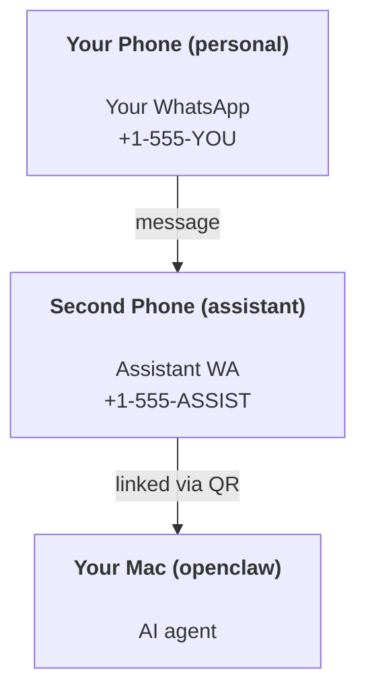

# 使用 OpenClaw 建構個人助理

OpenClaw 是一個自託管的閘道，可將 WhatsApp、Telegram、Discord、iMessage 等連接到 AI 代理程式。本指南涵蓋「個人助理」設定：一個專用的 WhatsApp 號碼，其行為如同您隨時待命的 AI 助理。

## ⚠️ 安全第一

您正在將代理程式置於能夠執行以下操作的位置：

- 在您的機器上執行指令（取決於您的工具政策）
- 讀取/寫入您工作區中的檔案
- 透過 WhatsApp/Telegram/Discord/Mattermost (外掛程式) 發送訊息

開始時保守一點：

- 務必設定 `channels.whatsapp.allowFrom`（切勿在您的個人 Mac 上對全世界開放執行）。
- 為助理使用專用的 WhatsApp 號碼。
- 心跳現在預設為每 30 分鐘一次。在您信任此設定之前，請透過設定 `agents.defaults.heartbeat.every: "0m"` 來停用它。

## 先決條件

- 已安裝並完成 OpenClaw 入門 — 如果您尚未完成此操作，請參閱 [入門指南](/zh-Hant/start/getting-started)
- 給助理使用的第二個電話號碼（SIM/eSIM/預付卡）

## 雙手機設定（建議）

您希望這樣做：



如果您將您的個人 WhatsApp 連結到 OpenClaw，每一則發給您的訊息都會變成「代理程式輸入」。這通常不是您想要的。

## 5 分鐘快速入門

1. 配對 WhatsApp 網頁版（顯示 QR Code；使用助理手機掃描）：

```exec
openclaw channels login
```

2. 啟動閘道（讓它保持執行）：

```exec
openclaw gateway --port 18789
```

3. 在 `~/.openclaw/openclaw.json` 中放入一個最小化的設定：

```json5
{
  channels: { whatsapp: { allowFrom: ["+15555550123"] } },
}
```

現在，從您在允許名單中的手機傳送訊息給助理號碼。

當入門完成時，我們會自動開啟儀表板並列印一個乾淨的（非權杖化）連結。如果它提示進行身份驗證，請將 `gateway.auth.token` 中的權杖貼上到 Control UI 設定中。若要稍後重新開啟：`openclaw dashboard`。

## 給代理程式一個工作區 (AGENTS)

OpenClaw 會從其工作區目錄讀取操作指令和「記憶」。

預設情況下，OpenClaw 使用 `~/.openclaw/workspace` 作為代理工作區，並會在設定/首次代理運行時自動建立它（以及初始的 `AGENTS.md`、`SOUL.md`、`TOOLS.md`、`IDENTITY.md`、`USER.md`、`HEARTBEAT.md`）。`BOOTSTRAP.md` 僅在工作區是全新時才建立（刪除後不應重新出現）。`MEMORY.md` 是可選的（不自動建立）；存在時，會在一般會話中載入。子代理會話僅注入 `AGENTS.md` 和 `TOOLS.md`。

提示：將此資料夾視為 OpenClaw 的「記憶」，並將其設為 git 儲存庫（最好是私有的），以便備份您的 `AGENTS.md` + 記憶檔案。如果安裝了 git，全新的工作區會自動初始化。

```exec
openclaw setup
```

完整的工作區佈局 + 備份指南：[代理工作區](/zh-Hant/concepts/agent-workspace)
記憶工作流程：[記憶](/zh-Hant/concepts/memory)

可選：使用 `agents.defaults.workspace` 選擇不同的工作區（支援 `~`）。

```json5
{
  agent: {
    workspace: "~/.openclaw/workspace",
  },
}
```

如果您已經從儲存庫提供自己的工作區檔案，則可以完全停用引導檔案的建立：

```json5
{
  agent: {
    skipBootstrap: true,
  },
}
```

## 將其變成「助理」的設定

OpenClaw 預設為良好的助理設定，但您通常會想要調整：

- `SOUL.md` 中的 persona/instructions
- thinking 預設值（如需要）
- heartbeats（在您信任它之後）

範例：

```json5
{
  logging: { level: "info" },
  agent: {
    model: "anthropic/claude-opus-4-6",
    workspace: "~/.openclaw/workspace",
    thinkingDefault: "high",
    timeoutSeconds: 1800,
    // Start with 0; enable later.
    heartbeat: { every: "0m" },
  },
  channels: {
    whatsapp: {
      allowFrom: ["+15555550123"],
      groups: {
        "*": { requireMention: true },
      },
    },
  },
  routing: {
    groupChat: {
      mentionPatterns: ["@openclaw", "openclaw"],
    },
  },
  session: {
    scope: "per-sender",
    resetTriggers: ["/new", "/reset"],
    reset: {
      mode: "daily",
      atHour: 4,
      idleMinutes: 10080,
    },
  },
}
```

## 會話與記憶

- 會話檔案：`~/.openclaw/agents/<agentId>/sessions/{{SessionId}}.jsonl`
- 會話元數據（token 使用量、最後路由等）：`~/.openclaw/agents/<agentId>/sessions/sessions.json`（舊版：`~/.openclaw/sessions/sessions.json`）
- `/new` 或 `/reset` 會為該聊天啟動一個新會話（可透過 `resetTriggers` 設定）。如果單獨發送，代理會回覆簡短的問候以確認重置。
- `/compact [instructions]` 會壓縮會話上下文並報告剩餘的上下文預算。

## 心跳（主動模式）

預設情況下，OpenClaw 每 30 分鐘執行一次心跳，提示為：
`Read HEARTBEAT.md if it exists (workspace context). Follow it strictly. Do not infer or repeat old tasks from prior chats. If nothing needs attention, reply HEARTBEAT_OK.`
設定 `agents.defaults.heartbeat.every: "0m"` 以停用。

- 如果 `HEARTBEAT.md` 存在但實際上是空的（只有空白行和像 `# Heading` 這樣的 markdown 標題），OpenClaw 會跳過心跳執行以節省 API 呼叫。
- 如果檔案不存在，心跳仍會執行，由模型決定要做什麼。
- 如果代理回覆 `HEARTBEAT_OK`（可選帶有短填充；請參閱 `agents.defaults.heartbeat.ackMaxChars`），OpenClaw 將抑制該心跳的傳出傳遞。
- 預設情況下，允許向 DM 風格的 `user:<id>` 目標進行心跳傳遞。設定 `agents.defaults.heartbeat.directPolicy: "block"` 以抑制直接目標傳遞，同時保持心跳執行處於啟用狀態。
- 心跳執行完整的代理輪次——間隔越短會消耗更多的 token。

```json5
{
  agent: {
    heartbeat: { every: "30m" },
  },
}
```

## 媒體輸入和輸出

傳入的附件（圖片/音訊/文件）可以透過模板顯示給您的命令：

- `{{MediaPath}}`（本機暫存檔案路徑）
- `{{MediaUrl}}`（偽 URL）
- `{{Transcript}}`（如果啟用了音訊轉錄）

代理的傳出附件：將 `MEDIA:<path-or-url>` 包含在單獨的一行中（無空格）。範例：

```
Here’s the screenshot.
MEDIA:https://example.com/screenshot.png
```

OpenClaw 會提取這些內容，並將其與文字一起作為媒體發送。

## 操作檢查清單

```exec
openclaw status          # local status (creds, sessions, queued events)
openclaw status --all    # full diagnosis (read-only, pasteable)
openclaw status --deep   # adds gateway health probes (Telegram + Discord)
openclaw health --json   # gateway health snapshot (WS)
```

日誌位於 `/tmp/openclaw/` 下（預設值：`openclaw-YYYY-MM-DD.log`）。

## 下一步

- WebChat：[WebChat](/zh-Hant/web/webchat)
- Gateway 運維：[Gateway runbook](/zh-Hant/gateway)
- Cron + 喚醒：[Cron jobs](/zh-Hant/automation/cron-jobs)
- macOS 選單欄配套程式：[OpenClaw macOS app](/zh-Hant/platforms/macos)
- iOS 節點應用程式：[iOS app](/zh-Hant/platforms/ios)
- Android 節點應用程式：[Android app](/zh-Hant/platforms/android)
- Windows 狀態：[Windows (WSL2)](/zh-Hant/platforms/windows)
- Linux 狀態：[Linux app](/zh-Hant/platforms/linux)
- 安全性：[Security](/zh-Hant/gateway/security)
