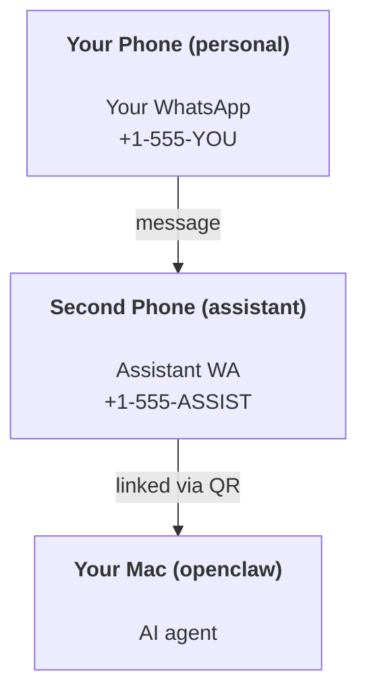

OpenClaw 是一個自託管的閘道，將 Discord、Google Chat、iMessage、Matrix、Microsoft Teams、Signal、Slack、Telegram、WhatsApp、Zalo 等連接到 AI 代理。本指南涵蓋「個人助理」設定：一個專用的 WhatsApp 號碼，其行為就像您隨時待命的 AI 助理。

## ⚠️ 安全第一

您將代理置於能夠執行以下操作的位置：

- 在您的機器上執行指令（視您的工具原則而定）
- 讀取/寫入您工作區中的檔案
- 透過 WhatsApp/Telegram/Discord/Mattermost 和其他捆綁頻道傳送訊息

從保守開始：

- 始終設定 `channels.whatsapp.allowFrom`（切勿在您的個人 Mac 上對全世界開放執行）。
- 為助理使用專用的 WhatsApp 號碼。
- 心跳現在預設為每 30 分鐘一次。在您信任此設定之前，請透過設定 `agents.defaults.heartbeat.every: "0m"` 來停用它。

## 先決條件

- 已安裝並入職 OpenClaw - 如果您尚未完成此操作，請參閱 [開始使用](/zh-Hant/start/getting-started)
- 助理的第二個電話號碼（SIM/eSIM/預付卡）

## 雙手機設定（建議）

您需要這樣：



如果您將您的個人 WhatsApp 連結到 OpenClaw，發給您的每條訊息都會變成「代理輸入」。這通常不是您想要的。

## 5 分鐘快速入門

1. 配對 WhatsApp Web（顯示 QR Code；使用助理手機掃描）：

```bash
openclaw channels login
```

2. 啟動閘道（保持其運行）：

```bash
openclaw gateway --port 18789
```

3. 將最小配置放入 `~/.openclaw/openclaw.json`：

```json5
{
  gateway: { mode: "local" },
  channels: { whatsapp: { allowFrom: ["+15555550123"] } },
}
```

現在從您的允許清單手機向助理號碼發送訊息。

當入職完成時，OpenClaw 會自動開啟儀表板並列印一個乾淨（非標記化）的連結。如果儀表板提示進行身份驗證，請將配置的共用密鑰貼上到 Control UI 設定中。入職預設使用標記（`gateway.auth.token`），但如果您將 `gateway.auth.mode` 切換到 `password`，密碼身份驗證也有效。若要稍後重新開啟：`openclaw dashboard`。

## 給代理一個工作區 (AGENTS)

OpenClaw 從其工作區目錄讀取操作指令和「記憶」。

預設情況下，OpenClaw 使用 `~/.openclaw/workspace` 作為代理工作區，並會在設定/首次代理運行時自動建立它（以及起始的 `AGENTS.md`、`SOUL.md`、`TOOLS.md`、`IDENTITY.md`、`USER.md`、`HEARTBEAT.md`）。`BOOTSTRAP.md` 僅在工作區是全新時建立（刪除後不應再次出現）。`MEMORY.md` 是可選的（不會自動建立）；如果存在，它會在一般會話中載入。子代理會話僅注入 `AGENTS.md` 和 `TOOLS.md`。

<Tip>將此資料夾視為 OpenClaw 的記憶體，並將其設為 git 儲存庫（最好是私有的），以便您的 `AGENTS.md` 和記憶體檔案能被備份。如果安裝了 git，全新的工作區會自動初始化。</Tip>

```bash
openclaw setup
```

完整的工作區佈局 + 備份指南：[Agent workspace](/zh-Hant/concepts/agent-workspace)
記憶體工作流程：[Memory](/zh-Hant/concepts/memory)

可選：使用 `agents.defaults.workspace` 選擇不同的工作區（支援 `~`）。

```json5
{
  agents: {
    defaults: {
      workspace: "~/.openclaw/workspace",
    },
  },
}
```

如果您已經從儲存庫部署自己的工作區檔案，您可以完全停用引導檔案的建立：

```json5
{
  agents: {
    defaults: {
      skipBootstrap: true,
    },
  },
}
```

## 將其變成「助理」的設定

OpenClaw 預設為良好的助理設定，但您通常會想要調整：

- [`SOUL.md`](/zh-Hant/concepts/soul) 中的 persona/instructions
- thinking 預設值（如果需要的話）
- heartbeats（一旦您信任它）

範例：

```json5
{
  logging: { level: "info" },
  agents: {
    defaults: {
      model: { primary: "anthropic/claude-opus-4-6" },
      workspace: "~/.openclaw/workspace",
      thinkingDefault: "high",
      timeoutSeconds: 1800,
      // Start with 0; enable later.
      heartbeat: { every: "0m" },
    },
    list: [
      {
        id: "main",
        default: true,
        groupChat: {
          mentionPatterns: ["@openclaw", "openclaw"],
        },
      },
    ],
  },
  channels: {
    whatsapp: {
      allowFrom: ["+15555550123"],
      groups: {
        "*": { requireMention: true },
      },
    },
  },
  session: {
    scope: "per-sender",
    resetTriggers: ["/new", "/reset"],
    reset: {
      mode: "daily",
      atHour: 4,
      idleMinutes: 10080,
    },
  },
}
```

## 會話與記憶體

- 會話檔案：`~/.openclaw/agents/<agentId>/sessions/{{SessionId}}.jsonl`
- 會話元資料（token 使用量、最後路徑等）：`~/.openclaw/agents/<agentId>/sessions/sessions.json`（舊版：`~/.openclaw/sessions/sessions.json`）
- `/new` 或 `/reset` 會為該聊天啟動一個全新的會話（可透過 `resetTriggers` 設定）。如果單獨發送，OpenClaw 會確認重置而不調用模型。
- `/compact [instructions]` 會壓縮會話上下文並回報剩餘的上下文預算。

## Heartbeats（主動模式）

預設情況下，OpenClaw 每 30 分鐘執行一次心跳檢測，並使用以下提示詞：
`Read HEARTBEAT.md if it exists (workspace context). Follow it strictly. Do not infer or repeat old tasks from prior chats. If nothing needs attention, reply HEARTBEAT_OK.`
設定 `agents.defaults.heartbeat.every: "0m"` 以停用此功能。

- 如果 `HEARTBEAT.md` 存在但實際上為空（僅包含空行和像 `# Heading` 這樣的 markdown 標題），OpenClaw 會跳過此次心跳檢測以節省 API 呼叫。
- 如果檔案不存在，心跳檢測仍會執行，由模型決定要做什麼。
- 如果代理回覆 `HEARTBEAT_OK`（可選擇性帶有短填充；請參閱 `agents.defaults.heartbeat.ackMaxChars`），OpenClaw 將抑制該次心跳的 outbound 傳遞。
- 預設情況下，允許向 DM 風格的 `user:<id>` 目標進行心跳傳遞。設定 `agents.defaults.heartbeat.directPolicy: "block"` 可在保持心跳執行啟用的同時，抑制直接目標的傳遞。
- 心跳檢測會執行完整的代理週期——較短的間隔會消耗更多的 tokens。

```json5
{
  agents: {
    defaults: {
      heartbeat: { every: "30m" },
    },
  },
}
```

## 媒體輸入與輸出

傳入的附件（圖片/音訊/文件）可以透過模板顯示給您的指令：

- `{{MediaPath}}` (本地暫存檔案路徑)
- `{{MediaUrl}}` (虛擬 URL)
- `{{Transcript}}` (如果啟用了音訊轉錄)

來自代理的傳出附件：請在獨立的一行中包含 `MEDIA:<path-or-url>` (不包含空格)。範例：

```
Here's the screenshot.
MEDIA:https://example.com/screenshot.png
```

OpenClaw 會提取這些內容，並將其隨文字一併作為媒體發送。

本地路徑的行為遵循與代理相同的檔案讀取信任模型：

- 如果 `tools.fs.workspaceOnly` 是 `true`，傳出 `MEDIA:` 的本地路徑將受限於 OpenClaw 的 temp root、媒體快取、代理工作區路徑以及沙盒生成的檔案。
- 如果 `tools.fs.workspaceOnly` 是 `false`，傳出 `MEDIA:` 可以使用代理已有權限讀取的主機本地檔案。
- 本地路徑可以是絕對路徑、相對於工作區的路徑，或是使用 `~/` 的相對於家目錄的路徑。
- 從主機本機發送仍然僅允許媒體和安全文件類型（圖片、音訊、影片、PDF 和 Office 文件）。純文字和類似機密的檔案不被視為可發送的媒體。

這意味著當您的 fs 原則已允許讀取時，工作區外產生的圖片/檔案現在可以發送，而不會重新開放任意主機文字附件的外洩風險。

## 運作檢查清單

```bash
openclaw status          # local status (creds, sessions, queued events)
openclaw status --all    # full diagnosis (read-only, pasteable)
openclaw status --deep   # asks the gateway for a live health probe with channel probes when supported
openclaw health --json   # gateway health snapshot (WS; default can return a fresh cached snapshot)
```

日誌位於 `/tmp/openclaw/` 之下 (預設值：`openclaw-YYYY-MM-DD.log`)。

## 下一步

- WebChat: [WebChat](/zh-Hant/web/webchat)
- Gateway ops: [Gateway runbook](/zh-Hant/gateway)
- Cron + wakeups: [Cron jobs](/zh-Hant/automation/cron-jobs)
- macOS 選單列伴隨程式：[OpenClaw macOS app](/zh-Hant/platforms/macos)
- iOS 節點應用程式：[iOS app](/zh-Hant/platforms/ios)
- Android 節點應用程式：[Android app](/zh-Hant/platforms/android)
- Windows 狀態：[Windows (WSL2)](/zh-Hant/platforms/windows)
- Linux 狀態：[Linux app](/zh-Hant/platforms/linux)
- 安全性：[Security](/zh-Hant/gateway/security)

## 相關

- [Getting started](/zh-Hant/start/getting-started)
- [Setup](/zh-Hant/start/setup)
- [Channels overview](/zh-Hant/channels)
